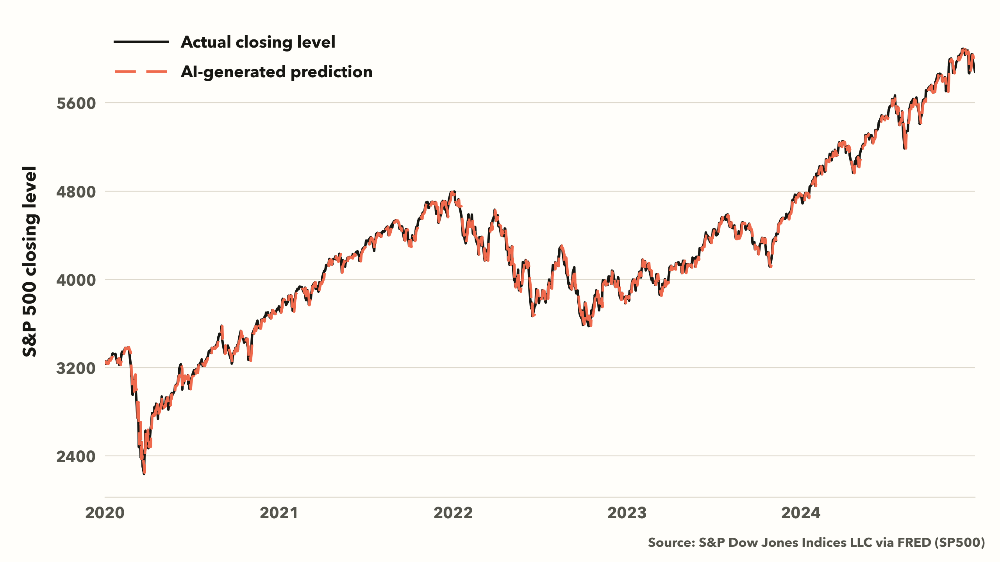
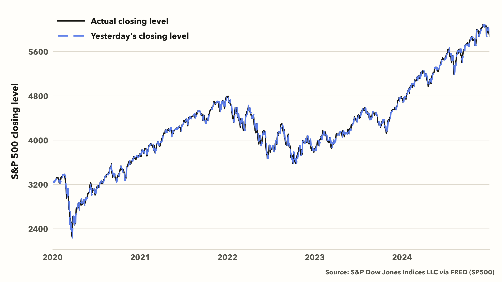
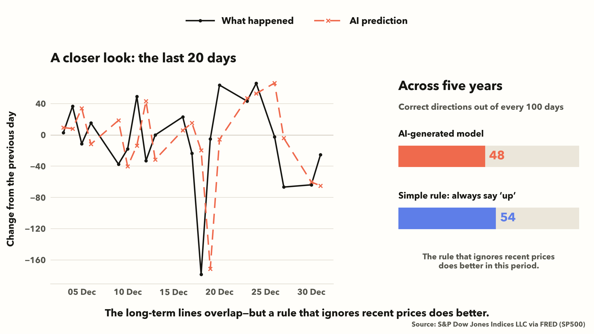
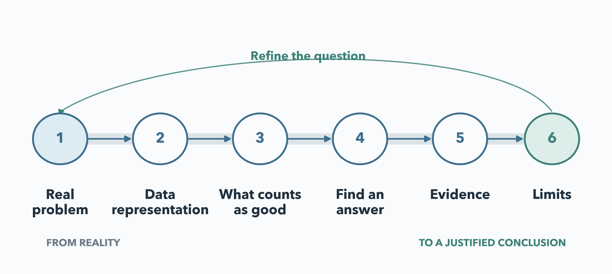
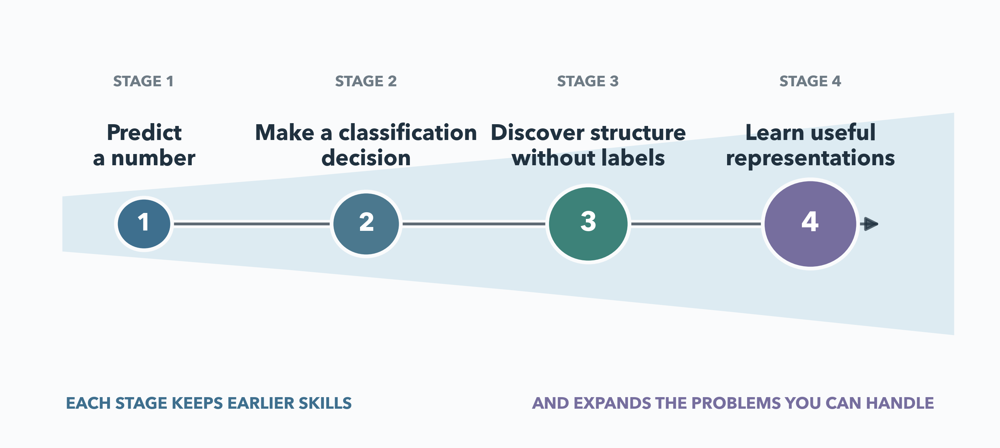

## The capability this course builds {.promise-slide}

::: {.course-promise}
Given a new real-world question and an unfamiliar dataset, you should be able to build a modelling process that you can **explain and defend**.
:::

::: {.outcome-list}

01<b>Define the task</b>
Turn a vague requirement into a question that data can answer.

02<b>Build a fair comparison</b>
Know what a more complicated model must improve upon.

03<b>Use evidence</b>
Test the result in the situation where you intend to use it.

04<b>Limit the conclusion</b>
Say what the result supports and where it may fail.

:::

::: {.level-note}
<b>MPS311</b> applies and explains the process. <b>MPS439</b> also investigates its assumptions, implementation, and limits.
:::

::: {.notes}
**讲：** 这门课训练的不是算法清单，而是面对新问题时能够定义任务、比较方案、检查证据并限制结论。

**问：** AI 已能写代码和画图，为什么还要学习机器学习？

**转：** 先不回答，用股票预测来看。
:::

## A tempting request

::: {.prompt-stage}

Prompt to an AI assistant

> Use historical stock-market data to predict tomorrow's closing price. Write the code and compare the predictions with what actually happened.
:::

::: {.big-question}
If the predicted line almost matches reality, would you trust it with your own money?
:::

::: {.notes}
**讲：** 把历史价格交给 AI，请它写程序预测明天并画出结果。

**问：** 如果两条线几乎重合，你会相信它、用它投资吗？

**转：** 先记住现在的判断。
:::

## The prediction looks remarkable

{fig-alt="Actual S&P 500 closing level and an AI-generated prediction across 2020 to 2024" .hero-chart}

::: {.question-line}
Has the model solved the problem?
:::

::: {.notes}
**讲：** 五年里，预测线几乎一直贴着真实市场。

**问：** 只根据这张图，它已经解决问题了吗？

**转：** 再看一个完全不需要训练的方法。
:::

## Yesterday looks just as convincing

{fig-alt="Actual S&P 500 closing level, an AI-generated prediction, and yesterday's price across 2020 to 2024" .hero-chart}

::: {.turning-point}
A convincing-looking prediction is not yet evidence of useful knowledge.
:::

::: {.notes}
**讲：** 右边只是把昨天的价格当作今天的预测，也能得到同样漂亮的长期曲线。

**问：** 现在能判断哪个方法真的更有用吗？

**转：** 把尺度拉近，看每天真正发生的变化。
:::

## A closer look changes the verdict

{fig-alt="A close comparison of actual and predicted daily changes, alongside five-year direction accuracy" .hero-chart}

::: {.notes}
**讲：** 放大后错误变得可见；完整五年里，AI 约为 48/100，永远预测上涨约为 54/100。

**问：** 那条几乎重合的长期曲线究竟证明了什么？

**转：** 区分它实际支持的四种说法。
:::

## What did the graph establish?

::: {.claim-ladder}

01<b>The program runs</b>
We have evidence that the implementation can execute.

02<b>The predicted price is close</b>
We have evidence about the price level.

03<b>The model anticipates tomorrow</b>
The previous evidence does not establish this claim.

04<b>The result supports investment</b>
This requires a decision, a fair comparison, and stronger evidence.

:::

::: {.notes}
**讲：** 程序能运行、价格接近、预见明天、支持投资，是四个不同层级的结论。

**问：** 从第二层到第三层、再到第四层，分别缺少什么证据？

**转：** 问题可能在选择模型之前就已经出现。
:::

## Machine learning begins before the model {.framework-slide}

{fig-alt="Six connected questions from a real problem to a justified conclusion" .framework-chart}

::: {.framework-caption}
The same questions return whenever the problem, data, or model changes.
:::

::: {.notes}
**讲：** 依次解释现实问题、数据表示、好答案、寻找答案、证据和局限；证据不足时要返回前面重新检查。

**问：** 股票方案最早在哪一步就可能出问题？

**转：** 用六问完整重审一次。
:::

## What the audit changed

::: {.audit-story}

We wanted<b>Support an investment decision</b>

We measured<b>How closely the price level was reproduced</b>

We compared<b>Yesterday's price and an always-up rule</b>

We can conclude<b>A close line is not evidence of foresight or profit</b>

:::

::: {.audit-conclusion}
The model produced a close line. The evidence did not support the original claim.
:::

::: {.notes}
**讲：** 目标是支持投资，不是复现价格；信息、标准和比较都必须匹配这个目标。

**必须落点：** 模型和图没有变，改变的是解释——现有证据不足以支持原结论。

**转：** 如果这真是一套通用的判断方法，换一个完全不同的问题，它也应该有用。
:::

## Is 99.9% a good result? {.rare-question-slide}

::: {.rare-scenario}
A rare disease affects **10 people in every 10,000**.

A system predicts that everyone is healthy.
:::

::: {.rare-score}
99.9%
accuracy
:::

::: {.big-question}
Would you call this an excellent system?
:::

::: {.notes}
**讲：** 不解释答案，只说明疾病很少见，系统把所有人都说成健康。

**问：** 99.9% 是不是很好？如果这是医院要使用的系统，你会接受吗？

**转：** 把这个数字拆开。
:::

## The number is correct. The system still fails.

::: {.rare-breakdown}

9,990<b>healthy people</b>
predicted healthy

10<b>people with the disease</b>
all missed

:::

::: {.rare-result}

Overall accuracy<b>99.9%</b>

Patients found<b>0 / 10</b>

:::

::: {.transfer-takeaway}
A score is useful only when it reflects the purpose and the failure that matters.
:::

::: {.notes}
**讲：** 数字完全正确，但系统没有找到任何一位需要帮助的人。评价回答了总体判断正确多少次，却没有回答真正的任务。

**问：** 在这个情境中，哪一种错误最重要？

**转：** 再快速判断两个不同问题。
:::

## Two quick judgements

::: {.quick-judgements}

Available information<b>Predict whether a student will pass <em>before</em> the final exam</b>
The model uses the final-exam mark as an input. What is wrong?

Fair comparison<b>Predict tomorrow's demand for shared bikes</b>
What simple rule should a complicated model beat?

:::

::: {.notes}
**问：** 第一个方案为什么无法真正使用？第二个复杂模型至少应该超过什么？

**讲：** 期末成绩在预测时还不存在；单车模型应至少与昨天、上周同一天或近期平均值比较。

**转：** 问题不断改变，但定义目的、信息、比较和证据的能力会保留下来。
:::

## The problems become harder and more realistic

{fig-alt="Four cumulative stages of modelling capability" .progression-chart}

::: {.progression-note}
Each stage keeps the earlier skills and expands the problems you can handle.
:::

::: {.notes}
**讲：** 四阶段不是算法目录，而是能处理的问题逐渐变难；每一阶段保留前面的能力。

**转：** 每一周也会重复同一种学习节奏。
:::

## The same reasoning returns every week

::: {.weekly-loop}

01<b>A problem or failure</b>

02<b>A clear task and standard</b>

03<b>A way to find an answer</b>

04<b>Evidence on new cases</b>

05<b>A limitation that motivates the next step</b>

:::

::: {.material-line}
<b>Lecture</b> builds the reasoning. <b>Note</b> provides the complete explanation. <b>Demo</b> makes a mechanism visible. <b>Lab</b> asks you to reconstruct it.
:::

::: {.notes}
**讲：** 从问题或失败开始，定义任务和标准，寻找答案，检查证据，再由局限推动下一步。

**补充：** Lecture、Note、Demo、Lab 都在训练同一种能力。

**转：** 这也解释了 AI 时代为什么仍需要学习这套过程。
:::

## Learning with AI

::: {.responsibility-columns}

<h3>AI can accelerate</h3>
<ul>
<li>writing and debugging code</li>
<li>trying an implementation</li>
<li>producing a first graph</li>
<li>explaining unfamiliar syntax</li>
</ul>

<h3>You remain responsible</h3>
<ul>
<li>the question worth answering</li>
<li>the information that may be used</li>
<li>the comparison and evidence</li>
<li>the conclusion you communicate</li>
</ul>

:::

::: {.ai-habit}
Use it. Test it. Check the evidence. Explain the result.
:::

::: {.notes}
**讲：** AI 加速实现，但不能替你决定问题、信息边界、比较、证据和结论。

**问：** 股票案例里 AI 完成了什么，哪些关键判断仍由人负责？

**转：** 用新的判断方式回到最初那张图。
:::

## Before you trust the result {.final-slide}

::: {.exit-question}
The prediction line almost perfectly matches the real market.

**What would you ask first now?**
:::

::: {.closing-thought}
Machine learning gives us a way to move from a real problem to a conclusion the evidence can support.
:::

::: {.notes}
**问：** 这一次，在相信结果以前，你首先会问什么？

**收束：** 能提出关于问题、信息、标准、比较、证据和局限的问题，就已经开始使用这门课的建模思维。
:::

## 30-second feedback {.feedback-slide}

Scan this code to share anonymous feedback or post a question for this lecture.

{fig-alt="Feedback QR code for Lesson 1 lecture" width="360"}

MPS311/439 · 2026–27 · Lesson 01 lecture

::: {.notes}
留出时间，让学生当场提交反馈或问题。
:::
