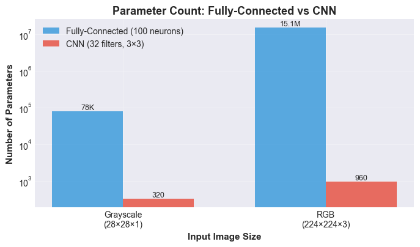
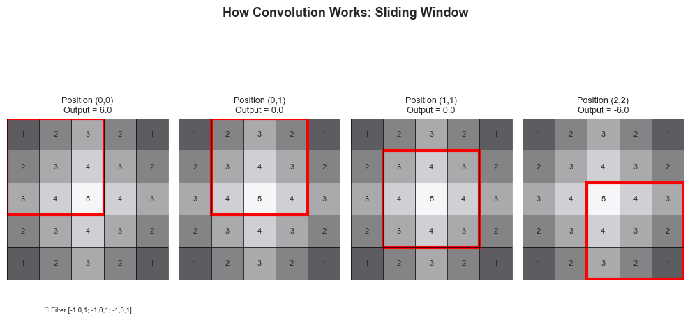
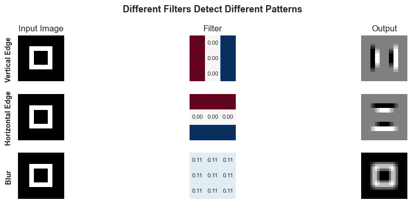
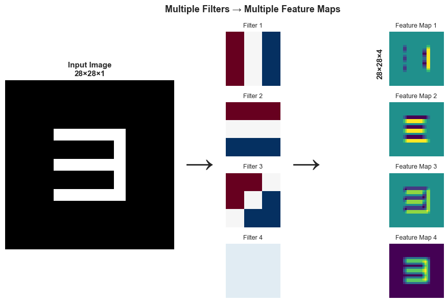
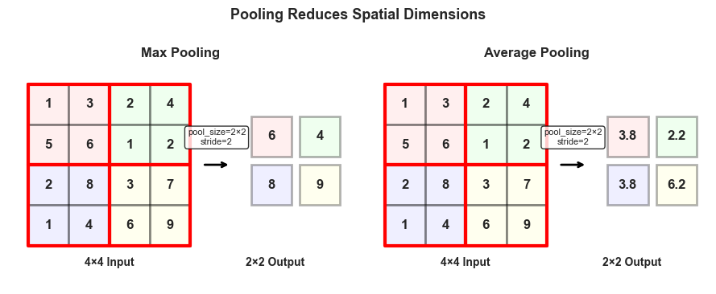
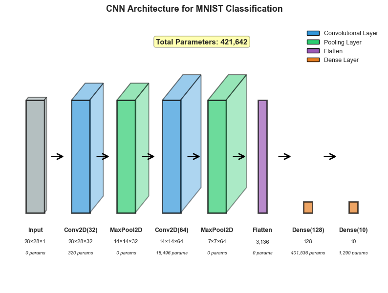
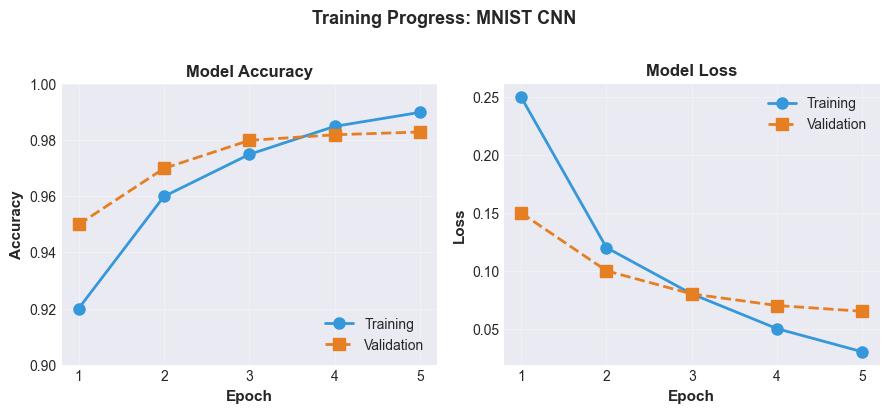
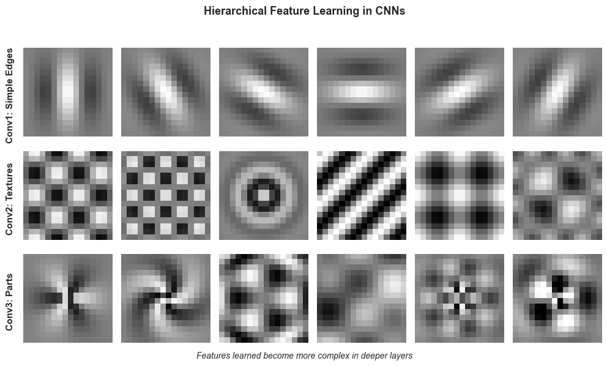

# Lesson 10: Convolutional Neural Networks
## Learning Spatial Patterns in Images

**MPS311/439 Machine Learning**  
**Dr. Wei Xing**  
**University of Sheffield**  
**Academic year 2026–27**

---

## Introduction: The Image Problem

Welcome back! Last week, we built fully-connected neural networks and saw how stacking layers of weighted sums and activations creates powerful models. We connected this to everything we've learned: logistic regression was essentially a single-layer network, and by adding more layers, we gained the ability to learn complex, non-linear patterns.

But there's a problem lurking when we apply these networks to images.

### The Parameter Explosion

Let's work through a concrete example. Suppose we want to classify handwritten digits from the MNIST dataset. Each image is 28×28 pixels in grayscale. If we flatten this into a vector (as we must for a fully-connected network), we have:

$$\text{Input size} = 28 \times 28 = 784 \text{ features}$$

Now, let's say we want our first hidden layer to have just 100 neurons. How many parameters (weights) do we need?

$$\text{Parameters} = 784 \times 100 = 78,400 \text{ weights}$$

That's nearly 80,000 parameters just in the first layer! And we haven't even counted the biases or subsequent layers.

Now imagine we want to work with color images at a more realistic resolution, say 224×224 pixels (common in computer vision):

$$\text{Input size} = 224 \times 224 \times 3 = 150,528 \text{ features}$$

With the same 100 hidden neurons:

$$\text{Parameters} = 150,528 \times 100 = 15,052,800 \text{ weights}$$

That's over **15 million parameters** in just the first layer! 



This creates several problems:
- **Computationally expensive** - millions of multiplications per image
- **Memory intensive** - storing all these weights
- **Overfitting prone** - too many parameters, not enough data
- **Inefficient** - we're ignoring the structure of images

### What We're Ignoring

When we flatten an image into a vector, we're treating it like a random collection of numbers. But images aren't random! They have **spatial structure**:

- **Nearby pixels are related** - the pixels forming an eye are close together
- **Patterns repeat** - edges, textures, and shapes appear in different locations
- **Hierarchy exists** - simple patterns (edges) combine to form complex objects (faces)

A fully-connected network connects every pixel to every neuron in the next layer. But to detect an edge, we only need to look at neighboring pixels, not pixels on the opposite side of the image!

### This Week's Mission

This week, we'll learn about **Convolutional Neural Networks (CNNs)**, which are specifically designed for data with spatial structure. CNNs will help us:

1. ✨ **Reduce parameters dramatically** while maintaining expressive power
2. 🔍 **Exploit spatial relationships** between nearby pixels
3. 🎯 **Learn hierarchical features** from simple to complex
4. 💻 **Implement efficient image classifiers** using Keras

The key insight? We don't need to connect every pixel to every neuron. We only need **local connections** that look at small regions, and we can **share these connections** across the entire image.

Let's see how this works!

---

## The Core Idea: Convolutions

### Motivation Through Intuition

Imagine you're trying to detect whether an image contains a vertical edge. Do you need to look at every pixel in the image simultaneously? No! You only need to look at small **local regions** and check if there's a sudden change from dark to light (or vice versa) in the horizontal direction.

This is the essence of a **convolution**: we define a small pattern detector (called a **filter** or **kernel**), and we slide it across the entire image. At each position, we check how well the local region matches our pattern.

The beauty? We use the **same filter** everywhere. This is called **parameter sharing**, and it's what gives CNNs their efficiency.

### The Convolution Operation

Let's make this concrete. A convolution operation involves:

1. A **filter** (or kernel): a small matrix of weights, typically 3×3 or 5×5
2. An **input image**: our data
3. A **sliding window**: we move the filter across the image
4. **Element-wise multiplication and sum**: at each position, multiply and add up

Here's how it works visually:



At each position $(i,j)$ in the output, we compute:

$$Y[i,j] = \sum_{m=0}^{k-1} \sum_{n=0}^{k-1} X[i+m, j+n] \cdot K[m,n] + b$$

where:
- $X$ is the input image
- $K$ is the filter (kernel) of size $k \times k$
- $b$ is a bias term
- $Y$ is the output (called a **feature map**)

**Notice something familiar?** This is still our trusty weighted sum from linear regression and neural networks! The key difference is:
- The weights are organized in a small local pattern
- We apply the same weights repeatedly across the image

### Simple Filter Examples

Different filters detect different patterns. Let's look at three examples:



**Example 1: Vertical Edge Detector**

$$K_{\text{vertical}} = \begin{bmatrix} -1 & 0 & 1 \\ -1 & 0 & 1 \\ -1 & 0 & 1 \end{bmatrix}$$

This filter looks for vertical transitions from dark (left, multiplied by -1) to bright (right, multiplied by +1). When applied to an image, it produces high values where vertical edges exist.

**Example 2: Horizontal Edge Detector**

$$K_{\text{horizontal}} = \begin{bmatrix} -1 & -1 & -1 \\ 0 & 0 & 0 \\ 1 & 1 & 1 \end{bmatrix}$$

This detects horizontal edges by looking for transitions from dark (top) to bright (bottom).

**Example 3: Blur Filter**

$$K_{\text{blur}} = \frac{1}{9}\begin{bmatrix} 1 & 1 & 1 \\ 1 & 1 & 1 \\ 1 & 1 & 1 \end{bmatrix}$$

This averages nearby pixels, creating a smoothing effect. Each output pixel is the average of a 3×3 region.

### The Magic: Learning Filters

Here's where it gets exciting. In traditional image processing, experts hand-designed filters for specific tasks. In CNNs, **we learn the filter weights through training**!

Just like we learned the weights in logistic regression by minimizing loss, we'll learn filter values that best help us classify images. The network will automatically discover which patterns are useful.

Let's implement a simple convolution in Python to build intuition:

```python
import numpy as np
import matplotlib.pyplot as plt

# Create a simple image with a vertical edge
image = np.zeros((7, 7))
image[:, 3:] = 1  # Right half is bright

# Define a vertical edge detector
kernel = np.array([[-1, 0, 1],
                   [-1, 0, 1],
                   [-1, 0, 1]])

# Manual convolution (simplified - no padding)
output = np.zeros((5, 5))
for i in range(5):
    for j in range(5):
        region = image[i:i+3, j:j+3]
        output[i, j] = np.sum(region * kernel)

print("Output (high value at edge):")
print(output)
```

---

## Building Blocks of CNNs

### Convolutional Layers

A convolutional layer is the fundamental building block of a CNN. It consists of:

1. **Multiple filters** - each detecting a different pattern
2. **Activation function** - typically ReLU, applied element-wise
3. **Bias terms** - one per filter

#### Multiple Filters Create Multiple Feature Maps

In practice, we don't use just one filter. We use many filters (32, 64, 128, or more) to detect many different patterns:



Each filter produces one **feature map** (also called an **activation map** or **channel**). If we have 32 filters, we get 32 feature maps as output. These feature maps stack together, creating a 3D output volume.

**Input dimensions:** $H \times W \times C_{\text{in}}$  
**Filter dimensions:** $k \times k \times C_{\text{in}}$  
**Output dimensions:** $H' \times W' \times C_{\text{out}}$

where $C_{\text{out}}$ is the number of filters.

#### Parameter Count

How many parameters does a convolutional layer have? For each filter:

$$\text{Parameters per filter} = (k \times k \times C_{\text{in}}) + 1$$

The $(k \times k \times C_{\text{in}})$ term counts the weights (filter operates on all input channels), and the +1 is for the bias.

For the entire layer with $C_{\text{out}}$ filters:

$$\text{Total parameters} = (k \times k \times C_{\text{in}} + 1) \times C_{\text{out}}$$

**Example:** A layer with 32 filters of size 3×3 operating on a grayscale input ($C_{\text{in}}=1$):

$$\text{Parameters} = (3 \times 3 \times 1 + 1) \times 32 = 10 \times 32 = 320$$

Compare this to a fully-connected layer connecting a 28×28 image to 32 neurons:

$$\text{Parameters} = (28 \times 28) \times 32 = 25,088$$

That's almost **80 times fewer parameters**! And the convolutional layer is more powerful because it preserves spatial structure.

#### Stride and Padding

Two important parameters control how convolutions are applied:

**Stride** ($S$): How many pixels to move the filter at each step.
- $S=1$ (default): Move one pixel at a time
- $S=2$: Skip every other position, reducing output size

**Padding** ($P$): Adding zeros around the image border.
- `"valid"`: No padding, output is smaller
- `"same"`: Add padding to keep output size equal to input

The output dimensions are calculated as:

$$H_{\text{out}} = \left\lfloor \frac{H_{\text{in}} + 2P - k}{S} \right\rfloor + 1$$

$$W_{\text{out}} = \left\lfloor \frac{W_{\text{in}} + 2P - k}{S} \right\rfloor + 1$$

**Example:** Input 28×28, filter 3×3, stride 1, padding 0:

$$H_{\text{out}} = \left\lfloor \frac{28 + 0 - 3}{1} \right\rfloor + 1 = 26$$

Most commonly, we use `padding="same"` to keep the spatial dimensions unchanged after convolution.

### Pooling Layers

After convolution layers, we typically add **pooling layers** to:

1. **Reduce spatial dimensions** - make the representation smaller and more manageable
2. **Reduce computation** - fewer pixels mean fewer calculations
3. **Provide translation invariance** - small shifts in input don't drastically change output

#### Types of Pooling



**Max Pooling** (most common): Take the maximum value in each region.

For a 2×2 region: $\text{output} = \max(a, b, c, d)$

**Average Pooling**: Take the average value in each region.

For a 2×2 region: $\text{output} = \frac{a + b + c + d}{4}$

Typical configuration: 2×2 pooling with stride 2 (reduces dimensions by half).

**Key fact:** Pooling layers have **zero learnable parameters**! They're just fixed operations.

#### Why Pooling Helps

Imagine detecting a cat in an image. Whether the cat is 2 pixels to the left or right shouldn't drastically change our answer. Pooling provides this **translation invariance** by taking the strongest signal in a region, regardless of its exact position.

---

## Putting It Together: CNN Architecture

### The Standard Pattern

A typical CNN follows this repeating pattern:

```
Input → [Conv → ReLU → Pool] × N → Flatten → Dense → Output
```

Let's break this down:

1. **Convolutional blocks** (repeated $N$ times):
   - Conv layer: Extract spatial features
   - ReLU activation: Add non-linearity
   - Pooling: Reduce dimensions

2. **Flatten**: Convert 3D feature maps to 1D vector

3. **Dense layers**: Standard fully-connected layers for final classification

### Example Architecture for MNIST

Let's design a CNN to classify MNIST digits (0-9):



**Layer-by-layer breakdown:**

| Layer | Operation | Output Shape | Parameters |
|-------|-----------|--------------|------------|
| Input | - | 28×28×1 | 0 |
| Conv2D | 32 filters, 3×3, same | 28×28×32 | 320 |
| MaxPool | 2×2, stride 2 | 14×14×32 | 0 |
| Conv2D | 64 filters, 3×3, same | 14×14×64 | 18,496 |
| MaxPool | 2×2, stride 2 | 7×7×64 | 0 |
| Flatten | - | 3,136 | 0 |
| Dense | 128 units | 128 | 401,536 |
| Dense | 10 units (softmax) | 10 | 1,290 |
| **Total** | | | **421,642** |

**Parameter calculations:**
- Conv1: $(3 \times 3 \times 1 + 1) \times 32 = 320$
- Conv2: $(3 \times 3 \times 32 + 1) \times 64 = 18,496$
- Dense1: $(3136 + 1) \times 128 = 401,536$
- Dense2: $(128 + 1) \times 10 = 1,290$

### Comparison with Fully-Connected Network

A fully-connected network with the same capacity would need:

- Input to hidden1: $784 \times 1024 = 802,816$ parameters
- Hidden1 to hidden2: $1024 \times 512 = 524,288$ parameters
- Hidden2 to output: $512 \times 10 = 5,120$ parameters
- **Total: 1,332,224 parameters**

Our CNN uses only about **32% of the parameters** while being more effective for images!

---

## Implementation in Keras

Now let's implement our CNN using Keras. Remember, Keras is built on top of TensorFlow and provides a simple, high-level interface.

### Loading and Preparing Data

```python
from tensorflow import keras
import numpy as np
import matplotlib.pyplot as plt

# Load MNIST dataset
(X_train, y_train), (X_test, y_test) = keras.datasets.mnist.load_data()

print(f"Training data shape: {X_train.shape}")  # (60000, 28, 28)
print(f"Training labels shape: {y_train.shape}")  # (60000,)

# Normalize pixel values to [0, 1]
X_train = X_train.astype('float32') / 255.0
X_test = X_test.astype('float32') / 255.0

# Reshape to add channel dimension (grayscale = 1 channel)
X_train = X_train.reshape(-1, 28, 28, 1)
X_test = X_test.reshape(-1, 28, 28, 1)

print(f"Reshaped training data: {X_train.shape}")  # (60000, 28, 28, 1)
```

**Why reshape?** Keras expects images in the format: `(batch_size, height, width, channels)`. For grayscale images, channels = 1.

### Building the CNN Model

```python
from tensorflow.keras import layers, models

# Create a Sequential model
model = models.Sequential([
    # First convolutional block
    layers.Conv2D(32, (3, 3), activation='relu', input_shape=(28, 28, 1)),
    layers.MaxPooling2D((2, 2)),
    
    # Second convolutional block
    layers.Conv2D(64, (3, 3), activation='relu'),
    layers.MaxPooling2D((2, 2)),
    
    # Flatten and dense layers
    layers.Flatten(),
    layers.Dense(128, activation='relu'),
    layers.Dense(10, activation='softmax')
])

# Display model architecture
model.summary()
```

**Understanding the code:**
- `Conv2D(32, (3,3))`: 32 filters, each 3×3
- `activation='relu'`: Apply ReLU after convolution
- `MaxPooling2D((2,2))`: 2×2 max pooling
- `Flatten()`: Convert 3D to 1D
- `Dense(10, activation='softmax')`: 10 classes with probability output

### Compiling the Model

```python
model.compile(
    optimizer='adam',
    loss='sparse_categorical_crossentropy',
    metrics=['accuracy']
)
```

**What do these mean?**
- `optimizer='adam'`: Adam optimizer (adaptive learning rate)
- `loss='sparse_categorical_crossentropy'`: For multi-class classification with integer labels
- `metrics=['accuracy']`: Track classification accuracy

### Training the Model

```python
# Train the model
history = model.fit(
    X_train, y_train,
    epochs=5,
    batch_size=128,
    validation_split=0.2,
    verbose=1
)
```

**Parameters explained:**
- `epochs=5`: Train for 5 complete passes through the data
- `batch_size=128`: Process 128 images at a time
- `validation_split=0.2`: Use 20% of training data for validation

You should see output like:

```
Epoch 1/5
375/375 [==============================] - 15s 40ms/step - loss: 0.1742 - accuracy: 0.9473 - val_loss: 0.0591 - val_accuracy: 0.9822
Epoch 2/5
375/375 [==============================] - 14s 38ms/step - loss: 0.0484 - accuracy: 0.9850 - val_loss: 0.0429 - val_accuracy: 0.9870
...
```

### Visualizing Training Progress

```python
# Plot training history
plt.figure(figsize=(12, 4))

plt.subplot(1, 2, 1)
plt.plot(history.history['accuracy'], label='Training')
plt.plot(history.history['val_accuracy'], label='Validation')
plt.xlabel('Epoch')
plt.ylabel('Accuracy')
plt.legend()
plt.title('Model Accuracy')

plt.subplot(1, 2, 2)
plt.plot(history.history['loss'], label='Training')
plt.plot(history.history['val_loss'], label='Validation')
plt.xlabel('Epoch')
plt.ylabel('Loss')
plt.legend()
plt.title('Model Loss')

plt.tight_layout()
plt.show()
```



**What to look for:**
- Training and validation accuracy should both increase
- Training and validation loss should both decrease
- If validation metrics plateau while training improves → **overfitting**

### Evaluating on Test Set

```python
# Evaluate on test data
test_loss, test_accuracy = model.evaluate(X_test, y_test, verbose=0)
print(f"Test accuracy: {test_accuracy:.4f}")
```

You should achieve around **98-99% accuracy** on MNIST with this simple CNN!

### Making Predictions

```python
# Predict on first 5 test images
predictions = model.predict(X_test[:5])

# predictions shape: (5, 10) - probabilities for each class
print("Predicted probabilities:")
print(predictions)

# Get predicted class (highest probability)
predicted_classes = np.argmax(predictions, axis=1)
print(f"\nPredicted classes: {predicted_classes}")
print(f"True classes: {y_test[:5]}")

# Visualize predictions
fig, axes = plt.subplots(1, 5, figsize=(12, 3))
for i in range(5):
    axes[i].imshow(X_test[i].reshape(28, 28), cmap='gray')
    axes[i].set_title(f"Pred: {predicted_classes[i]}\nTrue: {y_test[i]}")
    axes[i].axis('off')
plt.tight_layout()
plt.show()
```

---

## What Do CNNs Actually Learn?

> **Note:** This section contains optional material that goes deeper into understanding CNN internals. **MPS311 students** can skim this for intuition. **MPS439 students** should study this carefully.

### Hierarchical Feature Learning

One of the most fascinating aspects of CNNs is that they learn a **hierarchy of features**:



**Early layers** (Conv1, Conv2):
- Detect simple patterns: edges, corners, colors
- Act as low-level feature detectors
- Examples: horizontal lines, vertical lines, diagonal edges, color blobs

**Middle layers** (Conv3, Conv4):
- Combine simple features into textures and parts
- Detect more complex patterns: textures, simple shapes
- Examples: grid patterns, circular shapes, repeated structures

**Deep layers** (Conv5, Conv6):
- Recognize high-level concepts and object parts
- Examples: eyes, wheels, faces, text

This hierarchy emerges automatically from training! We never explicitly told the network to learn edges first, then textures, then objects. It discovers this organization because it's the most effective way to solve the task.

### Visualizing What Filters Detect

We can examine what activates specific filters. For a trained filter, we can:

1. Pass many images through the network
2. Find which images produce the highest activation for that filter
3. Examine these images to see what the filter detects

**Example observations:**
- Filter 3 in Conv1 might activate strongly on **vertical edges**
- Filter 17 in Conv2 might activate on **circular patterns**
- Filter 42 in Conv3 might activate on **eye-like structures**

### Optional: Mathematical Details of Backpropagation Through Convolutions

> **For MPS439 students:** Understanding how gradients flow through convolutional layers.

In a standard dense layer, backpropagation computes:

$$\frac{\partial \mathcal{L}}{\partial W} = \frac{\partial \mathcal{L}}{\partial Y} \cdot X^T$$

For convolutions, we need to compute:

$$\frac{\partial \mathcal{L}}{\partial K}$$

where $K$ is our filter and $\mathcal{L}$ is the loss.

The key insight: The gradient $\frac{\partial \mathcal{L}}{\partial K}$ can be computed as a convolution of the input $X$ with the gradient of the loss with respect to the output $\frac{\partial \mathcal{L}}{\partial Y}$:

$$\frac{\partial \mathcal{L}}{\partial K} = X \star \frac{\partial \mathcal{L}}{\partial Y}$$

where $\star$ denotes convolution.

This allows efficient backpropagation through convolutional layers using the same convolution operation!

### Transfer Learning with Pre-trained Models (MPS439)

Training large CNNs from scratch requires:
- Millions of images
- Days or weeks of GPU time
- Significant computational resources

Fortunately, we can use **transfer learning**: start with a model trained on a large dataset (like ImageNet with 14 million images) and adapt it to our specific task.

**Popular pre-trained models:**
- **VGG-16/VGG-19**: Simple architecture, 16-19 layers
- **ResNet-50/ResNet-101**: Very deep (50-101 layers) with residual connections
- **EfficientNet**: State-of-the-art efficiency and accuracy

#### Loading a Pre-trained Model

```python
from tensorflow.keras.applications import VGG16

# Load VGG16 without top classification layers
base_model = VGG16(
    weights='imagenet',
    include_top=False,
    input_shape=(224, 224, 3)
)

# Freeze base model weights
base_model.trainable = False

# Add custom classification layers
model = models.Sequential([
    base_model,
    layers.GlobalAveragePooling2D(),
    layers.Dense(256, activation='relu'),
    layers.Dense(num_classes, activation='softmax')
])
```

**Why this works:**
- Early layers learned general features (edges, textures)
- These features are useful for many visual tasks
- We only need to train the final layers for our specific classes

**When to use transfer learning:**
- Limited training data (< 10,000 images)
- Limited computational resources
- Your task is similar to ImageNet classification (recognizing objects)

---

## Practical Tips and Common Issues

### When Should You Use CNNs?

**Use CNNs when:**
- ✅ Working with **image data**
- ✅ Data has **spatial structure** (neighboring elements are related)
- ✅ Patterns can appear at different locations
- ✅ You want **translation invariance**

**Don't use CNNs when:**
- ❌ Working with **tabular data** (spreadsheet-like data)
- ❌ No spatial relationships between features
- ❌ Features have specific positional meaning
- ❌ Data is already in optimal representation

**Example:** For predicting house prices based on [square footage, number of bedrooms, age], use a regular neural network. For classifying images of houses, use a CNN.

### Dealing with Overfitting

CNNs can overfit, especially with limited data. Signs of overfitting:
- Training accuracy keeps improving
- Validation accuracy plateaus or decreases
- Large gap between training and validation loss

**Solutions:**

**1. Data Augmentation**: Create variations of training images

```python
from tensorflow.keras.preprocessing.image import ImageDataGenerator

datagen = ImageDataGenerator(
    rotation_range=15,        # Randomly rotate up to 15 degrees
    width_shift_range=0.1,    # Randomly shift horizontally
    height_shift_range=0.1,   # Randomly shift vertically
    horizontal_flip=True,     # Randomly flip horizontally
    zoom_range=0.1           # Randomly zoom
)

# Train with augmented data
model.fit(datagen.flow(X_train, y_train, batch_size=32),
          epochs=10,
          validation_data=(X_val, y_val))
```

**2. Dropout**: Randomly deactivate neurons during training

```python
model = models.Sequential([
    layers.Conv2D(32, (3, 3), activation='relu', input_shape=(28, 28, 1)),
    layers.MaxPooling2D((2, 2)),
    layers.Dropout(0.25),  # Drop 25% of activations
    
    layers.Conv2D(64, (3, 3), activation='relu'),
    layers.MaxPooling2D((2, 2)),
    layers.Dropout(0.25),
    
    layers.Flatten(),
    layers.Dense(128, activation='relu'),
    layers.Dropout(0.5),   # Drop 50% in dense layers
    layers.Dense(10, activation='softmax')
])
```

**3. Early Stopping**: Stop training when validation loss stops improving

```python
from tensorflow.keras.callbacks import EarlyStopping

early_stop = EarlyStopping(
    monitor='val_loss',
    patience=5,           # Stop if no improvement for 5 epochs
    restore_best_weights=True
)

model.fit(X_train, y_train,
          epochs=50,
          validation_split=0.2,
          callbacks=[early_stop])
```

### Choosing Architecture Parameters

**Number of filters:**
- Start small: 32 → 64 → 128
- Double after each pooling layer
- More filters = more capacity, but slower training

**Filter size:**
- 3×3 is most common (good balance)
- 5×5 for larger receptive fields
- 1×1 for channel-wise operations

**Number of layers:**
- Start simple: 2-3 convolutional blocks
- Add more if underfitting
- Diminishing returns beyond certain depth

**Rule of thumb:** Start simple, then increase complexity only if needed.

### Computational Considerations

CNNs are computationally intensive. Tips:

**Use GPU acceleration:**
- Google Colab provides free GPU access
- Enable GPU in Colab: Runtime → Change runtime type → GPU

**Start with small models:**
- Test on subset of data first
- Use smaller image sizes (28×28, 64×64)
- Scale up once working

**Monitor training time:**
- Each epoch should be < 5 minutes for experimentation
- If too slow, reduce model size or image resolution

### Common Errors and Fixes

**Shape mismatch errors:**
```python
# Error: expected 4D input but got 3D
# Fix: Add channel dimension
X = X.reshape(-1, 28, 28, 1)
```

**Memory errors (OOM):**
- Reduce batch size
- Reduce number of filters
- Use smaller images

**Poor accuracy:**
- Check if data is normalized (pixel values 0-1)
- Ensure labels are correct
- Try data augmentation
- Add more training data

---

## Summary and Takeaways

Congratulations! You've learned about Convolutional Neural Networks, one of the most important architectures in modern deep learning. Let's consolidate what you've learned.

### Core Concepts

1. **Spatial Structure Matters**
   - Images have inherent spatial relationships
   - Nearby pixels are correlated
   - Flattening images wastes this information

2. **Convolution Operation**
   - Small filter slides across image
   - Local weighted sum at each position
   - Same operation as our familiar $\sum w_i x_i + b$, but applied locally
   - Multiple filters detect multiple patterns

3. **Parameter Sharing**
   - Same filter used across entire image
   - Dramatically reduces parameters
   - Provides translation invariance
   - **320 parameters vs. 78,400 parameters** for comparable capacity

4. **Pooling for Dimension Reduction**
   - Reduces spatial dimensions (e.g., 28×28 → 14×14)
   - Provides translation invariance
   - No learnable parameters
   - Max pooling most common

5. **Hierarchical Learning**
   - Early layers: simple features (edges, colors)
   - Middle layers: textures and parts
   - Deep layers: complex objects
   - Emerges automatically from training

### What You Can Now Do

**All Students (MPS311 & MPS439):**

✅ **Understand** how convolution operations work  
✅ **Explain** why CNNs are more efficient than fully-connected networks for images  
✅ **Build** CNNs using Keras for image classification  
✅ **Choose** appropriate architecture parameters (filters, sizes, layers)  
✅ **Train** and evaluate CNN models  
✅ **Interpret** training curves and detect overfitting  
✅ **Apply** data augmentation and dropout to improve generalization

**MPS439 Students (Additional):**

✅ **Understand** backpropagation through convolutional layers  
✅ **Visualize** what different layers learn  
✅ **Use** pre-trained models for transfer learning  
✅ **Load** and fine-tune models like VGG-16 for custom tasks  
✅ **Experiment** with different architectures and compare performance

### Connection to Previous Weeks

Let's trace our journey:

**Lesson 2-3: Linear Regression**
- Learned: $y = \sum w_i x_i + b$
- Weighted sum of inputs

**Lesson 4: Logistic Regression**  
- Added: $\sigma(\sum w_i x_i + b)$
- Non-linear activation for classification

**Lesson 9: Neural Networks**
- Stacked multiple layers
- Fully connected: every input to every neuron

**Lesson 10: CNNs**
- Still using weighted sums and activations!
- But with **local connections** and **parameter sharing**
- Specialized for spatial data

The fundamental operations haven't changed—we've just organized them more intelligently for structured data.

### The Broader Picture

CNNs revolutionized computer vision starting in 2012 (AlexNet winning ImageNet). They now power:

- **Image classification**: Identifying objects in photos
- **Object detection**: Finding and locating multiple objects
- **Semantic segmentation**: Labeling each pixel
- **Face recognition**: Identifying individuals
- **Medical imaging**: Detecting diseases in X-rays, MRIs
- **Autonomous vehicles**: Understanding road scenes
- **Image generation**: Creating new images (GANs, Diffusion models)

The principles you learned today—local patterns, parameter sharing, hierarchical features—extend beyond CNNs to other domains. Similar ideas appear in:

- **Graph Neural Networks**: for social networks, molecules
- **Transformers**: for language processing (though with different mechanisms)
- **3D CNNs**: for video and volumetric data

### Practical Next Steps

To solidify your understanding:

1. **Experiment** with the MNIST code provided
   - Try different numbers of filters
   - Add/remove layers
   - Compare performance

2. **Apply** CNNs to Fashion-MNIST or CIFAR-10
   - Different dataset, same principles
   - Fashion-MNIST: clothing items (same size as MNIST)
   - CIFAR-10: color images (32×32×3)

3. **Read** model summaries carefully
   - Understand each layer's output shape
   - Count parameters
   - Trace data flow through network

4. **Visualize** your results
   - Plot training curves
   - Show misclassified examples
   - Understand failure modes

### Final Thoughts

You now have a powerful tool in your machine learning toolkit. CNNs are not just academic curiosities—they're production systems running on millions of devices, processing billions of images every day.

But remember: CNNs are specialists. They excel at spatial data but aren't suitable for everything. Part of becoming a skilled practitioner is knowing when to use which tool.

Most importantly, you've seen how ideas from previous weeks (weighted sums, activation functions, gradient descent) can be organized in clever ways to create something much more powerful. This is the essence of deep learning: smart architecture design combined with large-scale training.

Keep experimenting, stay curious, and don't hesitate to ask questions!

---

**Key Formulas Reference:**

Convolution output: $Y[i,j] = \sum_{m}\sum_{n} X[i+m, j+n] \cdot K[m,n] + b$

Output dimensions: $H_{\text{out}} = \left\lfloor \frac{H_{\text{in}} + 2P - k}{S} \right\rfloor + 1$

Parameters: $(k \times k \times C_{\text{in}} + 1) \times C_{\text{out}}$

---

*End of Lesson 10 Lecture Notes*  
*MPS311/439 Machine Learning · Dr. Wei Xing · University of Sheffield · 2026–27*
