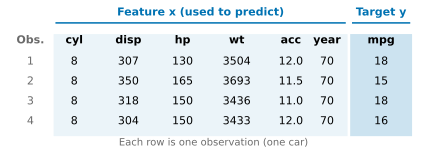
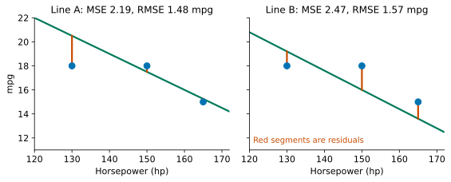
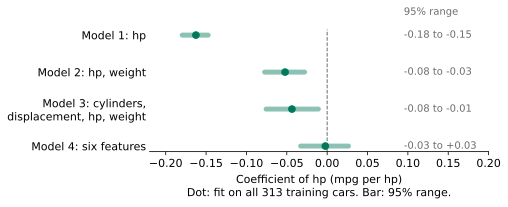
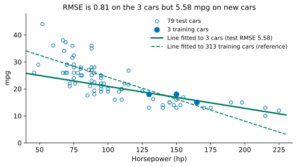
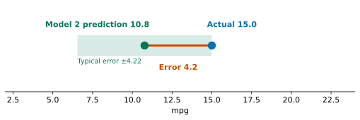
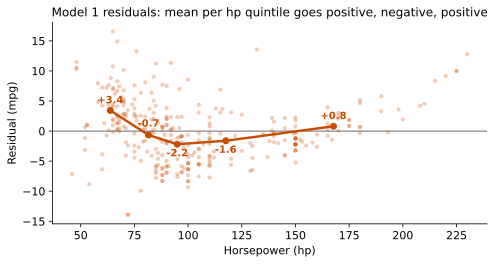

## 1. Motivation: Guess a Number

Here is a very common kind of problem. We have a few quantities that are easy to measure, and we want another number that is hard to get directly. We might predict tomorrow's national electricity demand from the weather and the date, estimate the power consumption of a chip from its design parameters, or guess the fuel consumption of a car from its horsepower and weight. The form is always the same: we are given some measured numbers and asked for one more number.

We start with the last example, and we start by guessing.

First, the units. Here mpg means miles per gallon, using the US gallon. One US gallon is about 3.8 litres. The imperial gallon is larger, so the same car has an mpg value about 1.2 times higher on the imperial scale. Among the 392 cars we will use, the lowest mpg is 9, the highest is 46.6, and the middle half lies between 17 and 29.

Consider an American car from 1970 with 198 horsepower (hp) and a weight of 4341 pounds (about 1969 kg). What is its mpg?

Make an estimate in your head before you open the answer.

::: {.callout-note collapse="true" title="Show answer"}
The measured value for this car is 15.0 mpg. Later we will use a prediction learned from data, and it gives 10.8 mpg, which is 4.2 below the measured value.
:::

Whatever number you guessed, three questions cannot be avoided. Where did the guess come from? Why should anyone trust it? Can we make it more accurate in a systematic way?

By the end of this lesson, you should be able to take a problem of the form "guess a number from a few measurements". You should be able to turn it into a method that can be written down, computed, and checked on new data. You should also be able to say where the method cannot be trusted. We follow five steps on one set of cars. The titles of the next five sections are these steps:

1. **Problem definition**: say exactly what we are guessing and what we guess from.
2. **Model**: choose how to model the problem, which means choosing the form of the answer.
3. **Loss**: define what counts as a good guess.
4. **Solution**: find the best model parameters.
5. **Validation**: test on cars the model has not seen, and see where it falls short.

A few notes on reading. A new term is shown in bold when it first appears. Three kinds of quantity have fixed colours in the text, the formulas and the figures. Blue is for data (features and target), green is for the model (predicted values, parameters, the fitted line), and red is for error (residuals and loss). "Section N" refers to Section N of this note.

The five steps are not taken once in a straight line. Later steps often send us back to change an earlier choice, and we will meet two examples of this.

## 2. Problem Definition: Features, Target and Data Split

The previous section described the rough shape of the problem: guess a number from a few measurements. This section puts it in a form that a computer can work with. What do we guess, what do we guess from, and which data do we learn from?

The data come from 392 cars built between 1970 and 1982. The original data had 6 cars with missing horsepower, and we removed them. Each car is one row of records, and we call it an [observation]{.c-data}. In each row, the quantities used for guessing are called [features]{.c-data} and are written $x$. The quantity to be guessed is called the [target]{.c-data} and is written $y$.

| Role | Quantities | Abbreviations |
|---|---|---|
| Features | number of cylinders, displacement, horsepower, weight, acceleration, model year | cyl, disp, hp, wt, acc, year |
| Target | miles per gallon | mpg |

The data also contain a column for origin. It is a categorical code (1, 2 and 3 stand for different regions), and we do not use it in this lesson.

{fig-alt="A table of four rows of car data, with the feature columns and the target column marked separately"}

**Indices.** We number the cars $i=1,\dots,n$ and the features $j=1,\dots,p$. The value of feature $j$ for car $i$ is $\textcolor{#0072B2}{x_{ij}}$, and the measured target of car $i$ is $\textcolor{#0072B2}{y_i}$. The first index always counts cars and the second always counts features. In the table above, the weight of car 2 is $x_{24}=3693$ lb (row 2, column 4) and its target is $y_2=15$ mpg. When we use only one feature, we drop the second index: $x_i$ is the value of that feature, for example the horsepower, for car $i$.

Every record carries the true value of the target, and we use these true values to learn how to guess. A problem of this kind is called **supervised learning**. The target here is a continuous number (mpg), and a problem with a continuous target is called **regression**.

What we really care about is not how accurately we guess the cars we have already recorded, but how accurately we guess **cars we have never seen**. To be able to check this, we first split the 392 cars into two groups. We pick 80% at random, which is 313 cars, and call them the **training set**. We use it for fitting. The remaining 79 cars form the **test set**, which we keep for the final check. During fitting, the test set takes no part in any choice. The section on validation explains why this is necessary.

We also need a starting point. The most naive guess ignores all features and predicts the average fuel consumption of the training set, 23.60 mpg, for every car. This is called the **baseline**. Any later method is useful only if it guesses better than the baseline. How to measure "better" is defined in the section on loss.

The problem is now fixed: guess the target from the features, learn from the training set, check on the test set, and compare with the baseline. The next question is what form the guess should take.

## 3. Model: Choosing How to Model

The previous section left us with a question: in what form should the guess be given? This section first chooses the simplest form, a straight line, and then extends it to several features.

Start with one feature, horsepower. A car with more horsepower generally uses more fuel (lower mpg), so the overall trend goes downward. The simplest way to model this is a straight line:

$$
\textcolor{#00795A}{\hat y} = \textcolor{#00795A}{b} + \textcolor{#00795A}{w}\,\textcolor{#0072B2}{x} .
$$

The symbol $\hat y$ is read "y hat". It is the [predicted value]{.c-model}, and the hat distinguishes it from the measured $y$. The number $b$ is called the intercept and $w$ is called the slope, and together they are the [parameters]{.c-model} of this model. For each extra 1 hp, the predicted mpg changes by $w$ on average, so $w$ has units of mpg/hp. It describes how the prediction changes with horsepower. It does not claim that adding horsepower causes lower mpg. A car with zero horsepower is outside the range of the data, so $b$ does not correspond to any real car either.

Choosing a straight line only marks out the candidates. Different values of $b$ and $w$ give different lines, and so different predictions. For example, take $b=40.606$ and $w=-0.1626$. A car with 100 hp is then predicted to have $40.606-0.1626\times100=24.35$ mpg. How these two numbers are obtained is explained in the section on the solution.

Now try it yourself. Below are three real cars: 130 hp with 18 mpg, 165 hp with 15 mpg, and 150 hp with 18 mpg.



Drag the line to the position you think fits these three cars best. Then drag it slightly off and ask yourself: can you tell at a glance that it got worse?

Most likely you cannot. The eye can only distinguish up to a limited precision, and several lines that all look good give different predictions for the same new car. To pick the best line out of many, we need a standard that turns "good" into a number. The next section defines it.

**Several features.** Fuel consumption depends on more than horsepower. Weight and displacement matter too. When we increase the number of features to $p$, the model is still a weighted sum. For car $i$:

$$
\textcolor{#00795A}{\hat y_i} = \textcolor{#00795A}{w_0} + \textcolor{#00795A}{w_1}\textcolor{#0072B2}{x_{i1}} + \textcolor{#00795A}{w_2}\textcolor{#0072B2}{x_{i2}} + \cdots + \textcolor{#00795A}{w_p}\textcolor{#0072B2}{x_{ip}} ,
$$

where $w_0$ is the $b$ from before, and $w_1,\dots,w_p$ are called [coefficients]{.c-model}. A model of this form is called a [linear model]{.c-model}: the prediction is a weighted sum of the features plus a constant. The $p+1$ parameters $w_0,\dots,w_p$ determine one specific model, and we collect them in a vector $\mathbf w$.

To make the notation shorter, we put a 1 in front of the features of each car, so that the [feature vector]{.c-data} of car $i$ is $\mathbf x_i=(1,x_{i1},\dots,x_{ip})^T$ and $\hat y_i=\mathbf w^T\mathbf x_i$. Now stack the $n$ cars. Written out in full, the predictions for all cars are

$$
\underbrace{\begin{pmatrix}\textcolor{#00795A}{\hat y_1}\\ \textcolor{#00795A}{\hat y_2}\\ \vdots\\ \textcolor{#00795A}{\hat y_n}\end{pmatrix}}_{\textcolor{#00795A}{\hat{\mathbf y}}:\ n\times 1}
=
\underbrace{\begin{pmatrix}
1 & \textcolor{#0072B2}{x_{11}} & \textcolor{#0072B2}{x_{12}} & \cdots & \textcolor{#0072B2}{x_{1p}}\\
1 & \textcolor{#0072B2}{x_{21}} & \textcolor{#0072B2}{x_{22}} & \cdots & \textcolor{#0072B2}{x_{2p}}\\
\vdots & \vdots & \vdots & & \vdots\\
1 & \textcolor{#0072B2}{x_{n1}} & \textcolor{#0072B2}{x_{n2}} & \cdots & \textcolor{#0072B2}{x_{np}}
\end{pmatrix}}_{\textcolor{#0072B2}{\mathbf X}:\ n\times(p+1)}
\underbrace{\begin{pmatrix}\textcolor{#00795A}{w_0}\\ \textcolor{#00795A}{w_1}\\ \vdots\\ \textcolor{#00795A}{w_p}\end{pmatrix}}_{\textcolor{#00795A}{\mathbf w}:\ (p+1)\times 1}
$$

Each object has a size, and it helps to check it. $\hat{\mathbf y}$ has one prediction per car, so it is a vector with $n$ entries ($n\times1$). The matrix $\mathbf X$ is the [data matrix]{.c-data}, with $n$ rows and $p+1$ columns: row $i$ is the feature vector $\mathbf x_i^T$ of car $i$, column $j$ holds feature $j$ of all cars, and the first column is all ones. The parameter vector $\mathbf w$ has $p+1$ entries ($(p+1)\times1$). The measured targets are stacked in the same way into a vector $\mathbf y=(y_1,\dots,y_n)^T$, also of size $n\times1$. Each row of the product is the prediction for one car, so all predictions can be written at once as

$$
\hat{\mathbf y}=\mathbf X\mathbf w .
$$

So far we have chosen only the form of the model, and the parameters $\mathbf w$ are still open. Each choice of $\mathbf w$ gives one candidate model. How do we pick the best one among them?

## 4. Loss: How to Define "Good"

The previous section gave us a family of candidate models, one for each choice of parameters. To pick one, we need a standard. We need a way to turn "how badly does this model guess on the data?" into a single number. The smaller the number, the better the model. A function like this is called a [loss function]{.c-loss}. This section defines the loss used in this lecture.

For car $i$, the [residual]{.c-loss} is the measured value minus the predicted value: $\textcolor{#C84B00}{e_i}=\textcolor{#0072B2}{y_i}-\textcolor{#00795A}{\hat y_i}$. A positive residual means the prediction was too low. A negative residual means it was too high. If we added the residuals directly, the positive and negative ones would cancel, so we first square each residual and then take the average. This gives the [mean squared error]{.c-loss} (MSE):

$$
\textcolor{#C84B00}{J(\mathbf w)}=\frac1n\sum_{i=1}^{n}\bigl(\textcolor{#0072B2}{y_i}-\textcolor{#00795A}{\hat y_i}\bigr)^2 .
$$

For a straight line with one input, $\hat y_i=b+wx_i$ (with one feature the second index is dropped, so $x_i$ is the horsepower of car $i$), so this quantity can also be written $J(b,w)$. Here $n$ is the number of cars used in the calculation. The unit of MSE is $\mathrm{mpg}^2$, which is hard to interpret. Its square root, $\sqrt{J}$, is called the [root mean squared error]{.c-loss} (RMSE). Its unit is mpg again, so we can read it as the size of a typical error.

Let us compute these for the three cars from before and the two candidate lines. Line A is $40-0.15x$ and line B is $40-0.16x$.

| Horsepower $x$ | Measured $y$ | Line A prediction | Line A residual | Line B prediction | Line B residual |
|---:|---:|---:|---:|---:|---:|
| 130 | 18 | 20.50 | −2.50 | 19.20 | −1.20 |
| 165 | 15 | 15.25 | −0.25 | 13.60 | 1.40 |
| 150 | 18 | 17.50 | 0.50 | 16.00 | 2.00 |

For line A, the MSE is $(2.50^2+0.25^2+0.50^2)/3=2.19$ and the RMSE is about 1.48 mpg. For line B, the MSE is $(1.20^2+1.40^2+2.00^2)/3=2.47$ and the RMSE is about 1.57 mpg. For these three cars and this standard, line A is better.

{fig-alt="Two scatter plots, each showing one candidate line and three residual line segments"}

Why do we square the residuals? Squaring punishes large errors more heavily. It also has a big advantage: in the next section, we can solve for the minimum directly. Squaring is not the only possible standard. We could, for example, add up the absolute values of the residuals instead. Different standards pick different lines, so choosing one is a decision. This lecture chooses MSE. Other choices are left to the questions in Advanced Study 4.

Note also that "$J$ is smaller, so the line is better" is a statement only about **the cars used in the calculation**. With a different set of cars, the comparison between the two lines might change. "Fitting closely to the cars we have already seen" and "guessing well for new cars" are two different questions. The later section on validation answers the second one.

Now every pair $(b,w)$ has a score. Trying lines one by one by eye is slow and inaccurate. Can we compute the pair with the lowest score directly? That is the question for the next section.

## 5. Solution: Finding the Best Model Parameters

The previous section gave every set of parameters a score, so the task is now to find the set with the lowest score. Trying sets one by one would be far too slow, so this section uses calculus to solve for it directly.

Fitting means finding the parameters that minimise $J$. As a function of $b$ and $w$, $J$ is quadratic, and its graph is a bowl that opens upwards. The point where the derivative is zero is the bottom of the bowl. We first work through the case of one feature, then extend the result to any number of features.

**One feature ($p=1$).**

$$
J(b,w)=\frac1n\sum_{i=1}^{n}(y_i-b-wx_i)^2 .
$$

Take the **partial derivative** with respect to $b$ (the rate at which $J$ changes when only $b$ moves and everything else is held fixed) and set it to zero:

$$
\frac{\partial J}{\partial b}=-\frac2n\sum_i(y_i-b-wx_i)=0
\;\Longrightarrow\;
\bar y-b-w\bar x=0
\;\Longrightarrow\;
b=\bar y-w\bar x ,
$$

where $\bar x$ and $\bar y$ are the means. This tells us that the best line must pass through the point $(\bar x,\bar y)$. Next, take the partial derivative with respect to $w$ and set it to zero:

$$
\frac{\partial J}{\partial w}=-\frac2n\sum_i x_i(y_i-b-wx_i)=0 .
$$

Substituting $b=\bar y-w\bar x$ gives $\sum_i x_i\bigl[(y_i-\bar y)-w(x_i-\bar x)\bigr]=0$. Because $\sum_i\bar x(y_i-\bar y)=0$ and $\sum_i\bar x(x_i-\bar x)=0$, we may replace $x_i$ by $x_i-\bar x$ on both sides. Rearranging gives

$$
w=\frac{\sum_i(x_i-\bar x)(y_i-\bar y)}{\sum_i(x_i-\bar x)^2},\qquad b=\bar y-w\bar x .
$$

The numerator measures how the two columns of numbers vary together. The denominator measures how much horsepower varies on its own. If every car had the same horsepower, the denominator would be zero, and these records alone could not determine the slope.

**Checking with the three cars.** Here $\bar x=148.33$ and $\bar y=17$. The numerator is $-50$ and the denominator is about $616.67$. Therefore

$$
w=\frac{-50}{616.67}\approx-0.0811,\qquad b=17+0.0811\times148.33\approx29.03 .
$$

On the three cars, this line has an MSE of about 0.649 (an RMSE of about 0.81 mpg). That is smaller than the 2.19 of line A and the 2.47 of line B.

{fig-alt="Contour plot of the MSE for the three cars, showing the minimum and the two lines A and B"}

**The same formula applied to all 313 training cars** gives $w=-0.1626$ and $b=40.606$. These are the two numbers we used in the earlier section on the model. The slope from three cars is about $-0.081$ and the slope from 313 cars is about $-0.163$, a difference of a factor of two. "Best" has a limited meaning here: among all straight lines, it is the one with the smallest $J$ on the cars used in the calculation. With a different set of cars, the best line would be different.

**Any number of features.** We write $J$ in matrix form, using $\hat{\mathbf y}=\mathbf X\mathbf w$ from before:

$$
J(\mathbf w)=\frac1n(\mathbf y-\mathbf X\mathbf w)^T(\mathbf y-\mathbf X\mathbf w)
=\frac1n\bigl(\mathbf y^T\mathbf y-2\mathbf w^T\mathbf X^T\mathbf y+\mathbf w^T\mathbf X^T\mathbf X\,\mathbf w\bigr).
$$

When there are several parameters, we collect all the partial derivatives into one vector called the **gradient**, written $\nabla J$. It points in the direction in which $J$ increases fastest. A zero gradient means that every partial derivative is zero. To compute it, we need two rules for matrix derivatives: $\nabla_{\mathbf w}(\mathbf a^T\mathbf w)=\mathbf a$, and, for a symmetric matrix $\mathbf A$, $\nabla_{\mathbf w}(\mathbf w^T\mathbf A\mathbf w)=2\mathbf A\mathbf w$ (derivations are in Appendix A). Then

$$
\nabla J(\mathbf w)=\frac2n\bigl(\mathbf X^T\mathbf X\,\mathbf w-\mathbf X^T\mathbf y\bigr).
$$

Setting the gradient to zero gives the **normal equation**

$$
\mathbf X^T\mathbf X\,\mathbf w=\mathbf X^T\mathbf y .
$$

If $\mathbf X^T\mathbf X$ is invertible, the solution is

$$
\mathbf w=(\mathbf X^T\mathbf X)^{-1}\mathbf X^T\mathbf y .
$$

Compare this with the one-feature case. When $p=1$, the first row of the normal equation is $n\,b+w\sum_ix_i=\sum_iy_i$. Dividing both sides by $n$ gives $b=\bar y-w\bar x$, which agrees with the result above.

When is $\mathbf X^T\mathbf X$ invertible? It is invertible exactly when the columns of $\mathbf X$ are linearly independent. This means two things. No feature can be reproduced exactly by combining the other features and the constant column. Also, the number of cars $n$ must be at least the number of parameters $p+1$. If the condition fails, the normal equation has infinitely many solutions and the parameters are not unique. For $p=1$, the condition says that the horsepower values are not all the same, which matches the denominator above being non-zero.

Adding features gives $\mathbf X$ more columns, but the derivation and the equations stay the same. How to read each number in the solution $\mathbf w$ is the topic of the next section.

**Two open questions.** Although we have written down the solution, it raises two new questions. First, the formula contains an inverse. When features are nearly correlated, $\mathbf X^T\mathbf X$ is still invertible, but it is very close to not being invertible. The solution can then react very strongly to tiny changes in the data. How can we tell when this happens, and how does software avoid it? Second, the normal equation is not the only way to solve the problem. Is there a method that avoids the inverse and approaches the answer step by step? Neither question affects the rest of this lecture. Advanced Study 1 answers the first and Advanced Study 2 answers the second.

## 6. Interpretation: How to Read Model Parameters

The previous section produced a set of coefficients $w_0,\dots,w_p$. The question for this section is whether we can read these numbers directly, and what exactly we learn from them.

Each $w_j$ means the following: **with the other features held fixed**, each one-unit increase in feature $j$ (column $j$ of $\mathbf X$) changes the predicted mpg by $w_j$ on average. Its unit is mpg divided by the unit of that feature, so the coefficient of hp (mpg/hp) and the coefficient of weight (mpg/lb) cannot be compared by size directly.

To compare them, we first apply **standardisation**: subtract each feature's mean and divide by its standard deviation, so that the new feature has mean 0 and standard deviation 1. Standardisation does not change the predictions. It only changes the unit in which we read the coefficient, which now tells us how many mpg the prediction changes when the feature changes by one standard deviation. Take a model with only hp and weight. The coefficient of hp is $-0.0521$ mpg/hp and the coefficient of weight is $-0.00587$ mpg/lb. The standard deviation of hp is about 38 hp and that of weight is about 840 lb, so the standardised coefficients are about $-2.0$ and $-4.9$ mpg. In this model, weight has about 2.5 times the influence of horsepower.

**Why the same coefficient changes.** Below, we add features to the model step by step. Each time we solve on the 313 training cars and record the coefficient of hp.

| Model | Features | Coefficient of hp | Training RMSE (mpg) |
|---|---|---:|---:|
| 1 | hp | −0.163 | 4.95 |
| 2 | hp, weight | −0.052 | 4.24 |
| 3 | cylinders, displacement, hp, weight | −0.044 | 4.23 |
| 4 | six features | −0.002 | 3.46 |

Before looking at the answer, make a prediction. In model 1, the coefficient of hp is $-0.163$. After we add weight to the model, will the coefficient of hp become larger, smaller, or stay the same?



You can tick the boxes in the widget above yourself. The result is that the coefficient of hp shrinks from $-0.163$ to nearly 0, for the same variable and the same cars.

The reason lies in the words "with the other features held fixed". Weight and horsepower are strongly related. The **correlation coefficient** (a measure of how closely two quantities vary together, between $-1$ and $1$, where values near $\pm1$ mean a strong relationship) is 0.86, so heavy cars usually have more horsepower. When hp is the only feature, it has to carry two kinds of information at once, "heavy" and "powerful", and the $-0.163$ includes the effect of weight. Once weight is in the model, the coefficient of hp describes only what happens when horsepower is higher among cars of the same weight, so it becomes smaller.

Next, we look at which feature makes it shrink further. Starting from hp and weight, adding acceleration has almost no effect ($-0.052$ becomes $-0.055$), while adding model year shrinks it to $-0.009$. Model year is negatively correlated with horsepower ($-0.42$, because later cars have less horsepower) and positively correlated with mpg (0.58, because later cars use less fuel). Without model year, the coefficient of hp absorbs the effect of "later cars are both more economical and less powerful". Once all six features are included, hp adds almost no further predictive information when the other five features are known.

So the value of a single coefficient depends on which other features are in the model. To read a coefficient, you must also state what the other features are.

**How much would the coefficient change with a different set of training cars?** We resample the 313 training cars at random with replacement, drawing 313 times, to make a new training set. We refit and record the coefficient of hp. We repeat this 500 times, sort the 500 values from smallest to largest, and remove the smallest and largest 2.5% each. The interval that remains is called the 95% range:

| Model | 95% range of the hp coefficient |
|---|---|
| 1 | −0.18 to −0.15 |
| 2 | −0.08 to −0.03 |
| 3 | −0.08 to −0.01 |
| 4 | −0.03 to +0.03 |

{fig-alt="Interval plot of the hp coefficient for four models, with a reference line at zero"}

With hp alone, the coefficient is stable and its range is narrow. After we add weight, which is strongly correlated with hp, the range widens. The range for model 4 crosses 0, so with a different set of training cars the coefficient of hp could be negative or positive. The reason is that correlated features carry much of the same information, so the model has difficulty deciding which one deserves the credit. Cylinders, displacement, hp and weight are all correlated with each other, with correlation coefficients between 0.84 and 0.95.

These are two different issues. In the first table above, the value of the coefficient changed because the other features changed, which is a question of how to read the coefficient. In the second table, the coefficient estimate is unstable because the training cars changed, which is a question about the data.

We now know how to read the coefficients, but a more basic question remains: can we trust these models when they predict new cars? The next section answers it.

## 7. Validation: Does the Model Work on New Data?

The second question raised at the start was why we should trust this guess. So far we have only looked at how closely the model fits the training cars. This section checks the model on cars that took no part in the fitting. This step is called **validation**: checking whether a model still works on new data. In this lecture, we do it with the test set that we set aside earlier.

The training RMSE tells us how closely the model fits the cars already used to solve for it. To know whether it is accurate for new cars, we must use new cars.

Consider an extreme example first. Go back to the three cars used in the solution. Their best line, $\hat y=29.03-0.0811x$, has an RMSE of only 0.81 mpg on those three cars. If we use the same line to predict the 79 test cars, the RMSE is 5.58 mpg, nearly 7 times larger. This line was tailored to the three cars and makes almost no promise about other cars.

{fig-alt="Scatter plot of test cars with two fitted lines"}

A small training error does not mean the model works for new cars. This is why we set aside a test set: the test cars take no part in the solution or in any choice, so their RMSE is an estimate for "cars the model has not seen".

The table below shows the results of the four models on the 79 test cars, compared with the baseline. **R²** is defined as

$$
R^2=1-\frac{\mathrm{MSE}_{\text{model}}}{\mathrm{MSE}_{\text{baseline}}},
$$

where 0 means the model is as poor as the baseline and 1 means the predictions are exactly right.

| Method | Test RMSE (mpg) | R² |
|---|---:|---:|
| Baseline: always guess the training mean, 23.60 | 7.18 | 0 |
| Model 1 (hp) | 4.71 | 0.571 |
| Model 2 (hp, weight) | 4.22 | 0.655 |
| Model 3 (cylinders, displacement, hp, weight) | 4.23 | 0.653 |
| Model 4 (six features) | 3.24 | 0.797 |

All four models beat the baseline. Model 4 reduces the typical error from 7.18 to 3.24 mpg. The values 4.22 and 4.23 for models 2 and 3 are not meaningfully different, so adding three more features gave no visible improvement.

Two points deserve attention. First, these four numbers were read from the same 79 cars. They are for reading only and should not be used to choose features again and again. Each time we choose, information from the test cars enters the selection, and they stop being fresh evidence. Second, there is no fixed relationship between training error and test error. For model 1, the training RMSE is 4.95 and the test RMSE is 4.71, so the test error is actually lower. This comes from random variation among 79 cars and is not a contradiction. Also, one random split cannot show that the model works for cars from other eras or other sources.

When many parameters are fitted with few cars, the training error becomes even more misleading. Drag the slider below to change the number of training cars used for fitting (six features, with the same 79 test cars) and watch how the training and test errors change.



With few training cars, the training error is lower than the test error. For example, with 20 cars the training RMSE is about 2.5 and the test RMSE is about 3.7. As the number of training cars grows, the two come closer, and with more than 100 cars they almost coincide. The reason is that when 7 parameters are determined from a few dozen cars, the model also learns the chance quirks of those cars. The more cars we have, the more these quirks cancel out.

We now have the formulas and the checks. How to carry out all of this in code is the subject of the next section.

## 8. Implementation: Doing It with scikit-learn

Every step so far came with a formula, and the software packs them into a few lines. In this section we walk through Model 2 (horsepower and weight): load the data, split it, fit the model, check it, and make a prediction.

```python
import numpy as np
import pandas as pd
from sklearn.model_selection import train_test_split
from sklearn.linear_model import LinearRegression
from sklearn.metrics import mean_squared_error

data = pd.read_csv("auto_mpg.csv")
X = data[["horsepower", "weight"]]
y = data["mpg"]

X_train, X_test, y_train, y_test = train_test_split(
    X, y, test_size=0.2, random_state=42
)

model = LinearRegression()
model.fit(X_train, y_train)
print(model.intercept_, model.coef_)

y_pred = model.predict(X_test)
print(mean_squared_error(y_test, y_pred) ** 0.5)      # test RMSE

baseline = y_train.mean()
print(((y_test - baseline) ** 2).mean() ** 0.5)       # test RMSE of the baseline
```

When you run it, the intercept is about 46.59, the two coefficients are about $-0.0521$ and $-0.00587$, the test RMSE is about 4.22, and the baseline is about 7.18. These agree with the numbers in the two previous sections. To get the predicted value for one particular car, pass in the same feature columns:

```python
car = pd.DataFrame({"horsepower": [198], "weight": [4341]})
print(model.predict(car))                              # about 10.8
```

The argument `random_state=42` makes `train_test_split` produce the same split every time, which is how the 313 training cars and 79 test cars are fixed. The call to `fit` solves the least squares problem. To confirm this, we can solve the normal equation ourselves:

```python
X1 = np.c_[np.ones(len(X_train)), X_train]        # add a column of ones
w = np.linalg.solve(X1.T @ X1, X1.T @ y_train)
print(w)                                            # same intercept and coefficients as above
```

Software usually does not compute the matrix inverse explicitly, and Advanced Study 1 explains why. Now that the code runs, one task remains: to pull everything together and say where the method falls short.

## 9. Summary and Limitations

Let us return to the car from the start: 198 hp, 4341 lb, measured 15.0 mpg. Model 2 predicts 10.8 mpg, which is 4.2 too low. We can now say what this number is worth. On the 79 cars it had never seen, Model 2 makes a typical error of 4.22 mpg, so an error of 4.2 on this car is a typical case. How far off was your own first guess? Whether it was better or worse than the model's, the difference is this: the error of the method can be measured, tested and improved.

{fig-alt="Predicted and measured values placed on a one-dimensional axis"}

**Five-step review.**

| Step | What this lecture did | Where |
|---|---|---|
| Problem definition | Features, target, supervised learning, training and test sets, baseline | Section 2 |
| Model | Linear model $\hat y=\mathbf w^T\mathbf x$ | Section 3 |
| Loss | Residual, MSE, RMSE | Section 4 |
| Solution | Least squares, normal equation | Section 5 |
| Validation | Test RMSE against the baseline, R²; reading the coefficients and their instability | Section 6, 7 |

**Transfer question.** A lab has recorded the composition of 200 alloy samples (the mass percentage of several elements), the heat treatment temperature and time, and the measured yield strength. The lab wants to predict the strength of a new alloy recipe. Without doing any calculation, write a plan using the five steps. What are the features and the target? What form of model will you use? What standard will you use to judge how good it is? How will you solve for the parameters? How will you check the result, and what is the baseline?

::: {.callout-note collapse="true" title="Reference answer"}
The features are the mass percentage of each element, the temperature and the time, and the target is the yield strength. Use a linear model and the MSE; the RMSE has the same unit as the strength. Solve with the normal equation or with `fit`. Hold out part of the samples (for example 20%) as a test set, take the mean strength of the training samples as the baseline, and compare the test RMSE. One point needs care. If you use the mass percentages of all the elements as features, they add up to exactly 100, so the composition columns are linearly dependent on the constant column and the invertibility condition fails. Drop one of the elements.
:::

**Where this method cannot be trusted.**

1. **A single coefficient is hard to read.** The coefficient of hp changes from $-0.163$ to $-0.002$ depending on which other features are in the model, and with six features its 95% range crosses 0.
2. **The test cars represent only the same batch of historical cars.** They come from the same records covering 1970 to 1982, with only one split and 79 cars. The differences between the four models can be supported only to this level of precision. We have no evidence about whether the models still work for other years or other sources of cars.
3. **Correlation is not mechanism.** Once the other five features are known, hp adds almost no extra predictive information. This answers a prediction question. It does not answer "does horsepower affect fuel consumption?" or "would changing a car's horsepower change its fuel consumption?"
4. **The linear form is itself an assumption.** If we sort the 313 training cars into five groups by horsepower, the mean residuals of Model 1 in the groups are about $+3.4$, $-0.7$, $-2.2$, $-1.6$ and $+0.8$ mpg. The two ends are positive and the middle is negative, which shows that the straight line misses a stretch of curvature.

{fig-alt="Scatter of residuals with a line through the five group means"}

One problem remains unsolved here. The comparison of the four models can only be read, not used to choose. If we want to pick one set of features from many, what evidence should we use so that we do not spend the test cars?

**Back to the promise at the start.** Faced with a problem of the kind "guess a number from a few measurements", you can now do the following. Write it as data using features and a target. Choose a linear model, judge it by the MSE, and find the parameters with the normal equation or `fit`. Check it with a test set and a baseline. And say where it cannot be trusted. That is everything in this lecture.

*MPS311 students are encouraged to read the studies below; MPS439 students should complete at least one of Studies 1 to 3.*

---

## Advanced Study 1: Stability of the Solution

This answers the first open question at the end of Section 5. The formula contains a matrix inverse, so what goes wrong when features are almost correlated, how can we tell, and how does software avoid the problem?

**A small example.** A computer stores numbers with a limited number of digits, and real data always contains small errors. Consider this system of equations:

$$
\begin{pmatrix}1&1\\1&1.0001\end{pmatrix}\mathbf w=\begin{pmatrix}2\\2\end{pmatrix}
\quad\text{has the solution}\quad \mathbf w=(2,\,0)^T .
$$

Change the second 2 on the right-hand side to 2.0001. This is a change of less than one part in ten thousand, yet the solution becomes $(1,\,1)^T$. A matrix whose two columns are almost identical reacts very strongly to tiny changes in its input. When features are almost correlated, $\mathbf X^T\mathbf X$ is exactly this kind of matrix.

**Condition number.** We measure this sensitivity with a single number. A matrix stretches vectors, and the largest stretching factor divided by the smallest is called the **condition number**. The matrix above has a condition number of about $4\times10^4$. The larger the condition number, the more a tiny change in the input can be magnified in the output, and the less reliable the solution is.

**Why we avoid solving the normal equation directly.** The matrix $\mathbf X^T\mathbf X$ applies the stretching of $\mathbf X$ twice, so its condition number is the square of the condition number of $\mathbf X$:

$$
\kappa(\mathbf X^T\mathbf X)=\kappa(\mathbf X)^2 .
$$

For the six features of the 313 training cars (with a column of ones added, using the raw values), the condition number of $\mathbf X$ is about $8.8\times10^4$, while that of $\mathbf X^T\mathbf X$ is about $7.7\times10^9$. Double-precision floating-point numbers carry about 16 significant digits. The larger condition number therefore costs about 10 digits and leaves only about 6. After we standardise each feature (Section 6), the two numbers drop to about 11 and 116, and the problem becomes much gentler. This is one computational benefit of standardisation.

**What software does.** Software avoids forming $\mathbf X^T\mathbf X$. It breaks $\mathbf X$ itself into a product of matrices that are easy to work with, and then solves the least squares problem from those pieces, so the condition number is not squared. Common factorisations are the QR decomposition and the singular value decomposition (SVD). NumPy's `np.linalg.lstsq` and scikit-learn's `LinearRegression` follow this approach, so the `fit` in Section 8 can be used with confidence.

## Advanced Study 2: Gradient Descent

This answers the second open question at the end of Section 5. Is there a way to approach the answer step by step, without computing an inverse?

**The intuition of walking downhill.** Imagine walking down a valley blindfolded. At each step you feel which direction goes down fastest under your feet, and you take a step that way. The gradient $\nabla J$ from Section 5 points in the direction of fastest increase, so its opposite is the direction of fastest decrease. Starting from any set of parameters, we repeat

$$
\mathbf w\leftarrow\mathbf w-\eta\,\nabla J(\mathbf w),\qquad
\nabla J(\mathbf w)=\frac2n\mathbf X^T(\mathbf X\mathbf w-\mathbf y).
$$

The number $\eta>0$ is called the **learning rate**, and it sets how far each step goes. The method is called gradient descent.

**An example with one parameter.** Take $J(w)=(w-3)^2$, whose lowest point is at $w=3$. The gradient is $2(w-3)$, and after one update the error $w-3$ is multiplied by $1-2\eta$.

| Learning rate $\eta$ | Error is multiplied by | Starting from $w=0$, where the error size is 3 |
|---:|---:|---|
| 0.1 | 0.8 | Shrinks steadily: 2.4, 1.92, 1.54, slowly approaching 3 |
| 0.5 | 0 | Reaches the minimum in one step |
| 1.1 | −1.2 | Jumps back and forth, moves further away each time, and diverges |

If the steps are too small, progress is slow. If they are too large, a step crosses the bottom of the valley and lands higher up on the other side. For this example, the method converges only when $0<\eta<1$.

**Two parameters: a long narrow valley.** Take $J(w_1,w_2)=w_1^2+100\,w_2^2$. It is 100 times steeper in the $w_2$ direction than in the $w_1$ direction, like a long narrow bowl. The two parameters update independently: $w_1$ is multiplied by $1-2\eta$ at each step, and $w_2$ by $1-200\eta$. To avoid overshooting in the steep direction, we need $\eta<0.01$. With $\eta=0.009$, the steep direction settles quickly, but the flat direction shrinks by only about 1.8% per step, and it takes about 250 steps to shrink to 1% of its starting size. The steep direction limits the step size, so the flat direction moves slowly.

**Back to our data.** Use the two features hp and weight. How steep each direction is depends on the size of the feature values. Weight is in the thousands and hp is only one or two hundred, so with raw values the two directions differ in steepness by a factor of about $10^8$. To avoid divergence, the learning rate must be below about $10^{-7}$, and then the flat direction needs over a hundred million steps to shrink to 1%. After standardisation, the two directions differ in steepness by only a factor of about 13, and $\eta=0.1$ gets close to the least squares solution within a few hundred steps. This is another benefit of standardisation, and it is the same message as Advanced Study 1: when features have very different scales, the problem is hard to compute.



The shading is read as in the contour picture of the earlier section on the solution: darker means a larger loss, and the red dot is the least squares solution. Try changing the learning rate and the number of steps in the figure above. If the rate is too small, the path moves slowly. If it is moderate, the path arrives within a few dozen steps. If it is too large, the path jumps back and forth and may even diverge.

**Comparison with the normal equation.** The normal equation gives the answer in one go, but it requires working with $\mathbf X^T\mathbf X$. Gradient descent needs only simple multiplications at each step, which can be cheaper when there are many features, but we must choose the learning rate and the number of steps. Many models that come later have no closed-form solution, and for those, methods of this kind are the only option.

## Advanced Study 3: Implementing Gradient Descent Yourself

Use numpy to implement the update formula from Advanced Study 2 on the standardised hp and weight, and compare the result with the least squares solution:

```python
Z = (X_train - X_train.mean()) / X_train.std()      # standardisation
Z1 = np.c_[np.ones(len(Z)), Z]
y = y_train.values

w = np.zeros(3)
eta = 0.1
for step in range(500):
    grad = 2 / len(Z1) * Z1.T @ (Z1 @ w - y)
    w = w - eta * grad
print(w)
print(np.linalg.lstsq(Z1, y, rcond=None)[0])         # for comparison
```

The two printed lines should be almost identical. Change `eta` to 0.6, then to 0.01, and vary the number of steps as well, and compare what you see with the explanation in Advanced Study 2. Then remove the standardisation line and see what happens.

## Advanced Study 4: Open Questions

This lecture does not develop the following four questions. Each comes with a starting point. They need some background in probability and linear algebra.

1. **The probability view.** Suppose $y=\mathbf X\mathbf w+\boldsymbol\varepsilon$, where the noise terms $\varepsilon_i$ are independent and normally distributed with mean 0 and variance $\sigma^2$. How is minimising the MSE related to maximising the likelihood? Starting point: write down the log-likelihood and compare it with $J(\mathbf w)$.
2. **The geometry of projection.** Why is the least squares solution the orthogonal projection of $\mathbf y$ onto the column space of $\mathbf X$? Starting point: the normal equation can be written as $\mathbf X^T(\mathbf y-\mathbf X\mathbf w)=\mathbf 0$. Explain why this says the residual is orthogonal to every column.
3. **A robust loss.** If we replace the MSE with the average of the absolute residuals, how does the best solution change? Why does it no longer have a closed-form solution like the normal equation? Starting point: with only a constant term, the value that minimises squared error is the mean. What value minimises absolute error?
4. **Uncertainty in the coefficients.** Write the resampling idea of Section 6 as a formula. Starting point: $\hat{\mathbf w}=(\mathbf X^T\mathbf X)^{-1}\mathbf X^T\mathbf y$ is a linear function of $\mathbf y$. If $\mathrm{Cov}(\mathbf y)=\sigma^2\mathbf I$, find the covariance of $\hat{\mathbf w}$, and explain how correlated features make $(\mathbf X^T\mathbf X)^{-1}$ large.

## Appendix A: A Quick Review of Mathematical Intuition

**Sums and averages.** $\sum_i(x_i-\bar x)=0$: the deviations from the average cancel, the positive ones against the negative ones. The derivation in Section 5 uses this fact.

**Partial derivatives and the gradient.** The partial derivative of a function $J(w_0,\dots,w_p)$ with respect to one $w_j$ is the rate at which $J$ changes when only $w_j$ changes and all the others stay fixed. Arranging all the partial derivatives into a vector gives the gradient $\nabla J$, which points in the direction in which $J$ increases fastest.

**Vector and matrix notation.** $\mathbf a^T\mathbf b=\sum_ja_jb_j$ is the inner product. Also $(\mathbf A\mathbf B)^T=\mathbf B^T\mathbf A^T$, and $\mathbf X^T\mathbf X$ is a symmetric matrix. Saying that the columns of $\mathbf X$ are linearly independent means that no column can be written as a weighted sum of the other columns.

**Two differentiation identities.** For $\mathbf a^T\mathbf w=\sum_ja_jw_j$, the derivative with respect to $w_m$ is $a_m$, so

$$
\nabla_{\mathbf w}(\mathbf a^T\mathbf w)=\mathbf a .
$$

For a symmetric matrix $\mathbf A$, we have $\mathbf w^T\mathbf A\mathbf w=\sum_j\sum_kA_{jk}w_jw_k$. When we differentiate with respect to $w_m$, two kinds of terms contain $w_m$: those with $j=m$ and those with $k=m$. They give $\sum_kA_{mk}w_k+\sum_jA_{jm}w_j=2(\mathbf A\mathbf w)_m$ (using $A_{jm}=A_{mj}$), so

$$
\nabla_{\mathbf w}(\mathbf w^T\mathbf A\mathbf w)=2\mathbf A\mathbf w .
$$

**Why a zero gradient means the minimum.** The matrix of second derivatives of $J$ is $\frac2n\mathbf X^T\mathbf X$. For any vector $\mathbf v$, $\mathbf v^T\mathbf X^T\mathbf X\mathbf v=\|\mathbf X\mathbf v\|^2\ge0$. So $J$ is a bowl that opens upwards and has no other stationary points, and the point where the gradient is zero is the lowest point.
