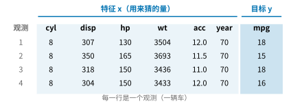
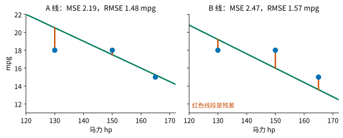
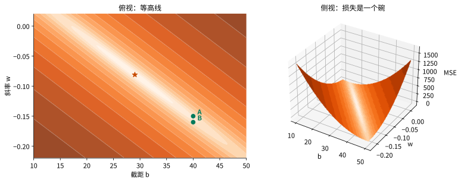
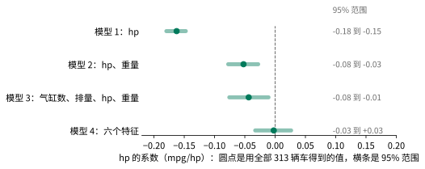
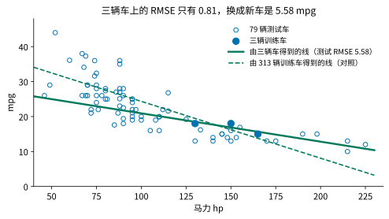
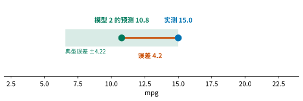
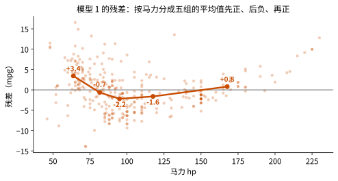

## 1. 动机：先猜一个数

有一类问题很常见：手里有几个容易测量的量，想知道另一个不容易直接得到的数。由天气和日期推测明天全国的用电量，由芯片的设计参数估计它的功耗，由一辆车的马力和重量猜它的油耗。形式都一样：给出几个测得出来的数，要求你回答一个数。

我们从最后一个例子开始，先猜一下。

先说明单位。这里的 mpg 是每加仑汽油行驶的英里数，用的是美制加仑：1 美制加仑约 3.8 升，英制加仑更大，同一辆车的英制 mpg 数值约为美制的 1.2 倍。我们要用的 392 辆车中，mpg 最低 9，最高 46.6，中间一半在 17 到 29 之间。

一辆 1970 年的美国车，198 马力（hp），重 4341 磅（约 1969 公斤）。它的 mpg 是多少？

请先在心里估一个数，再展开答案。

::: {.callout-note collapse="true" title="展开答案"}
这辆车的实测值是 15.0 mpg。后面我们会用到一个由数据得到的预测，它给出 10.8 mpg，比实测低 4.2。
:::

无论你猜的是多少，下面三个问题都躲不掉：这个猜测是怎么来的？凭什么相信它？能不能系统地把它猜得更准？

这节课结束时，你应能把一个“由几个测量值猜一个数”的问题，变成一个能写下来、能算出来、能用新数据检验的方法，并说清楚它在哪里不可信。我们用同一批车走完五步，后面五节的标题就是这五步：

1. **问题定义**：说清楚要猜什么、凭什么猜；
2. **模型**：选一种建模的方式，也就是答案的形式；
3. **损失**：定义怎样算猜得好；
4. **求解**：找到最好的模型参数；
5. **验证**：拿没见过的车检验，并看它在哪里不够用。

阅读时请注意：新术语在第一次出现时加粗；有三类量全文用固定的颜色标出，蓝色是数据（特征、目标），绿色是模型（预测值、参数、拟合的线），红色是误差（残差、损失），公式和图里也一样。文中的 Section N 指本文的第 N 节。

这五步不是一次走完的：后面的步骤常常让我们回头修改前面的选择，后面会遇到两个这样的例子。

## 2. 问题定义：特征、目标与数据划分

上一节给出了问题的大致形状：由几个测量值猜一个数。本节要把它说成可以交给计算机的形式：猜什么，凭什么猜，用哪些数据来学。

数据来自 392 辆 1970 到 1982 年的汽车。原始数据里有 6 辆缺少马力，已经去掉。每一辆车是一行记录，称为一个[观测]{.c-data}。每一行里，用来猜的量称为[特征]{.c-data}，记作 $x$；要猜的量称为[目标]{.c-data}，记作 $y$。

| 角色 | 量 | 缩写 |
|---|---|---|
| 特征 | 气缸数、排量、马力、重量、加速度、车型年份 | cyl、disp、hp、wt、acc、year |
| 目标 | 每加仑行驶的英里数 | mpg |

数据里还有一列产地，它是类别编码（用 1、2、3 表示不同地区），这一讲不使用。

{fig-alt="四行汽车数据表，特征列与目标列分别标出"}

**下标约定。**把车编号为 $i=1,\dots,n$，把特征编号为 $j=1,\dots,p$。第 $i$ 辆车的第 $j$ 个特征记为 $\textcolor{#0072B2}{x_{ij}}$，第 $i$ 辆车的目标实测值记为 $\textcolor{#0072B2}{y_i}$。第一个下标永远数车，第二个下标永远数特征。例如上表中第 2 辆车的重量是 $x_{24}=3693$ 磅（第 2 行第 4 列），它的目标是 $y_2=15$ mpg。只用一个特征时省略第二个下标：$x_i$ 就是这个特征（例如马力）在第 $i$ 辆车上的值。

每条记录都带着目标的真实值，我们用这些真实值来学怎么猜，这类问题称为**监督学习**。目标是一个连续的数（mpg），这样的问题称为**回归**。

我们真正关心的，不是对已经记录下来的车猜得多准，而是对**没有见过的车**猜得多准。为了能检验这一点，先把 392 辆车分成两份：随机取 80%，即 313 辆，称为**训练集**，用来拟合；其余 79 辆称为**测试集**，留到最后检验。在拟合阶段，测试集不参与任何选择。为什么必须这样做，后面的验证一节会回答。

还需要一个起点。最朴素的猜法是不看任何特征，对每辆车都猜训练集的平均油耗 23.60 mpg。它称为**基线**。以后任何方法，只有比基线猜得更准，才算有用。“更准”怎样衡量，后面的损失一节才定义。

问题已经定好：用特征猜目标，用训练集学，用测试集检验，用基线作比较。接下来的问题是：猜测要以什么形式给出？

## 3. 模型：选择建模方式

上一节留下的问题是：猜测以什么形式给出？本节先选定最简单的一种，一条直线，再推广到多个特征。

先只用一个特征：马力。马力大的车，油耗一般更高（mpg 更低），整体趋势向下。最简单的建模方式是用一条直线：

$$
\textcolor{#00795A}{\hat y} = \textcolor{#00795A}{b} + \textcolor{#00795A}{w}\,\textcolor{#0072B2}{x} .
$$

$\hat y$ 读作“y 帽”，表示[预测值]{.c-model}，用来区别于实测的 $y$。$b$ 称为截距，$w$ 称为斜率，它们是这个模型的[参数]{.c-model}：马力每增加 1 hp，预测的 mpg 平均变化 $w$，单位是 mpg/hp。它描述的是预测怎样随马力变化，不是“加马力会使油耗变低”的因果结论。零马力的车不在数据范围内，所以 $b$ 也不对应任何真实的车。

选定直线，只是划出了候选范围：$b$ 与 $w$ 取不同的数，就是不同的直线，给出不同的预测。例如取 $b=40.606$、$w=-0.1626$，100 hp 的车预测为 $40.606-0.1626\times100=24.35$ mpg。这两个数怎样得到，求解一节会说明。

现在请你自己试一次。下面是三辆真实的车：130 hp 对应 18 mpg，165 hp 对应 15 mpg，150 hp 对应 18 mpg。



拖动直线，把它调到你认为最贴近这三辆车的位置。然后把它拖偏一点点，问问自己：你能一眼看出它变差了吗？

多半看不出。眼睛只能分辨到有限的精度，而看起来都不错的几条线，在同一辆新车上给出的预测并不相同。要从许多条线里选出最好的一条，需要一个把“好”变成数字的标准。下一节定义它。

**多个特征。**油耗不只取决于马力，重量、排量也有关。把特征增加到 $p$ 个，模型仍然是加权和，对第 $i$ 辆车：

$$
\textcolor{#00795A}{\hat y_i} = \textcolor{#00795A}{w_0} + \textcolor{#00795A}{w_1}\textcolor{#0072B2}{x_{i1}} + \textcolor{#00795A}{w_2}\textcolor{#0072B2}{x_{i2}} + \cdots + \textcolor{#00795A}{w_p}\textcolor{#0072B2}{x_{ip}} ,
$$

其中 $w_0$ 就是前面的 $b$，$w_1,\dots,w_p$ 称为[系数]{.c-model}。这样的模型称为[线性模型]{.c-model}：预测是各特征的加权和再加一个常数。$p+1$ 个参数 $w_0,\dots,w_p$ 决定了一个具体的模型，我们把它们放进一个向量 $\mathbf w$。

为了书写方便，给每辆车的特征前补一个 1，于是第 $i$ 辆车的[特征向量]{.c-data}是 $\mathbf x_i=(1,x_{i1},\dots,x_{ip})^T$，$\hat y_i=\mathbf w^T\mathbf x_i$。把 $n$ 辆车叠在一起，所有车的预测完整写出来是

$$
\underbrace{\begin{pmatrix}\textcolor{#00795A}{\hat y_1}\\ \textcolor{#00795A}{\hat y_2}\\ \vdots\\ \textcolor{#00795A}{\hat y_n}\end{pmatrix}}_{\textcolor{#00795A}{\hat{\mathbf y}}:\ n\times 1}
=
\underbrace{\begin{pmatrix}
1 & \textcolor{#0072B2}{x_{11}} & \textcolor{#0072B2}{x_{12}} & \cdots & \textcolor{#0072B2}{x_{1p}}\\
1 & \textcolor{#0072B2}{x_{21}} & \textcolor{#0072B2}{x_{22}} & \cdots & \textcolor{#0072B2}{x_{2p}}\\
\vdots & \vdots & \vdots & & \vdots\\
1 & \textcolor{#0072B2}{x_{n1}} & \textcolor{#0072B2}{x_{n2}} & \cdots & \textcolor{#0072B2}{x_{np}}
\end{pmatrix}}_{\textcolor{#0072B2}{\mathbf X}:\ n\times(p+1)}
\underbrace{\begin{pmatrix}\textcolor{#00795A}{w_0}\\ \textcolor{#00795A}{w_1}\\ \vdots\\ \textcolor{#00795A}{w_p}\end{pmatrix}}_{\textcolor{#00795A}{\mathbf w}:\ (p+1)\times 1}
$$

每个对象的大小都值得核对一遍。$\hat{\mathbf y}$ 每辆车一个预测，是有 $n$ 个分量的向量（$n\times1$）。矩阵 $\mathbf X$ 是[数据矩阵]{.c-data}，$n$ 行 $p+1$ 列：第 $i$ 行是第 $i$ 辆车的特征向量 $\mathbf x_i^T$，第 $j$ 列放所有车的第 $j$ 个特征，第一列全是 1。参数向量 $\mathbf w$ 有 $p+1$ 个分量（$(p+1)\times1$）。实测目标按同样方式叠成向量 $\mathbf y=(y_1,\dots,y_n)^T$，大小也是 $n\times1$。乘积的每一行就是一辆车的预测，所有车的预测因此可以一次写成

$$
\hat{\mathbf y}=\mathbf X\mathbf w .
$$

此时我们只选定了模型的形式，参数 $\mathbf w$ 还没有定。每一组 $\mathbf w$ 对应一个候选模型，怎样在它们之中挑出最好的？

## 4. 损失：如何定义“好”

上一节给出了一族候选模型，每组参数是一个。要从中挑，需要一个标准：把一个模型在数据上猜得有多差，变成一个数。这个数越小，模型越好。这样的函数称为[损失函数]{.c-loss}。本节定义本讲使用的损失。

对第 $i$ 辆车，[残差]{.c-loss}是实测值减预测值：$\textcolor{#C84B00}{e_i}=\textcolor{#0072B2}{y_i}-\textcolor{#00795A}{\hat y_i}$。残差为正，说明预测偏低；为负，说明预测偏高。直接把残差相加，正负会抵消，所以先把每个残差平方，再取平均，得到[均方误差]{.c-loss}（MSE）：

$$
\textcolor{#C84B00}{J(\mathbf w)}=\frac1n\sum_{i=1}^{n}\bigl(\textcolor{#0072B2}{y_i}-\textcolor{#00795A}{\hat y_i}\bigr)^2 .
$$

对一元直线，$\hat y_i=b+wx_i$（只有一个特征时省略第二个下标，$x_i$ 就是第 $i$ 辆车的马力），这个量也写成 $J(b,w)$。$n$ 是参与计算的车数。MSE 的单位是 $\mathrm{mpg}^2$，不便直接理解；它的平方根 $\sqrt{J}$ 称为 [RMSE]{.c-loss}，单位回到 mpg，可以读成典型误差的尺度。

用刚才那三辆车和两条候选线算一遍。A 线是 $40-0.15x$，B 线是 $40-0.16x$。

| 马力 $x$ | 实测 $y$ | A 线预测 | A 残差 | B 线预测 | B 残差 |
|---:|---:|---:|---:|---:|---:|
| 130 | 18 | 20.50 | −2.50 | 19.20 | −1.20 |
| 165 | 15 | 15.25 | −0.25 | 13.60 | 1.40 |
| 150 | 18 | 17.50 | 0.50 | 16.00 | 2.00 |

A 线的 MSE 为 $(2.50^2+0.25^2+0.50^2)/3=2.19$，RMSE 约 1.48 mpg；B 线的 MSE 为 $(1.20^2+1.40^2+2.00^2)/3=2.47$，RMSE 约 1.57 mpg。就这三辆车和这个标准而言，A 线更好。

{fig-alt="两张散点图，各画一条候选线和三条残差线段"}

为什么用平方？平方使大的误差被惩罚得更重；并且这个选择有一个很大的好处，下一节里最小值可以直接解出来。平方不是唯一的标准，例如也可以把残差的绝对值相加。不同的标准会选出不同的线，选哪一种是一个决定。本讲选 MSE，其他选择放在 Advanced Study 4 的问题里。

还要注意：$J$ 越小越好，只是对**参与计算的车**说的。换一组车，两条线的比较结果可能改变。“在已经看见的车上贴得近”和“对新车猜得准”是两个问题，后面的验证一节回答第二个。

现在每一组 $(b,w)$ 都有了一个分数。靠眼睛一条条试线又慢又不准。能不能直接算出分数最低的那一组？这是下一节的问题。

## 5. 求解：找到最好的模型参数

上一节给每组参数打了分，问题变成：找出分数最低的那一组。靠一条条试太慢，本节用微积分直接解出来。

拟合就是找使 $J$ 最小的参数。$J$ 是 $b$ 和 $w$ 的二次函数，图像是一个开口向上的碗，导数为零的点就是碗底。先在一元情形下做一遍，再推广到任意多个特征。

**一元情形（$p=1$）。**

$$
J(b,w)=\frac1n\sum_{i=1}^{n}(y_i-b-wx_i)^2 .
$$

对 $b$ 求**偏导数**（只让 $b$ 变化、其余不动时 $J$ 的变化率）并令其为零：

$$
\frac{\partial J}{\partial b}=-\frac2n\sum_i(y_i-b-wx_i)=0
\;\Longrightarrow\;
\bar y-b-w\bar x=0
\;\Longrightarrow\;
b=\bar y-w\bar x ,
$$

其中 $\bar x$、$\bar y$ 是平均值。这说明最优的直线必定经过点 $(\bar x,\bar y)$。再对 $w$ 求偏导并令其为零：

$$
\frac{\partial J}{\partial w}=-\frac2n\sum_i x_i(y_i-b-wx_i)=0 .
$$

把 $b=\bar y-w\bar x$ 代入，得到 $\sum_i x_i\bigl[(y_i-\bar y)-w(x_i-\bar x)\bigr]=0$。由于 $\sum_i\bar x(y_i-\bar y)=0$ 且 $\sum_i\bar x(x_i-\bar x)=0$，两边可以把 $x_i$ 换成 $x_i-\bar x$，整理得

$$
w=\frac{\sum_i(x_i-\bar x)(y_i-\bar y)}{\sum_i(x_i-\bar x)^2},\qquad b=\bar y-w\bar x .
$$

分子衡量两列数怎样一起变化，分母衡量马力自己的变化。如果所有车的马力都相同，分母为零，仅凭这些记录无法确定斜率。

**用三辆车检验。**$\bar x=148.33$，$\bar y=17$，分子为 $-50$，分母约为 $616.67$。于是

$$
w=\frac{-50}{616.67}\approx-0.0811,\qquad b=17+0.0811\times148.33\approx29.03 .
$$

这条线在三辆车上的 MSE 约为 0.649（RMSE 约 0.81 mpg），比 A 线的 2.19 和 B 线的 2.47 都小。

{fig-alt="三辆车的 MSE 等高线图，标出最小点与 A、B 两条线"}

**同一个公式用于全部 313 辆训练车**，得到 $w=-0.1626$、$b=40.606$，这就是前面“模型”一节里用过的那两个数。三辆车的斜率约为 $-0.081$，313 辆车的斜率约为 $-0.163$，相差一倍。“最优”只表示：在用来计算的这批车上、在所有直线之中使 $J$ 最小。换一批车，最优线就不同。

**任意多个特征。**把 $J$ 写成矩阵形式，用前面的 $\hat{\mathbf y}=\mathbf X\mathbf w$：

$$
J(\mathbf w)=\frac1n(\mathbf y-\mathbf X\mathbf w)^T(\mathbf y-\mathbf X\mathbf w)
=\frac1n\bigl(\mathbf y^T\mathbf y-2\mathbf w^T\mathbf X^T\mathbf y+\mathbf w^T\mathbf X^T\mathbf X\,\mathbf w\bigr).
$$

多个参数时，把所有偏导数排成一个向量，称为**梯度** $\nabla J$，它指向 $J$ 上升最快的方向。梯度为零，就是每个偏导数都为零。求它需要两条矩阵求导恒等式：$\nabla_{\mathbf w}(\mathbf a^T\mathbf w)=\mathbf a$，以及对对称矩阵 $\mathbf A$，$\nabla_{\mathbf w}(\mathbf w^T\mathbf A\mathbf w)=2\mathbf A\mathbf w$（推导见附录 A）。于是

$$
\nabla J(\mathbf w)=\frac2n\bigl(\mathbf X^T\mathbf X\,\mathbf w-\mathbf X^T\mathbf y\bigr).
$$

令梯度为零，得到**正规方程**

$$
\mathbf X^T\mathbf X\,\mathbf w=\mathbf X^T\mathbf y .
$$

如果 $\mathbf X^T\mathbf X$ 可逆，解为

$$
\mathbf w=(\mathbf X^T\mathbf X)^{-1}\mathbf X^T\mathbf y .
$$

和一元情形对照一下：$p=1$ 时正规方程的第一行是 $n\,b+w\sum_ix_i=\sum_iy_i$，两边除以 $n$ 就是 $b=\bar y-w\bar x$，与上面一致。

$\mathbf X^T\mathbf X$ 什么时候可逆？当且仅当 $\mathbf X$ 的各列线性无关，也就是没有哪个特征能被其余特征和常数列精确组合出来，并且车数 $n$ 不少于参数个数 $p+1$。条件不满足时，正规方程有无穷多个解，参数不唯一。$p=1$ 时这个条件就是“马力不全相同”，对应上面分母不为零。

增加特征只是让 $\mathbf X$ 多几列，推导和方程都不变。解出来的 $\mathbf w$ 里每一个数怎样读，下一节处理。

**两个遗留问题。**虽然解已经写出来，但它带来两个新问题。第一，公式里有求逆。特征几乎相关时，$\mathbf X^T\mathbf X$ 虽然可逆，却离不可逆只差一点点，求出的解可能对数据的微小变化极其敏感。怎样判断这种情况，软件又怎样避免？第二，正规方程不是唯一的求解思路，有没有一种不求逆、一步步逼近答案的办法？这两个问题不影响本讲后面的内容，Advanced Study 1 回答第一个，Advanced Study 2 回答第二个。

## 6. 解读：怎样读模型参数

上一节解出了一组系数 $w_0,\dots,w_p$。本节的问题是：这些数能不能直接读？读出来的是什么？

每个 $w_j$ 的含义是：**在其余特征不变时**，第 $j$ 个特征（$\mathbf X$ 的第 $j$ 列）每增加一个单位，预测的 mpg 平均变化 $w_j$。它的单位是 mpg 除以该特征的单位，所以 hp 的系数（mpg/hp）和重量的系数（mpg/磅）不能直接比较大小。

要比较，先做**标准化**：每个特征减去它的平均值，再除以它的标准差，新特征的均值为 0、标准差为 1。标准化不改变预测，只是换了读数的单位：此时系数表示“该特征变化一个标准差，预测变化多少 mpg”。例如只用 hp 与重量两个特征时，hp 的系数是 $-0.0521$ mpg/hp，重量的系数是 $-0.00587$ mpg/磅。hp 的标准差约 38 hp，重量的标准差约 840 磅，标准化后分别约为 $-2.0$ 与 $-4.9$ mpg：在这个模型里，重量的影响约是马力的 2.5 倍。

**同一个系数为什么会变。**下面逐步给模型加特征，每次都在 313 辆训练车上求解，记下 hp 的系数。

| 模型 | 特征 | hp 的系数 | 训练 RMSE（mpg） |
|---|---|---:|---:|
| 1 | hp | −0.163 | 4.95 |
| 2 | hp、重量 | −0.052 | 4.24 |
| 3 | 气缸数、排量、hp、重量 | −0.044 | 4.23 |
| 4 | 六个特征 | −0.002 | 3.46 |

在看答案前，请先预测：模型 1 里 hp 的系数是 $-0.163$。在模型里再加入重量之后，hp 的系数会变大、变小，还是不变？



你可以在上面的组件里自己勾选。结果是：hp 的系数从 $-0.163$ 一路缩到接近 0，同一个变量，同一批车。

原因在“其余特征不变”这几个字。重量和马力高度相关：**相关系数**（衡量两个量一起变化的程度，取值在 $-1$ 到 $1$ 之间，越接近 $\pm1$ 越相关）是 0.86，重的车通常马力也大。只用 hp 时，hp 一个变量要同时承担“重”和“有力”两种信息，$-0.163$ 里包含了重量的作用。把重量放进去之后，hp 的系数只描述“重量相同的车之间，马力多一点会怎样”，所以变小了。

再看是哪个特征让它继续缩小。在 hp 与重量的基础上，加入加速度几乎没有影响（$-0.052$ 变为 $-0.055$），加入车型年份则让它缩到 $-0.009$。年份与马力负相关（$-0.42$，较晚的车马力偏低），与 mpg 正相关（0.58，较晚的车更省油）。不放入年份时，hp 的系数里混进了“较晚的车既省油、马力又低”的作用。六个特征全放进去之后，已知其余五个特征时，hp 几乎不再提供额外的预测信息。

所以，单个系数的数值依赖于模型里还有谁。读系数，必须同时说清楚其余特征有哪些。

**换一批训练车，系数会变多大？**把 313 辆训练车随机重抽（抽后放回，抽 313 次）得到一份新的训练集，重新拟合，记下 hp 的系数。这样重复 500 次，把这 500 个数从小到大排列，去掉最小和最大的各 2.5%，剩下的区间称为 95% 范围：

| 模型 | hp 系数的 95% 范围 |
|---|---|
| 1 | −0.18 到 −0.15 |
| 2 | −0.08 到 −0.03 |
| 3 | −0.08 到 −0.01 |
| 4 | −0.03 到 +0.03 |

{fig-alt="四个模型的 hp 系数区间图，零处有参考线"}

只用 hp 时，系数很稳定，范围很窄。加入与它高度相关的重量后，范围变宽。模型 4 的范围跨过 0：换一批训练车，hp 的系数可能是负的，也可能是正的。原因是相关特征提供了大量相同的信息，模型很难把功劳分给其中某一个。气缸数、排量、hp、重量两两相关，相关系数在 0.84 到 0.95 之间。

这是两件不同的事。上面的第一张表里，系数的数值变了，是因为其余特征变了，这是读法的问题；第二张表里，系数估计不稳，是因为训练车变了，这是数据的问题。

系数读懂了，但还剩一个更朴素的问题：用这些模型预测新车，可信吗？下一节回答。

## 7. 验证：模型对新数据有效吗

开头提出的第二个问题是：凭什么相信这个猜测？到目前为止，我们只看过模型在训练车上贴得多近。本节用没有参与拟合的车来检验，这一步称为**验证**：检查模型在新数据上是否仍然有效。本讲用前面留出的测试集来完成。

训练 RMSE 回答的是：对已经用来求解的车，贴得有多近。要回答对新车准不准，必须用新车。

先看一个极端的例子。回到求解时用过的三辆车，它们的最优线 $\hat y=29.03-0.0811x$ 在这三辆车上的 RMSE 只有 0.81 mpg。把同一条线拿去预测 79 辆测试车，RMSE 是 5.58 mpg，近 7 倍。这条线是为那三辆车量身定做的，对其他车几乎没有承诺。

{fig-alt="测试车散点与两条拟合线"}

训练误差小，不等于对新车有效。这就是要留出测试集的原因：测试车不参与求解，也不参与任何选择，它们的 RMSE 才是对“没有见过的车”的估计。

下表是四个模型在 79 辆测试车上的结果，并和基线比较。**R²** 定义为

$$
R^2=1-\frac{\mathrm{MSE}_{\text{模型}}}{\mathrm{MSE}_{\text{基线}}},
$$

0 表示和基线一样差，1 表示预测完全准确。

| 方法 | 测试 RMSE（mpg） | R² |
|---|---:|---:|
| 基线：永远猜训练均值 23.60 | 7.18 | 0 |
| 模型 1（hp） | 4.71 | 0.571 |
| 模型 2（hp、重量） | 4.22 | 0.655 |
| 模型 3（气缸数、排量、hp、重量） | 4.23 | 0.653 |
| 模型 4（六个特征） | 3.24 | 0.797 |

四个模型都明显好于基线。模型 4 把典型误差从 7.18 降到 3.24 mpg。模型 2 和模型 3 的 4.22 与 4.23 没有实质差别：多加三个特征没有带来可见的改善。

有两点要注意。第一，这四个数是在同一批 79 辆车上读出来的，只能用来阅读，不应用它们反复挑选特征：每挑一次，测试车的信息就进入了选择，它们就不再是全新的证据。第二，训练误差和测试误差之间没有固定的大小关系：模型 1 的训练 RMSE 是 4.95，测试 RMSE 是 4.71，测试反而更低，这是 79 辆车的随机波动，不是矛盾。一次随机划分也不能证明模型对其他年代、其他来源的车有效。

用几辆车去拟合很多参数，训练误差会失真得更厉害。请拖动下面的滑块，改变用来拟合的训练车数量（六个特征，测试车仍是同样的 79 辆），看训练误差和测试误差怎样变化。



训练车较少时，训练误差明显低于测试误差：例如 20 辆车时，训练 RMSE 约 2.5，测试 RMSE 约 3.7。训练车增多，两者靠近，到 100 辆以上几乎重合。原因是：用几十辆车确定 7 个参数，模型会把这几十辆车的偶然性也学进去；车越多，偶然性相互抵消得越多。

公式和检验都有了，怎样在代码里完成这一切，下一节给出。

## 8. 实现：用 scikit-learn 完成

前面的每一步都有公式，软件把它们打包成几行。本节用模型 2（hp 与重量）走一遍：读入数据，划分，拟合，检验，预测。

```python
import numpy as np
import pandas as pd
from sklearn.model_selection import train_test_split
from sklearn.linear_model import LinearRegression
from sklearn.metrics import mean_squared_error

data = pd.read_csv("auto_mpg.csv")
X = data[["horsepower", "weight"]]
y = data["mpg"]

X_train, X_test, y_train, y_test = train_test_split(
    X, y, test_size=0.2, random_state=42
)

model = LinearRegression()
model.fit(X_train, y_train)
print(model.intercept_, model.coef_)

y_pred = model.predict(X_test)
print(mean_squared_error(y_test, y_pred) ** 0.5)      # 测试 RMSE

baseline = y_train.mean()
print(((y_test - baseline) ** 2).mean() ** 0.5)       # 基线的测试 RMSE
```

运行后，截距约 46.59，两个系数约 $-0.0521$ 和 $-0.00587$，测试 RMSE 约 4.22，基线约 7.18，和前面两节的数一致。要得到某辆车的预测，传入同样的特征列：

```python
car = pd.DataFrame({"horsepower": [198], "weight": [4341]})
print(model.predict(car))                              # 约 10.8
```

`train_test_split` 的 `random_state=42` 使每次划分相同，313 辆与 79 辆就是这样固定下来的。`fit` 做的就是求解一节的最小二乘。为了确认这一点，可以自己解一遍正规方程：

```python
X1 = np.c_[np.ones(len(X_train)), X_train]        # 补一列 1
w = np.linalg.solve(X1.T @ X1, X1.T @ y_train)
print(w)                                            # 与上面的截距、系数相同
```

软件内部通常不显式求逆，原因见 Advanced Study 1。代码跑通之后，还剩最后一件事：把整件事收拢，并说清楚它在哪里不够用。

## 9. 总结与局限

回到开头那辆车：198 hp、4341 磅，实测 15.0 mpg。模型 2 的预测是 10.8 mpg，低了 4.2。现在可以说出这个数的分量：模型 2 在 79 辆没见过的车上的典型误差是 4.22 mpg，这辆车的误差 4.2 正好是一个典型的情形。你当初的猜测差了多少？无论比它好还是差，区别在于：这个方法的误差可以量出来，可以被检验，也可以被改进。

{fig-alt="一维数轴上预测值与实测值的位置"}

**五步回顾。**

| 步骤 | 本讲怎么做 | 在哪一节 |
|---|---|---|
| 问题定义 | 特征、目标、监督学习、训练集与测试集、基线 | Section 2 |
| 模型 | 线性模型 $\hat y=\mathbf w^T\mathbf x$ | Section 3 |
| 损失 | 残差、MSE、RMSE | Section 4 |
| 求解 | 最小二乘，正规方程 | Section 5 |
| 验证 | 测试 RMSE 对基线，R²；读系数与不稳定 | Section 6、7 |

**迁移题。**某实验室记录了 200 块合金样品的成分（几种元素的质量百分比）、热处理温度和时间，以及测得的屈服强度，想预测一块新配方合金的强度。请不做任何计算，用五步写出方案：特征和目标是什么？用什么形式？用什么标准衡量好坏？怎样求解？怎样检验，基线是什么？

::: {.callout-note collapse="true" title="参考回答"}
特征是各元素的质量百分比、温度和时间，目标是屈服强度；用线性模型；用 MSE，RMSE 与强度同单位；用正规方程或 `fit` 求解；先留出一部分样品（例如 20%）作测试集，基线是训练样品的平均强度，比较测试 RMSE。有一处要小心：如果把所有元素的质量百分比都当作特征，它们加起来恒等于 100，各成分列与常数列线性相关，求解一节的可逆条件不成立，应去掉其中一个成分。
:::

**这个方法在哪里不可信。**

1. **单个系数难以读。**hp 的系数随其余特征从 $-0.163$ 变到 $-0.002$，六个特征时它的 95% 范围跨过 0。
2. **测试车只代表同一批历史汽车。**它们来自同一批 1970 到 1982 年的记录，只有一次划分、79 辆车。四个模型的差别只能支持到这个精度，对其他年代、其他来源的车是否仍然有效，这里没有证据。
3. **关联不是机制。**在已知其他五个特征时，hp 几乎不再提供额外的预测信息。这回答的是预测问题，不是“马力是否影响油耗”或“改变一辆车的马力会不会改变它的油耗”。
4. **线性形式本身是一个假设。**把 313 辆训练车按马力分成五组，模型 1 在各组的平均残差依次约为 $+3.4$、$-0.7$、$-2.2$、$-1.6$、$+0.8$ mpg：两头偏正，中间偏负，说明直线遗漏了一段弯曲。

{fig-alt="残差散点与五组平均值折线"}

还有一个问题，这里没有解决：这四个模型的比较只能“读”，不能“选”。如果要在许多组特征里挑一组，该用什么证据来挑，才不会把测试车用掉？

**回到开头的承诺。**现在，面对一个“由几个测量值猜一个数”的问题，你可以：用特征和目标把它写成数据；选一个线性模型，用 MSE 衡量好坏，用正规方程或 `fit` 求出参数；用测试集和基线检验它；并且说清楚它在哪里不可信，这就是本讲的全部内容。

*以下是 Advanced Study，不影响主线，每个 Study 可以单独阅读。MPS311 鼓励选读，MPS439 应至少完成 Study 1 到 3 中的一个。*

---

## Advanced Study 1：解的稳定性

这里回答 Section 5 末尾的第一个遗留问题：公式里有求逆，特征几乎相关时会出什么问题，怎样判断，软件怎么避免。

**一个小例子。**计算机只保存有限位数字，数据里也总有微小的误差。看这个方程组：

$$
\begin{pmatrix}1&1\\1&1.0001\end{pmatrix}\mathbf w=\begin{pmatrix}2\\2\end{pmatrix}
\quad\text{的解是}\quad \mathbf w=(2,\,0)^T .
$$

把右边的第二个 2 换成 2.0001，改变不到万分之一，解却变成 $(1,\,1)^T$。两列几乎相同的矩阵，对输入的微小变化反应极大。特征几乎相关时，$\mathbf X^T\mathbf X$ 就是这样的矩阵。

**条件数。**用一个数来衡量这种敏感程度：矩阵把向量拉长，最大的拉伸倍数除以最小的拉伸倍数，称为**条件数**。上面这个矩阵的条件数约 $4\times10^4$。条件数越大，输入的微小变化被放大到输出的倍数可能越大，解越不可靠。

**为什么不直接解正规方程。**$\mathbf X^T\mathbf X$ 相当于把 $\mathbf X$ 的拉伸做了两次，所以它的条件数是 $\mathbf X$ 的条件数的平方：

$$
\kappa(\mathbf X^T\mathbf X)=\kappa(\mathbf X)^2 .
$$

在 313 辆训练车的六个特征上（补一列 1，用原始数值），$\mathbf X$ 的条件数约 $8.8\times10^4$，而 $\mathbf X^T\mathbf X$ 的条件数约 $7.7\times10^9$。双精度浮点数约有 16 位有效数字，后者相当于损失约 10 位，只剩约 6 位。把每个特征标准化（Section 6）之后，两个数分别约 11 和 116，问题就温和得多。这是标准化在计算上的一个好处。

**软件怎么做。**避开 $\mathbf X^T\mathbf X$，把 $\mathbf X$ 本身分解成几个容易处理的矩阵的乘积，再据此直接解最小二乘，这样条件数不再平方。常用的分解有 QR 分解和奇异值分解（SVD）。NumPy 的 `np.linalg.lstsq` 和 scikit-learn 的 `LinearRegression` 属于这一类做法，所以 Section 8 的 `fit` 可以放心使用。

## Advanced Study 2：梯度下降

这里回答 Section 5 末尾的第二个遗留问题：有没有一种不求逆、一步步逼近答案的办法。

**下山的直觉。**想象蒙着眼睛在山谷里下山：每一步先感受脚下哪个方向下降最快，朝那个方向迈一步。Section 5 的梯度 $\nabla J$ 指向上升最快的方向，它的反方向就是下降最快的方向。于是从任意一组参数出发，反复做

$$
\mathbf w\leftarrow\mathbf w-\eta\,\nabla J(\mathbf w),\qquad
\nabla J(\mathbf w)=\frac2n\mathbf X^T(\mathbf X\mathbf w-\mathbf y).
$$

$\eta>0$ 称为**学习率**，决定每一步走多远。这个方法称为梯度下降。

**一个参数的例子。**取 $J(w)=(w-3)^2$，最低点在 $w=3$。梯度是 $2(w-3)$，更新后误差 $w-3$ 每步乘以 $1-2\eta$。

| 学习率 $\eta$ | 误差每步乘以 | 从 $w=0$ 出发，误差大小从 3 开始 |
|---:|---:|---|
| 0.1 | 0.8 | 逐步缩小：2.4、1.92、1.54，慢慢走向 3 |
| 0.5 | 0 | 一步到位 |
| 1.1 | −1.2 | 来回跳动，越跳越远，发散 |

步子太小，走得太慢；步子太大，一步跨过谷底，跳到对面更高的地方。对这个例子，$0<\eta<1$ 才收敛。

**两个参数：狭长的山谷。**取 $J(w_1,w_2)=w_1^2+100\,w_2^2$，它在 $w_2$ 方向比在 $w_1$ 方向陡 100 倍，像一个狭长的碗。两个参数的更新互不影响：$w_1$ 每步乘以 $1-2\eta$，$w_2$ 每步乘以 $1-200\eta$。为了不在陡的方向上跳出去，需要 $\eta<0.01$。取 $\eta=0.009$，陡的方向很快到位，平的方向每步只缩小约 1.8%，要缩小到原来的 1% 约需 250 步。陡的方向限制了步长，平的方向就走得很慢。

**回到我们的数据。**用 hp 和重量两个特征，两个方向的陡峭程度由特征的大小决定。重量的数值（几千）比 hp（一两百）大得多，原始数值下两个方向的陡峭程度相差约 $10^8$ 倍。要不发散，学习率必须小于约 $10^{-7}$，此时平的方向要走上亿步才缩小到原来的 1%。标准化之后两个方向的陡峭程度只相差约 13 倍，$\eta=0.1$ 走几百步就足够接近最小二乘的解。这是标准化的另一个好处，与 Advanced Study 1 说的是同一件事：特征尺度悬殊，问题就难算。



图中的颜色读法和前面求解一节的等高线图相同：颜色越深损失越大，红点是最小二乘解。试着在上面的图里调节学习率和步数：太小，路径走得很慢；适中，几十步就到达；过大，来回跳动，甚至发散。

**与正规方程比较。**正规方程一次解出，但要处理 $\mathbf X^T\mathbf X$；梯度下降每步只做简单的乘法，特征很多时可能更省，但要选择学习率和步数。后面很多没有闭式解的模型，只能用这一类方法。

## Advanced Study 3：自己实现梯度下降

用 numpy 实现 Advanced Study 2 的更新公式，对标准化后的 hp 与重量求解，再与最小二乘的结果对照：

```python
Z = (X_train - X_train.mean()) / X_train.std()      # 标准化
Z1 = np.c_[np.ones(len(Z)), Z]
y = y_train.values

w = np.zeros(3)
eta = 0.1
for step in range(500):
    grad = 2 / len(Z1) * Z1.T @ (Z1 @ w - y)
    w = w - eta * grad
print(w)
print(np.linalg.lstsq(Z1, y, rcond=None)[0])         # 对照
```

两行输出应当几乎相同。试着把 `eta` 改成 0.6，再改回 0.01，同时改变步数，对照 Advanced Study 2 的解释看到的现象；再把标准化那一行去掉，看看会发生什么。

## Advanced Study 4：开放问题

下面四个问题本讲没有展开，每个给出一个起点。它们需要一些概率和线性代数的基础。

1. **概率视角。**假设 $y=\mathbf X\mathbf w+\boldsymbol\varepsilon$，噪声 $\varepsilon_i$ 相互独立，服从均值为 0、方差为 $\sigma^2$ 的正态分布。最小化 MSE 与最大化似然是什么关系？起点：写出对数似然，与 $J(\mathbf w)$ 对照。
2. **投影的几何。**最小二乘解为什么是 $\mathbf y$ 在 $\mathbf X$ 的列空间上的正交投影？起点：正规方程可写成 $\mathbf X^T(\mathbf y-\mathbf X\mathbf w)=\mathbf 0$，说明残差与每一列都正交。
3. **稳健的损失。**把 MSE 换成残差绝对值的平均，最优解有什么不同？为什么它不再有像正规方程那样的闭式解？起点：只有常数项时，使平方误差最小的是均值，使绝对误差最小的是什么？
4. **系数的不确定性。**把 Section 6 的重抽想法写成公式。起点：$\hat{\mathbf w}=(\mathbf X^T\mathbf X)^{-1}\mathbf X^T\mathbf y$ 是 $\mathbf y$ 的线性函数，若 $\mathrm{Cov}(\mathbf y)=\sigma^2\mathbf I$，求 $\hat{\mathbf w}$ 的协方差，并说明相关特征怎样使 $(\mathbf X^T\mathbf X)^{-1}$ 变大。

## 附录 A：数学直觉复习

**求和与平均。**$\sum_i(x_i-\bar x)=0$：偏离平均值的量，正负相抵。Section 5 的推导用到了它。

**偏导数与梯度。**函数 $J(w_0,\dots,w_p)$ 对某个 $w_j$ 的偏导数，是只改变 $w_j$、其余不动时 $J$ 的变化率。把所有偏导数排成向量，就是梯度 $\nabla J$，它指向 $J$ 上升最快的方向。

**向量与矩阵记号。**$\mathbf a^T\mathbf b=\sum_ja_jb_j$ 是内积；$(\mathbf A\mathbf B)^T=\mathbf B^T\mathbf A^T$；$\mathbf X^T\mathbf X$ 是对称矩阵。$\mathbf X$ 的列线性无关，是指没有哪一列能写成其余各列的加权和。

**两条求导恒等式。**对 $\mathbf a^T\mathbf w=\sum_ja_jw_j$，对 $w_m$ 求导得 $a_m$，所以

$$
\nabla_{\mathbf w}(\mathbf a^T\mathbf w)=\mathbf a .
$$

对对称矩阵 $\mathbf A$，$\mathbf w^T\mathbf A\mathbf w=\sum_j\sum_kA_{jk}w_jw_k$。对 $w_m$ 求导，含 $w_m$ 的项有两类：$j=m$ 与 $k=m$，得 $\sum_kA_{mk}w_k+\sum_jA_{jm}w_j=2(\mathbf A\mathbf w)_m$（用到 $A_{jm}=A_{mj}$），所以

$$
\nabla_{\mathbf w}(\mathbf w^T\mathbf A\mathbf w)=2\mathbf A\mathbf w .
$$

**为什么梯度为零就是最小。**$J$ 的二阶导数矩阵是 $\frac2n\mathbf X^T\mathbf X$。对任意向量 $\mathbf v$，$\mathbf v^T\mathbf X^T\mathbf X\mathbf v=\|\mathbf X\mathbf v\|^2\ge0$，所以 $J$ 是开口向上的碗，不会有别的极值点，梯度为零的点就是最低点。
