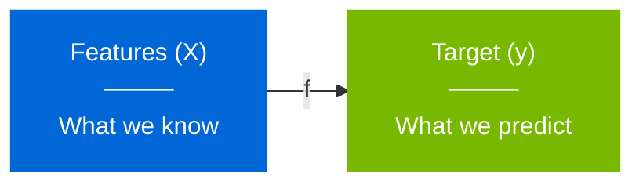
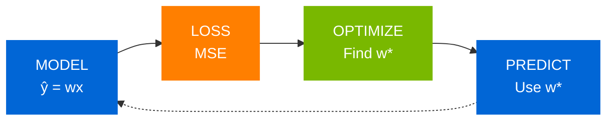

# Lesson 2: Linear Regression
## Predicting Continuous Outcomes with Straight Lines

<div class="pt-12">
  <span class="text-xl">
    MPS311/439 Machine Learning<br>
    Dr. Wei Xing<br>
    2026–27
  </span>
</div>

<!--
LECTURE NOTE: Welcome students. Set expectations for foundational lecture.
By the end, they'll understand both intuition and mathematics of prediction.
-->

---
layout: center
class: text-center
---

# How Does This Work?

<div class="grid grid-cols-2 gap-16 mt-16">

<div>
<div class="text-6xl mb-4">🏠</div>
<div class="text-2xl font-bold text-blue-600">House Features</div>
<div class="text-lg mt-4">Size, Bedrooms, Location</div>
<div class="text-4xl mt-8">↓</div>
<div class="text-3xl font-bold text-green-600 mt-8">£350,000</div>
</div>

<div>
<div class="text-6xl mb-4">📚</div>
<div class="text-2xl font-bold text-blue-600">Assignment Scores</div>
<div class="text-lg mt-4">Homework, Quizzes, Labs</div>
<div class="text-4xl mt-8">↓</div>
<div class="text-3xl font-bold text-green-600 mt-8">Final: 85%</div>
</div>

</div>

<div class="mt-16 text-2xl font-bold text-orange-600">
This is Prediction
</div>

<!--
LECTURE NOTE: Start with engagement. Ask students about their experiences.
Have they used Rightmove? Grade calculators? Uber fare estimates?
Emphasize this is mathematics, not magic.
-->

---
layout: center
---

# Prediction is Everywhere

<div class="grid grid-cols-3 gap-8 mt-12 text-center">

<div class="p-6 bg-blue-50 rounded-lg">
<div class="text-4xl mb-4">🚗</div>
<div class="font-bold text-lg">Uber</div>
<div class="text-sm mt-2">Fare estimation</div>
</div>

<div class="p-6 bg-blue-50 rounded-lg">
<div class="text-4xl mb-4">📺</div>
<div class="font-bold text-lg">Netflix</div>
<div class="text-sm mt-2">Watch time</div>
</div>

<div class="p-6 bg-blue-50 rounded-lg">
<div class="text-4xl mb-4">⚡</div>
<div class="font-bold text-lg">Energy</div>
<div class="text-sm mt-2">Demand forecast</div>
</div>

<div class="p-6 bg-blue-50 rounded-lg">
<div class="text-4xl mb-4">📦</div>
<div class="font-bold text-lg">Amazon</div>
<div class="text-sm mt-2">Delivery time</div>
</div>

<div class="p-6 bg-blue-50 rounded-lg">
<div class="text-4xl mb-4">💰</div>
<div class="font-bold text-lg">Finance</div>
<div class="text-sm mt-2">Stock trends</div>
</div>

<div class="p-6 bg-blue-50 rounded-lg">
<div class="text-4xl mb-4">🏥</div>
<div class="font-bold text-lg">Healthcare</div>
<div class="text-sm mt-2">Treatment outcomes</div>
</div>

</div>

<div class="mt-12 text-center text-2xl font-bold text-blue-600">
Today: Linear Regression — Your First ML Tool
</div>

<!--
LECTURE NOTE: Connect to students' daily lives with concrete examples.
Ask: "How many checked Uber prices today?" Get them engaged.
This establishes relevance before technical content.
-->

---
layout: center
---

# The Goal: Learn a Function



<div class="mt-16 grid grid-cols-2 gap-16">

<div class="text-center">
<div class="text-xl font-bold text-blue-600 mb-4">Input</div>
<div class="text-lg">Size: 1500 sq ft</div>
<div class="text-lg">Bedrooms: 3</div>
<div class="text-lg">Age: 10 years</div>
</div>

<div class="text-center">
<div class="text-xl font-bold text-green-600 mb-4">Output</div>
<div class="text-3xl font-bold mt-4">£280,000</div>
</div>

</div>

<div class="mt-12 text-center text-xl">
<span class="font-bold text-orange-600">Regression:</span> Predicting continuous numerical values
</div>

<!--
LECTURE NOTE: Draw clear distinction between features and targets.
Use hand gestures: point left for input, right for output.
This is the foundation of supervised learning.
-->

---
layout: center
class: text-center
---

# The Simplest Model

<div class="text-4xl font-bold text-blue-600 mt-8">
A Straight Line
</div>

<div class="grid grid-cols-4 gap-4 mt-12 text-left">

<div class="p-5 bg-blue-50 rounded-lg">
<div class="text-sm text-blue-700 font-bold">1. Observe</div>
<div class="text-xl font-bold mt-2">Plot the data</div>
</div>

<div class="p-5 bg-green-50 rounded-lg">
<div class="text-sm text-green-700 font-bold">2. Identify</div>
<div class="text-xl font-bold mt-2">Find the trend</div>
</div>

<div class="p-5 bg-orange-50 rounded-lg border-2 border-orange-400">
<div class="text-sm text-orange-700 font-bold">3. Model</div>
<div class="text-xl font-bold mt-2">Fit a line</div>
</div>

<div class="p-5 bg-purple-50 rounded-lg">
<div class="text-sm text-purple-700 font-bold">4. Use</div>
<div class="text-xl font-bold mt-2">Make predictions</div>
</div>

</div>

<div class="mt-12 text-2xl text-gray-600">
When the data follows a trend, a line gives us a useful first model.
</div>

<!--
LECTURE NOTE: Build intuition visually first.
Ask students to imagine plotting points on a graph.
What's the simplest pattern? A line!
This is the "aha" moment before equations.
-->

---
layout: two-cols
---

# The Linear Equation

<div class="mt-12">

### From School

<div class="text-4xl font-bold text-center my-8">
y = mx + c
</div>

### Machine Learning

<div class="text-4xl font-bold text-center my-8 text-blue-600">
ŷ = w₁x + w₀
</div>

</div>

::right::

<div class="mt-16 ml-8">

<div class="p-6 bg-blue-50 rounded-lg mb-6">
<div class="font-bold text-lg mb-2">ŷ (y-hat)</div>
<div>Predicted value</div>
</div>

<div class="p-6 bg-orange-50 rounded-lg mb-6">
<div class="font-bold text-lg mb-2">w₁ (weight)</div>
<div>Slope — how steep?</div>
</div>

<div class="p-6 bg-green-50 rounded-lg">
<div class="font-bold text-lg mb-2">w₀ (bias)</div>
<div>Intercept — where to start?</div>
</div>

</div>

<!--
LECTURE NOTE: Connect to familiar algebra y=mx+c.
Explain "hat" notation - prediction, not actual value.
Emphasize w₀ and w₁ are what we need to find.
-->

---
layout: center
class: text-center
---

# But Which Line?

<div class="text-3xl mt-12 mb-8">
Infinitely many lines could fit the data
</div>

<div class="grid grid-cols-3 gap-8 mt-12">

<div class="p-6 bg-red-50 rounded-lg">
<div class="text-xl font-bold mb-2">Line A</div>
<div class="text-4xl text-red-600">📉</div>
<div class="mt-2">Too flat</div>
</div>

<div class="p-6 bg-green-50 rounded-lg border-4 border-green-600">
<div class="text-xl font-bold mb-2">Line B</div>
<div class="text-4xl text-green-600">📈</div>
<div class="mt-2">Just right</div>
</div>

<div class="p-6 bg-red-50 rounded-lg">
<div class="text-xl font-bold mb-2">Line C</div>
<div class="text-4xl text-red-600">📈</div>
<div class="mt-2">Too steep</div>
</div>

</div>

<div class="mt-12 text-2xl font-bold text-orange-600">
We need to measure "best"
</div>

<!--
LECTURE NOTE: Visual demonstration of the problem.
Draw multiple lines on whiteboard through same points.
Ask: "Which looks best?" Need objective measure, not intuition.
-->

---
layout: center
---

# Measuring Error: Mean Squared Error

<div class="grid grid-cols-2 gap-12 mt-8">

<div>

### The Idea

<div class="space-y-6 mt-8">

<div class="flex items-center gap-4">
<div class="text-3xl">1️⃣</div>
<div>Measure vertical distance</div>
</div>

<div class="flex items-center gap-4">
<div class="text-3xl">2️⃣</div>
<div>Square each error</div>
</div>

<div class="flex items-center gap-4">
<div class="text-3xl">3️⃣</div>
<div>Take the average</div>
</div>

</div>

</div>

<div>

### The Formula

<div class="text-3xl text-center my-12 p-8 bg-blue-50 rounded-lg">

$$J = \frac{1}{n} \sum (y_i - \hat{y}_i)^2$$

</div>

<div class="text-center text-xl mt-8">
<div class="font-bold text-orange-600">Goal:</div>
<div class="mt-2">Minimize J</div>
</div>

</div>

</div>

<!--
LECTURE NOTE: Break down step by step with hand gestures.
Explain why square: (1) always positive, (2) penalizes large errors.
Work through simple example on board with 3 points.
This is our objective function - what we minimize.
-->

---
layout: center
class: text-center
---

# Training = Finding the Minimum

<div class="grid grid-cols-3 gap-5 mt-8 text-left">

<div class="p-5 bg-blue-50 rounded-lg">
<div class="font-bold text-blue-700">Start</div>
<div class="mt-2">Choose initial parameter values</div>
</div>

<div class="p-5 bg-orange-50 rounded-lg border-2 border-orange-400">
<div class="font-bold text-orange-700">Search</div>
<div class="mt-2">Move toward lower loss</div>
</div>

<div class="p-5 bg-green-50 rounded-lg">
<div class="font-bold text-green-700">Finish</div>
<div class="mt-2">Keep the parameters with minimum loss</div>
</div>

</div>

<div class="grid grid-cols-2 gap-12 mt-10">

<div class="text-left">
<div class="text-2xl font-bold text-blue-600 mb-4">Training</div>
<div class="text-lg">Learn from examples</div>
<div class="text-lg">Find best w₀, w₁</div>
<div class="text-lg">Minimize error</div>
</div>

<div class="text-left">
<div class="text-2xl font-bold text-green-600 mb-4">Testing</div>
<div class="text-lg">Evaluate on new data</div>
<div class="text-lg">Check generalization</div>
<div class="text-lg">Measure real performance</div>
</div>

</div>

<!--
LECTURE NOTE: Use physical analogy - rolling ball down a hill to valley.
Draw bowl shape on board representing loss surface.
Emphasize training ≠ testing. Never test on training data.
-->

---
layout: center
---

# Train/Test Split

<div class="mt-8 p-4 bg-gray-100 rounded-lg text-center text-xl font-bold">
Full dataset (100%)
</div>

<div class="grid grid-cols-2 gap-10 mt-6">

<div class="p-6 bg-blue-50 rounded-lg border-2 border-blue-400">
<div class="text-2xl font-bold text-blue-700">Training set: 70–80%</div>
<div class="mt-4">Learn the model parameters</div>
<div class="mt-2 text-sm text-gray-600">The model is allowed to see these examples.</div>
</div>

<div class="p-6 bg-green-50 rounded-lg border-2 border-green-400">
<div class="text-2xl font-bold text-green-700">Test set: 20–30%</div>
<div class="mt-4">Evaluate performance</div>
<div class="mt-2 text-sm text-gray-600">These examples stay unseen until evaluation.</div>
</div>

</div>

<div class="mt-8 p-5 bg-red-50 rounded-lg text-center text-xl mx-20">
<span class="font-bold text-red-600">Critical Rule:</span> Never test on training data
</div>

<div class="mt-5 text-center text-lg text-gray-600">
Like studying for an exam vs. taking the exam
</div>

<!--
LECTURE NOTE: Crucial ML workflow concept.
Draw physical separation on board - train | test.
Explain generalization: does it work on new data?
Testing on training data is like memorizing answers.
-->

---
layout: center
class: text-center
---

# From One to Many Features

<div class="mt-12">

<div class="grid grid-cols-2 gap-16">

<div class="p-8 bg-blue-50 rounded-lg">
<div class="text-2xl font-bold mb-6">Single Feature</div>
<div class="text-xl">ŷ = w₁x + w₀</div>
<div class="mt-6 text-gray-600">Size → Price</div>
</div>

<div class="p-8 bg-green-50 rounded-lg">
<div class="text-2xl font-bold mb-6">Multiple Features</div>
<div class="text-xl">ŷ = w₁x₁ + w₂x₂ + ... + w₀</div>
<div class="mt-6 text-gray-600">Size, Beds, Age → Price</div>
</div>

</div>

</div>

<div class="mt-16 text-2xl text-orange-600 font-bold">
Real world: many features matter
</div>

<!--
LECTURE NOTE: Transition from simple to realistic.
Ask: "Does house price only depend on size?"
List other factors: location, bedrooms, age, etc.
Natural extension of single feature case.
-->

---
layout: center
---

# Vector Notation

<div class="grid grid-cols-3 gap-12 mt-12">

<div class="text-center">
<div class="text-xl font-bold text-blue-600 mb-6">Weights</div>
<div class="text-2xl p-6 bg-blue-50 rounded-lg">

$$\mathbf{w} = \begin{bmatrix} w_0 \\ w_1 \\ w_2 \\ \vdots \\ w_p \end{bmatrix}$$

</div>
</div>

<div class="text-center">
<div class="text-xl font-bold text-green-600 mb-6">Features</div>
<div class="text-2xl p-6 bg-green-50 rounded-lg">

$$\mathbf{x} = \begin{bmatrix} 1 \\ x_1 \\ x_2 \\ \vdots \\ x_p \end{bmatrix}$$

</div>
</div>

<div class="text-center">
<div class="text-xl font-bold text-orange-600 mb-6">Prediction</div>
<div class="text-3xl p-6 bg-orange-50 rounded-lg mt-8">

$$\hat{y} = \mathbf{w}^T\mathbf{x}$$

</div>
</div>

</div>

<div class="mt-16 text-center text-xl text-gray-600">
One compact equation for any number of features
</div>

<!--
LECTURE NOTE: Introduce vectors as elegant notation.
Show how messy equation becomes compact.
Emphasize computational efficiency of matrix operations.
This is practical necessity, not just mathematical elegance.
-->

---
layout: center
class: text-center
---

# The Matrix View

<div class="mt-8 text-3xl font-bold text-blue-600">
$$
\begin{bmatrix}
1 & x_{1,1} & x_{1,2} & \cdots & x_{1,p} \\
1 & x_{2,1} & x_{2,2} & \cdots & x_{2,p} \\
\vdots & \vdots & \vdots & \ddots & \vdots \\
1 & x_{n,1} & x_{n,2} & \cdots & x_{n,p}
\end{bmatrix}
\begin{bmatrix}
w_0 \\
w_1 \\
\vdots \\
w_p
\end{bmatrix}
=
\begin{bmatrix}
y_1 \\
y_2 \\
\vdots \\
y_n
\end{bmatrix}
$$

</div>

<div class="grid grid-cols-3 gap-8 mt-12">

<div>
<div class="font-bold mb-4">Data Matrix (X)</div>
<div class="text-sm">n × (p+1)</div>
<div class="mt-2">Each row: one example</div>
<div>Each column: one feature</div>
</div>

<div>
<div class="font-bold mb-4">Weights (w)</div>
<div class="text-sm">(p+1) × 1</div>
<div class="mt-2">Parameters to learn</div>
<div>One per feature + bias</div>
</div>

<div>
<div class="font-bold mb-4">Targets (y)</div>
<div class="text-sm">n × 1</div>
<div class="mt-2">True values</div>
<div>What we want to predict</div>
</div>

</div>

<div class="mt-12 p-6 bg-blue-50 rounded-lg mx-20 text-lg">
All predictions computed at once
</div>

<!--
LECTURE NOTE: Show matrix structure on board.
Point to rows (data points) and columns (features).
Emphasize first column of 1s for bias term.
Matrix multiplication gives all predictions simultaneously.
-->

---
layout: center
class: text-center
---

# Deriving the Normal Equation
## The Mathematical Journey

<div class="mt-12 text-2xl text-gray-600">
How do we find the optimal weights mathematically?
</div>

<div class="mt-12">


</div>

<div class="mt-12 text-xl">
Next 2 slides: Step-by-step derivation
</div>

<!--
LECTURE NOTE: Transition to mathematical derivation.
Tell students this is rigorous but important.
They should follow the logic, not memorize every step.
The result is what matters most.
-->

---
layout: default
---

# Derivation Step 1: Setup and Expansion
## From Loss to Matrix Form

<div class="grid grid-cols-2 gap-8 mt-6">

<div>

### Our Goal
Minimize the sum of squared errors:

$J(\mathbf{w}) = \sum_{i=1}^{n} (y_i - \hat{y}_i)^2$

### Matrix Form
Express as matrix operations:

<div class="p-4 bg-blue-50 rounded-lg my-4">

$J(\mathbf{w}) = (\mathbf{y} - \mathbf{Xw})^T (\mathbf{y} - \mathbf{Xw})$

</div>

<!-- ### Expand the Product

$\begin{align}
J(\mathbf{w}) &= (\mathbf{y}^T - \mathbf{w}^T\mathbf{X}^T)(\mathbf{y} - \mathbf{Xw}) \\[0.3cm]
&= \mathbf{y}^T\mathbf{y} - \mathbf{y}^T\mathbf{Xw} - \mathbf{w}^T\mathbf{X}^T\mathbf{y} \\
&\quad + \mathbf{w}^T\mathbf{X}^T\mathbf{Xw}
\end{align}$ -->

</div>

<div>

### Key Observation

Since $\mathbf{y}^T\mathbf{Xw}$ is a **scalar**:

$\mathbf{y}^T\mathbf{Xw} = (\mathbf{y}^T\mathbf{Xw})^T = \mathbf{w}^T\mathbf{X}^T\mathbf{y}$

<div class="mt-6"></div>

### Simplified Form

<div class="p-4 bg-orange-50 rounded-lg my-6 text-center">

$J(\mathbf{w}) = \mathbf{y}^T\mathbf{y} - 2\mathbf{w}^T\mathbf{X}^T\mathbf{y} + \mathbf{w}^T\mathbf{X}^T\mathbf{Xw}$

</div>

<div class="mt-8 p-4 bg-blue-100 rounded-lg">
<div class="font-bold mb-2">Intuition:</div>
We've rewritten total error as a quadratic function in <b>w</b>
</div>

</div>

</div>

<!--
LECTURE NOTE: Walk through expansion carefully on board.
Emphasize the scalar property - students often miss this.
Point out this is just algebra, no magic.
The quadratic form means there's a unique minimum (convex).
-->

---
layout: center
class: text-center
---

# Derivation Step 2: Gradient and Solution

<div class="mt-8 text-2xl font-bold text-blue-700">
Finding the Minimum of the Loss Function
</div>

<div class="mt-12 grid grid-cols-2 gap-12 items-start">

<div class="text-left">

### Take the Gradient

Using matrix calculus rules:

<div class="space-y-3 mt-4 text-base">

$\nabla_{\mathbf{w}} (\mathbf{y}^T\mathbf{y}) = \mathbf{0}$
<div class="text-xs text-gray-600">constant term</div>

$\nabla_{\mathbf{w}} (\mathbf{w}^T\mathbf{X}^T\mathbf{y}) = \mathbf{X}^T\mathbf{y}$
<div class="text-xs text-gray-600">linear term</div>

$\nabla_{\mathbf{w}} (\mathbf{w}^T\mathbf{X}^T\mathbf{Xw}) = 2\mathbf{X}^T\mathbf{Xw}$
<div class="text-xs text-gray-600">quadratic term</div>

</div>

<div class="mt-6 font-semibold">Combine the terms:</div>

<div class="p-4 bg-blue-50 rounded-lg my-4 text-lg text-center">

$\nabla_{\mathbf{w}} J(\mathbf{w}) = -2\mathbf{X}^T\mathbf{y} + 2\mathbf{X}^T\mathbf{Xw}$

</div>

</div>

<div class="text-left">

### Set Gradient to Zero

At the minimum, the gradient is zero:

<div class="my-4 text-lg text-center">

$$ -2\mathbf{X}^T\mathbf{y} + 2\mathbf{X}^T\mathbf{X}\mathbf{\hat{w}} = \mathbf{0} $$

</div>

### Rearranging

$\mathbf{X}^T\mathbf{X}\mathbf{\hat{w}} = \mathbf{X}^T\mathbf{y}$

### Solve for $\mathbf{\hat{w}}$

<div class="p-6 bg-green-50 rounded-lg my-6 border-2 border-green-600">
<div class="text-center text-3xl font-bold text-green-700">

$\mathbf{\hat{w}} = (\mathbf{X}^T\mathbf{X})^{-1}\mathbf{X}^T\mathbf{y}$

</div>
</div>

<div class="p-4 bg-orange-100 rounded-lg text-center">
<div class="font-bold mb-2">The Normal Equation</div>
Direct, closed-form solution for the optimal weights!
</div>

</div>

</div>

<!--
LECTURE NOTE: Matrix calculus rules - students should accept these.
Emphasize: gradient = 0 means we found extremum.
Since loss is convex (bowl-shaped), this is the minimum.
The final equation is elegant and powerful.
This assumes X'X is invertible (full rank).
-->

---
layout: center
class: text-center
---

# The Normal Equation

<div class="mt-12 text-5xl font-bold text-orange-600">

$\mathbf{\hat{w}} = (\mathbf{X}^T\mathbf{X})^{-1}\mathbf{X}^T\mathbf{y}$

</div>

<div class="mt-16 text-2xl">
The direct solution for optimal weights
</div>

<div class="grid grid-cols-2 gap-12 mt-12 mx-20">

<div class="p-6 bg-green-50 rounded-lg">
<div class="font-bold text-xl mb-4">Advantages</div>
<div>✓ Closed-form solution</div>
<div>✓ No iteration needed</div>
<div>✓ Mathematically optimal</div>
<div>✓ Any number of features</div>
</div>

<div class="p-6 bg-blue-50 rounded-lg">
<div class="font-bold text-xl mb-4">Requirements</div>
<div>• X<sup>T</sup>X must be invertible</div>
<div>• Full rank (no multicollinearity)</div>
<div>• Enough data (n > p)</div>
<div>• Computationally expensive for large p</div>
</div>

</div>

<!--
LECTURE NOTE: This is the payoff moment - make it dramatic!
This ONE formula works for any number of features.
We just derived it from first principles!
This is what sklearn does under the hood.
Compare to iterative methods (gradient descent) we'll see later.
-->

---
layout: center
---

# In Practice: scikit-learn

<div class="text-center text-xl text-gray-600 mt-8 mb-12">
Complex mathematics → Simple code
</div>

```python {all|3-4|7-8|11-12}
from sklearn.linear_model import LinearRegression

# Your data
X = [[1500], [1800], [2100], [2400]]  # sizes
y = [300000, 350000, 400000, 450000]   # prices

# Train the model
model = LinearRegression()
model.fit(X, y)  # Solves Normal Equation!

# Make predictions
new_house = [[2000]]
predicted_price = model.predict(new_house)
```

<div class="mt-8 text-center text-2xl">
<span class="font-bold text-green-600">Result:</span> £375,000
</div>

<!--
LECTURE NOTE: Show the power of abstraction.
Complex math becomes 3 lines of code.
Understanding math helps debug and trust results.
Live demo if possible - show it working.
This connects theory to practice.
-->

---
layout: center
class: text-center
---

# The Core ML Loop



<div class="mt-12 text-2xl">
This pattern applies to <span class="font-bold text-orange-600">all</span> supervised learning
</div>

<div class="mt-8 text-xl text-gray-600">
Neural networks, decision trees, SVMs — same loop, different components
</div>

<!--
LECTURE NOTE: Tie everything together with this fundamental pattern.
Point to each box and connect to today's lecture.
This is THE most important conceptual framework.
Every ML algorithm follows this loop.
Write on board: Model → Loss → Optimize → Predict
-->

---
layout: two-cols
---

# What We Learned

<div class="mt-8 space-y-6">

### Concepts
- Regression problems
- Linear models
- Loss functions
- Training vs Testing

### Mathematics
- MSE formula
- Normal Equation
- Matrix operations
- Optimization

</div>

::right::

<div class="mt-8 space-y-6">

### Skills
- Build linear models
- Use scikit-learn
- Make predictions
- Interpret results

<div class="mt-8 p-6 bg-green-50 rounded-lg">
<div class="text-center font-bold text-xl text-green-700">
You now understand prediction
</div>
</div>

</div>

<!--
LECTURE NOTE: Recap with energy - celebrate their progress!
This was dense material - they should feel accomplished.
Connect back to opening: now they know how Rightmove works!
-->

---
layout: center
---

# Current Limitations

<div class="grid grid-cols-2 gap-8 mt-12">

<div class="p-6 bg-red-50 rounded-lg">
<div class="text-xl font-bold mb-4 text-red-600">Assumes</div>
<div>Linear relationships</div>
<div class="mt-2 text-gray-600">But world is often non-linear</div>
</div>

<div class="p-6 bg-red-50 rounded-lg">
<div class="text-xl font-bold mb-4 text-red-600">Can Overfit</div>
<div>With too many features</div>
<div class="mt-2 text-gray-600">Memorizes instead of learns</div>
</div>

<div class="p-6 bg-red-50 rounded-lg">
<div class="text-xl font-bold mb-4 text-red-600">Uses Features As-Is</div>
<div>No transformation</div>
<div class="mt-2 text-gray-600">May miss patterns</div>
</div>

<div class="p-6 bg-red-50 rounded-lg">
<div class="text-xl font-bold mb-4 text-red-600">Sensitive</div>
<div>To outliers</div>
<div class="mt-2 text-gray-600">Extreme values affect fit</div>
</div>

</div>

<!--
LECTURE NOTE: Be honest about limitations.
These aren't failures - they're opportunities for improvement.
Set up next week's lecture naturally.
-->

---
layout: center
class: text-center
---

# Next Week: Making It Better

<div class="grid grid-cols-2 gap-12 mt-12 mx-20">

<div class="p-8 bg-blue-50 rounded-lg">
<div class="text-2xl font-bold mb-6 text-blue-600">Feature Engineering</div>
<div class="text-lg">Polynomial features</div>
<div class="text-lg">Interaction terms</div>
<div class="text-lg">Feature scaling</div>
<div class="mt-4 text-4xl">📊</div>
</div>

<div class="p-8 bg-green-50 rounded-lg">
<div class="text-2xl font-bold mb-6 text-green-600">Regularization</div>
<div class="text-lg">Ridge (L2)</div>
<div class="text-lg">Lasso (L1)</div>
<div class="text-lg">Preventing overfitting</div>
<div class="mt-4 text-4xl">🎯</div>
</div>

</div>

<div class="mt-12 text-2xl font-bold text-orange-600">
Building on today's foundation
</div>

<!--
LECTURE NOTE: Build excitement for next session.
Preview solutions to today's limitations.
Show quick example of polynomial fit vs linear on curved data.
End with: "Foundation built - next we extend it!"
-->

---
layout: center
class: text-center
---

# Final Thought

<div class="text-3xl italic mt-16 mb-12 mx-20 text-gray-700">
"All models are wrong, but some are useful"
</div>

<div class="text-xl text-gray-600">
— George Box
</div>

<div class="mt-16 grid grid-cols-2 gap-12 mx-20">

<div class="text-left">
<div class="font-bold text-xl mb-4">Linear Regression is:</div>
<div>Simple yet powerful</div>
<div>Interpretable</div>
<div>Fast to compute</div>
<div>Widely used in practice</div>
</div>

<div class="text-left">
<div class="font-bold text-xl mb-4">Key Principles:</div>
<div>Start simple</div>
<div>Understand the math</div>
<div>Validate thoroughly</div>
<div>Iterate and improve</div>
</div>

</div>

<!--
LECTURE NOTE: End on inspiring note.
Despite being "simple", linear regression is incredibly powerful.
Many real-world problems solved with this technique.
Don't always need complex models - start simple!
-->

---
layout: center
class: text-center
---

# Questions?

<div class="mt-16 text-xl space-y-4">

**Office Hours:** Tuesday 12:00-1:00 PM, Hicks Building I22

**Email:** w.xing@sheffield.ac.uk

</div>

<div class="mt-16 text-3xl font-bold text-blue-600">
Next: Feature Engineering & Regularization
</div>

<div class="mt-12 text-lg text-gray-600">
Recommended: Chapter 3, *Introduction to Statistical Learning*
</div>

<!--
LECTURE NOTE: Open floor for questions.
Common questions: When does it fail? How many features? Real usage?
Stay after for individual discussions.
Encourage trying on their own dataset for homework.
-->

---
layout: end
class: text-center
---

# Thank You

<div class="text-2xl mt-12">
See you next week
</div>

<!-- COURSE_FEEDBACK_QR:START -->
---
layout: center
class: text-center
---

# 30-second feedback

<p class="text-xl mb-4">Scan this code to share anonymous feedback or post a question for this lecture.</p>


<p class="text-sm mt-4 opacity-70">MPS311/439 · 2026-27 · Lesson 02 lecture</p>
<!-- COURSE_FEEDBACK_QR:END -->
