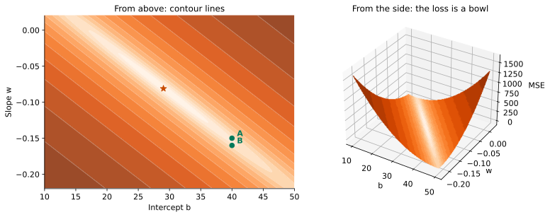

## Guess one number

::: {.stage}
::: {.say}
Some quantities are easy to measure. Another one is not. Can we still guess it?
:::

::: {.tiles}
<div class="tile"><span>Year and origin</span><b>1970</b><p>an American car</p></div>
<div class="tile"><span>Horsepower</span><b class="c-data">198 hp</b><p>engine power</p></div>
<div class="tile"><span>Weight</span><b class="c-data">4341 lb</b><p>about 1,970 kg</p></div>
:::

::: {.ask}
<small>Write your guess</small>
How many miles per US gallon (mpg) does this car travel?
:::
:::

::: {.notes}
约 2 分钟。先说这一类问题（几个易测的量，猜一个难得的数），再请学生在纸上或心里写下数字，请两三位说出来，不评价。mpg 是美制加仑；英制数值约高 20%。
:::

## A guess can be checked

::: {.stage}
::: {.tiles}
<div class="tile"><span>Your guess</span><b>?</b><p>where did it come from?</p></div>
<div class="tile"><span>Prediction from data</span><b class="c-model">10.8 mpg</b><p>we will build it today</p></div>
<div class="tile"><span>Measured</span><b class="c-data">15.0 mpg</b><p>the real car</p></div>
:::

::: {.rows}
<div><span class="n">1</span><b>Where does a guess come from?</b></div>
<div><span class="n">2</span><b>Why should we trust it?</b></div>
<div><span class="n">3</span><b>Can we guess better, in a systematic way?</b></div>
:::
:::

::: {.notes}
约 1.5 分钟。揭晓后收几个学生的猜测。预测 10.8 比实测低 4.2，先记着，结尾回来。三个问题要说慢。
:::

## What you will be able to do

::: {.stage}
::: {.say .xl}
Turn "guess one number from a few measurements" into a method you can **write down, compute and test on new data**, and say where it cannot be trusted.
:::

::: {.flow}
<div><span>1</span>Problem</div>
<div><span>2</span>Model</div>
<div><span>3</span>Loss</div>
<div><span>4</span>Solution</div>
<div><span>5</span>Validation</div>
:::

::: {.muted .small}
Today every step uses the same car data.
:::
:::

::: {.notes}
约 1 分钟。能力承诺 + 五步路线图。念出五个词，告诉学生：每页标题前的词（Problem:、Model:、Loss:、Solution:、Validation:）就是现在在第几步。每进入新的一步，先说这一步要回答什么问题；每一步结束，用一句话收回来。
:::

## [Problem:]{.stg} What do we know, what do we guess?

::: {.stage .tight}
{.fig .fig-f2 fig-alt="Four rows of car data with feature columns and the target column marked"}

::: {.tiles .two}
<div class="tile txt"><span>Feature x</span><b class="c-data">What we use to guess</b></div>
<div class="tile txt"><span>Target y</span><b class="c-data">What we want to guess</b></div>
:::

::: {.muted .small .center}
Row $i$ is car $i$, column $j$ is feature $j$: $\textcolor{#0072B2}{x_{24}}=3693$ lb is the weight of car 2. With one feature we write just $x_i$.
:::

::: {.muted .small .center}
The targets are known, so this is supervised learning. The target is a number, so this is regression.
:::
:::

::: {.notes}
约 1.5 分钟。第 1 步 Problem：先说清楚在问什么，学生才能跟上后面每一步。F2 是四辆车的记录表。顺带命名：监督学习、回归。
:::

## [Problem:]{.stg} We care about cars we have not seen

::: {.stage}
::: {.splitbar}
<div class="train"><b>313</b><span>training cars: fit the model here</span></div>
<div class="test"><b>79</b><span>test cars</span></div>
:::

::: {.say}
Split first. The test cars take **no part** in fitting, and we keep them until the end.
:::

::: {.muted .small}
So the problem is set: guess mpg from the features, judged on 79 cars we never touch while fitting. (392 cars, random 80% / 20% split.)
:::
:::

::: {.notes}
约 1.5 分钟。为什么先划分：只有没见过的车才能检验。基线放到验证页再引入。收一句：问题已经说准，测试车留好。
:::

## [Model:]{.stg} What form can the guess take?

::: {.stage}
::: {.formula}
$$
\textcolor{#00795A}{\hat y}=\textcolor{#00795A}{b}+\textcolor{#00795A}{w}\,\textcolor{#0072B2}{x}
$$
:::

::: {.rows}
<div><span class="n">x</span><div><b class="c-data">Horsepower</b><p>the feature we know</p></div></div>
<div><span class="n">ŷ</span><div><b class="c-model">Predicted mpg</b><p>"y hat": the model's guess, not the measured y</p></div></div>
<div><span class="n">b, w</span><div><b class="c-model">Parameters</b><p>b is the intercept. w is the slope: each extra hp changes the prediction by w mpg.</p></div></div>
:::
:::

::: {.notes}
约 1.5 分钟。第 2 步 Model：现在回答“猜测可以取什么形式”。强调 w 描述预测随马力的变化，不是因果；零马力的车不存在，所以 b 也不对应真实的车。
:::

## [Model:]{.stg} Move the line yourself

::: {.stage .top}
::: {.say}
Drag the two ends of the line to fit the three cars. Then pull it slightly off. **Can you see it get worse?**
:::


:::

::: {.notes}
约 3 分钟，学生自己动手。让他们先拖 1 分钟，再故意拖偏；多半看不出变差，引出“需要把好变成数”。
:::

## [Model:]{.stg} More features, same form

::: {.stage}
::: {.formula .m1}
$$
\textcolor{#00795A}{\hat y_i} = \textcolor{#00795A}{w_0} + \textcolor{#00795A}{w_1}\textcolor{#0072B2}{x_{i1}} + \textcolor{#00795A}{w_2}\textcolor{#0072B2}{x_{i2}} + \cdots + \textcolor{#00795A}{w_p}\textcolor{#0072B2}{x_{ip}}
$$
:::

::: {.formula .m2}
$$
\underbrace{\begin{pmatrix}\textcolor{#00795A}{\hat y_1}\\ \textcolor{#00795A}{\hat y_2}\\ \vdots\\ \textcolor{#00795A}{\hat y_n}\end{pmatrix}}_{\textcolor{#00795A}{\hat{\mathbf y}}:\ n\times 1}
=
\underbrace{\begin{pmatrix}
1 & \textcolor{#0072B2}{x_{11}} & \cdots & \textcolor{#0072B2}{x_{1p}}\\
1 & \textcolor{#0072B2}{x_{21}} & \cdots & \textcolor{#0072B2}{x_{2p}}\\
\vdots & \vdots & & \vdots\\
1 & \textcolor{#0072B2}{x_{n1}} & \cdots & \textcolor{#0072B2}{x_{np}}
\end{pmatrix}}_{\textcolor{#0072B2}{\mathbf X}:\ n\times(p+1)}
\underbrace{\begin{pmatrix}\textcolor{#00795A}{w_0}\\ \textcolor{#00795A}{w_1}\\ \vdots\\ \textcolor{#00795A}{w_p}\end{pmatrix}}_{\textcolor{#00795A}{\mathbf w}:\ (p+1)\times 1}
$$
:::

::: {.say}
Row $i$ is car $i$, column $j$ is feature $j$. A **linear model** is a weighted sum of the features plus a constant: $\hat{\mathbf y}=\mathbf X\mathbf w$. Here $w_0$ is the $b$ from before. Every choice of $\mathbf w$ is a different candidate model.
:::
:::

::: {.notes}
约 1.5 分钟，第一次出现 X，要把矩阵读开：n 行是 n 辆车，p+1 列是常数列加 p 个特征；w 是 p+1 个分量，ŷ 是 n 个分量。下标约定：第一个下标数车，第二个数特征（第 5 页已交代）。不推导。收一句：模型就是一族直线，每组 w 是一个候选。
:::

## [Loss:]{.stg} How do we score a guess?

::: {.stage}
::: {.say}
A **residual** is measured minus predicted. Positive and negative residuals cancel, so square them first, then average.
:::

::: {.formula}
$$
\textcolor{#C84B00}{J(\mathbf w)}=\frac1n\sum_{i=1}^{n}\bigl(\textcolor{#0072B2}{y_i}-\textcolor{#00795A}{\hat y_i}\bigr)^2
$$
:::

::: {.muted}
This is the **mean squared error** (MSE), our loss function. Its square root, RMSE, is in mpg: the typical size of a miss.
:::
:::

::: {.notes}
约 2 分钟。第 3 步 Loss：现在回答“怎么给一个猜测打分”。先问“把所有残差直接加起来行不行”，停 20 秒，再给平方。
:::

## [Loss:]{.stg} Two lines, one score

::: {.stage}
{.fig .fig-wide fig-alt="Two panels showing the same three cars with two candidate lines and their residuals"}

::: {.say .center}
For these three cars, line A is better. But the score applies **only to the cars it was computed on**.
:::
:::

::: {.notes}
约 2 分钟。板书只算 A 线一遍（三个残差平方再平均），B 线直接指图。强调最后一句，为验证页铺垫。收一句：现在有了给猜测打分的办法。
:::

## [Solution:]{.stg} Which line scores best?

::: {.stage .tight}
{.fig .fig-f5 fig-alt="Contour plot and 3D surface of the loss over intercept and slope with the minimum marked"}

::: {.two .f5t}
::: {.say}
The loss is a bowl in $(b, w)$. At the bottom, **both partial derivatives are zero**.
:::

::: {.formula .m2}
$$
\frac{\partial J}{\partial b}=0,\qquad\frac{\partial J}{\partial w}=0
$$
:::
:::
:::

::: {.notes}
约 1.5 分钟。第 4 步 Solution：现在回答“哪一条线得分最低”。只讲图和条件：碗底、导数为零。推导放下一页，带学生走一遍。
:::

## [Solution:]{.stg} The derivation

::: {.stage}
::: {.steps}
::: {.step}
[Write the loss, one feature]{.lab}

$$
\textcolor{#C84B00}{J(b,w)}=\frac1n\sum_{i=1}^{n}\bigl(\textcolor{#0072B2}{y_i}-\textcolor{#00795A}{b}-\textcolor{#00795A}{w}\,\textcolor{#0072B2}{x_i}\bigr)^2
$$
:::

::: {.step}
[Set ∂J/∂b = 0]{.lab}

$$
-\frac2n\sum_{i}\bigl(\textcolor{#0072B2}{y_i}-\textcolor{#00795A}{b}-\textcolor{#00795A}{w}\,\textcolor{#0072B2}{x_i}\bigr)=0
\;\Longrightarrow\;
\textcolor{#00795A}{b}=\textcolor{#0072B2}{\bar y}-\textcolor{#00795A}{w}\,\textcolor{#0072B2}{\bar x}
$$
:::

::: {.step}
[Set ∂J/∂w = 0, substitute b]{.lab}

$$
\sum_{i}\textcolor{#0072B2}{x_i}\bigl(\textcolor{#0072B2}{y_i}-\textcolor{#00795A}{b}-\textcolor{#00795A}{w}\,\textcolor{#0072B2}{x_i}\bigr)=0
\;\Longrightarrow\;
\textcolor{#00795A}{w}=\frac{\sum_i(\textcolor{#0072B2}{x_i}-\textcolor{#0072B2}{\bar x})(\textcolor{#0072B2}{y_i}-\textcolor{#0072B2}{\bar y})}{\sum_i(\textcolor{#0072B2}{x_i}-\textcolor{#0072B2}{\bar x})^2}
$$
:::

::: {.step}
[Check on the three cars]{.lab}

$$
\textcolor{#00795A}{w}=\frac{-50}{616.7}\approx-0.081,\qquad
\textcolor{#00795A}{b}=17+0.081\times148.3\approx29.03
$$
:::
:::
:::

::: {.notes}
约 4 分钟，板书同步，带学生一行一行走。第 1 行：回忆损失。第 2 行：对 b 求偏导，得到线过均值点 (x̄, ȳ)。第 3 行：对 w 求偏导，代入 b；用 Σ(xᵢ − x̄) = 0 把 Σ xᵢ(yᵢ − ȳ) 改写成 Σ(xᵢ − x̄)(yᵢ − ȳ)，得协方差除以方差。第 4 行：三辆车 (130,18)、(150,18)、(165,15)，x̄ = 148.3，ȳ = 17，分子 −50，分母 616.7，和碗底星号处的 b = 29.03、w = −0.0811 完全一致。
:::

## [Solution:]{.stg} "Best" depends on the cars used

::: {.stage}
::: {.tiles .two}
<div class="tile"><span>Fit on 3 cars</span><b class="c-model">−0.081</b><p>slope, mpg per hp</p></div>
<div class="tile"><span>Fit on 313 training cars</span><b class="c-model">−0.163</b><p>slope, mpg per hp</p></div>
:::

::: {.say .xl}
The same formula, different cars, a slope twice as steep. "Best" means best **on the cars used to compute it**.
:::
:::

::: {.notes}
约 1.5 分钟。三辆车结果：斜率 −0.081，截距 29.03，MSE 0.65，比 A、B 线都小。
:::

## [Solution:]{.stg} Many features, same steps

::: {.stage}
::: {.steps}
::: {.step}
[Write the loss, many features]{.lab}

$$
\textcolor{#C84B00}{J(\mathbf w)}=\frac1n(\textcolor{#0072B2}{\mathbf y}-\mathbf X\textcolor{#00795A}{\mathbf w})^T(\textcolor{#0072B2}{\mathbf y}-\mathbf X\textcolor{#00795A}{\mathbf w})
$$
:::

::: {.step}
[Set ∇J = 0]{.lab}

$$
\nabla J=\frac2n\bigl(\mathbf X^T\mathbf X\,\textcolor{#00795A}{\mathbf w}-\mathbf X^T\textcolor{#0072B2}{\mathbf y}\bigr)=\mathbf 0
\;\Longrightarrow\;
\mathbf X^T\mathbf X\,\textcolor{#00795A}{\mathbf w}=\mathbf X^T\textcolor{#0072B2}{\mathbf y}
$$
:::

::: {.step}
[Solve for w]{.lab}

$$
\textcolor{#00795A}{\mathbf w}=(\mathbf X^T\mathbf X)^{-1}\mathbf X^T\textcolor{#0072B2}{\mathbf y}
$$
:::

::: {.step}
[Check: one feature]{.lab}

$$
n\,\textcolor{#00795A}{b}+\textcolor{#00795A}{w}\sum_i\textcolor{#0072B2}{x_i}=\sum_i\textcolor{#0072B2}{y_i}
\;\Longrightarrow\;
\textcolor{#00795A}{b}=\textcolor{#0072B2}{\bar y}-\textcolor{#00795A}{w}\,\textcolor{#0072B2}{\bar x}
$$
:::
:::
:::

::: {.notes}
弹性页，约 2 分钟，时间紧可跳过。结构与上一页逐行对应：第 1 行同一个损失，残差平方和写成向量内积；第 2 行先展开平方得 yᵀy − 2wᵀXᵀy + wᵀXᵀXw，再求梯度，一个式子顶了上一页所有偏导，令其为零得正规方程；第 3 行 X 的各列线性无关时 XᵀX 可逆，解出 w；第 4 行验算：p = 1 时第一行就是 n b + w Σxᵢ = Σyᵢ，回到上一页的 b = ȳ − w x̄。遗留两问（求逆是否稳定、不求逆的办法）只口头提一句，指向 Advanced Study 1、2。
:::

## [Solution:]{.stg} How to read a coefficient

::: {.stage}
::: {.say}
A coefficient $w_j$ is the change in predicted mpg for one more unit of feature $j$, **with the other features held fixed**.
:::

::: {.ask}
<small>Predict first</small>
Model 1 uses hp only. Its hp coefficient is **−0.163**. Now add weight to the model. Will the hp coefficient get larger, smaller, or stay the same?
:::
:::

::: {.notes}
约 1 分钟。请学生举手表决：变大、变小、不变，各数一下。
:::

## [Solution:]{.stg} Same cars, same variable, new coefficient

::: {.stage .top}


::: {.say}
Weight and horsepower are strongly correlated (0.86), so they **share the credit**.
:::
:::

::: {.notes}
约 3 分钟。依次勾选重量、气缸数与排量、加速度与年份；hp 系数 −0.163 → −0.052 → −0.044 → −0.002。年份的原因：较晚的车马力偏低又更省油。收一句：解出来了，也知道系数该怎么读。
:::

## [Validation:]{.stg} Can we trust it on new cars?

::: {.stage}
::: {.two .f7}
::: {}
::: {.say}
Three cars used to fit the line: RMSE **0.81 mpg**.
:::

::: {.ask}
<small>Predict first</small>
The same line on the 79 test cars. RMSE = ?
:::

::: {.fragment}
::: {.answer}
5.58 mpg
:::
::: {.muted .small}
Nearly seven times larger. A low training error does not mean the model works on new cars.
:::
:::
:::

::: {.fragment}
{.fig fig-alt="Test cars with the line fitted on three cars and the line fitted on 313 training cars"}
:::
:::
:::

::: {.notes}
约 2 分钟。第 5 步 Validation：现在回答“新车上能信吗”。先停 20 秒让学生写数，点击后揭示 5.58 和图。这就是要留测试集的原因。
:::

## [Validation:]{.stg} Do the models beat a simple guess?

::: {.stage}
::: {.say}
Baseline: always guess the training mean, 23.60 mpg. Test RMSE on the 79 unseen cars:
:::

::: {.bars}
<div class="base"><div class="lab">Baseline</div><div class="bar" style="width:100%"></div><div class="v">7.18</div></div>
<div><div class="lab">Model 1<small>hp</small></div><div class="bar" style="width:65.6%"></div><div class="v">4.71</div></div>
<div><div class="lab">Model 2<small>hp, weight</small></div><div class="bar" style="width:58.8%"></div><div class="v">4.22</div></div>
<div><div class="lab">Model 3<small>cylinders, displacement, hp, weight</small></div><div class="bar" style="width:58.9%"></div><div class="v">4.23</div></div>
<div><div class="lab">Model 4<small>all six features</small></div><div class="bar" style="width:45.1%"></div><div class="v">3.24</div></div>
:::

::: {.muted .small}
Read these numbers, but do not use them to pick features again and again: each pick would leak the test cars into the choice.
:::
:::

::: {.notes}
约 2.5 分钟。模型 2 与 3 没有实质差别。基线在这里第一次引入：最朴素的猜法，永远猜训练均值。
:::

## The same five steps in code

::: {.stage}
```python
X = data[["horsepower", "weight"]]
y = data["mpg"]

X_train, X_test, y_train, y_test = train_test_split(
    X, y, test_size=0.2, random_state=42)       # split first

model = LinearRegression().fit(X_train, y_train)  # fit on training cars
rmse = mean_squared_error(y_test, model.predict(X_test)) ** 0.5  # test
```

::: {.muted .small}
You will run this flow yourself in Lab 2.
:::
:::

::: {.notes}
弹性页，约 2 分钟，时间紧可跳过。只讲四件事：特征与目标、先划分、拟合、在测试集上评分。
:::

## Back to the car

::: {.stage}
{.fig .fig-wide fig-alt="A number line with the predicted value, the measured value and the typical error range"}

::: {.say}
Model 2 predicts 10.8 mpg. The car measured 15.0. The error, 4.2 mpg, is **typical**: Model 2's test RMSE is 4.22.
:::

::: {.muted}
Whatever your own guess was, this method's error can be measured, tested and improved.
:::
:::

::: {.notes}
约 1.5 分钟。回扣开场那辆车；请学生对照自己当初的猜测。
:::

## Apply it to a new problem

::: {.stage}
::: {.say .xl}
A lab recorded 200 alloy samples: the percentage of each element, the heat-treatment temperature and time, and the measured yield strength.
:::

::: {.ask}
<small>With your neighbour, one minute</small>
Write the five steps for predicting the strength of a new alloy. No calculation. What are the features and the target? What is the baseline?
:::
:::

::: {.notes}
弹性页，约 2 分钟。请一位学生说一步。参考：若所有元素百分比都作特征，它们加起来恒为 100，列与常数列线性相关，要去掉一个。
:::

## Where this method cannot be trusted

::: {.stage}
::: {.rows}
<div><span class="n">1</span><b>A single coefficient is hard to read</b></div>
<div><span class="n">2</span><b>The test cars are one batch: 1970 to 1982, one split, 79 cars</b></div>
<div><span class="n">3</span><b>Association is not mechanism</b></div>
<div><span class="n">4</span><b>The straight line itself is an assumption: the residuals show a curve</b></div>
:::

::: {.ask}
<small>Still open</small>
With many sets of features, how do we choose one without using up the test cars?
:::
:::

::: {.notes}
约 2 分钟。四条局限各用一句话：系数 −0.163 变到 −0.002；测试车只代表同一批历史汽车；关联不回答“为什么”；残差图显示直线遗漏弯曲。最后留下未解问题，不预告下一讲。
:::

## What you can do now {.final-slide}

::: {.takeaway}
::: {.rows}
<div><span class="n">1</span><div><b>Problem</b><p>features, target, test cars, baseline</p></div></div>
<div><span class="n">2</span><div><b>Model</b><p>linear: a weighted sum of the features</p></div></div>
<div><span class="n">3</span><div><b>Loss</b><p>mean squared error</p></div></div>
<div><span class="n">4</span><div><b>Solution</b><p>set the gradient to zero: the normal equation</p></div></div>
<div><span class="n">5</span><div><b>Validation</b><p>test RMSE against the baseline, and say where it fails</p></div></div>
:::

::: {.qr}
{fig-alt="Feedback QR code for Lesson 2"}
<b>30-second feedback</b>
<p>After class: Lab 2</p>
:::
:::

::: {.notes}
约 1 分钟。课堂最终停在这一页：五步回顾，答疑和扫码都在这里。课后要做 Lab 2，不预告下一讲。
:::
