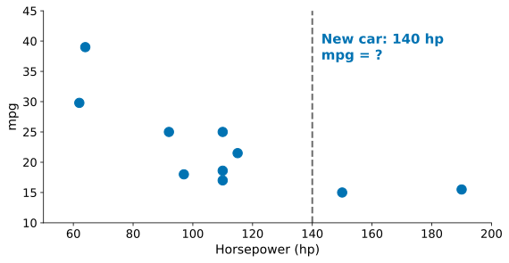
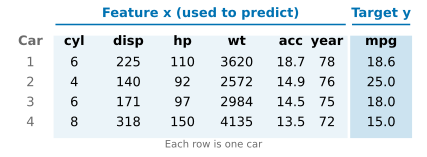
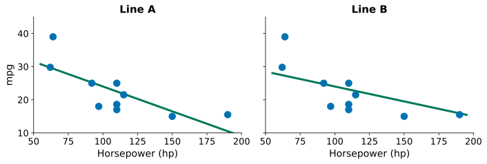
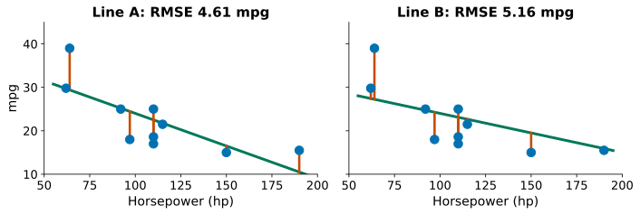
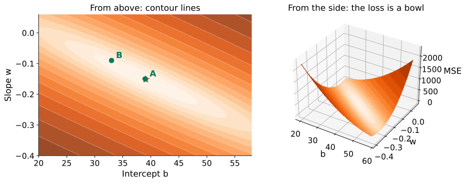
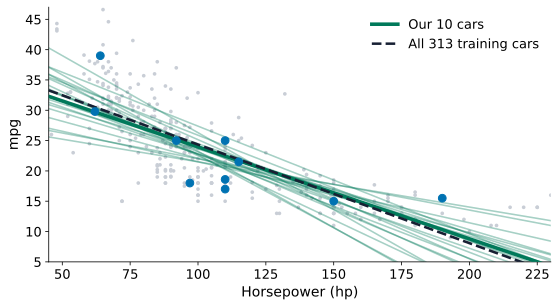
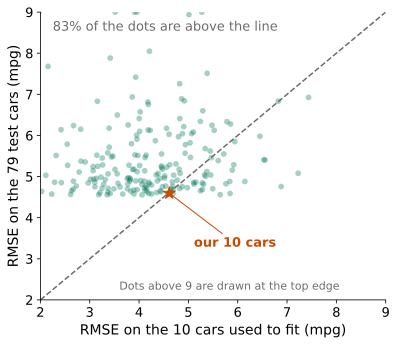
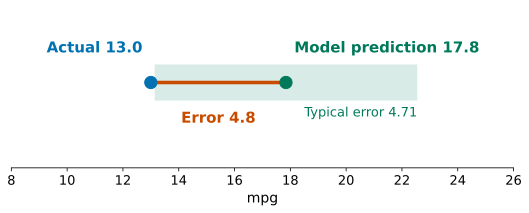

## A new car arrives

::: {.stage}
{.fig .fig-s2 fig-alt="Ten cars as dots: horsepower against mpg, and a dashed vertical line for a new car with 140 hp"}

::: {.ask}
<small>Look at the ten cars</small>
A new car has 140 hp. What mpg would you guess? How did you decide?
:::
:::

::: {.notes}
约 3 分钟。先不讲任何术语。请学生看这十辆车的点，在心里或纸上写一个数，请两位同学说出猜测和理由，不评价。多半会说“画一条线”或“看附近的点”，记下这句话，后面的拖线和打分都回到它。这辆新车是 79 辆测试车之一（规则：在看结果之前定下，是用全部训练车拟合的马力直线下误差最接近测试 RMSE 的那辆），实测 13.0 mpg，先不揭晓，结尾回来。mpg 是美制加仑，英制数值约高 20%。
:::

## What you will be able to do

::: {.stage}
::: {.say}
Easy-to-measure quantities in, one hard-to-measure number out: a chip's power from its design parameters, an alloy's strength from its composition, a car's mpg from its engine.
:::

::: {.say .xl}
Today you turn such a guess into a method you can **write down, compute and test on new data**.
:::

::: {.flow}
<div><span>1</span>Problem</div>
<div><span>2</span>Model</div>
<div><span>3</span>Loss</div>
<div><span>4</span>Solution</div>
<div><span>5</span>Test</div>
:::
:::

::: {.notes}
约 2 分钟。承接上页：你们刚才做的就是这一类问题。念出五个词，告诉学生每页标题前的词就是现在在第几步；每进入新的一步先说这一步要回答什么，每步结束用一句话收回来。今天五步都用同一批车。
:::

## [Problem:]{.stg} What do we know, what do we guess?

::: {.stage .tight}
{.fig .fig-f2 fig-alt="Four rows of car data with feature columns and the target column marked"}

::: {.tiles .two}
<div class="tile txt"><span>Feature x</span><b class="c-data">What we use to guess</b></div>
<div class="tile txt"><span>Target y</span><b class="c-data">What we want to guess</b></div>
:::

::: {.muted .small .center}
Row $i$ is car $i$, column $j$ is feature $j$: $\textcolor{#0072B2}{x_{23}}=92$ hp is the horsepower of car 2. With one feature we write just $x_i$.
:::

::: {.muted .small .center}
The targets are known, so this is supervised learning. The target is a number, so this is regression.
:::
:::

::: {.notes}
约 2 分钟。第 1 步 Problem。F2 是十辆车里的前四辆的完整记录（所有特征）。今天先只用马力一个特征，后面再加。顺带命名：监督学习、回归。下标约定：第一个下标数车，第二个数特征（x₂₃ 是第 2 辆车的第 3 个特征，即马力 92）。
:::

## [Problem:]{.stg} The problem, in one sentence

::: {.stage}
::: {.say .xl}
Given the features $\textcolor{#0072B2}{x}$ of a car that is **not in the table**, give a prediction $\textcolor{#00795A}{\hat y}$ close to its true mpg $\textcolor{#0072B2}{y}$.
:::

::: {.muted}
For the ten cars we know $y$. For the new car we do not: that is the point.
:::
:::

::: {.notes}
约 1 分钟。把问题说准：目标是表里没有的车。这句话是后面“为什么要留一批没用过的车”的伏笔，现在不展开。收一句：问题说准了，下一步是答案取什么形式。
:::

## [Model:]{.stg} What form can the guess take?

::: {.stage}
::: {.formula}
$$
\textcolor{#00795A}{\hat y}=\textcolor{#00795A}{b}+\textcolor{#00795A}{w}\,\textcolor{#0072B2}{x}
$$
:::

::: {.rows}
<div><span class="n">x</span><div><b class="c-data">Horsepower</b><p>the feature we know</p></div></div>
<div><span class="n">ŷ</span><div><b class="c-model">Predicted mpg</b><p>"y hat": the model's guess, not the measured y</p></div></div>
<div><span class="n">b, w</span><div><b class="c-model">Parameters</b><p>b is the intercept. w is the slope: each extra hp changes the prediction by w mpg.</p></div></div>
:::
:::

::: {.notes}
约 1.5 分钟。第 2 步 Model：回答“猜测可以取什么形式”。呼应开场学生说的“画一条线”：一条直线就是两个旋钮。强调 w 描述预测随马力的变化，不是因果；零马力的车不存在，所以 b 也不对应真实的车。
:::

## [Model:]{.stg} Real cars have many features

::: {.stage}
::: {.formula .m1}
$$
\textcolor{#00795A}{\hat y_i} = \textcolor{#00795A}{w_0} + \textcolor{#00795A}{w_1}\textcolor{#0072B2}{x_{i1}} + \textcolor{#00795A}{w_2}\textcolor{#0072B2}{x_{i2}} + \cdots + \textcolor{#00795A}{w_p}\textcolor{#0072B2}{x_{ip}}
$$
:::

::: {.formula .m2}
$$
\underbrace{\begin{pmatrix}\textcolor{#00795A}{\hat y_1}\\ \textcolor{#00795A}{\hat y_2}\\ \vdots\\ \textcolor{#00795A}{\hat y_n}\end{pmatrix}}_{\textcolor{#00795A}{\hat{\mathbf y}}:\ n\times 1}
=
\underbrace{\begin{pmatrix}
1 & \textcolor{#0072B2}{x_{11}} & \cdots & \textcolor{#0072B2}{x_{1p}}\\
1 & \textcolor{#0072B2}{x_{21}} & \cdots & \textcolor{#0072B2}{x_{2p}}\\
\vdots & \vdots & & \vdots\\
1 & \textcolor{#0072B2}{x_{n1}} & \cdots & \textcolor{#0072B2}{x_{np}}
\end{pmatrix}}_{\textcolor{#0072B2}{\mathbf X}:\ n\times(p+1)}
\underbrace{\begin{pmatrix}\textcolor{#00795A}{w_0}\\ \textcolor{#00795A}{w_1}\\ \vdots\\ \textcolor{#00795A}{w_p}\end{pmatrix}}_{\textcolor{#00795A}{\mathbf w}:\ (p+1)\times 1}
$$
:::

::: {.say}
A real car has $p$ features, and the model is a weighted sum plus a constant: $\hat{\mathbf y}=\mathbf X\mathbf w$. With $p=1$ it is the line we just saw, with $w_0=b$ and $w_1=w$. To see the ideas, we stay with $p=1$ for now.
:::
:::

::: {.notes}
约 1.5 分钟。先说清楚：真实的车有很多特征（气缸数、排量、马力、重量、加速度、年份，p = 6），同一种形式推广过来就是加权和加常数项。把矩阵读开：n 行是 n 辆车，p+1 列是常数列加 p 个特征；w 是 p+1 个分量，ŷ 是 n 个分量；下标约定第一个数车、第二个数特征。不推导。关键一句：p = 1 就是刚才那条线，w₀ 就是 b，w₁ 就是 w；为了看清楚思路，Loss 和推导先看 p = 1，推导完再回到一般的 p。
:::

## [Model:]{.stg} Move the line yourself

::: {.stage .top}
::: {.say}
One feature, one line. Drag the two ends of the line to fit the ten cars. Then pull it a little off. **Can you tell which is better?**
:::


:::

::: {.notes}
约 3 分钟，学生自己动手。让他们先拖一分钟，再故意拖偏；十个点比较分散，多半看不出哪条更好，引出“需要把好变成数”。这页不显示任何分数。
:::

## [Loss:]{.stg} How do we score a line?

::: {.stage}
{.fig .fig-f4 fig-alt="Two candidate lines A and B on the same ten cars, no scores"}

::: {.say .center}
Two lines, one feature, the same ten cars. **Which is better, and by how much?** How would you put a number on it?
:::
:::

::: {.notes}
约 1.5 分钟。第 3 步 Loss：回答“怎么给一条线打分”。这是全课最值得学生自己想的一问：讲者自己提问，请一两位学生说想法（多半会说“看点离线有多远”，正好是残差），不设点击揭示，不给答案，直接翻页。
:::

## [Loss:]{.stg} Residual, squared, averaged

::: {.stage .tight}
::: {.say}
Residual = measured minus predicted. Square it, then average.
:::

::: {.formula .m2}
$$
\textcolor{#C84B00}{J(\mathbf w)}=\frac1n\sum_{i=1}^{n}\bigl(\textcolor{#0072B2}{y_i}-\textcolor{#00795A}{\hat y_i}\bigr)^2
$$
:::

{.fig .fig-f4b fig-alt="The same two lines with red residual segments and their RMSE"}

::: {.muted .center}
This is the mean squared error (MSE), our loss, shown here for one feature. RMSE is its square root, in mpg.
:::
:::

::: {.notes}
约 2.5 分钟。接上页学生的说法：点到线的竖直距离就是残差（红线段）。为什么要平方：正负残差会互相抵消，平方后都变成正的，也更惩罚大的偏差。板书只算 A 线一遍（十个残差平方再平均），B 线直接指图。A 线 RMSE 4.61，B 线 5.16，A 更好，但差距不大，说明眼睛确实不容易分辨。收一句：现在有了给线打分的办法。
:::

## [Solution:]{.stg} Which line scores best?

::: {.stage .tight}
{.fig .fig-f5 fig-alt="Contour plot and 3D surface of the loss over intercept and slope with the minimum marked"}

::: {.say}
The loss is a bowl in $(b, w)$. Where is its lowest point?
:::
:::

::: {.notes}
约 1.5 分钟。第 4 步 Solution：回答“哪一条线得分最低”。先讲怎么读等高线（每一圈是同样的分数），再讲 3D 的碗；A、B 两个绿点在碗里的位置，红星是碗底。只讲图，不给条件、不写偏导：停下来问学生“怎么找到碗底那一点”，听一两个回答（多半会说“往下走”或“斜率为零”），然后翻页，下一页就是对这个问题的回答。
:::

## [Solution:]{.stg} At the bottom the slope is zero in both directions

::: {.stage}
::: {.steps}
::: {.step}
[Write the loss, one feature]{.lab}

$$
\textcolor{#C84B00}{J(b,w)}=\frac1n\sum_{i=1}^{n}\bigl(\textcolor{#0072B2}{y_i}-\textcolor{#00795A}{b}-\textcolor{#00795A}{w}\,\textcolor{#0072B2}{x_i}\bigr)^2
$$
:::

::: {.step}
[Set ∂J/∂b = 0]{.lab}

$$
-\frac2n\sum_{i}\bigl(\textcolor{#0072B2}{y_i}-\textcolor{#00795A}{b}-\textcolor{#00795A}{w}\,\textcolor{#0072B2}{x_i}\bigr)=0
\;\Longrightarrow\;
\textcolor{#00795A}{b}=\textcolor{#0072B2}{\bar y}-\textcolor{#00795A}{w}\,\textcolor{#0072B2}{\bar x}
$$
:::

::: {.step}
[Set ∂J/∂w = 0, substitute b]{.lab}

$$
\sum_{i}\textcolor{#0072B2}{x_i}\bigl(\textcolor{#0072B2}{y_i}-\textcolor{#00795A}{b}-\textcolor{#00795A}{w}\,\textcolor{#0072B2}{x_i}\bigr)=0
\;\Longrightarrow\;
\textcolor{#00795A}{w}=\frac{\sum_i(\textcolor{#0072B2}{x_i}-\textcolor{#0072B2}{\bar x})(\textcolor{#0072B2}{y_i}-\textcolor{#0072B2}{\bar y})}{\sum_i(\textcolor{#0072B2}{x_i}-\textcolor{#0072B2}{\bar x})^2}
$$
:::

::: {.step}
[Check on the ten cars]{.lab}

$$
\textcolor{#00795A}{w}=\frac{-1960.9}{12938}\approx-0.1516,\quad
\textcolor{#00795A}{b}\approx\textcolor{#0072B2}{22.44}+0.1516\times\textcolor{#0072B2}{110}\approx39.11
$$
:::
:::
:::

::: {.notes}
约 4.5 分钟，板书同步，带学生一行一行走。开头先回答上一页的问题：碗底在两个方向上斜率都为零，所以令两个偏导为零。第 1 行：回忆损失。第 2 行：对 b 求偏导，得到线过均值点 (x̄, ȳ)。第 3 行：对 w 求偏导，代入 b；用 Σ(xᵢ − x̄) = 0 把 Σ xᵢ(yᵢ − ȳ) 改写成 Σ(xᵢ − x̄)(yᵢ − ȳ)，得协方差除以方差。第 4 行：十辆车马力平均 110，mpg 平均 22.44，分子 −1960.9，分母 12938，w = −0.1516，b = 39.11，正是上一页碗底红星的位置；不要逐项手算，汇总量已给出。这条线的训练 RMSE 是 4.61，上一页的 A 线是它的取整版，几乎一样；B 线是 5.16，差得多。
:::

## [Solution:]{.stg} Many features, same steps

::: {.stage}
::: {.steps}
::: {.step}
[Write the loss, many features]{.lab}

$$
\textcolor{#C84B00}{J(\mathbf w)}=\frac1n(\textcolor{#0072B2}{\mathbf y}-\mathbf X\textcolor{#00795A}{\mathbf w})^T(\textcolor{#0072B2}{\mathbf y}-\mathbf X\textcolor{#00795A}{\mathbf w})
$$
:::

::: {.step}
[Set ∇J = 0]{.lab}

$$
\nabla J=\frac2n\bigl(\mathbf X^T\mathbf X\,\textcolor{#00795A}{\mathbf w}-\mathbf X^T\textcolor{#0072B2}{\mathbf y}\bigr)=\mathbf 0
\;\Longrightarrow\;
\mathbf X^T\mathbf X\,\textcolor{#00795A}{\mathbf w}=\mathbf X^T\textcolor{#0072B2}{\mathbf y}
$$
:::

::: {.step}
[Solve for w]{.lab}

$$
\textcolor{#00795A}{\mathbf w}=(\mathbf X^T\mathbf X)^{-1}\mathbf X^T\textcolor{#0072B2}{\mathbf y}
$$
:::

::: {.step}
[Check: one feature]{.lab}

$$
n\,\textcolor{#00795A}{b}+\textcolor{#00795A}{w}\sum_i\textcolor{#0072B2}{x_i}=\sum_i\textcolor{#0072B2}{y_i}
\;\Longrightarrow\;
\textcolor{#00795A}{b}=\textcolor{#0072B2}{\bar y}-\textcolor{#00795A}{w}\,\textcolor{#0072B2}{\bar x}
$$
:::
:::
:::

::: {.notes}
必讲，约 2.5 分钟：后面的柱状图和勾选互动都用多特征模型。结构与上一页逐行对应：第 1 行同一个损失，残差平方和写成向量内积；第 2 行先展开平方得 yᵀy − 2wᵀXᵀy + wᵀXᵀXw，再求梯度，一个式子顶了上一页所有偏导，令其为零得正规方程；第 3 行 X 的各列线性无关时 XᵀX 可逆，解出 w；第 4 行验算：p = 1 时第一行就是 n b + w Σxᵢ = Σyᵢ，回到上一页的 b = ȳ − w x̄。遗留两问（求逆是否稳定、不求逆的办法）只口头提一句，指向 Advanced Study 1、2。收一句：解得出来了，但这是用这十辆车算出的最好。
:::

## [Test:]{.stg} Is the best line best for other cars?

::: {.stage}
{.fig .fig-f13 fig-alt="Twenty fitted lines from twenty different sets of ten cars, our line, and the line from all 313 training cars"}

::: {.say .center}
Twenty sets of ten cars, twenty different best lines. "Best" means best **on the cars used to compute it**.
:::
:::

::: {.notes}
约 1.5 分钟。第 5 步 Test：回答“新车上能信吗”。灰点是 313 辆训练车，每条淡绿线是换一组 10 辆车得到的最佳直线（随机抽样、没有挑选），粗绿线是我们这十辆，虚线是用全部 313 辆车的结果。斜率最陡和最平的差一倍以上。收一句：我们关心的是没见过的车，而现在算出的“最好”只对用过的车成立。
:::

## [Test:]{.stg} Keep some cars out of the fitting

::: {.stage}
::: {.two .f14}
::: {}
::: {.splitbar .mini}
<div class="train"><b>313</b><span>fit the model here</span></div>
<div class="test"><b>79</b><span>never used</span></div>
:::

::: {.say}
Before fitting anything, 79 of the 392 cars were put aside. The line never sees them, so they show how it does on cars it was not fitted to.
:::
:::

::: {}
{.fig .fig-f14 fig-alt="Scatter of RMSE on the ten fitting cars against RMSE on the 79 test cars, for 200 different sets of ten cars"}
:::
:::

::: {.muted .small}
Each dot is a line fitted to a different set of ten training cars. The line usually looks better on the cars it was fitted to than on the test cars.
:::
:::

::: {.notes}
约 3 分钟。训练车用来拟合，测试车从不参与，所以只有它们能告诉我们这条线对新车有没有用。右图每个点是一组 10 辆训练车：横轴是在这 10 辆车上的 RMSE，横轴以上的点说明在测试车上更差，约 83% 的组合如此（中位数约 4.1 对 5.1）；红星是我们这十辆车，恰好两者几乎一样（4.61 对 4.59），这是这一组的运气，不是保证。五个点超过 9，画在上边缘。不要说“过拟合”，那是下一讲的概念；这里只说“用过的车上的分数偏乐观”。收一句：以后报告的数字都在测试车上算。
:::

## [Test:]{.stg} Do the models beat a simple guess?

::: {.stage}
::: {.say}
Baseline: always guess the training mean, 23.60 mpg. Each model is fitted on the 313 training cars. Test RMSE on the 79 test cars:
:::

::: {.bars}
<div class="base"><div class="lab">Baseline</div><div class="bar" style="width:100%"></div><div class="v">7.18</div></div>
<div><div class="lab">Model 1<small>hp</small></div><div class="bar" style="width:65.6%"></div><div class="v">4.71</div></div>
<div><div class="lab">Model 2<small>hp, weight</small></div><div class="bar" style="width:58.8%"></div><div class="v">4.22</div></div>
<div><div class="lab">Model 3<small>cylinders, displacement, hp, weight</small></div><div class="bar" style="width:58.9%"></div><div class="v">4.23</div></div>
<div><div class="lab">Model 4<small>all six features</small></div><div class="bar" style="width:45.1%"></div><div class="v">3.24</div></div>
:::

::: {.muted .small}
Read these numbers, but do not use them to pick features again and again: each pick would leak the test cars into the choice.
:::
:::

::: {.notes}
约 2.5 分钟。基线在这里第一次引入：最朴素的猜法，永远猜训练均值。模型 1 就是我们的直线（用全部 313 辆训练车拟合，w = −0.163，b = 40.61）。模型 2 与 3 没有实质差别。最后一句为局限页埋伏笔。收一句：模型 2 比模型 1 好，它对马力说了什么？
:::

## How to read a coefficient

::: {.stage .top}
::: {.say}
A coefficient $w_j$ is the change in predicted mpg for one more unit of feature $j$, **with the other features held fixed**.
:::



::: {.muted}
Weight and horsepower are strongly correlated (0.86), so they **share the credit**.
:::
:::

::: {.notes}
约 3.5 分钟。讲者先问：模型 1 的马力系数是 −0.163，加入重量后会变大、变小还是不变？举手数一下，不设点击揭示。然后依次勾选重量、气缸数与排量、加速度与年份；hp 系数 −0.163 → −0.052 → −0.044 → −0.002。年份的原因：较晚的车马力偏低又更省油。时间紧时这页改为口头讲结论，省掉互动。
:::

## The same five steps in code

::: {.stage}
```python
# Problem: features and target
X = data[["horsepower", "weight"]]
y = data["mpg"]
# Test: keep 20% of the cars aside
X_train, X_test, y_train, y_test = train_test_split(
    X, y, test_size=0.2, random_state=42)
# Model, Loss, Solution: fit on the training cars
model = LinearRegression().fit(X_train, y_train)
# Test: score on the test cars
rmse = mean_squared_error(y_test, model.predict(X_test)) ** 0.5
```

::: {.muted .small}
You will run this flow yourself in Lab 2.
:::
:::

::: {.notes}
约 2 分钟，必讲。只讲四件事：特征与目标；先划分，留出测试车；一行 fit 同时完成模型、损失和求解（求的就是正规方程那个 w）；在测试车上算 RMSE。不讲语法细节，整节代码留给 Lab 2。这一页把今天的五步和学生课后要写的代码对上。
:::

## Back to the car

::: {.stage}
{.fig .fig-f17 fig-alt="A number line with the predicted value, the measured value and the typical error range"}

::: {.say}
The 140 hp car was one of the 79 test cars. The line fitted on all 313 training cars predicts 17.8 mpg. The car measured 13.0. The error, 4.8, is **typical**: the test RMSE is 4.71.
:::

::: {.muted}
Whatever your own guess was, this method's error can be measured, tested and improved.
:::
:::

::: {.notes}
约 1.5 分钟。回扣开场那辆新车；请学生对照自己当初的猜测。强调这辆车是测试车，线从没见过它，所以这个误差是诚实的。它是按开场前定下的规则选出的（误差最接近测试 RMSE），所以 4.8 对 4.71 是设计出来的“典型”，不要说成巧合。
:::

## Where this method cannot be trusted

::: {.stage}
::: {.rows}
<div><span class="n">1</span><b>A single coefficient is hard to read</b></div>
<div><span class="n">2</span><b>The test cars are one batch: 1970 to 1982, one split, 79 cars</b></div>
<div><span class="n">3</span><b>Association is not mechanism</b></div>
<div><span class="n">4</span><b>The straight line itself is an assumption: the residuals show a curve</b></div>
:::

::: {.ask}
<small>Still open</small>
With many sets of features, how do we choose one without using up the test cars?
:::
:::

::: {.notes}
约 2 分钟。四条局限各用一句话：系数 −0.163 变到 −0.002；测试车只代表同一批历史汽车；关联不回答“为什么”；残差图显示直线遗漏弯曲。最后留下未解问题，不预告下一讲。
:::

## What you can do now {.final-slide}

::: {.takeaway}
::: {.steps}
::: {.step}
[Problem]{.lab}

$$
\textcolor{#0072B2}{\mathbf X}\ \text{(features)},\quad\textcolor{#0072B2}{\mathbf y}\ \text{(target)},\quad\text{for new cars}
$$
:::

::: {.step}
[Model]{.lab}

$$
\textcolor{#00795A}{\hat{\mathbf y}}=\mathbf X\,\textcolor{#00795A}{\mathbf w}
$$
:::

::: {.step}
[Loss]{.lab}

$$
\textcolor{#C84B00}{J(\mathbf w)}=\frac1n\sum_{i=1}^{n}\bigl(\textcolor{#0072B2}{y_i}-\textcolor{#00795A}{\hat y_i}\bigr)^2
$$
:::

::: {.step}
[Solution]{.lab}

$$
\nabla J=\mathbf 0\;\Longrightarrow\;\textcolor{#00795A}{\mathbf w}=(\mathbf X^T\mathbf X)^{-1}\mathbf X^T\textcolor{#0072B2}{\mathbf y}
$$
:::

::: {.step}
[Test]{.lab}

$$
\textcolor{#C84B00}{\mathrm{RMSE}_{\text{test}}}=\sqrt{\tfrac1m\sum_{j=1}^{m}\bigl(\textcolor{#0072B2}{y_j}-\textcolor{#00795A}{\hat y_j}\bigr)^2}\ \text{ vs. the baseline}
$$
:::
:::

::: {.qr}
{fig-alt="Feedback QR code for Lesson 2"}
<b>30-second feedback</b>
<p>After class: Lab 2</p>
:::
:::

::: {.notes}
约 2.5 分钟，课堂最终停在这一页：把整条链用同一套颜色走一遍，蓝色是数据，绿色是模型，红色是误差。读公式时对应回今天每一步的页面，不再展开。答疑和扫码都在这里。课后要做 Lab 2，不预告下一讲。
:::
