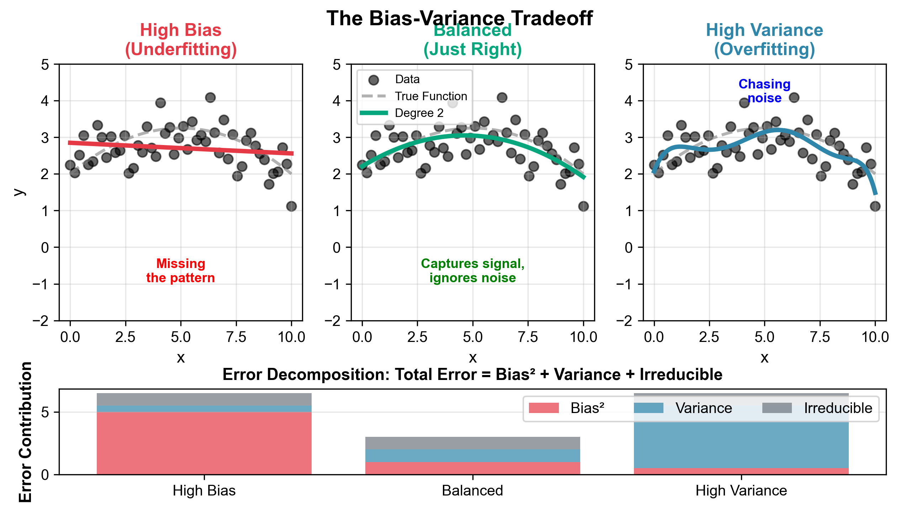
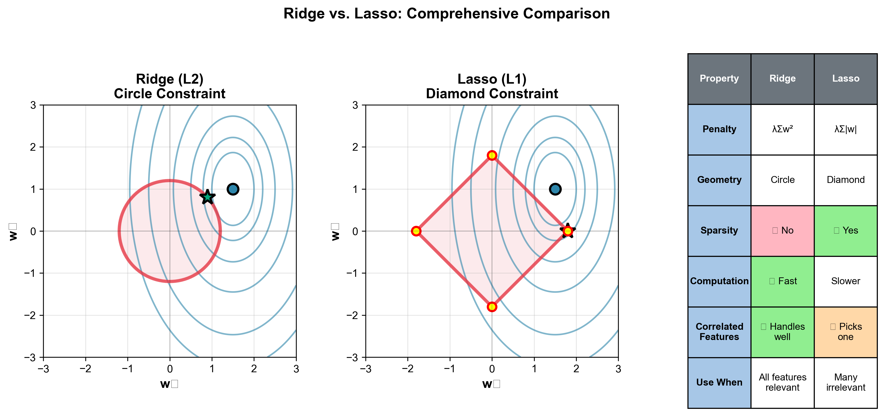
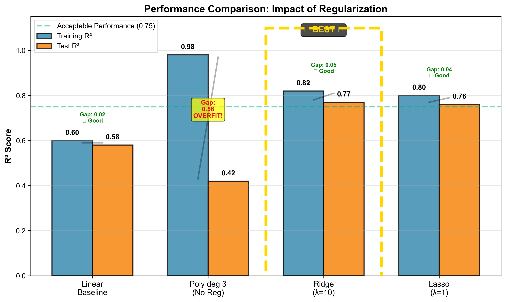

# Lesson 3: Feature Engineering & Regularization
## Adding Flexibility Without Overfitting

**MPS311/439 Machine Learning**  
**Dr. Wei Xing**  
**University of Sheffield**  
**Academic year 2026–27**  
**Expected reading time:** 90 minutes

---

## Table of Contents
1. [Introduction & Motivation](#1-introduction--motivation)
2. [From Lines to Curves: Feature Engineering](#2-from-lines-to-curves-feature-engineering)
3. [The Dark Side: When Power Becomes a Problem](#3-the-dark-side-when-power-becomes-a-problem)
4. [The Solution: Regularization](#4-the-solution-regularization)
5. [Tuning λ: Cross-Validation](#5-tuning-λ-cross-validation)
6. [Bringing It All Together](#6-bringing-it-all-together)
7. [Summary & The Bigger Picture](#7-summary--the-bigger-picture)
8. [Practice Problems](#8-practice-problems)
9. [Appendix: Advanced Topics for MPS439](#9-appendix-advanced-topics-for-mps439)

---

## 1. Introduction & Motivation

### 1.1 The Netflix Prize: A Machine Learning Success Story

Between 2006 and 2009, Netflix ran one of the most famous machine learning competitions in history. The challenge was simple: improve their movie recommendation algorithm by at least 10%. The prize? **$1 million**.

Thousands of teams competed, and the winning solution didn't come from a revolutionary new algorithm. Instead, it came from two key insights:

1. **Sophisticated feature engineering** - Creating powerful predictive features from basic user and movie data
2. **Ensemble methods with regularization** - Combining multiple models while preventing overfitting

The difference between winning and losing wasn't access to better data or more computing power. It was understanding **when to add complexity** (feature engineering) and **when to constrain it** (regularization).

> **Key Lesson:** In machine learning, how you transform and control your features is often more important than the base algorithm you choose.

### 1.2 Where We Are in the Course

**Last week (Lesson 2):**
- Linear regression with basic features
- The Normal Equation: $\mathbf{\hat{w}} = (\mathbf{X}^T\mathbf{X})^{-1}\mathbf{X}^T\mathbf{y}$
- Mean Squared Error as our loss function
- Train/test splits for evaluation

**This week:**
We extend linear regression with two powerful techniques that work together:
1. **Feature Engineering** - Transform simple inputs into powerful predictors
2. **Regularization** - Prevent models from becoming too complex

**The journey ahead:**
- **Act 1:** Discover the power of polynomial features
- **Act 2:** Encounter the problem of overfitting  
- **Act 3:** Learn regularization as the solution

### 1.3 Learning Objectives

By the end of these notes, you will be able to:

✓ **Transform features** to capture non-linear relationships using polynomial features and interactions  
✓ **Recognize and diagnose overfitting** through train/test performance gaps  
✓ **Apply Ridge and Lasso regression** to prevent overfitting while maintaining model power  
✓ **Use cross-validation** to tune hyperparameters without touching the test set  
✓ **Implement the complete pipeline** in sklearn with proper data handling

Let's begin our journey by understanding why basic linear regression sometimes isn't enough.

---

## 2. From Lines to Curves: Feature Engineering

### 2.1 The Limitation of Straight Lines

In Lesson 2, we learned that linear regression fits a straight line (or hyperplane) to our data:

$$\hat{y} = w_1 x_1 + w_2 x_2 + \cdots + w_p x_p + w_0$$

This works beautifully when the true relationship between features and target is linear. But what happens when it's not?

**Example: House Prices vs. Age**

Consider predicting house prices based on the age of the house. You might expect older houses to be cheaper (depreciation, outdated features). But let's look at real market data:


*Figure 2.1: House prices don't follow a straight line. The relationship is U-shaped.*

What's happening here?

- **New houses (0-10 years):** High prices due to modern features, warranties, contemporary design
- **Middle-aged houses (15-40 years):** Lower prices due to wear, dated styles, need for repairs
- **Old houses (50+ years):** Prices rise again! Vintage appeal, historical value, solid construction, mature gardens

A straight line fundamentally cannot capture this **U-shaped relationship**. No matter how we adjust $w_1$ (the slope), we're limited to predictions that either always increase or always decrease with age.

**Mathematical perspective:**
- Our model: $\hat{y} = w_1 \cdot \text{age} + w_0$
- This is **monotonic** - it only goes one direction
- We need a model that can curve back

**The natural question:** *How can we fit curves using linear regression?*

### 2.2 The Brilliant Solution: Polynomial Features

Here's the key insight that unlocks tremendous power:

> <span style="color: #E63946; font-weight: bold;">We can't make the model non-linear, but we can make the features non-linear!</span>

#### 2.2.1 The Core Transformation

Instead of using age directly, let's create new features:

**Original feature:**
$$x = [\text{age}]$$

**Polynomial features (degree 2):**
$$x' = [\text{age}, \text{age}^2]$$

**Polynomial features (degree 3):**
$$x' = [\text{age}, \text{age}^2, \text{age}^3]$$

Now our model becomes:

**Degree 2 (Quadratic):**
$$\hat{y} = w_2 \cdot \text{age}^2 + w_1 \cdot \text{age} + w_0$$

**Degree 3 (Cubic):**
$$\hat{y} = w_3 \cdot \text{age}^3 + w_2 \cdot \text{age}^2 + w_1 \cdot \text{age} + w_0$$

**The critical insight (highlight this):**

> The model is still **linear in the parameters** $\mathbf{w}$. We haven't changed the model class—we've only changed the input features!

This means:
- ✓ We can still use the Normal Equation
- ✓ All our optimization theory from Lesson 2 applies
- ✓ The problem remains convex with a unique solution
- ✓ We just replace $\mathbf{X}$ with $\mathbf{X}_{\text{poly}}$

#### 2.2.2 Connection to Mathematics You Know

**Taylor Series:** From mathematical analysis, you know that any smooth function can be approximated by polynomials:

$$f(x) \approx a_0 + a_1 x + a_2 x^2 + a_3 x^3 + \cdots$$

**Weierstrass Approximation Theorem:** Every continuous function on a closed interval can be uniformly approximated by polynomials.

What we're doing in machine learning is **learning the coefficients** $a_i$ from data rather than deriving them analytically!

### 2.3 Seeing Polynomials in Action

Let's systematically explore what happens as we increase the polynomial degree. We'll use the same house price data throughout:


*Figure 2.2: Progressive polynomial fits showing increasing complexity. Notice how training performance improves but test performance eventually degrades.*

Let's analyze each degree:

#### Degree 1: Linear (Underfitting)

**Model:** $\hat{y} = w_1 \cdot \text{age} + w_0$

**Observations:**
- The straight line clearly misses the U-shaped pattern
- Systematic errors visible: predictions too high at extremes, too low in middle
- **Training R² ≈ 0.45** - Not fitting the data well
- **Test R² ≈ 0.43** - Similar poor performance

**Diagnosis:** <span style="color: #E63946;">**High bias**</span> - Model is too simple to capture the true pattern

#### Degree 2: Quadratic (Just Right!)

**Model:** $\hat{y} = w_2 \cdot \text{age}^2 + w_1 \cdot \text{age} + w_0$

**Observations:**
- Beautiful smooth U-curve that captures the general pattern
- Passes through the "middle" of the data cloud
- Slight errors but they appear random (no systematic pattern)
- **Training R² ≈ 0.78** - Good fit to training data
- **Test R² ≈ 0.75** - Nearly as good on test data!

**Diagnosis:** <span style="color: #06A77D;">**Sweet spot**</span> - Captures true relationship without overfitting

#### Degree 3: Cubic (Still Acceptable)

**Model:** $\hat{y} = w_3 \cdot \text{age}^3 + w_2 \cdot \text{age}^2 + w_1 \cdot \text{age} + w_0$

**Observations:**
- Slight wiggle but generally still smooth
- Fits training points more closely
- **Training R² ≈ 0.85** - Better training fit than degree 2
- **Test R² ≈ 0.73** - Slightly worse than degree 2!

**Diagnosis:** Starting to show signs of overfitting—training improved but test got worse

#### Degree 5: Noticeable Oscillations

**Observations:**
- Clear oscillations between data points
- Unrealistic "waves" in the prediction curve
- **Training R² ≈ 0.93** - Excellent training fit
- **Test R² ≈ 0.68** - Deteriorating test performance

**Diagnosis:** <span style="color: #F77F00;">**Warning signs**</span> - Beginning to fit noise

#### Degree 10: Severe Overfitting

**Observations:**
- Wild oscillations between data points
- Curve passes through or very near every training point
- Completely unrealistic behavior between points
- **Training R² ≈ 0.99** - Nearly perfect training fit!
- **Test R² ≈ 0.42** - Worse than linear regression!

**Diagnosis:** <span style="color: #E63946;">**Severe overfitting**</span> - Model has memorized training data

### 2.4 The Pattern: Training vs. Test Performance

The key observation from Figure 2.2:

**Training error (R²):**
- Monotonically increases with polynomial degree
- Degree 15 might achieve R² = 0.999

**Test error (R²):**
- Initially increases (degree 1 → 2 → 3)
- Reaches a maximum around degree 2-3
- Then **decreases** despite better training fit

> <span style="color: #2E86AB; font-weight: bold;">This divergence between training and test performance is the signature of overfitting.</span>

### 2.5 Feature Explosion: The Combinatorial Problem

With multiple original features, polynomial features explode combinatorially. Consider a dataset with 8 features:

**Original features:**
$$\text{size, bedrooms, bathrooms, age, location\_score, garden, garage, stories}$$

**Polynomial degree 2 includes:**
1. **All originals:** 8 features
2. **All squares:** size², bedrooms², ..., stories² (8 more features)
3. **All interactions:** size×bedrooms, size×bathrooms, ..., garage×stories  
   - Number of pairs: $\binom{8}{2} = 28$ features

**Total for degree 2:** 8 + 8 + 28 = **45 features**

**General formula:**
The number of features with polynomial degree $d$ and $p$ original features:

$$\text{Number of features} = \binom{p + d}{d}$$

**Comparison table:**

| Original Features (p) | Degree (d) | Total Features | Growth Factor |
|----------------------|------------|----------------|---------------|
| 8 | 1 | 8 | 1× |
| 8 | 2 | 45 | 5.6× |
| 8 | 3 | 165 | 20.6× |
| 8 | 5 | 1,001 | 125× |
| 8 | 10 | 43,758 | 5,470× |

**The excitement:**
- More features = more expressiveness
- Can capture complex, non-linear patterns
- Polynomial features are a form of **basis expansion**
- We can approximate almost any function!

**The question:**
*With all this power to create features, are we done? Should we always use high-degree polynomials?*

Let's look more carefully at what happens with these high-degree polynomials...

### 2.6 A Brief Note on Interaction Terms

Beyond polynomials of individual features, we can create **interaction terms** that multiply features together:

**Example:** For house prices, consider:
- size = 2000 sq ft, bedrooms = 1 → Large studio (luxury)
- size = 2000 sq ft, bedrooms = 5 → Normal family house
- size = 800 sq ft, bedrooms = 4 → Cramped (undesirable)

The effect of size **depends on** the number of bedrooms. We can capture this with:

$$\text{interaction} = \text{size} \times \text{bedrooms}$$

Our model becomes:

$$\hat{y} = w_1 \cdot \text{size} + w_2 \cdot \text{bedrooms} + w_3 \cdot (\text{size} \times \text{bedrooms}) + w_0$$

The $w_3$ coefficient captures how the combined effect differs from the sum of individual effects.

**Note:** Interaction terms are automatically included when you use `PolynomialFeatures(degree=2)` in sklearn. For degree 2 with $p$ features, you get:
- $p$ original features
- $p$ squared terms  
- $\binom{p}{2}$ interaction terms

We'll explore interactions more in the lab, but the key point is: they give us even more features and even more modeling power!

---

## 3. The Dark Side: When Power Becomes a Problem

### 3.1 The Troubling Observations

Let's return to our degree 10 polynomial from Section 2.3. On the surface, it looks amazing:

- **Training R² = 0.99** - Nearly perfect fit!
- Passes through (or very near) every training point
- Minimizes training error beautifully

But when we evaluate on the test set:

- **Test R² = 0.35** - Terrible performance!
- Worse than our simple linear regression (R² = 0.43)
- Worse than doing almost nothing!

**The puzzle:** How can a model that fits training data so well perform so poorly on test data?

### 3.2 Understanding Overfitting

#### 3.2.1 The Formal Definition

> <span style="color: #E63946; font-weight: bold;">**Overfitting** occurs when a model learns the noise in the training data rather than the underlying signal, resulting in poor generalization to new data.</span>

**Components of any dataset:**

$$\text{Observed data} = \text{True signal} + \text{Random noise}$$

For our house prices:
- **True signal:** The actual relationship between age and price (smooth U-curve)
- **Random noise:** Measurement errors, unique circumstances, missing variables

**What good models do:**
- Capture the signal
- Ignore the noise

**What overfit models do:**
- Capture the signal AND the noise
- Treat random fluctuations as if they were meaningful patterns

#### 3.2.2 The Memorization Analogy

Consider preparing for an exam:

**Good learning (analogous to good fit):**
- Understand the underlying concepts
- Can apply knowledge to new problems
- Generalizes to questions you haven't seen before

**Memorization (analogous to overfitting):**
- Memorize specific practice problems and their answers
- Excel on those exact problems
- Fail on slightly different problems

Overfitting is the machine learning equivalent of memorization without understanding.

### 3.3 The Bias-Variance Tradeoff

To understand overfitting deeply, we need to decompose prediction error into its components:


*Figure 3.1: Decomposition of prediction error into bias, variance, and irreducible error.*

**Mathematical decomposition:**

$$\mathbb{E}[(\text{True value} - \text{Prediction})^2] = \text{Bias}^2 + \text{Variance} + \text{Irreducible Error}$$

Let's understand each component:

#### Bias

**Definition:** Error from overly simplistic assumptions in the learning algorithm.

**Characteristics:**
- Systematic error (always wrong in the same direction)
- Model is too simple to capture the true pattern
- **High bias = Underfitting**

**Example:** Using a straight line for a U-shaped relationship
- Will consistently underpredict at both extremes
- Will consistently overpredict in the middle
- No amount of training data will fix this

**Mathematical intuition:** Bias = $\mathbb{E}[\hat{f}(x)] - f(x)$
- Expected prediction vs. true function
- Even averaged over many training sets, we're systematically wrong

#### Variance

**Definition:** Error from sensitivity to small fluctuations in the training data.

**Characteristics:**
- Random error (prediction changes dramatically with different training samples)
- Model is too complex and fits noise
- **High variance = Overfitting**

**Example:** Degree 10 polynomial
- Different training samples → wildly different curves
- Small changes in training data → large changes in predictions
- Model is unstable

**Mathematical intuition:** Variance = $\mathbb{E}[(\hat{f}(x) - \mathbb{E}[\hat{f}(x)])^2]$
- How much does prediction vary across different training sets?
- High variance means prediction is unreliable

#### Irreducible Error

**Definition:** Error that cannot be eliminated by any model.

**Sources:**
- True randomness in the data-generating process
- Missing features we don't have access to
- Measurement noise

**Important:** This sets a lower bound on achievable error. Even perfect models can't eliminate this.

#### The Tradeoff

Here's the fundamental tension in machine learning:

**Simple models (e.g., linear):**
- ✓ Low variance (stable predictions)
- ✗ High bias (misses patterns)
- **Result:** Underfitting

**Complex models (e.g., degree 10 polynomial):**
- ✓ Low bias (flexible enough to capture patterns)
- ✗ High variance (fits noise)
- **Result:** Overfitting

**Optimal models:**
- Balance bias and variance
- Minimize total error
- This is the "sweet spot" we're seeking


*Figure 3.2: The classic U-curve showing how training and test errors diverge with model complexity.*

**Interpreting the curves:**

**Training error (blue, decreasing):**
- More complexity → better fit to training data
- Always decreases (or stays flat)
- Approaches zero with enough complexity

**Test error (orange, U-shaped):**
- Initially decreases: Capturing true patterns (reducing bias)
- Reaches minimum: Optimal complexity
- Then increases: Fitting noise (increasing variance)

**The sweet spot:**
- Marked by the vertical dashed line
- Minimum test error
- Optimal balance of bias and variance

### 3.4 Why Does Overfitting Happen?

#### The Degrees of Freedom Problem

**Intuitive explanation:** With $n$ data points and $p$ parameters:

- If $p \ll n$: Model is constrained, must find a simple pattern
- If $p \approx n$: Model has just enough freedom to fit data + noise
- If $p > n$: Underdetermined system, infinitely many solutions!

**Example:**
- Dataset: 50 houses
- Linear model: 8 parameters → Okay
- Degree 2 polynomial: 45 parameters → Risky
- Degree 3 polynomial: 165 parameters → Disaster!

With 165 parameters and only 50 data points, the model has so much freedom that it can fit almost anything—including noise.

#### Fitting Noise Instead of Signal

**Concrete example:**

Suppose the true relationship is:
$$\text{price} = 300 - 5 \cdot \text{age} + 0.05 \cdot \text{age}^2 + \epsilon$$

where $\epsilon \sim \mathcal{N}(0, 10,000)$ is random noise.

**What a degree 2 polynomial learns:**
- Estimates: $w_0 \approx 300$, $w_1 \approx -5$, $w_2 \approx 0.05$
- Ignores the noise $\epsilon$ (can't fit it systematically)
- Generalizes well to new data

**What a degree 10 polynomial learns:**
- Estimates: $w_0 \approx 300$, $w_1 \approx -5$, $w_2 \approx 0.05$
- **But also:** $w_3 \approx 0.002$, $w_4 \approx -0.001$, ..., $w_{10} \approx 0.0001$
- These higher-order terms capture specific noise realizations in the training data
- These noise patterns don't repeat in the test data
- Result: Poor generalization

### 3.5 Recognizing Overfitting in Practice

**Warning signs checklist:**

✗ **Large train/test performance gap:**
```
Training R² = 0.95
Test R² = 0.60
Gap = 0.35  ← RED FLAG!
```

✗ **Very large coefficient magnitudes:**
```
w = [1,253,000, -1,187,000, 1,045,000, -998,000, ...]
```
These huge, oscillating values indicate the model is "fighting itself" to fit noise.

✗ **Model is unstable:**
- Removing a single data point drastically changes predictions
- Different random train/test splits give wildly different results

✗ **Predictions are erratic:**
- Small changes in input → large changes in output
- Prediction curve oscillates wildly

✗ **Training performance "too good":**
- Training R² ≈ 1.0 is suspicious
- Real data always has some irreducible error
- Perfect fit likely means fitting noise

### 3.6 The Crisis

**Where we stand:**

✓ **Feature engineering** gave us the power to fit complex, non-linear patterns  
✗ **Too much power** leads to overfitting  
✗ **Can't simply use all possible features**  

**The fundamental question:**

> How do we keep the good (curve-fitting ability) without the bad (overfitting)?

**What we need:**
- A way to use rich feature sets (polynomials, interactions)
- While preventing the model from fitting noise
- Maintaining good generalization to new data

**The answer: Regularization**

In the next section, we'll discover how to constrain model complexity while preserving its expressive power.

---

## 4. The Solution: Regularization

### 4.1 The Core Intuition: Occam's Razor

**William of Ockham (14th century):**
> "Entities should not be multiplied beyond necessity"

**Modern interpretation:**
> Given multiple models that fit the data equally well, prefer the simpler one.

**Why simplicity matters:**
- Simpler models are less likely to have fit noise
- Simpler models generalize better
- Simpler models are more interpretable
- Simpler models make more stable predictions

**The machine learning implementation:**

Instead of reducing the number of features (which we can't always do), we **penalize complexity** directly in the loss function.

> <span style="color: #2E86AB; font-weight: bold;">Key Insight: We can't reduce features, but we can penalize large weights that indicate overfitting.</span>

**Analogy:**
- Feature engineering: Gave the model a powerful sports car
- Overfitting: Model drives recklessly
- Regularization: Install a speed limiter that still allows speed but prevents dangerous behavior

### 4.2 Ridge Regression (L2 Regularization)

#### 4.2.1 The Modified Loss Function

**Original loss function (from Lesson 2):**

$$J(\mathbf{w}) = \frac{1}{n} \sum_{i=1}^{n} (y_i - \hat{y}_i)^2$$

This is just Mean Squared Error—we want to minimize prediction errors.

**Ridge loss function (new):**

$$\boxed{J_{\text{Ridge}}(\mathbf{w}) = \underbrace{\frac{1}{n} \sum_{i=1}^{n} (y_i - \hat{y}_i)^2}_{\text{Data Fit Term}} + \underbrace{\lambda \sum_{j=1}^{p} w_j^2}_{\text{Regularization Term}}}$$

**Understanding each component:**

**Term 1: Mean Squared Error (Data Fit)**
- Same as before: $\frac{1}{n} \sum_{i=1}^{n} (y_i - \hat{y}_i)^2$
- Measures how well the model fits training data
- We still want predictions close to actual values
- **Alone:** Would lead to overfitting with many features

**Term 2: L2 Penalty (Regularization)**
- New: $\lambda \sum_{j=1}^{p} w_j^2$
- Penalizes large weight magnitudes
- L2 norm squared: $\|\mathbf{w}\|_2^2 = w_1^2 + w_2^2 + \cdots + w_p^2$
- **Effect:** Encourages weights to be small

**The λ (lambda) hyperparameter:**

- $\lambda = 0$: No regularization (standard linear regression)
- $\lambda > 0$: Increasing penalty for large weights
- $\lambda \to \infty$: All weights forced toward zero (predict mean only)

**Important note (highlight):**
> We typically **don't penalize** the bias term $w_0$. The regularization applies only to $w_1, w_2, \ldots, w_p$.

**Why not penalize $w_0$?**
- $w_0$ just shifts predictions up/down (doesn't affect complexity)
- Penalizing $w_0$ would depend on the scale of $y$
- Standard practice is to leave bias unregularized

#### 4.2.2 Why Square the Weights?

**Question:** Why use $w_j^2$ instead of $|w_j|$ or $w_j^4$?

**Reason 1: Smooth Optimization**
- The squared function is differentiable everywhere
- $\frac{d}{dw}(w^2) = 2w$ is well-defined for all $w$
- Enables closed-form solution (modified Normal Equation)

**Reason 2: Proportional Penalty**

Let's see how the penalty scales:

| Weight | $w$ | $w^2$ | Penalty ($\lambda w^2$ with $\lambda=1$) |
|--------|-----|-------|-------------------------------------------|
| Tiny | 0.1 | 0.01 | 0.01 (very small) |
| Small | 1.0 | 1.00 | 1.00 |
| Medium | 5.0 | 25.00 | 25.00 |
| Large | 10.0 | 100.00 | 100.00 |
| Huge | 50.0 | 2,500.00 | 2,500.00 |

**Observation:** Large weights are penalized disproportionately more!

- Small weights: Penalty is even smaller ($0.1^2 = 0.01$)
- Large weights: Penalty grows quadratically ($10^2 = 100$)
- **Effect:** Strong incentive to keep all weights moderate

**Reason 3: Convexity**
- $J_{\text{Ridge}}(\mathbf{w})$ remains a convex function
- Guarantees a unique global minimum
- No local minima to worry about
- Reliable optimization

**Reason 4: Connection to Gaussian Prior**
- In Bayesian interpretation: L2 penalty = Gaussian prior on weights
- Assumes weights are likely to be small
- Extreme values require strong evidence from data

#### 4.2.3 The Modified Normal Equation

Let's derive the solution for Ridge regression, building on what we learned in Lesson 2.

**Step 1: Write loss in matrix form**

$$J(\mathbf{w}) = \frac{1}{n}(\mathbf{y} - \mathbf{Xw})^T(\mathbf{y} - \mathbf{Xw}) + \lambda \mathbf{w}^T\mathbf{w}$$

Note: $\mathbf{w}^T\mathbf{w} = \sum_{j=1}^p w_j^2$ is just the L2 norm squared.

**Step 2: Expand the MSE term (like Lesson 2)**

$$J(\mathbf{w}) = \frac{1}{n}(\mathbf{y}^T\mathbf{y} - 2\mathbf{y}^T\mathbf{Xw} + \mathbf{w}^T\mathbf{X}^T\mathbf{Xw}) + \lambda \mathbf{w}^T\mathbf{w}$$

**Step 3: Take the gradient**

Using matrix calculus rules:

$$\nabla_{\mathbf{w}} J = \frac{2}{n}(-\mathbf{X}^T\mathbf{y} + \mathbf{X}^T\mathbf{Xw}) + 2\lambda\mathbf{w}$$

**Step 4: Set gradient to zero**

At the minimum: $\nabla_{\mathbf{w}} J = \mathbf{0}$

$$-\mathbf{X}^T\mathbf{y} + \mathbf{X}^T\mathbf{Xw} + n\lambda\mathbf{w} = \mathbf{0}$$

**Step 5: Rearrange**

$$\mathbf{X}^T\mathbf{Xw} + n\lambda\mathbf{w} = \mathbf{X}^T\mathbf{y}$$

$$(\mathbf{X}^T\mathbf{X} + n\lambda\mathbf{I})\mathbf{w} = \mathbf{X}^T\mathbf{y}$$

**Step 6: Solve for w**

$$\boxed{\mathbf{\hat{w}}_{\text{Ridge}} = (\mathbf{X}^T\mathbf{X} + n\lambda\mathbf{I})^{-1}\mathbf{X}^T\mathbf{y}}$$

**Compare to standard Normal Equation:**

- **Standard:** $\mathbf{\hat{w}} = (\mathbf{X}^T\mathbf{X})^{-1}\mathbf{X}^T\mathbf{y}$
- **Ridge:** $\mathbf{\hat{w}} = (\mathbf{X}^T\mathbf{X} + n\lambda\mathbf{I})^{-1}\mathbf{X}^T\mathbf{y}$

**Key difference:** We add $n\lambda\mathbf{I}$ to $\mathbf{X}^T\mathbf{X}$

**Benefits of this modification:**

✓ **Always invertible:** $\mathbf{X}^T\mathbf{X} + n\lambda\mathbf{I}$ is positive definite for any $\lambda > 0$  
✓ **Works even when $p > n$:** Standard regression fails, Ridge works  
✓ **Numerical stability:** Adding $n\lambda\mathbf{I}$ improves conditioning  
✓ **Closed-form solution:** No iterative optimization needed

#### 4.2.4 How Ridge Affects Coefficients

Let's visualize what happens to coefficients as we vary $\lambda$:


*Figure 4.1: Ridge coefficient paths showing smooth shrinkage toward zero as λ increases.*

**Reading the plot:**

**X-axis:** $\log_{10}(\lambda)$ from -3 to 4
- Left ($\lambda = 0.001$): Almost no regularization
- Right ($\lambda = 10,000$): Heavy regularization

**Y-axis:** Coefficient values

**Each colored line:** One coefficient's path as $\lambda$ changes

**Key observations:**

1. **$\lambda = 0$ (far left):**
   - Some coefficients are very large (e.g., $w_3 \approx 1000$)
   - Others very negative (e.g., $w_5 \approx -950$)
   - Coefficients "fighting each other" to fit training data

2. **$\lambda$ increases:**
   - All coefficients shrink smoothly
   - Large coefficients shrink faster (quadratic penalty!)
   - Paths are continuous and smooth

3. **$\lambda = 100$:**
   - All coefficients are moderate size
   - More balanced magnitudes
   - Still contributing to predictions

4. **$\lambda = 10,000$ (far right):**
   - All coefficients ≈ 0
   - Model essentially predicts the mean
   - Underfitting

**Critical property (highlight):**
> Ridge shrinks coefficients **smoothly** toward zero but **never exactly to zero**. All features remain in the model.

**Why never exactly zero?**
- Mathematical: The derivative of $w^2$ is $2w$, which smoothly approaches 0 as $w \to 0$
- Geometric: We'll see this in the next section

#### 4.2.5 Geometric Interpretation

Ridge regression can be formulated as a **constrained optimization** problem:

**Equivalent formulations:**

**Penalty form (what we've been using):**
$$\min_{\mathbf{w}} \text{MSE}(\mathbf{w}) + \lambda \sum w_j^2$$

**Constraint form:**
$$\min_{\mathbf{w}} \text{MSE}(\mathbf{w}) \quad \text{subject to} \quad \sum w_j^2 \leq t$$

For every $\lambda$, there's a corresponding $t$ (and vice versa).

**Geometric picture (for $p=2$ weights):**


*Figure 4.2: Geometric interpretation showing why Ridge creates smooth shrinkage (circular constraint) and Lasso creates sparsity (diamond constraint with corners on axes).*

**Left panel (Ridge):**

**MSE contours (blue ellipses):**
- Each ellipse: Points with equal MSE
- Center: Unconstrained minimum (standard regression solution)
- Moving outward: Increasing error

**Constraint region (red circle):**
- All points inside: Satisfy $w_1^2 + w_2^2 \leq t$
- The circle's radius is determined by $\lambda$ (or equivalently, $t$)

**Solution (green dot):**
- Where an MSE ellipse *touches* the constraint circle
- This is the lowest-MSE point within the constraint
- Typically **not** on an axis (both $w_1$ and $w_2$ are non-zero)

**Why no sparsity?**
- Smooth circular boundary
- MSE ellipses usually touch the circle at interior points
- Rare for the tangent point to be exactly on an axis

### 4.3 Lasso Regression (L1 Regularization)

#### 4.3.1 The L1 Penalty

**Lasso stands for:** Least Absolute Shrinkage and Selection Operator

The name hints at two properties: **shrinkage** (like Ridge) and **selection** (unique to Lasso).

**Lasso loss function:**

$$\boxed{J_{\text{Lasso}}(\mathbf{w}) = \frac{1}{n} \sum_{i=1}^{n} (y_i - \hat{y}_i)^2 + \lambda \sum_{j=1}^{p} |w_j|}$$

**Key difference from Ridge:**
- Ridge uses: $\lambda \sum w_j^2$ (squared weights)
- Lasso uses: $\lambda \sum |w_j|$ (absolute values)

**Seems like a small change, but the consequences are profound!**

#### 4.3.2 The Sparsity Property

The remarkable feature of Lasso:

> <span style="color: #06A77D; font-weight: bold;">Lasso forces some coefficients to exactly zero, performing automatic feature selection!</span>

Let's see this in action:


*Figure 4.3: Lasso coefficient paths showing coefficients hitting exactly zero, creating sparse solutions.*

**Reading the plot:**

**Progression as $\lambda$ increases:**

**$\lambda = 0$ (far left):**
- 45 features, all non-zero
- Same as unregularized regression

**$\lambda = 0.1$:**
- 40 features remain non-zero
- 5 coefficients have **dropped to exactly zero**
- These features are effectively removed from the model

**$\lambda = 1$:**
- 25 features remain
- 20 coefficients now zero
- Model uses only half the available features

**$\lambda = 10$:**
- 8 features remain (back to original features!)
- 37 coefficients zeroed out
- Highly sparse model

**$\lambda = 100$:**
- Only 2-3 most important features survive
- Everything else eliminated

**The "wedge" pattern:**
- Lines converge toward zero in a wedge shape
- Coefficients hit zero **sequentially**
- Order of elimination tells us feature importance!

**Why this is powerful:**

✓ **Automatic feature selection:** Don't need to manually choose which features to include  
✓ **Interpretability:** Sparse models are easier to understand and explain  
✓ **Efficiency:** Fewer features → faster predictions  
✓ **Overfitting prevention:** Using fewer features reduces model complexity

#### 4.3.3 Why L1 Creates Sparsity: Geometric Intuition

**Return to geometric interpretation (Right panel of Figure 4.2):**

**Constraint region (red diamond):**
- L1 constraint: $|w_1| + |w_2| \leq t$
- Forms a **diamond** (rotated square) in 2D
- **Corners** of the diamond lie on the axes

**The key insight:**

Because the constraint region has **sharp corners at the axes**, and because these corners are the "pointy bits" that stick out furthest in the axis directions, MSE ellipses are likely to touch the constraint region **at a corner**.

**At corners:**
- One (or more) coordinate is exactly zero
- Example: At the point $(t, 0)$, we have $w_1 = t$ and $w_2 = 0$

**Result:** Sparse solutions naturally emerge from the geometry!

**Contrast with Ridge:**
- Smooth circular boundary → no corners
- Tangent points are typically "in the middle" of the boundary
- All coefficients remain non-zero

**In higher dimensions:**
- L1 constraint forms a polytope (multi-dimensional diamond)
- Even more corners, even more opportunities for sparsity
- Many coefficients can be simultaneously zero

#### 4.3.4 Mathematical Note: Non-Differentiability

**Technical detail for mathematically inclined students:**

The L1 penalty $|w|$ has a problem: it's not differentiable at $w = 0$!

$$\frac{d}{dw}|w| = \begin{cases} +1 & \text{if } w > 0 \\ -1 & \text{if } w < 0 \\ \text{undefined} & \text{if } w = 0 \end{cases}$$

**Consequences:**

✗ **No closed-form solution** like Ridge  
✗ **Can't use Normal Equation**  
✓ **Must use iterative optimization** (coordinate descent, LARS algorithm)

**The good news:**
- Modern optimization algorithms handle this efficiently
- sklearn implements fast Lasso solvers
- You don't need to worry about the optimization details in practice

**Why this creates sparsity:**
- The "kink" at zero creates a "barrier"
- Small weights are pushed all the way to zero
- Unlike Ridge's smooth approach to zero

### 4.4 Ridge vs. Lasso: When to Use Which?

Let's synthesize everything into practical guidance:

**Comparison table:**

| Aspect | Ridge (L2) | Lasso (L1) |
|--------|------------|------------|
| **Penalty** | $\lambda \sum w_j^2$ | $\lambda \sum \|w_j\|$ |
| **Sparsity** | No (all weights non-zero) | Yes (some weights exactly zero) |
| **Feature selection** | No | Yes (automatic) |
| **Solution** | Closed-form (fast) | Iterative (slower) |
| **Stability with correlated features** | Good | Can be unstable |
| **Interpretability** | All features matter (harder to explain) | Few features (easier to explain) |
| **Use when** | All features likely relevant | Many irrelevant features suspected |

**Decision framework:**

**Use Ridge when:**
- You believe most features are relevant
- Features are highly correlated (multicollinearity)
- Want computational efficiency (closed-form solution)
- Prediction accuracy is primary goal

**Example:** Medical diagnosis with many biomarkers, most of which have some predictive value

**Use Lasso when:**
- You suspect many features are irrelevant
- Want automatic feature selection
- Need model interpretability (for stakeholders, regulations)
- Features are relatively independent

**Example:** Gene expression data with 10,000 genes but only a handful relevant to disease

**Try both when:**
- Unsure about feature relevance
- Have time for cross-validation comparison
- Want to understand which features matter

**The safe default:**
- Start with Ridge (more stable)
- Try Lasso if Ridge uses many features
- Compare performance via cross-validation

### 4.5 Example: Regularization in Action

Let's see concrete results on our house price dataset:


*Figure 4.4: Performance comparison showing how regularization reduces train/test gap.*

**Results summary:**

| Model | Features Used | Train R² | Test R² | Train-Test Gap |
|-------|--------------|----------|---------|----------------|
| **Linear (baseline)** | 8 | 0.60 | 0.58 | 0.02 |
| **Polynomial deg 3** | 165 | 0.98 | 0.42 | 0.56 ⚠️ |
| **Ridge (λ=10)** | 165 | 0.82 | 0.77 | 0.05 ✓ |
| **Lasso (λ=1)** | 23 of 165 | 0.80 | 0.76 | 0.04 ✓ |

**Key observations:**

1. **Unregularized polynomial:**
   - Excellent training performance (R² = 0.98)
   - Terrible test performance (R² = 0.42)
   - **Huge gap** of 0.56 → Classic overfitting!

2. **Ridge with λ=10:**
   - Training performance decreased (R² = 0.82)
   - But test performance **increased** (R² = 0.77)!
   - Small gap of 0.05 → Good generalization
   - Uses all 165 features but with small coefficients

3. **Lasso with λ=1:**
   - Similar performance to Ridge (R² = 0.76 on test)
   - Uses only **23 out of 165 features**
   - Much simpler, more interpretable model
   - Small gap of 0.04 → Good generalization

**The lesson:**
> Regularization trades a small decrease in training performance for a large improvement in test performance. This is exactly what we want!

**Coefficient comparison:**

**Unregularized:**
```
w = [1253, -1187, 1045, -998, 876, -823, ...]
```
Large, oscillating values indicating overfitting.

**Ridge (λ=10):**
```
w = [12.5, -10.3, 8.7, -6.2, 4.8, -3.9, ...]
```
Small, controlled values. All features contribute modestly.

**Lasso (λ=1):**
```
w = [15.3, -11.2, 0, 0, 9.1, 0, 0, 7.8, ...]
```
Sparse! Many exact zeros. Only important features survive.

---

## 5. Tuning λ: Cross-Validation

### 5.1 The Hyperparameter Problem

We've introduced regularization to control overfitting. But now we face a new challenge:

> How do we choose the right value of λ?

**What happens with different λ values:**

- $\lambda = 0$: No regularization → risk overfitting
- $\lambda = 0.1$: Light regularization → might still overfit
- $\lambda = 10$: Moderate regularization → possibly optimal
- $\lambda = 1000$: Heavy regularization → risk underfitting

**What doesn't work:**

❌ **Maximize training performance:**
- Would always choose $\lambda = 0$ (no regularization)
- This defeats the entire purpose!

❌ **Maximize test performance:**
- This is **cheating**! The test set is supposed to be "unseen"
- If we tune hyperparameters using test data, it's no longer a fair evaluation
- We'd be overfitting to the test set

**What we need:**
- A way to estimate test performance
- Using **only training data**
- That guides us to the optimal λ

**The solution: Cross-validation**

### 5.2 K-Fold Cross-Validation

#### 5.2.1 The Core Idea

Cross-validation cleverly splits the training data to simulate having a separate validation set:

> Use part of the training data for training, part for validation, and **rotate** which part is used for validation.


*Figure 5.1: 5-fold cross-validation showing how data is split and rotated.*

#### 5.2.2 The Algorithm (K=5 example)

**Step 1: Split training data into K=5 equal folds**

Suppose we have 1000 training examples:
- Fold 1: Examples 1-200
- Fold 2: Examples 201-400  
- Fold 3: Examples 401-600
- Fold 4: Examples 601-800
- Fold 5: Examples 801-1000

**Step 2: Train and validate K times, rotating the validation fold**

**Iteration 1:**
- **Training:** Folds 2, 3, 4, 5 (800 examples)
- **Validation:** Fold 1 (200 examples)
- **Result:** Validation score $\text{Score}_1$

**Iteration 2:**
- **Training:** Folds 1, 3, 4, 5 (800 examples)
- **Validation:** Fold 2 (200 examples)
- **Result:** Validation score $\text{Score}_2$

**Iteration 3:**
- **Training:** Folds 1, 2, 4, 5 (800 examples)
- **Validation:** Fold 3 (200 examples)
- **Result:** Validation score $\text{Score}_3$

**Iteration 4:**
- **Training:** Folds 1, 2, 3, 5 (800 examples)
- **Validation:** Fold 4 (200 examples)
- **Result:** Validation score $\text{Score}_4$

**Iteration 5:**
- **Training:** Folds 1, 2, 3, 4 (800 examples)
- **Validation:** Fold 5 (200 examples)
- **Result:** Validation score $\text{Score}_5$

**Step 3: Average the scores**

$$\text{CV Score} = \frac{\text{Score}_1 + \text{Score}_2 + \text{Score}_3 + \text{Score}_4 + \text{Score}_5}{5}$$

Often also report standard deviation: $\text{CV Score} \pm \text{Std}$

#### 5.2.3 Why Cross-Validation Works

**Key properties:**

✓ **Every data point is validated exactly once**
- Fair assessment across all data
- No sample is privileged or ignored

✓ **Uses all training data efficiently**
- Each fold trains on 80% of data (if K=5)
- Much better than single train/val split (e.g., 70%/30%)
- Maximizes use of limited data

✓ **Reduces variance in estimates**
- Single validation split: Performance heavily depends on random split
- K-fold: Averages over K different splits
- Variance approximately reduced by factor of $\sqrt{K}$

✓ **No information leakage from test set**
- Test set remains completely unseen
- Cross-validation uses only training data
- Maintains integrity of final evaluation

**Statistical perspective:**

Think of each fold's validation score as a sample from the distribution of possible validation scores. By averaging K samples, we get a more stable estimate of the true expected performance.

#### 5.2.4 Choosing K

**Common choices:**

**K = 5 (most common):**
- ✓ Good balance of computation and reliability
- ✓ Each fold trains on 80% of data
- ✓ 5 model trainings required
- **Recommendation:** Use this as your default

**K = 10:**
- ✓ Slightly more reliable estimates (lower variance)
- ✓ Each fold trains on 90% of data
- ✗ 10 model trainings (2× more computation)
- **Use when:** Data is limited, want most reliable estimates

**K = n (Leave-One-Out Cross-Validation):**
- ✓ Each fold trains on maximum data (n-1 examples)
- ✗ Must train n models (very expensive!)
- ✗ High variance in individual fold scores
- ✗ Rarely used in practice
- **Use when:** Dataset is tiny (n < 100) and every example counts

**Practical advice:**
- Default to K=5 for most problems
- Use K=10 if dataset is small (< 1000 examples)
- Never use K < 3 (insufficient averaging)
- Avoid K > 10 (diminishing returns, high computation)

### 5.3 Grid Search: Finding Optimal λ

#### 5.3.1 The Grid Search Process

Now we combine cross-validation with systematic exploration of λ values:

**Step 1: Define grid of λ values to try**

Use logarithmic spacing to cover wide range:
```
λ_values = [0.001, 0.01, 0.1, 1, 10, 100, 1000]
```

**Why logarithmic?**
- λ's effect is roughly logarithmic
- $\lambda = 0.01$ vs. $\lambda = 0.02$ → small difference
- $\lambda = 1$ vs. $\lambda = 2$ → small difference  
- $\lambda = 1$ vs. $\lambda = 100$ → large difference

**Step 2: For each λ, run K-fold cross-validation**

```
For λ = 0.001:
    Run 5-fold CV → CV Score = 0.654 ± 0.031
    
For λ = 0.01:
    Run 5-fold CV → CV Score = 0.702 ± 0.028
    
For λ = 0.1:
    Run 5-fold CV → CV Score = 0.748 ± 0.024
    
For λ = 1:
    Run 5-fold CV → CV Score = 0.771 ± 0.022
    
For λ = 10:
    Run 5-fold CV → CV Score = 0.778 ± 0.020  ← Best!
    
For λ = 100:
    Run 5-fold CV → CV Score = 0.742 ± 0.025
    
For λ = 1000:
    Run 5-fold CV → CV Score = 0.623 ± 0.029
```

**Step 3: Select λ with best CV score**

$\lambda^* = 10$ (highest CV R²)

**Step 4: Retrain on full training set**

- Use optimal $\lambda^* = 10$
- Train on all training data (don't split anymore)
- This is your final model

**Step 5: Evaluate on test set (once!)**

- Use final model to predict test set
- Report test R²
- **This is your final performance estimate**

#### 5.3.2 Visualizing the Results


*Figure 5.2: Cross-validation error showing U-shaped curve with optimal λ marked.*

**Reading the plot:**

**X-axis:** $\log_{10}(\lambda)$ from -3 to 3

**Y-axis:** Mean Squared Error (or could be R², depending on metric)

**Two curves:**

**Training error (blue circles):**
- Monotonically increases with λ
- More regularization → worse training fit
- This is expected and desired!

**CV error (orange squares):**
- U-shaped curve
- **Left (small λ):** High error → underfitting
- **Middle:** Minimum error → optimal λ
- **Right (large λ):** High error → overfitting

**Optimal point (green vertical line):**
- Where CV error is minimized
- $\lambda^* = 10$ in this example
- Marked with star on the CV curve

**Error bars:**
- Show standard deviation across K folds
- Indicates uncertainty in CV estimates
- Smaller error bars = more reliable estimates

**Key observations:**

1. **The U-curve reappears!**
   - Left: Underfitting (too little regularization)
   - Right: Overfitting (too much regularization)
   - Middle: Sweet spot

2. **Training error always increases**
   - Regularization constrains the model
   - Necessarily reduces training performance
   - This is the "cost" we pay for better generalization

3. **CV error provides guidance**
   - Reliably identifies optimal λ
   - Prevents both overfitting (left) and underfitting (right)

### 5.4 The Three-Dataset Paradigm

We now work with three distinct datasets:

**1. Training Set (60-70% of data)**
- **Purpose:** Fit model parameters (weights $\mathbf{w}$)
- **Used during:** Every model training iteration
- **Number of times seen:** Many (once per fold × number of λ values)

**2. Validation Set (implicit in cross-validation)**
- **Purpose:** Select hyperparameters (λ)
- **Used during:** Cross-validation
- **Number of times seen:** Once per λ value being tested
- **Key point:** Never used to fit weights

**3. Test Set (20-30% of data)**
- **Purpose:** Final evaluation of selected model
- **Used during:** After all decisions are made
- **Number of times seen:** Exactly once!
- **Key point:** Represents truly unseen data

**The critical rule (highlight):**

> <span style="color: #E63946; font-weight: bold;">NEVER touch the test set until you have finalized your model and all hyperparameters!</span>

**Why this matters:**

If you tune λ based on test performance:
- ✗ Test set becomes validation set
- ✗ No longer have unbiased performance estimate
- ✗ Could be overfitting to test set
- ✗ True performance on new data likely worse

**The proper workflow:**

```
1. Split data → Train (70%) | Test (30%)
2. Use ONLY training data for everything up to final evaluation
3. Within training data, use cross-validation
4. Select best λ based on CV performance
5. Retrain final model on full training set with best λ
6. Evaluate ONCE on test set
7. Report test performance as expected performance on new data
```

### 5.5 Practical Implementation Notes

**Computational cost:**

Grid search with:
- G = 7 λ values
- K = 5 folds
- Total models trained: G × K = 35

This is usually affordable for linear models (fast to train).

**Stratification:**

For **classification** tasks:
- Ensure each fold has similar class proportions
- Prevents fold with all positive or all negative examples
- sklearn's `cross_val_score` with `cv=5` does this automatically

For **regression** tasks:
- Usually random splitting is fine
- Could stratify by target value ranges if very skewed

**Reproducibility:**

Always set a random seed:
```python
np.random.seed(42)
```
This ensures:
- ✓ Same folds every time you run the code
- ✓ Results are reproducible
- ✓ Fair comparison between methods

**Parallel computation:**

Cross-validation is "embarrassingly parallel":
- Each fold is independent
- Can train all K folds simultaneously
- sklearn's `GridSearchCV` has `n_jobs` parameter
- Set `n_jobs=-1` to use all CPU cores

---

## 6. Bringing It All Together

### 6.1 The Complete Machine Learning Pipeline

Let's synthesize everything into a comprehensive workflow:

**Step-by-step pipeline:**

```
1. Load and explore data
   - Understand features and target
   - Check for missing values, outliers
   - Visualize relationships
   
2. Split into train and test (FIRST THING!)
   - Typically 80/20 or 70/30 split
   - Stratify if classification
   - Set random seed for reproducibility
   
3. Feature engineering (on training data only!)
   - Create polynomial features
   - Create interaction terms
   - Compute feature statistics (mean, std) from training data
   
4. Feature scaling (critical for regularization!)
   - Fit scaler on training data
   - Transform both train and test using fitted scaler
   
5. Model selection via cross-validation
   - Try different λ values
   - Run K-fold CV for each
   - Select best λ based on CV score
   
6. Final model training
   - Retrain on full training set
   - Use optimal λ
   
7. Final evaluation
   - Evaluate on test set (once!)
   - Report performance
   - Compare to baseline
```

**Critical principle (highlight):**

> Everything learned from data (feature statistics, optimal λ, model weights) must be learned from the training set only!

### 6.2 Why Feature Scaling is Critical for Regularization

This is one of the most important practical details!

**The problem with unscaled features:**

Consider predicting house prices with two features:
- **size:** 1000-3000 sq ft (range ≈ 2000)
- **bedrooms:** 1-5 (range ≈ 4)

To increase predicted price by £100,000, the model could:

**Option A:** Increase size coefficient
- $w_{\text{size}} = 50$ → adds £50 per sq ft
- For 2000 sq ft: contributes £100,000
- L2 penalty: $\lambda \times 50^2 = 2,500\lambda$

**Option B:** Increase bedroom coefficient
- $w_{\text{bedrooms}} = 25,000$ → adds £25k per bedroom
- For 4 bedrooms: contributes £100,000
- L2 penalty: $\lambda \times 25,000^2 = 625,000,000\lambda$

**The problem:** Bedroom coefficient is penalized 250,000× more harshly!

This is unfair—the model will artificially favor using size over bedrooms, not because size is more predictive, but purely due to scale differences.

**The solution: Standardization**

Transform each feature to have mean = 0 and standard deviation = 1:

$$x_{\text{scaled}} = \frac{x - \mu}{\sigma}$$

where $\mu$ is the mean and $\sigma$ is the standard deviation of the training data.

**After scaling:**
- Both features have similar ranges (typically -3 to +3)
- Regularization penalty is fair
- Model can choose weights based on predictive power, not scale

**Critical implementation detail (highlight):**

> Fit the scaler on training data only, then apply to both train and test!

**Why?**
```python
# WRONG - leaks information from test set
scaler.fit(np.concatenate([X_train, X_test]))

# CORRECT - only uses training data
scaler.fit(X_train)
X_train_scaled = scaler.transform(X_train)
X_test_scaled = scaler.transform(X_test)
```

Using test statistics would:
- ✗ Leak information about test distribution
- ✗ Break the simulation of deployment (where you don't have test data)
- ✗ Lead to overly optimistic performance estimates

### 6.3 Implementation with sklearn

#### 6.3.1 Key sklearn Components

**Preprocessing:**
```python
from sklearn.preprocessing import PolynomialFeatures, StandardScaler
```

**Models:**
```python
from sklearn.linear_model import Ridge, Lasso, ElasticNet
```

**Model Selection:**
```python
from sklearn.model_selection import (
    train_test_split, 
    cross_val_score, 
    GridSearchCV
)
```

**Pipelines:**
```python
from sklearn.pipeline import Pipeline
```

#### 6.3.2 Why Use Pipelines?

Pipelines ensure correct order of operations and prevent data leakage:

**Without pipeline (error-prone):**
```python
# Easy to make mistakes here!
poly = PolynomialFeatures(degree=2)
X_train_poly = poly.fit_transform(X_train)
scaler = StandardScaler()
X_train_scaled = scaler.fit_transform(X_train_poly)
# What if you forget to transform test set the same way?
```

**With pipeline (safe):**
```python
pipeline = Pipeline([
    ('poly', PolynomialFeatures(degree=2)),
    ('scaler', StandardScaler()),
    ('ridge', Ridge(alpha=1.0))
])

# Everything happens in correct order automatically
pipeline.fit(X_train, y_train)
predictions = pipeline.predict(X_test)
```

**Benefits:**
- ✓ Guarantees correct order
- ✓ Prevents data leakage
- ✓ Makes code cleaner
- ✓ Easy to deploy
- ✓ Works seamlessly with cross-validation

#### 6.3.3 Complete Example (Conceptual)

Here's the structure of a complete implementation:

```python
# Step 1: Load data
from sklearn.datasets import fetch_california_housing
X, y = fetch_california_housing(return_X_y=True)

# Step 2: Train/test split
from sklearn.model_selection import train_test_split
X_train, X_test, y_train, y_test = train_test_split(
    X, y, test_size=0.2, random_state=42
)

# Step 3: Define pipeline
from sklearn.pipeline import Pipeline
from sklearn.preprocessing import PolynomialFeatures, StandardScaler
from sklearn.linear_model import Ridge

pipeline = Pipeline([
    ('poly', PolynomialFeatures(degree=2)),
    ('scaler', StandardScaler()),
    ('ridge', Ridge())
])

# Step 4: Grid search with cross-validation
from sklearn.model_selection import GridSearchCV

param_grid = {
    'ridge__alpha': [0.01, 0.1, 1, 10, 100, 1000]
}

grid_search = GridSearchCV(
    pipeline, 
    param_grid, 
    cv=5,  # 5-fold cross-validation
    scoring='r2',
    return_train_score=True
)

# Step 5: Fit (this does all the CV)
grid_search.fit(X_train, y_train)

# Step 6: Examine results
print(f"Best λ: {grid_search.best_params_['ridge__alpha']}")
print(f"Best CV R²: {grid_search.best_score_:.3f}")

# Step 7: Final evaluation on test set
test_r2 = grid_search.score(X_test, y_test)
print(f"Test R²: {test_r2:.3f}")
```

**Note:** Full working code with detailed explanations will be provided in the lab session. This conceptual overview shows the structure.

### 6.4 Interpreting Results

#### 6.4.1 Performance Metrics Comparison

**What to report:**

```
Model: Ridge Regression with Polynomial Features (degree=2)
Regularization: λ = 10 (selected via 5-fold CV)

Performance:
- Training R²: 0.823
- CV R²: 0.778 ± 0.023
- Test R²: 0.771

Interpretation:
Model explains 77% of variance in target variable on unseen data.
Small train/test gap (5%) indicates good generalization without overfitting.
Cross-validation uncertainty (±0.023) shows results are stable.
```

**Red flags to watch for:**

✗ **Large train/test gap:** Training R² = 0.95, Test R² = 0.60
- Indicates overfitting
- Need more regularization or simpler model

✗ **Both scores low:** Training R² = 0.55, Test R² = 0.52
- Indicates underfitting
- Need more features or less regularization

✗ **High CV uncertainty:** CV R² = 0.70 ± 0.15
- Results not reliable
- Might need more data or larger K

#### 6.4.2 Coefficient Analysis

**Ridge coefficients (λ = 10):**
```
Feature          Coefficient    Interpretation
-------------------------------------------------
size             125.3          +£125 per sq ft
bedrooms         -15.7          -£16 per bedroom (holding size constant)
bathrooms        45.2           +£45 per bathroom
age              -2.8           -£3 per year older
size²            0.03           Quadratic effect of size
size×bedrooms    -0.5           Interaction effect
```

**Why is bedrooms coefficient negative?**
- Holding size constant, more bedrooms = smaller rooms
- Smaller rooms are less desirable
- Makes sense when you think about it!

**Comparing regularization strengths:**

| λ | Size coef | Bedroom coef | L2 Norm |
|---|-----------|--------------|---------|
| 0.1 | 187.3 | -89.2 | 245.6 |
| 1 | 152.1 | -45.3 | 178.9 |
| 10 | 125.3 | -15.7 | 128.4 |
| 100 | 67.8 | -5.3 | 69.2 |

All coefficients shrink proportionally as λ increases.

#### 6.4.3 Lasso's Feature Selection

**Lasso with λ = 1:**

**Features that survived (non-zero coefficients):**
1. size
2. size²
3. bedrooms
4. bathrooms
5. size × bedrooms
6. size × bathrooms
7. bedrooms²
8. age

**Total: 8 features used (out of 45 available)**

**Features eliminated (zero coefficients):**
- All higher-order polynomials (degree 3+)
- Most interaction terms between minor features
- Redundant features

**Interpretation:**
- Lasso identified the most important features
- Simpler model (8 vs 45 features)
- Similar performance to Ridge
- Easier to interpret and deploy

### 6.5 Common Pitfalls

**Pitfall 1: Data leakage through scaling**
```python
# WRONG
scaler = StandardScaler()
X_all_scaled = scaler.fit_transform(np.vstack([X_train, X_test]))

# CORRECT
scaler = StandardScaler()
scaler.fit(X_train)
X_train_scaled = scaler.transform(X_train)
X_test_scaled = scaler.transform(X_test)
```

**Pitfall 2: Tuning λ on test set**
```python
# WRONG
best_lambda = None
best_test_r2 = -np.inf
for lambda_val in [0.1, 1, 10, 100]:
    model = Ridge(alpha=lambda_val)
    model.fit(X_train, y_train)
    test_r2 = model.score(X_test, y_test)
    if test_r2 > best_test_r2:
        best_lambda = lambda_val
        best_test_r2 = test_r2

# CORRECT - use cross-validation on training set
```

**Pitfall 3: Forgetting to scale before regularization**
```python
# WRONG - regularization without scaling
model = Ridge(alpha=1.0)
model.fit(X_train, y_train)

# CORRECT - scale first
pipeline = Pipeline([
    ('scaler', StandardScaler()),
    ('ridge', Ridge(alpha=1.0))
])
pipeline.fit(X_train, y_train)
```

**Pitfall 4: Using wrong metric consistently**
```python
# WRONG - mixed metrics
cv_score = cross_val_score(model, X_train, y_train, scoring='neg_mean_squared_error')
test_score = model.score(X_test, y_test)  # This returns R²!

# CORRECT - same metric throughout
cv_score = cross_val_score(model, X_train, y_train, scoring='r2')
test_score = model.score(X_test, y_test)  # Also R²
```

---

## 7. Summary & The Bigger Picture

### 7.1 The Journey Recapped

Let's trace the narrative arc of this lecture:

**Act 1: Discovery (Feature Engineering)**
- Linear regression limited to straight lines
- Polynomial features = curves while keeping model linear
- More features = more power to fit complex patterns
- We were excited by this power!

**Act 2: Crisis (Overfitting)**
- High-degree polynomials: Training R² = 0.99, Test R² = 0.35
- Model memorized training data instead of learning patterns
- Bias-variance tradeoff revealed
- Too much power became a problem

**Act 3: Resolution (Regularization)**
- Ridge (L2): Penalize large weights, smooth shrinkage
- Lasso (L1): Penalize absolute weights, create sparsity
- Cross-validation: Tune λ properly using only training data
- Power WITH control = mastery

**The synthesis:**
> Feature engineering + Regularization = Powerful yet controlled models

### 7.2 Core Takeaways

**Box 1: Feature Engineering**
- ✓ Polynomial features capture non-linear relationships
- ✓ Transform $x \to [x, x^2, x^3, ...]$ keeps model linear in parameters
- ✓ More features = more model capacity
- ⚠️ But also more risk of overfitting

**Box 2: Overfitting**
- ✓ Model memorizes training data (fits noise, not signal)
- ✓ Signature: High training performance, poor test performance
- ✓ Caused by too many parameters relative to data
- ✓ Recognizable by large train/test performance gap

**Box 3: Regularization**
- ✓ Penalizes model complexity in loss function
- ✓ Ridge (L2): $\lambda \sum w_j^2$ → smooth shrinkage
- ✓ Lasso (L1): $\lambda \sum |w_j|$ → sparse solutions
- ✓ λ controls strength: 0 = no regularization, ∞ = maximum

**Box 4: Cross-Validation**
- ✓ Uses only training data to estimate test performance
- ✓ K-fold: Efficient, reduced variance (use K=5 as default)
- ✓ Grid search: Systematic λ exploration
- ✓ Never touch test set until final evaluation!

### 7.3 The Bias-Variance Spectrum Revisited

```
Underfitting          Sweet Spot          Overfitting
(High Bias)        (Balanced)          (High Variance)
     ↑                  ↑                    ↑
  λ → ∞           λ optimal              λ → 0
  
Too simple       Just right           Too complex
Misses patterns  Captures signal      Fits noise
Poor train perf  Good both perf      Great train, poor test
```

**Regularization as the control knob:**
- Turning λ up → move left (toward underfitting)
- Turning λ down → move right (toward overfitting)
- Cross-validation finds the sweet spot

### 7.4 Practical Wisdom

**When starting a new project:**

1. ✓ **Start simple:** Begin with baseline linear regression
2. ✓ **Add complexity gradually:** Try degree 2, then degree 3 if needed
3. ✓ **Default to Ridge:** More stable than Lasso
4. ✓ **Use Lasso for interpretability:** When stakeholders need simple explanations
5. ✓ **Always scale:** Before any regularization
6. ✓ **Use CV religiously:** Never tune on test set
7. ✓ **Monitor gaps:** Watch train/test performance difference
8. ✓ **Be suspicious of perfection:** Training R² = 1.0 is a red flag

**Decision framework:**

```
Do you need many polynomial/interaction features?
  ├─ No → Stick with linear regression
  └─ Yes → Use feature engineering
       ↓
       Is there overfitting (large train/test gap)?
       ├─ No → You're done!
       └─ Yes → Apply regularization
            ↓
            Need feature selection / interpretability?
            ├─ Yes → Try Lasso
            └─ No → Try Ridge
                 ↓
                 Use cross-validation to find optimal λ
```

### 7.5 Connection to the Universal ML Framework

**Recall from Lesson 2:**

```
MODEL → LOSS → OPTIMIZATION
```

**This week's instantiation:**

**MODEL (extended):**
- Linear regression with polynomial features
- $\hat{y} = w_1 x_1 + w_2 x_2^2 + w_3 (x_1 \times x_2) + \cdots + w_0$
- Still linear in parameters

**LOSS (enhanced):**
- MSE + regularization penalty
- Ridge: $\frac{1}{n}\sum(y_i - \hat{y}_i)^2 + \lambda \sum w_j^2$
- Lasso: $\frac{1}{n}\sum(y_i - \hat{y}_i)^2 + \lambda \sum |w_j|$

**OPTIMIZATION (adapted):**
- Ridge: Closed-form (modified Normal Equation)
- Lasso: Iterative (coordinate descent)

**This pattern repeats throughout ML:**
- Logistic regression (next week): Same ideas, different loss
- Neural networks: Same framework, gradient descent
- Decision trees: Different optimization, but same principle

### 7.6 Looking Ahead: Lesson 4 Preview

**Transition from regression to classification:**

**This week (Regression):**
- Target: Continuous values (prices, temperatures)
- Output: $\hat{y} \in \mathbb{R}$
- Example: House price = £235,000

**Next week (Classification):**
- Target: Categories (spam/ham, disease/healthy)
- Output: $\hat{y} \in \{0, 1\}$ or $\{1, 2, 3\}$
- Example: Email is spam

**What carries over:**
- ✓ Feature engineering (same techniques!)
- ✓ Regularization (Ridge and Lasso for classification too!)
- ✓ Cross-validation (same approach)
- ✓ Train/test splits (same principle)

**What changes:**
- Model: Logistic regression (instead of linear regression)
- Loss: Cross-entropy (instead of MSE)
- Metrics: Accuracy, precision, recall (instead of R²)
- Visualization: Decision boundaries (instead of regression lines)

**The continuity:**
All the hard work learning regularization and cross-validation pays off—we'll use these concepts again and again!

### 7.7 Final Thought

> <span style="color: #2E86AB; font-weight: bold;">"The art of machine learning is knowing when to add complexity and when to constrain it. Feature engineering gives you the brush; regularization gives you the discipline."</span>

**The essence:**
- Power without control → overfitting → failure
- Control without power → underfitting → missed opportunities
- **Power WITH control → mastery → success**

You now have both tools. Use them wisely!

---

## 8. Practice Problems

### Conceptual Questions

**Question 1:** Explain in your own words why a degree 10 polynomial can have worse test performance than a degree 2 polynomial, despite fitting the training data much better.

**Question 2:** Why do we square the penalty term in Ridge regression ($w^2$) rather than using the absolute value ($|w|$)? What would be different if we used $w^4$?

**Question 3:** A colleague says: "I'm getting perfect performance on my training set (R² = 1.0), so my model is perfect!" What would you tell them?

**Question 4:** Explain why we fit the StandardScaler on training data only, but then transform both training and test data using that fitted scaler.

**Question 5:** When would you choose Lasso over Ridge? When would you choose Ridge over Lasso?

### Mathematical Problems

**Problem 1:** Given the following data points: (1, 3), (2, 5), (3, 4), manually compute the Ridge regression solution for a degree 1 model with λ = 1. Show all steps.

**Problem 2:** Consider polynomial features of degree 2 with 3 original features. How many total features will you have? List them explicitly.

**Problem 3:** A model has 100 features and 50 training examples. Explain why this might be problematic and how regularization helps.

### Computational Problems

**Problem 4:** Load the sklearn diabetes dataset. 
- (a) Fit a standard linear regression and report train/test R²
- (b) Create degree 2 polynomial features and refit. What happens to train/test R²?
- (c) Apply Ridge regression with λ = 1. Does this improve test performance?
- (d) Use cross-validation to find optimal λ

**Problem 5:** Generate synthetic data with a known U-shaped relationship:
```
y = 5 - 2*x + 0.3*x² + noise
```
- (a) Fit polynomial models of degree 1, 2, 3, 5, 10
- (b) Plot all fits on the same plot
- (c) Which degree best recovers the true relationship?
- (d) Apply Ridge with different λ values to degree 10. Can you recover good performance?

**Problem 6:** Implement 5-fold cross-validation from scratch (don't use sklearn's cross_val_score). Verify your implementation gives similar results to sklearn.

### Interpretation Problems

**Problem 7:** You train two models on the same data:
```
Ridge (λ=10): Train R² = 0.85, Test R² = 0.82
Lasso (λ=1):  Train R² = 0.83, Test R² = 0.81, Features used: 15/50
```
Which model would you choose and why?

**Problem 8:** After cross-validation, you get these results:
```
λ = 0.1:  CV R² = 0.70 ± 0.15
λ = 1:    CV R² = 0.75 ± 0.08
λ = 10:   CV R² = 0.74 ± 0.09
λ = 100:  CV R² = 0.68 ± 0.07
```
Which λ would you choose? Explain your reasoning considering both the mean and standard deviation.

---

## 9. Appendix: Advanced Topics for MPS439

This appendix contains advanced material for MPS439 students. MPS311 students are welcome to read this for enrichment, but it's not required.

### 9.1 Rigorous Derivation of Ridge Regression with Lagrange Multipliers

**Constrained optimization formulation:**

$$\min_{\mathbf{w}} \frac{1}{n}\sum_{i=1}^{n} (y_i - \mathbf{w}^T\mathbf{x}_i)^2 \quad \text{subject to} \quad \sum_{j=1}^{p} w_j^2 \leq t$$

**Form the Lagrangian:**

$$\mathcal{L}(\mathbf{w}, \lambda) = \frac{1}{n}\sum_{i=1}^{n} (y_i - \mathbf{w}^T\mathbf{x}_i)^2 + \lambda\left(\sum_{j=1}^{p} w_j^2 - t\right)$$

**KKT (Karush-Kuhn-Tucker) conditions:**

1. **Stationarity:** $\nabla_{\mathbf{w}} \mathcal{L} = \mathbf{0}$
2. **Primal feasibility:** $\sum w_j^2 \leq t$
3. **Dual feasibility:** $\lambda \geq 0$
4. **Complementary slackness:** $\lambda(\sum w_j^2 - t) = 0$

**Solving stationarity condition:**

$$\frac{\partial \mathcal{L}}{\partial \mathbf{w}} = \frac{2}{n}\mathbf{X}^T(\mathbf{Xw} - \mathbf{y}) + 2\lambda\mathbf{w} = \mathbf{0}$$

$$\mathbf{X}^T\mathbf{Xw} + n\lambda\mathbf{w} = \mathbf{X}^T\mathbf{y}$$

$$(\mathbf{X}^T\mathbf{X} + n\lambda\mathbf{I})\mathbf{w} = \mathbf{X}^T\mathbf{y}$$

$$\mathbf{w} = (\mathbf{X}^T\mathbf{X} + n\lambda\mathbf{I})^{-1}\mathbf{X}^T\mathbf{y}$$

**Penalty-constraint equivalence:**

For every constraint bound $t$, there exists a Lagrange multiplier $\lambda$ such that the constrained problem's solution equals the penalized problem's solution. The mapping between $t$ and $\lambda$ is:

$$t = \|\mathbf{w}^*(\lambda)\|_2^2$$

where $\mathbf{w}^*(\lambda)$ is the Ridge solution for penalty $\lambda$.

### 9.2 Lasso Optimization via Coordinate Descent

**The challenge:** L1 penalty $|w|$ is not differentiable at $w = 0$.

**Subgradient at zero:**

$$\partial |w| = \begin{cases} \{1\} & \text{if } w > 0 \\ [-1, 1] & \text{if } w = 0 \\ \{-1\} & \text{if } w < 0 \end{cases}$$

**Coordinate descent algorithm:**

```
Initialize: w = 0 (or random)
Repeat until convergence:
    For j = 1 to p:
        # Compute residual excluding feature j
        r_j = y - X_{-j}w_{-j}
        
        # Compute OLS coefficient for feature j
        w_j^OLS = (X_j^T r_j) / (X_j^T X_j)
        
        # Apply soft-thresholding
        w_j^new = sign(w_j^OLS) * max(|w_j^OLS| - λ/||X_j||², 0)
```

**Soft-thresholding operator:**

$$\text{soft}(z, \gamma) = \begin{cases} z - \gamma & \text{if } z > \gamma \\ 0 & \text{if } |z| \leq \gamma \\ z + \gamma & \text{if } z < -\gamma \end{cases}$$

**Why this creates sparsity:**

If $|w_j^{\text{OLS}}| < \lambda/\|X_j\|^2$, then $w_j^{\text{new}} = 0$ exactly.

Coefficients below the threshold are set to zero, not just made small.

### 9.3 Elastic Net

**Motivation:** Combine advantages of Ridge and Lasso

**Loss function:**

$$J(\mathbf{w}) = \frac{1}{n}\sum_{i=1}^{n} (y_i - \hat{y}_i)^2 + \lambda_1 \sum_{j=1}^{p} |w_j| + \lambda_2 \sum_{j=1}^{p} w_j^2$$

**Alternative parameterization:**

$$J(\mathbf{w}) = \frac{1}{n}\sum_{i=1}^{n} (y_i - \hat{y}_i)^2 + \lambda \left[\alpha \|w\|_1 + (1-\alpha)\|w\|_2^2\right]$$

where:
- $\lambda$: Overall regularization strength
- $\alpha \in [0, 1]$: Mixing parameter
  - $\alpha = 0$: Pure Ridge
  - $\alpha = 1$: Pure Lasso
  - $0 < \alpha < 1$: Elastic Net

**Properties:**

✓ Encourages grouped selection of correlated features (unlike Lasso which picks one arbitrarily)  
✓ Produces sparsity like Lasso  
✓ Stable like Ridge  
✓ Works well with $p > n$

**When to use:**

- Many correlated features + want some feature selection
- Lasso is unstable on your data
- Group structure in features (e.g., dummy variables from categorical features)

### 9.4 Bayesian Interpretation

**Ridge as MAP with Gaussian Prior:**

Assume prior on weights: $w_j \sim \mathcal{N}(0, \tau^2)$

Maximum a posteriori (MAP) estimate:

$$\mathbf{w}_{\text{MAP}} = \arg\max_{\mathbf{w}} p(\mathbf{w}|\mathbf{y}, \mathbf{X})$$

Using Bayes rule and taking negative log:

$$-\log p(\mathbf{w}|\mathbf{y}, \mathbf{X}) \propto \sum(y_i - \mathbf{w}^T\mathbf{x}_i)^2 + \frac{\sigma^2}{\tau^2}\sum w_j^2$$

This is exactly Ridge with $\lambda = \sigma^2/\tau^2$!

**Lasso as MAP with Laplace Prior:**

Assume prior: $w_j \sim \text{Laplace}(0, b)$

Density: $p(w) = \frac{1}{2b}e^{-|w|/b}$

MAP estimate leads to Lasso with $\lambda = \sigma^2/b$.

**Interpretation:**

- Ridge: Assumes weights are likely small (Gaussian prior)
- Lasso: Assumes many weights are exactly zero (Laplace has peak at zero)
- Regularization = Encoding prior beliefs about parameter values

### 9.5 Computational Complexity

**Ridge Regression:**
- **Normal Equation:** $O(np^2 + p^3)$
  - $O(np^2)$: Compute $\mathbf{X}^T\mathbf{X}$
  - $O(p^3)$: Invert $(\mathbf{X}^T\mathbf{X} + \lambda\mathbf{I})$
- **Gradient Descent:** $O(knp)$ where $k$ is iterations
- **Trade-off:** Normal equation faster for $p < 10,000$

**Lasso Regression:**
- **No closed form:** Must use iterative methods
- **Coordinate Descent:** $O(knp)$ per iteration
- **Convergence:** Typically 100-1000 iterations
- **Total:** $O(k \cdot np)$ where $k \gg 1$

**Practical guidelines:**
- $p < 1,000$: Ridge Normal Equation is fastest
- $1,000 < p < 10,000$: Both work, Ridge slightly faster
- $p > 10,000$: Gradient-based methods for both
- $p > 100,000$: Use sparse matrices, stochastic methods

### 9.6 Extensions

**Group Lasso:**
- Extends Lasso to groups of features
- Penalty: $\lambda \sum_{g=1}^{G} \sqrt{|g|} \|\mathbf{w}_g\|_2$
- Effect: Selects or eliminates entire groups
- Use case: Categorical variables with many levels

**Fused Lasso:**
- Penalizes differences between adjacent coefficients
- Penalty: $\lambda_1 \sum |w_j| + \lambda_2 \sum |w_j - w_{j-1}|$
- Effect: Coefficients vary smoothly
- Use case: Ordered features (time series, spatial data)

**Adaptive Lasso:**
- Weighs penalty by feature importance
- Penalty: $\sum_{j=1}^p \frac{\lambda}{|\hat{w}_j^{\text{initial}}|} |w_j|$
- Effect: Less penalty on important features
- Properties: Oracle property (asymptotically optimal selection)

**Suggested next steps:**
1. Review these notes at your own pace
2. Work through the practice problems
3. Attend the lab session for hands-on implementation
4. Start thinking about Assessment 1 (due Lesson 6)

**Resources:**
- Office hours: Tuesday 12:00-1:00 PM, Hicks Building I22
- Email: w.xing@sheffield.ac.uk
- Discussion forum on Blackboard

Good luck with your learning journey! Remember: understanding comes from doing. Practice implementing these concepts, experiment with different datasets, and don't hesitate to ask questions.

---

*End of Lesson 3 Lecture Notes*  
*MPS311/439 Machine Learning · Dr. Wei Xing · University of Sheffield · 2026–27*
