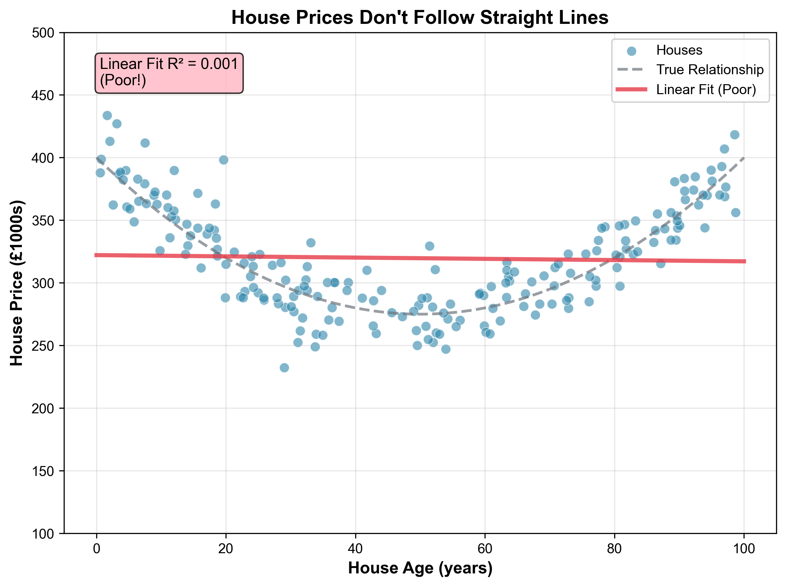
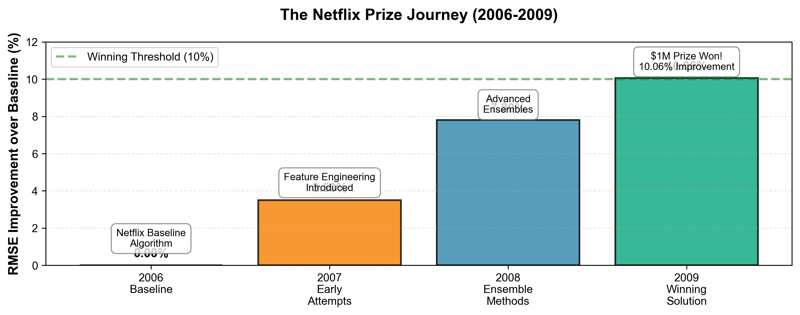
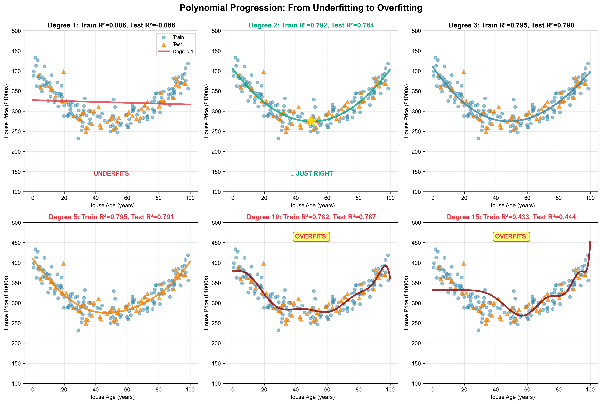
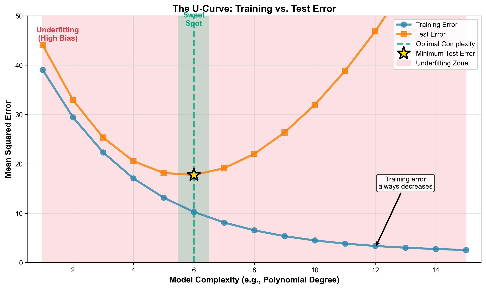
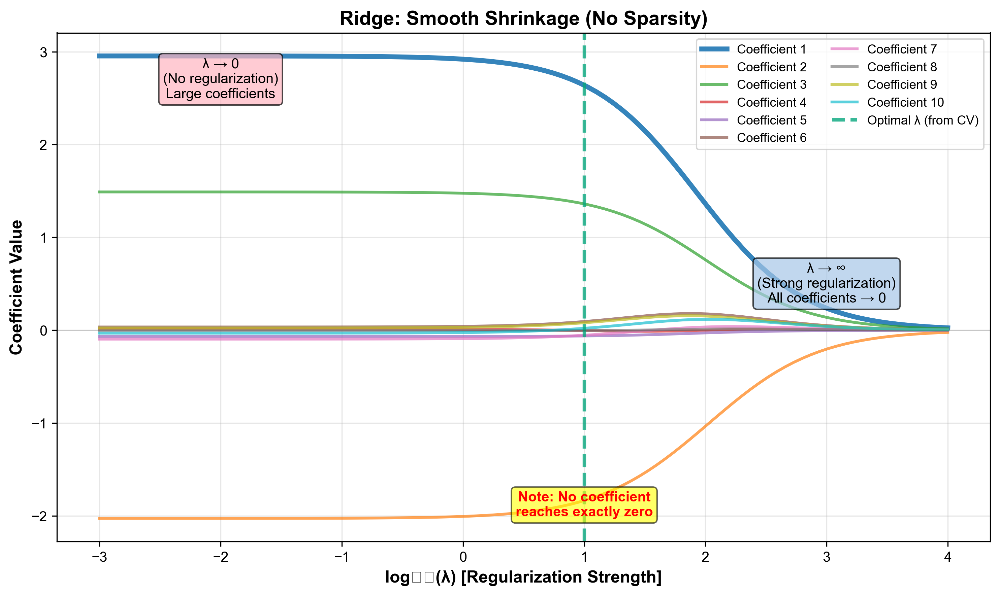
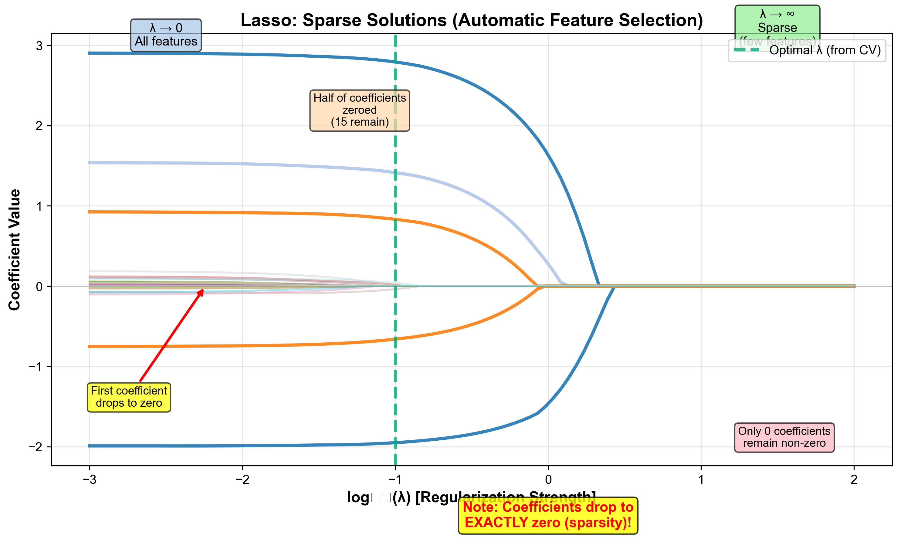
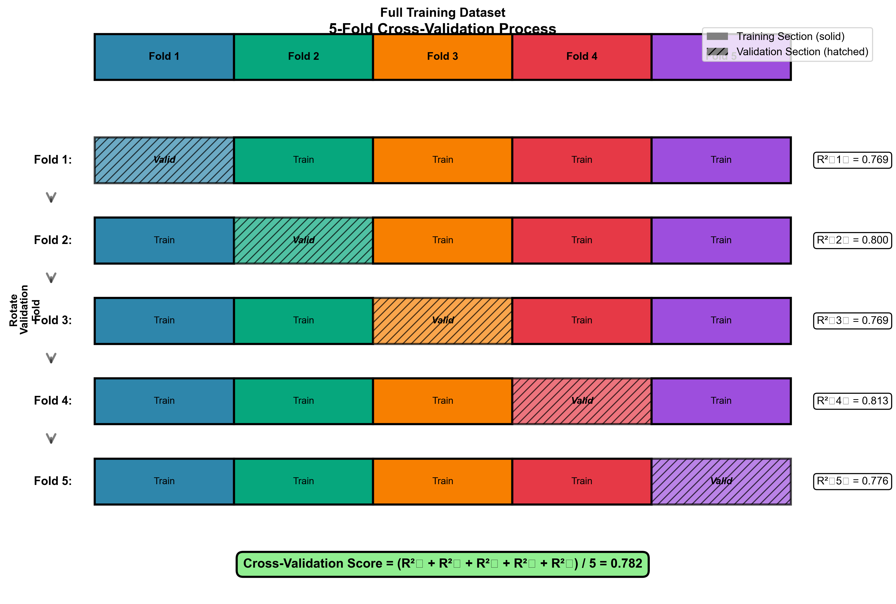
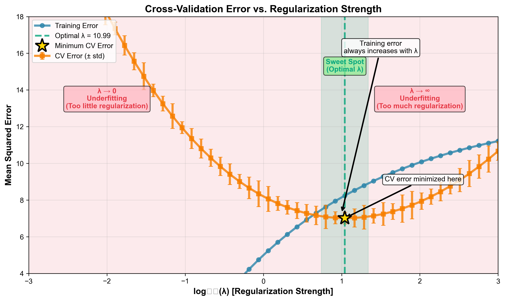

# Lesson 3: Feature Engineering & Regularization

## Adding Flexibility Without Overfitting

<div class="pt-12">
  <span class="text-xl">
    MPS311/439 Machine Learning<br>
    Dr. Wei Xing<br>
    2026–27
  </span>
</div>

---
layout: 'default'
class: ''
---

# Last Week: The World in a Straight Line

We learned about **Linear Regression**. It's powerful, but it has one major limitation:

It assumes the relationship between features ($X$) and the target ($y$) is **linear**.

<!-- <br> -->


<div class="abs-br m-6 flex gap-2">
  But what happens when reality isn't a straight line?
</div>

---
layout: 'default'
class: ''
---

# The $1 Million Question

Between 2006-2009, Netflix offered a **$1 million prize** to any team that could improve their movie recommendation algorithm by 10%.



<br>
<div class="text-2xl p-8 bg-gray-500 bg-opacity-10 rounded">
<p>The winning solution wasn't a revolutionary new algorithm.</p>
<p>It was about two key ideas:</p>
</div>
<br>

1.  <span class="text-teal-500 font-bold">Sophisticated Feature Engineering</span> (Creating power)
2.  <span class="text-amber-500 font-bold">Regularization</span> (Controlling that power)

Today, you will learn both.


---
layout: 'two-cols'
class: ''
---

# Act 1: The Quest for Power

Let's look at house prices. A straight line misses the U-shaped pattern completely.
- **New houses:** Expensive
- **Middle-aged houses:** Cheaper
- **Old (vintage) houses:** Expensive again!

This relationship is **non-linear**. Our current tool can't handle this.

::right::

<p class="text-center text-sm">A straight line fit (Degree 1)</p>
<p class="text-center text-sm"><span style="color: #E63946;">High Bias</span> - The model is too simple.</p>

---
layout: 'default'
class: ''
---

# The "Aha!" Moment: Polynomial Features

Here's the brilliant insight:

> We can't make our <span class="text-teal-500">model</span> non-linear, but we can make our <span class="text-amber-500">features</span> non-linear!

We invent new features by taking our original feature to a power.

**Original Feature:**
`age`

**New Polynomial Features (Degree 2):**
`age`, `age`<sup>2</sup>

Our model is still linear, but it's linear with respect to the **new features**:

$$ \hat{y} = w_2 \cdot \text{age}^2 + w_1 \cdot \text{age} + w_0 $$

This is just a quadratic equation! It can fit curves.

---
layout: 'default'
class: ''
---

# Polynomial Features in Python

`scikit-learn` makes this easy with `PolynomialFeatures`.

```python
from sklearn.preprocessing import PolynomialFeatures
import numpy as np

# Let's say we have one feature: age
# 3 data points: age 2, 3, and 4
X = np.array([[2], [3], [4]])

# Create a transformer for degree 2 polynomials
poly = PolynomialFeatures(degree=2, include_bias=False)

# Transform our data
X_poly = poly.fit_transform(X)

# Original X:     Transformed X_poly:
# [[2],           # [[ 2.,  4.],   (x, x^2)
#  [3],           #  [ 3.,  9.],
#  [4]]           #  [ 4., 16.]]
print(X_poly)
```

We've turned our single feature `x` into two features: `x` and `x^2`.

---
layout: 'default'
class: ''
---

# Visualizing Our New Superpower

Let's see what happens as we increase the polynomial degree on our housing data.



<!-- <br> -->
As complexity increases, our model fits the **training data** better and better. Degree 10 looks almost perfect!

**Question:** Is the Degree 10 model the best one?

---
layout: 'default'
class: ''
---

# Act 2: The Crisis of Power

What happens when we evaluate on the **test set** (unseen data)?

<div class="grid grid-cols-2 gap-4">
<div>
<p class="text-center text-lg">Degree 2 (The "Just Right" model)</p>
<p class="text-center">Training R² ≈ 0.78<br><span class="text-green-400">Test R² ≈ 0.75</span></p>
</div>
<div>
<p class="text-center text-lg">Degree 10 (The "Super Powerful" model)</p>
<p class="text-center">Training R² ≈ 0.99<br><span class="text-red-400">Test R² ≈ 0.42</span></p>
</div>
</div>

The powerful model completely failed on new data. This is **Overfitting**.

---
layout: 'default'
class: ''
---

# Overfitting: Memorizing the Noise

**Overfitting** occurs when a model learns the random <span class="text-red-400">noise</span> in the training data instead of the underlying <span class="text-green-400">signal</span>.

<br>

<p class="text-2xl text-center">It's like a student who memorizes the answers to practice questions but doesn't understand the concepts. They fail the real exam.</p>

<br>

The model has become too complex and flexible. It has **high variance**. The wild wiggles are the model trying to fit every single noisy point.

---
layout: 'default'
class: ''
---

# The Bias-Variance Tradeoff

This reveals a fundamental tension in machine learning:



  - **Low Complexity (High Bias):** Model is too simple. It **underfits**.
  - **High Complexity (High Variance):** Model is too powerful. It **overfits**.
  - **The Sweet Spot:** Minimum test error. This is our goal!

**Our problem:** How do we find this sweet spot?

---
layout: 'default'
class: ''
---

# What's Going on Inside? Looking at the Weights

Let's peek inside our models and see what the coefficients ($w$) look like:

<div class="grid grid-cols-2 gap-8 mt-8">
<div>
<p class="text-center text-lg font-bold text-green-400">Degree 2 (Good Fit)</p>
<div class="bg-gray-800 p-4 rounded">

```python
w_0 = 180.5
w_1 = -15.3
w_2 = 2.1
```

</div>
<p class="text-center mt-4 text-sm">Small, reasonable values ✓</p>
</div>

<div>
<p class="text-center text-lg font-bold text-red-400">Degree 10 (Overfitting)</p>
<div class="bg-gray-800 p-4 rounded">

```python
w_0 = 180.5
w_1 = 1243.7
w_2 = -8921.3
w_3 = 15234.8
w_4 = -9876.2
...
w_10 = 234567.9
```

</div>
<p class="text-center mt-4 text-sm">Huge, wild values! ✗</p>
</div>
</div>

<div class="text-center mt-8 text-xl">
💡 The overfitted model needs <span class="text-red-400">massive coefficients</span> to create those crazy wiggles!
</div>

<div class="text-center mt-4">
<p class="text-lg">Could we just... tell the model to keep the weights small?</p>
</div>


# Act 3: The Solution - Regularization

If our model is too powerful, how can we control it?

> Instead of reducing the number of features, we **penalize the model** for using them too much.

We add a **penalty term** to our loss function that discourages large coefficient values ($w_j$).

$$ J(\mathbf{w}) = \underbrace{\text{MSE}}_{\text{Fit the data}} + \underbrace{\lambda \cdot \text{Penalty}(\mathbf{w})}_{\text{Keep it simple}} $$

The hyperparameter $\lambda$ (lambda) controls the strength of the penalty.

  - $\lambda = 0$: No penalty (Overfitting).
  - $\lambda$ is large: Heavy penalty (Underfitting).

---
layout: 'two-cols'
class: ''
---

# Method 1: Ridge Regression (L2)

Ridge Regression penalizes the **sum of squared coefficients**.

**Penalty:** $\lambda \sum_{j=1}^{p} w_j^2$

  - **Effect:** It shrinks large coefficients towards zero.
  - It pushes coefficients *close* to zero, but **never exactly to zero**. All features remain in the model.

::right::

<p class="text-center">How coefficients shrink as $\lambda$ increases</p>

<p class="text-center text-sm">Notice the smooth, gradual decay.</p>

---
layout: 'default'
class: ''
---

# Ridge Regression in Python

Using Ridge is straightforward. **Crucially, you must scale your data first!**

Regularization penalizes features based on their coefficient size, so features on a large scale will be unfairly penalized more than features on a small scale.

```python
from sklearn.linear_model import Ridge
from sklearn.preprocessing import StandardScaler

# 1. Scale the data to have mean 0 and variance 1
scaler = StandardScaler()
X_train_scaled = scaler.fit_transform(X_train)

# 2. Create and train the model
# In scikit-learn, lambda is called 'alpha'
ridge_model = Ridge(alpha=10.0) 
ridge_model.fit(X_train_scaled, y_train)
```

**Rule of thumb:** Always use `StandardScaler` before any regularized model.

---
layout: 'two-cols'
class: ''
---

# Method 2: Lasso Regression (L1)

Lasso penalizes the **sum of absolute value of coefficients**.

**Penalty:** $\lambda \sum_{j=1}^{p} |w_j|$

  - This small change has a huge effect!
  - **Effect:** Lasso can shrink coefficients **exactly to zero**.
  - This performs automatic **feature selection**, creating **sparse** models.

::right::

<p class="text-center">How coefficients shrink as $\lambda$ increases</p>

<p class="text-center text-sm">Notice how many lines hit zero and stay there.</p>

---
layout: 'default'
class: ''
---

# Lasso Regression in Python

The code for Lasso is very similar to Ridge. Don't forget to scale your data!

```python
from sklearn.linear_model import Lasso
from sklearn.preprocessing import StandardScaler

# 1. Scale the data (assuming it's not already done)
scaler = StandardScaler()
X_train_scaled = scaler.fit_transform(X_train)

# 2. Create and train the model
lasso_model = Lasso(alpha=1.0) # alpha is lambda
lasso_model.fit(X_train_scaled, y_train)

# We can inspect the coefficients to see which ones are now zero!
print(lasso_model.coef_)
# [15.3, -11.2, 0., 0., 9.1, 0., ...]
```

Lasso is great when you suspect many of your features are irrelevant.

---
layout: 'default'
class: ''
---

# Choosing the Right $\lambda$: Cross-Validation

How do we find the best value for our hyperparameter $\lambda$?

  - We can't use the training set (it would just pick $\lambda=0$).
  - We must **never** use the test set! That's cheating and gives a false sense of performance.

**Solution: K-Fold Cross-Validation**
We split our *training set* into K "folds". We train on K-1 folds and validate on the remaining one, rotating until each fold has been the validation set once.



This gives us a reliable estimate of test performance for a given $\lambda$, using **only the training data**.

---
layout: 'default'
class: ''
---

# Cross-Validation in Python

We don't have to write the loops for cross-validation ourselves. `scikit-learn` provides a helpful function.

```python
from sklearn.model_selection import cross_val_score
from sklearn.linear_model import Ridge
import numpy as np

# Assume X_train_scaled and y_train are ready

# Create a Ridge model with a specific alpha (lambda)
model = Ridge(alpha=10.0)

# Run 5-fold cross-validation
# 'scoring="r2"' tells it what metric to calculate
# cv=5 means 5 folds
scores = cross_val_score(model, X_train_scaled, y_train, scoring="r2", cv=5)

# scores will be an array of 5 R^2 values, one from each fold
# [0.78, 0.75, 0.81, 0.79, 0.76]
print(f"R2 scores for each fold: {np.round(scores, 2)}")
print(f"Average CV R2: {scores.mean():.2f}")
```

To find the best `alpha`, we would run this code in a loop for different alpha values and pick the one with the highest average score.

---
layout: 'default'
class: ''
---

# Finding the Optimal $\lambda$

We run cross-validation for a range of $\lambda$ values and pick the one with the best average score.

This again creates a U-shaped curve, but this time it's the **Cross-Validation Error**.



The plot tells us that a $\lambda$ around 10 is the "sweet spot" for this model—it balances the bias-variance tradeoff perfectly.

---
layout: 'default'
class: ''
---

# Summary: The Story Recapped

**Act 1: Discovery (Power)**

  - We used **Polynomial Features** to give linear models the power to fit curves.

**Act 2: Crisis (Overfitting)**

  - Too much power led to the model memorizing training noise, causing it to fail on new data.

**Act 3: Resolution (Control)**

  - **Regularization** (Ridge & Lasso) adds a penalty to prevent complexity.
  - We use **Cross-Validation** to tune the penalty strength ($\lambda$) without touching the test set.

> Feature engineering gives you the **power**; regularization gives you the **control**.

---
layout: 'default'
class: ''
---

# Practical Wisdom: Your Checklist

When you start a new project, remember these steps:

  - ✅ **Start simple:** Always begin with a basic Linear Regression model as a baseline.
  - ✅ **Add complexity carefully:** Try polynomial features, but monitor the gap between training and test performance.
  - ✅ **Always scale your data:** Use `StandardScaler` before applying Ridge or Lasso. This is non-negotiable!
  - ✅ **Default to Ridge:** Ridge is often more stable and a great starting point for regularization.
  - ✅ **Use Lasso for simplicity:** If you need a model that is easier to explain or suspect many features are useless, try Lasso.
  - ✅ **Use Cross-Validation religiously:** Never, ever tune your model's hyperparameters ($\lambda$) using the test set.

---
layout: 'default'
class: ''
---

# Looking Ahead: Lesson 4 - Classification

Next week, we change our goal from predicting numbers to predicting categories.

**This Week (Regression):**

  - **Goal:** Predict a continuous value (e.g., house price = £235,000)
  - **Model:** Linear Regression
  - **Loss:** Mean Squared Error

**Next Week (Classification):**

  - **Goal:** Predict a category (e.g., email is "Spam" or "Not Spam")
  - **Model:** Logistic Regression
  - **Loss:** Cross-Entropy

**The good news:** All the hard work you did today on **feature engineering**, **regularization**, and **cross-validation** applies directly to classification models too!

<!-- COURSE_FEEDBACK_QR:START -->
---
layout: center
class: text-center
---

# 30-second feedback

<p class="text-3xl mb-4">What would help you learn better next time?</p>

<p class="text-2xl mb-4">Scan to share anonymous feedback on today's lecture.</p>


<p class="text-sm mt-4 opacity-70">MPS311/439 · 2026-27 · Lesson 03 lecture</p>
<!-- COURSE_FEEDBACK_QR:END -->
