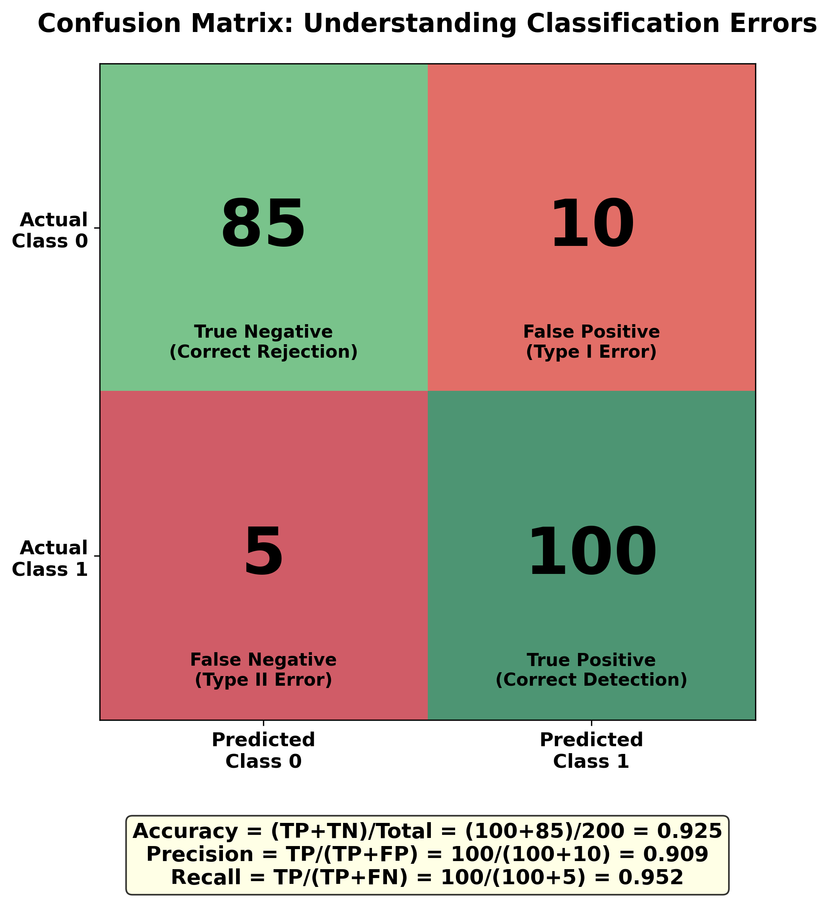
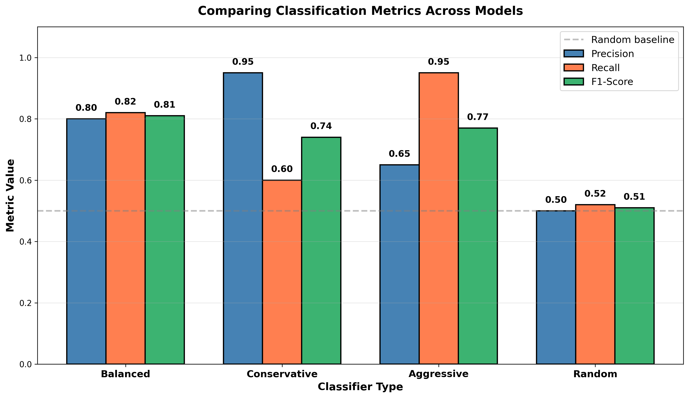
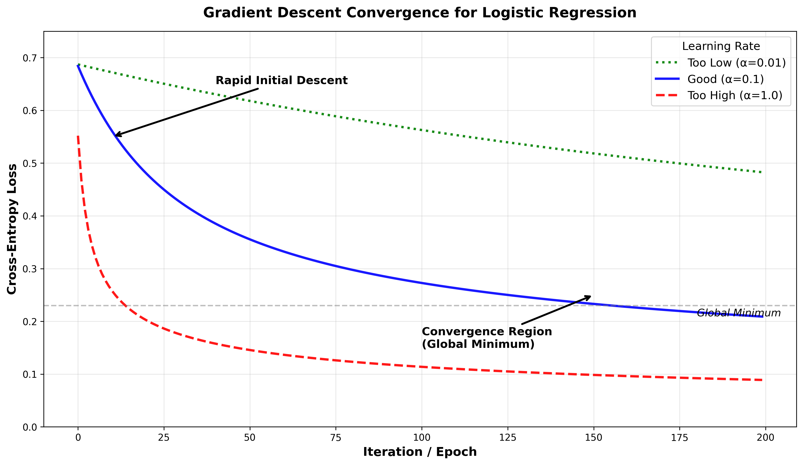

# Lesson 4: Logistic Regression
## Linear Classification and Model Evaluation

**MPS311/439 Machine Learning**  
**Dr. Wei Xing**  
**University of Sheffield**  
**Academic year 2026–27**

---

## Welcome Back!

Last week, we explored how to extend linear regression through **feature engineering** and **regularization**. We learned how to create polynomial features to capture non-linear patterns and how Ridge and Lasso regression can prevent overfitting by controlling model complexity. These techniques gave us powerful tools for predicting continuous outcomes like house prices or temperatures.

But what happens when we want to predict **categories** instead of numbers? What if we want to know whether an email is spam or not? Whether a patient has a disease? Whether a student will pass or fail? These are **classification** problems, and they require a different approach.

This week, we'll discover how to adapt our linear models for classification tasks. We'll learn about **logistic regression**, understand why it uses something called the **sigmoid function**, and explore how to properly evaluate classification models. By the end, you'll be able to build models that make yes/no decisions with confidence scores!

---

## 1. The Classification Challenge

### 1.1 What is Classification?

**Classification** is the task of predicting which **discrete category** (or class) an observation belongs to, based on its features. Unlike regression where we predict continuous values, classification predicts discrete labels.

**Real-world examples:**
- **Email filtering**: Is this email spam (1) or not spam (0)?
- **Medical diagnosis**: Does the patient have the disease (1) or not (0)?
- **Credit approval**: Should we approve (1) or reject (0) this loan application?
- **Image recognition**: Is this image a cat (0) or a dog (1)?

In this lecture, we'll focus on **binary classification** where there are exactly two classes, typically labeled as 0 and 1 (or negative and positive).

### 1.2 Why Can't We Just Use Linear Regression?

You might wonder: "Why can't we just use what we learned last week? Can't we treat the classes as numbers (0 and 1) and use linear regression?"

Great question! Let's see what happens when we try. Imagine we're predicting whether students will pass or fail based on hours studied.


**The fundamental problems:**

1. **Impossible predictions**: Linear regression can predict values less than 0 or greater than 1. But probabilities must be between 0 and 1! What does it mean to have a "-0.2 probability" of passing?

2. **Sensitivity to outliers**: Notice the orange star in the figure? That's a student who studied only 1 hour but passed (maybe they're naturally talented, or got lucky). This single outlier drastically affects the regression line, making predictions worse for everyone else.

3. **No probability interpretation**: Even if predictions happen to fall between 0 and 1, linear regression doesn't give us proper probabilities. The output doesn't have the mathematical properties that probabilities require.

4. **Wrong loss function**: We'll see later that squared error (which we used for regression) isn't the right way to measure classification errors.

### 1.3 What We Need Instead

For classification, we need a model that:
- ✅ Always outputs values between 0 and 1 (so we can interpret them as probabilities)
- ✅ Gives us P(y=1|x) - the probability that an observation belongs to class 1, given its features
- ✅ Has a smooth, differentiable function (so we can train it with gradient descent)
- ✅ Uses a loss function designed for classification

**Logistic regression** gives us all of these! Despite its name containing "regression", logistic regression is actually a **classification** algorithm. The name comes from the fact that it uses regression techniques internally, but its output is a classification decision.

---

## 2. From Regression to Classification: The Sigmoid Function

### 2.1 The Core Idea

Here's the key insight: We can still use a **linear combination** of features (just like linear regression), but we'll pass it through a special function that squashes any real number into the range (0, 1).

**The two-step process:**
1. **Linear combination**: Compute $ z = w_0 + w_1x_1 + w_2x_2 + \ldots + w_px_p $ (same as before!)
2. **Squashing**: Apply a function that maps $z \rightarrow$ probability between 0 and 1

This special function is called the **sigmoid function** (also known as the logistic function).

### 2.2 Meet the Sigmoid Function

The sigmoid function is defined as:

$$ \sigma(z) = \frac{1}{1 + e^{-z}} $$

Let's visualize what this function does:


**Why sigmoid is perfect for our needs:**

- **Maps everything to (0,1)**: No matter what $z$ is (from $-\infty$ to $+\infty$), the output is always between 0 and 1
- **Smooth and differentiable**: We can use gradient descent to train the model
- **Interpretable**: The output can be directly interpreted as a probability
- **Natural threshold**: When $z=0$, $\sigma(z)=0.5$, giving us a natural decision boundary

**Key properties to remember:**
- $\sigma(0) = 0.5$ (the middle point)
- As $z \rightarrow +\infty$, $\sigma(z) \rightarrow 1$ (high confidence in class 1)
- As $z \rightarrow -\infty$, $\sigma(z) \rightarrow 0$ (high confidence in class 0)
- $\sigma(-z) = 1 - \sigma(z)$ (symmetry)

### 2.3 The Logistic Regression Model

Now we can define our complete model:

**Step 1**: Compute the linear combination

$$z = w_0 + w_1x_1 + w_2x_2 + \ldots + w_px_p$$

Or in vector notation: $z = \mathbf{w}^T \mathbf{x}$

**Step 2**: Apply sigmoid to get probability

$$P(y=1|\mathbf{x}) = \sigma(z) = \frac{1}{1 + e^{-z}}$$

**Interpretation of weights:**
- **Positive weight** ($w_j > 0$): Increasing $x_j$ increases the probability of class 1
- **Negative weight** ($w_j < 0$): Increasing $x_j$ decreases the probability of class 1
- **Larger magnitude** $|w_j|$: Stronger influence on the prediction

**Example:** Imagine predicting disease risk:
- If $w_{\text{age}} = 0.05$: Each additional year of age increases the log-odds of disease
- If $w_{\text{exercise}} = -0.3$: More exercise hours decrease the probability of disease
- If $w_{\text{smoking}} = 0.8$: Smoking has a strong positive effect on disease risk

### 2.4 Making Decisions: The Decision Boundary

Once we have $P(y=1|\mathbf{x})$, how do we actually make a prediction? We need a **decision rule**:

**Decision Rule:**
- If $P(y=1|\mathbf{x}) > 0.5$ → Predict class 1
- If $P(y=1|\mathbf{x}) \leq 0.5$ → Predict class 0

Since $\sigma(0) = 0.5$, this is equivalent to:
- If $z > 0$ (i.e., $\mathbf{w}^T \mathbf{x} > 0$) → Predict class 1
- If $z \leq 0$ (i.e., $\mathbf{w}^T \mathbf{x} \leq 0$) → Predict class 0

The **decision boundary** is the line (or hyperplane) where $\mathbf{w}^T \mathbf{x} = 0$. This is still a **linear** boundary, just like in linear regression!

Let's see this in action with two features:


In this figure:
- The **black line** is the decision boundary where $P(y=1) = 0.5$
- The **colored background** shows probability contours: red regions have high $P(y=1)$, blue regions have low $P(y=1)$
- Points far from the boundary have predictions closer to 0 or 1 (high confidence)
- Points near the boundary have predictions closer to 0.5 (low confidence)

**Key insight**: Even though we're using sigmoid to get probabilities, the decision boundary itself is still **linear**. This means logistic regression works best when the two classes can be separated (at least approximately) by a straight line or hyperplane.

---

## 3. Training Logistic Regression

Now we know what logistic regression predicts, but how do we find the best weights $\mathbf{w}$? We need to define what "best" means by choosing an appropriate **loss function**.

### 3.1 Why Not Squared Error?

In linear regression, we used the squared error: $L = (y - \hat{y})^2$

For classification, this seems natural at first:
- True label $y$ is either 0 or 1
- Prediction $\hat{y} = \sigma(\mathbf{w}^T \mathbf{x})$ is between 0 and 1
- We could minimize the squared difference

**But there's a critical problem**: When we use squared error with the sigmoid function, the resulting optimization landscape is **non-convex**. This means:
- Multiple local minima exist (not just one global minimum)
- Gradient descent might get stuck in a local minimum
- Different initializations give different results
- Training becomes unreliable and unpredictable

We need a loss function that creates a **convex** optimization problem, guaranteeing that gradient descent will find the best solution.

### 3.2 Cross-Entropy Loss: The Right Loss for Classification

The cross-entropy loss (also called log loss) is specifically designed for probability predictions:

**For a single sample:**

$$L(y, \hat{y}) = -\left[y \log(\hat{y}) + (1-y) \log(1-\hat{y})\right]$$

Where:
- $y$ is the true label (0 or 1)
- $\hat{y}$ is the predicted probability $P(y=1|\mathbf{x})$

**Let's understand this intuitively:**

**Case 1: When true label $y = 1$**
- Loss becomes: $L = -\log(\hat{y})$
- If we predict $\hat{y} = 0.9$ (confident and correct): $L = -\log(0.9) \approx 0.11$ (small loss ✓)
- If we predict $\hat{y} = 0.5$ (uncertain): $L = -\log(0.5) \approx 0.69$ (medium loss)
- If we predict $\hat{y} = 0.1$ (confident but wrong): $L = -\log(0.1) \approx 2.30$ (large loss ✗)
- If we predict $\hat{y} \rightarrow 0$ (very wrong): $L \rightarrow \infty$ (infinite penalty!)

**Case 2: When true label $y = 0$**
- Loss becomes: $L = -\log(1-\hat{y})$
- If we predict $\hat{y} = 0.1$ (confident and correct): $L = -\log(0.9) \approx 0.11$ (small loss ✓)
- If we predict $\hat{y} = 0.5$ (uncertain): $L = -\log(0.5) \approx 0.69$ (medium loss)
- If we predict $\hat{y} = 0.9$ (confident but wrong): $L = -\log(0.1) \approx 2.30$ (large loss ✗)
- If we predict $\hat{y} \rightarrow 1$ (very wrong): $L \rightarrow \infty$ (infinite penalty!)

**Beautiful properties:**
- Heavily penalizes confident wrong predictions
- Encourages the model to output calibrated probabilities
- Creates a convex optimization landscape (guaranteed global minimum!)
- Has a clean gradient that works well with gradient descent

### 3.3 Using Sklearn's LogisticRegression

Fortunately, we don't need to implement all the optimization mathematics ourselves. Sklearn provides a clean interface:

```python
from sklearn.linear_model import LogisticRegression
from sklearn.model_selection import train_test_split

# Split data
X_train, X_test, y_train, y_test = train_test_split(X, y, test_size=0.3, random_state=42)

# Create and train model
model = LogisticRegression()
model.fit(X_train, y_train)

# Get class predictions (0 or 1)
y_pred = model.predict(X_test)

# Get probability predictions
y_prob = model.predict_proba(X_test)
# Returns array like: [[P(class 0), P(class 1)] for each sample]

# Access learned parameters
print("Intercept:", model.intercept_)
print("Coefficients:", model.coef_)
```

**Key methods:**
- `.fit(X, y)`: Train the model on training data
- `.predict(X)`: Get hard predictions (0 or 1) using the 0.5 threshold
- `.predict_proba(X)`: Get probability estimates for each class
- `.coef_` and `.intercept_`: Access the learned weights

### 3.4 A Simple Example

Let's see logistic regression in action with minimal code:

```python
import numpy as np
from sklearn.linear_model import LogisticRegression
from sklearn.datasets import make_classification

# Generate simple binary classification data
X, y = make_classification(n_samples=100, n_features=2, n_redundant=0, 
                           n_clusters_per_class=1, random_state=42)

# Train logistic regression
model = LogisticRegression()
model.fit(X, y)

# Make predictions
y_pred = model.predict(X)
y_prob = model.predict_proba(X)[:, 1]  # Get P(y=1) for each sample

# Show a few examples
for i in range(5):
    print(f"Sample {i}: True={y[i]}, Predicted={y_pred[i]}, P(y=1)={y_prob[i]:.3f}")
```

**Output might look like:**
```
Sample 0: True=1, Predicted=1, P(y=1)=0.912
Sample 1: True=0, Predicted=0, P(y=1)=0.143
Sample 2: True=1, Predicted=1, P(y=1)=0.876
Sample 3: True=0, Predicted=0, P(y=1)=0.089
Sample 4: True=1, Predicted=0, P(y=1)=0.487
```

Notice sample 4: The model predicted class 0, but the true label was 1, and the probability was 0.487 (very close to the decision threshold). This is an uncertain prediction where the model could easily be wrong.

---

## 4. Evaluating Classification Models

Training a model is only half the battle. How do we know if it's actually good? For regression, we used metrics like MSE or R². For classification, we need different tools.

### 4.1 The Problem with Accuracy

The most obvious metric is **accuracy**: what percentage of predictions are correct?

$$\text{Accuracy} = \frac{\text{Number of Correct Predictions}}{\text{Total Predictions}}$$

This seems reasonable, but it can be very misleading!

**Example - Email Spam Detection:**
Imagine 95% of emails are legitimate (not spam), and only 5% are spam.

Consider a "naive model" that simply predicts "not spam" for every single email:
- Accuracy = 95% (it's correct for all legitimate emails!)
- But it catches **zero spam emails** - completely useless!

This is the problem of **imbalanced classes**: when one class is much more common than the other, accuracy doesn't tell the full story.

**When accuracy IS useful:**
- Classes are balanced (roughly 50/50 split)
- False positives and false negatives are equally costly
- You need a single simple metric for quick comparison

**When accuracy is MISLEADING:**
- Classes are imbalanced
- Different types of errors have different costs
- You need to understand model behavior in detail

### 4.2 The Confusion Matrix: Foundation of Classification Metrics

To truly understand how our classifier performs, we need to break down its predictions into four categories:



**The four outcomes:**

1. **True Positive (TP)**: Model predicted 1, and the true label was 1 ✓
   - Correctly identified positive cases
   - Example: Correctly diagnosed a disease

2. **True Negative (TN)**: Model predicted 0, and the true label was 0 ✓
   - Correctly identified negative cases
   - Example: Correctly identified a healthy patient

3. **False Positive (FP)**: Model predicted 1, but true label was 0 ✗
   - Incorrectly identified as positive (Type I Error)
   - Example: False alarm - diagnosed disease when patient is healthy

4. **False Negative (FN)**: Model predicted 0, but true label was 1 ✗
   - Missed a positive case (Type II Error)
   - Example: Failed to diagnose disease in sick patient

**Different scenarios care about different errors:**
- **Medical screening**: False negatives are critical (missing a disease could be fatal)
- **Spam filter**: False positives are critical (marking important emails as spam is frustrating)
- **Fraud detection**: Need to balance both (too many false alarms annoy customers, but missing fraud costs money)

**Creating a confusion matrix in Python:**
```python
from sklearn.metrics import confusion_matrix

y_true = [1, 0, 1, 1, 0, 1, 0, 0]
y_pred = [1, 0, 1, 0, 0, 1, 0, 1]

cm = confusion_matrix(y_true, y_pred)
print(cm)
# Output:
# [[3 1]   <- Row 0: True negatives and false positives
#  [1 3]]  <- Row 1: False negatives and true positives
```

### 4.3 Precision, Recall, and F1-Score

From the confusion matrix, we can compute metrics that focus on different aspects of performance:

#### Precision: "When I predict positive, how often am I right?"

$$\text{Precision} = \frac{TP}{TP + FP}$$

**High precision means**: Few false alarms
- When the model says "yes", you can trust it
- Important when false positives are costly

**Example**: In email spam filtering:
- High precision means: Emails marked as spam are almost always actually spam
- Low precision means: Many legitimate emails are incorrectly marked as spam (frustrating!)

#### Recall (Sensitivity): "Of all actual positives, how many did I catch?"

$$\text{Recall} = \frac{TP}{TP + FN}$$

**High recall means**: Few missed detections
- The model catches most positive cases
- Important when false negatives are costly

**Example**: In disease screening:
- High recall means: Most patients with the disease are correctly identified
- Low recall means: Many sick patients are incorrectly told they're healthy (dangerous!)

#### F1-Score: The Harmonic Mean

$$F1 = 2 \times \frac{\text{Precision} \times \text{Recall}}{\text{Precision} + \text{Recall}}$$

**The F1-score balances precision and recall**:
- Use when both false positives and false negatives matter
- Reaches maximum (1.0) only when both precision and recall are perfect
- More sensitive to low values (can't compensate poor recall with high precision)

Let's visualize how different classifiers perform on these metrics:



**Understanding the different classifier types:**
- **Balanced**: Good performance on both metrics - generally the best choice
- **Conservative**: High precision, low recall - rarely makes false positives, but misses many positives
- **Aggressive**: Low precision, high recall - catches most positives, but makes many false alarms
- **Random**: Poor performance overall - not learning meaningful patterns

**Computing metrics in Python:**
```python
from sklearn.metrics import precision_score, recall_score, f1_score, classification_report

y_true = [1, 0, 1, 1, 0, 1, 0, 0]
y_pred = [1, 0, 1, 0, 0, 1, 0, 1]

precision = precision_score(y_true, y_pred)
recall = recall_score(y_true, y_pred)
f1 = f1_score(y_true, y_pred)

print(f"Precision: {precision:.3f}")
print(f"Recall: {recall:.3f}")
print(f"F1-Score: {f1:.3f}")

# Or get everything at once:
print(classification_report(y_true, y_pred))
```

### 4.4 The Precision-Recall Tradeoff

Here's a fundamental insight: **You usually can't maximize both precision and recall simultaneously**. There's a tradeoff.

Remember that by default, logistic regression predicts class 1 when P(y=1) > 0.5. But we can change this threshold!

**Increasing the threshold (e.g., to 0.7):**
- Predicts class 1 only when very confident
- **Precision increases**: Fewer false positives (more conservative)
- **Recall decreases**: More false negatives (misses more positives)

**Decreasing the threshold (e.g., to 0.3):**
- Predicts class 1 more liberally
- **Recall increases**: Fewer false negatives (catches more positives)
- **Precision decreases**: More false positives (more false alarms)

**Practical example - Medical diagnosis:**
- **Conservative threshold (0.8)**: Only diagnose disease when very confident
  - High precision: Diagnosed patients almost certainly have the disease
  - Low recall: Many sick patients are told they're healthy
  - Appropriate when treatment has serious side effects

- **Aggressive threshold (0.2)**: Diagnose disease with low confidence
  - High recall: Almost all sick patients are identified
  - Low precision: Many healthy people are incorrectly diagnosed
  - Appropriate for initial screening (better safe than sorry)

**Adjusting the threshold in Python:**
```python
# Get probability predictions
y_prob = model.predict_proba(X_test)[:, 1]

# Use custom threshold
threshold = 0.7
y_pred_custom = (y_prob > threshold).astype(int)

# Compare with default threshold (0.5)
y_pred_default = model.predict(X_test)
```

### 4.5 ROC Curve and AUC: The Complete Picture

Instead of choosing a single threshold, we can evaluate model performance across **all possible thresholds** using the **ROC curve** (Receiver Operating Characteristic).

The ROC curve plots:
- **X-axis**: False Positive Rate (FPR) = $\frac{FP}{FP + TN}$
- **Y-axis**: True Positive Rate (TPR) = Recall = $\frac{TP}{TP + FN}$

Each point on the curve represents a different classification threshold.


**Interpreting the ROC curve:**

- **Diagonal line (y=x)**: Random guessing baseline
  - A random classifier achieves 50% TPR with 50% FPR
  - Any point on this line means the model is no better than chance

- **Curve above diagonal**: Model is useful
  - Can achieve high TPR with low FPR
  - The further above the diagonal, the better

- **Top-left corner**: Perfect classifier
  - TPR = 1.0 (catches all positives)
  - FPR = 0.0 (no false alarms)

- **Area Under Curve (AUC)**: Summary metric
  - AUC = 0.5: No better than random guessing
  - AUC = 0.7-0.8: Acceptable performance
  - AUC = 0.8-0.9: Good performance
  - AUC = 0.9-1.0: Excellent performance
  - AUC = 1.0: Perfect classifier

**What AUC really means:**
AUC represents the probability that the model ranks a random positive sample higher than a random negative sample. In other words, if you pick a positive example and a negative example at random, AUC is the probability that your model assigns a higher score to the positive one.

**Creating ROC curves in Python:**
```python
from sklearn.metrics import roc_curve, roc_auc_score
import matplotlib.pyplot as plt

# Get probability predictions
y_prob = model.predict_proba(X_test)[:, 1]

# Compute ROC curve
fpr, tpr, thresholds = roc_curve(y_test, y_prob)
auc_score = roc_auc_score(y_test, y_prob)

# Plot
plt.plot(fpr, tpr, label=f'ROC Curve (AUC = {auc_score:.2f})')
plt.plot([0, 1], [0, 1], 'k--', label='Random Guess')
plt.xlabel('False Positive Rate')
plt.ylabel('True Positive Rate')
plt.title('ROC Curve')
plt.legend()
plt.show()

print(f"AUC Score: {auc_score:.3f}")
```

### 4.6 Choosing the Right Metric for Your Problem

With so many metrics, how do you choose? Here's a decision guide:

| Scenario | Recommended Metric | Reasoning |
|----------|-------------------|-----------|
| **Balanced classes + equal error costs** | Accuracy | Simple and interpretable |
| **Imbalanced classes** | F1-Score, Precision, or Recall | Accuracy is misleading |
| **False positives are very costly** | Precision | Minimize false alarms |
| **False negatives are very costly** | Recall | Don't miss positive cases |
| **Need to compare models overall** | AUC | Threshold-independent |
| **Need to choose operating point** | ROC Curve | Shows all precision-recall tradeoffs |
| **Real costs for FP and FN** | Cost-sensitive evaluation | Incorporate business costs |

**Examples:**
- **Spam detection**: Optimize precision (false positives frustrate users)
- **Cancer screening**: Optimize recall (false negatives could be fatal)
- **Fraud detection**: Balance with F1-score (both errors are costly)
- **Credit approval**: Use AUC for model comparison, then choose threshold based on business needs

---

## 5. Practical Implementation: A Complete Example

Let's bring everything together with a complete worked example. We'll use a real dataset to predict heart disease risk.

### 5.1 Loading and Exploring Data

```python
import numpy as np
import pandas as pd
from sklearn.datasets import load_breast_cancer
from sklearn.model_selection import train_test_split
from sklearn.linear_model import LogisticRegression
from sklearn.metrics import confusion_matrix, classification_report, roc_auc_score

# Load breast cancer dataset (binary classification)
data = load_breast_cancer()
X = data.data
y = data.target  # 0 = malignant, 1 = benign

print(f"Dataset shape: {X.shape}")
print(f"Features: {data.feature_names[:5]}...")  # Show first 5 features
print(f"Class distribution: {np.bincount(y)}")  # Count of each class

# Split into train and test sets
X_train, X_test, y_train, y_test = train_test_split(
    X, y, test_size=0.3, random_state=42, stratify=y
)
```

**Output:**
```
Dataset shape: (569, 30)
Features: ['mean radius' 'mean texture' 'mean perimeter' 'mean area' 'mean smoothness']...
Class distribution: [212 357]
```

### 5.2 Training the Model

```python
# Create and train logistic regression model
model = LogisticRegression(max_iter=10000, random_state=42)
model.fit(X_train, y_train)

# Make predictions
y_pred = model.predict(X_test)
y_prob = model.predict_proba(X_test)[:, 1]

print("Training complete!")
print(f"Training accuracy: {model.score(X_train, y_train):.3f}")
print(f"Testing accuracy: {model.score(X_test, y_test):.3f}")
```

### 5.3 Evaluating Performance

```python
# Confusion matrix
cm = confusion_matrix(y_test, y_pred)
print("\nConfusion Matrix:")
print(cm)

# Detailed classification report
print("\nClassification Report:")
print(classification_report(y_test, y_pred, target_names=['Malignant', 'Benign']))

# AUC score
auc = roc_auc_score(y_test, y_prob)
print(f"\nAUC Score: {auc:.3f}")
```

**Output:**
```
Confusion Matrix:
[[ 59   4]
 [  3 105]]

Classification Report:
              precision    recall  f1-score   support
   Malignant       0.95      0.94      0.94        63
      Benign       0.96      0.97      0.97       108
    accuracy                           0.96       171

AUC Score: 0.991
```

**Interpretation:**
- **High accuracy (96%)**: Model performs well overall
- **High precision for both classes**: Predictions are reliable
- **High recall for both classes**: Few missed cases
- **Excellent AUC (0.991)**: Model ranks samples very well

### 5.4 Interpreting Model Coefficients

```python
# Get feature names and coefficients
feature_names = data.feature_names
coefficients = model.coef_[0]

# Create dataframe for better visualization
coef_df = pd.DataFrame({
    'Feature': feature_names,
    'Coefficient': coefficients
}).sort_values('Coefficient', key=abs, ascending=False)

print("\nTop 5 Most Important Features:")
print(coef_df.head())
```

**Example output:**
```
                    Feature  Coefficient
worst perimeter             2.156
worst concave points        1.842
mean concave points         1.234
worst radius                0.987
worst texture              -0.654
```

**Interpretation:**
- **Positive coefficients**: Higher values increase probability of benign diagnosis
- **Negative coefficients**: Higher values increase probability of malignant diagnosis
- **Magnitude**: Indicates strength of influence (after accounting for feature scaling)

**Important note**: To properly interpret coefficients, features should be standardized (same scale). Otherwise, features with larger ranges will appear to have smaller coefficients just due to their scale.

### 5.5 Probability Predictions vs Hard Classifications

```python
# Show some examples with probabilities
print("\nSample Predictions:")
print("True | Pred | P(Benign) | Confidence")
print("-" * 40)
for i in range(10):
    true_label = "Benign" if y_test[i] == 1 else "Malignant"
    pred_label = "Benign" if y_pred[i] == 1 else "Malignant"
    prob = y_prob[i]
    confidence = max(prob, 1 - prob)
    
    print(f"{true_label:10} | {pred_label:10} | {prob:.3f} | {confidence:.3f}")
```

**Example output:**
```
True       | Pred       | P(Benign) | Confidence
----------------------------------------
Benign     | Benign     | 0.982      | 0.982
Malignant  | Malignant  | 0.045      | 0.955
Benign     | Benign     | 0.917      | 0.917
Benign     | Benign     | 0.523      | 0.523  <- Low confidence!
Malignant  | Malignant  | 0.112      | 0.888
```

**Key observations:**
- Most predictions have high confidence (>0.9)
- The 4th sample has low confidence (0.523) - model is very uncertain
- For borderline cases, you might want human review or additional tests

### 5.6 When Logistic Regression Works Well

Logistic regression is a great choice when:

✅ **Classes are approximately linearly separable**
- Decision boundary can be drawn as a straight line or flat hyperplane
- Features have roughly linear relationships with log-odds

✅ **You need interpretable results**
- Coefficients show feature importance and direction
- Easy to explain to stakeholders: "Each unit increase in X increases odds by Y%"

✅ **You want probability estimates**
- Outputs are well-calibrated probabilities (with proper training)
- Can rank predictions by confidence

✅ **As a baseline model**
- Fast to train, even on large datasets
- Good starting point before trying complex models

✅ **With high-dimensional data**
- Works well with many features (especially with regularization)
- Doesn't suffer from curse of dimensionality like some methods

### 5.7 When Logistic Regression Struggles

Logistic regression has limitations:

❌ **Non-linear decision boundaries**
- Cannot naturally capture complex patterns
- Struggles with interactions between features (unless manually engineered)

❌ **Feature engineering burden**
- May need polynomial features or manual interaction terms
- Requires domain knowledge to create good features

❌ **Multicollinearity**
- Highly correlated features make coefficients unstable
- Harder to interpret which features are truly important

Let's visualize when logistic regression succeeds vs fails:


**Left panel**: Linearly separable data
- Classes can be separated by a straight line
- Logistic regression finds an excellent decision boundary
- High accuracy and clean separation

**Right panel**: Non-linearly separable data (XOR pattern)
- Classes are arranged in a pattern that cannot be separated by a straight line
- Logistic regression's linear boundary performs poorly
- Many misclassifications in all regions

**Solutions for non-linear problems:**
1. **Feature engineering**: Create polynomial features, like we did in Lesson 3
   ```python
   from sklearn.preprocessing import PolynomialFeatures
   poly = PolynomialFeatures(degree=2, include_bias=False)
   X_poly = poly.fit_transform(X)
   ```

2. **Use non-linear models**: Decision trees (Lesson 6), neural networks (Weeks 10-11)

3. **Kernel methods**: Transform features into higher dimensions (advanced topic)

---

## 6. Looking Ahead

### 6.1 The Linear Boundary Limitation

As we've seen, logistic regression always produces **linear decision boundaries**. This is both a strength (simple, interpretable) and a limitation (can't capture complex patterns).

**What we mean by "linear":**
- In 2D: A straight line separates the classes
- In 3D: A flat plane separates the classes
- In higher dimensions: A hyperplane separates the classes

Real-world data often has non-linear patterns:
- Customer behavior might depend on complex feature interactions
- Medical diagnosis might require curved boundaries in feature space
- Image classification inherently requires non-linear decisions

### 6.2 Extension to Multi-Class Classification

So far, we've focused on binary classification (2 classes). But what about predicting among multiple categories?

**Examples:**
- Classifying flower species (3 types in Iris dataset)
- Handwritten digit recognition (10 classes: 0-9)
- Document categorization (many categories)

**Two main approaches:**

1. **One-vs-Rest (OvR)**:
   - Train $K$ binary classifiers (one per class)
   - Classifier $k$ predicts: "Is this class $k$ or not?"
   - Final prediction: Choose class with highest probability

2. **Softmax Regression (Multinomial Logistic Regression)**:
   - Direct generalization of logistic regression
   - Uses softmax function instead of sigmoid
   - Outputs probability distribution over all $K$ classes
   - Probabilities sum to 1.0

**Good news**: Sklearn handles multi-class automatically!
```python
# Works the same way for 2, 3, or more classes!
model = LogisticRegression(multi_class='auto')
model.fit(X_train, y_train)
y_pred = model.predict(X_test)  # Works for K classes
y_prob = model.predict_proba(X_test)  # Returns K probabilities per sample
```

### 6.3 Next Week: Linear and Quadratic Discriminant Analysis

Next week, we'll learn about **LDA** (Linear Discriminant Analysis) and **QDA** (Quadratic Discriminant Analysis). These are alternative approaches to classification that:

**Linear Discriminant Analysis (LDA):**
- Different approach: Models the distribution of each class
- Assumes features follow a Gaussian (normal) distribution
- Also produces linear decision boundaries (like logistic regression)
- Often works better with small datasets
- Can also be used for dimensionality reduction

**Quadratic Discriminant Analysis (QDA):**
- Relaxes LDA's assumptions
- Produces **quadratic (curved) boundaries** - can handle non-linear patterns!
- More flexible but requires more data
- Better when classes have different covariances

**Key comparison:**

| Method | Boundary Shape | Approach | Best When |
|--------|----------------|----------|-----------|
| **Logistic Regression** | Linear | Discriminative (models $P(y\|\mathbf{x})$) | Large datasets, need probabilities |
| **LDA** | Linear | Generative (models $P(\mathbf{x}\|y)$) | Small datasets, Gaussian features |
| **QDA** | Quadratic/Curved | Generative (models $P(\mathbf{x}\|y)$) | Non-linear patterns, enough data |

### 6.4 Key Takeaways

Let's recap what you've learned this week:

1. **Classification predicts categories, not continuous values**
   - Binary classification: Two classes (0 and 1)
   - Different from regression in fundamental ways

2. **Logistic regression uses sigmoid to get probabilities**
   - Linear combination: $z = \mathbf{w}^T \mathbf{x}$
   - Sigmoid transformation: $P(y=1) = \frac{1}{1 + e^{-z}}$
   - Decision boundary at $P(y=1) = 0.5$, i.e., where $z = 0$

3. **Cross-entropy loss is designed for classification**
   - Penalizes confident wrong predictions heavily
   - Creates convex optimization landscape
   - Better than squared error for classification

4. **Multiple metrics are needed to evaluate classifiers**
   - Accuracy can be misleading with imbalanced data
   - Confusion matrix shows all types of errors
   - Precision, recall, F1-score focus on different aspects
   - ROC curve and AUC evaluate across all thresholds

5. **Linear decision boundaries are both strength and limitation**
   - Strength: Simple, fast, interpretable
   - Limitation: Can't capture non-linear patterns
   - Solutions: Feature engineering or non-linear models

**Congratulations!** You now understand one of the most widely-used machine learning algorithms. Logistic regression is everywhere - from medical diagnosis to credit scoring to online advertising. Its simplicity and interpretability make it a go-to choice for many real-world applications.

---

## 7. Advanced Section (MPS439 Students Only)

*This section is for MPS439 students. MPS311 students: feel free to read if curious, but this material is not required for your coursework.*

### 7.1 Mathematical Derivation of Cross-Entropy Loss

Where does the cross-entropy loss actually come from? It's not arbitrary - it emerges naturally from **maximum likelihood estimation**.

#### 7.1.1 The Maximum Likelihood Principle

**Goal**: Find parameters $\mathbf{w}$ that make our observed data most likely.

For a single training example $(\mathbf{x}, y)$:
- If $y=1$: We want to maximize $P(y=1|\mathbf{x}) = \sigma(\mathbf{w}^T \mathbf{x})$
- If $y=0$: We want to maximize $P(y=0|\mathbf{x}) = 1 - \sigma(\mathbf{w}^T \mathbf{x})$

We can write both cases compactly as:

$$P(y|\mathbf{x}, \mathbf{w}) = \left[\sigma(\mathbf{w}^T \mathbf{x})\right]^y \times \left[1 - \sigma(\mathbf{w}^T \mathbf{x})\right]^{(1-y)}$$

**Why this works:**
- When $y=1$: $P(y|\mathbf{x}, \mathbf{w}) = \sigma(\mathbf{w}^T \mathbf{x})^1 \times [1-\sigma(\mathbf{w}^T \mathbf{x})]^0 = \sigma(\mathbf{w}^T \mathbf{x})$
- When $y=0$: $P(y|\mathbf{x}, \mathbf{w}) = \sigma(\mathbf{w}^T \mathbf{x})^0 \times [1-\sigma(\mathbf{w}^T \mathbf{x})]^1 = 1-\sigma(\mathbf{w}^T \mathbf{x})$

#### 7.1.2 From Single Sample to Dataset

For $n$ independent samples, the likelihood of the entire dataset is:

$$\mathcal{L}(\mathbf{w}) = \prod_{i=1}^{n} P(y_i|\mathbf{x}_i, \mathbf{w})$$

$$\mathcal{L}(\mathbf{w}) = \prod_{i=1}^{n} \left[\sigma(\mathbf{w}^T \mathbf{x}_i)\right]^{y_i} \times \left[1 - \sigma(\mathbf{w}^T \mathbf{x}_i)\right]^{(1-y_i)}$$

#### 7.1.3 Log-Likelihood Transformation

Products are hard to optimize. Taking the logarithm converts products to sums:

$$\log \mathcal{L}(\mathbf{w}) = \sum_{i=1}^{n} \left\{y_i \log\left[\sigma(\mathbf{w}^T \mathbf{x}_i)\right] + (1-y_i) \log\left[1 - \sigma(\mathbf{w}^T \mathbf{x}_i)\right]\right\}$$

**Why logarithm?**
- Log is monotonic: maximizing $\mathcal{L}(\mathbf{w})$ is equivalent to maximizing $\log \mathcal{L}(\mathbf{w})$
- Converts products to sums (easier to work with)
- Prevents numerical underflow (probabilities can be tiny)

#### 7.1.4 From Maximization to Minimization

Machine learning convention: minimize loss rather than maximize likelihood.

**Negative log-likelihood per sample:**

$$\text{Loss} = -\frac{1}{n} \log \mathcal{L}(\mathbf{w})$$

$$= -\frac{1}{n} \sum_{i=1}^{n} \left\{y_i \log(\hat{y}_i) + (1-y_i) \log(1-\hat{y}_i)\right\}$$

Where $\hat{y}_i = \sigma(\mathbf{w}^T \mathbf{x}_i)$

**This is exactly the cross-entropy loss!**

**Key insight**: Minimizing cross-entropy is equivalent to maximizing likelihood of correct labels

### 7.2 Why Cross-Entropy Creates a Convex Problem

With linear regression, we had a closed-form solution (normal equation). With logistic regression, we must use iterative optimization.

**The good news**: The optimization landscape is **convex**, meaning:
- Only one global minimum (no local minima to get stuck in)
- Gradient descent is guaranteed to converge to the best solution
- Different initializations lead to the same final result

**Mathematical insight** (intuition, not rigorous proof):
- The log of the sigmoid function is concave
- The negative log-likelihood is therefore convex
- Convex functions have the "bowl shape" property

This is why we use cross-entropy instead of squared error - it gives us the mathematical guarantee of finding the best solution!

### 7.3 Implementing Gradient Descent from Scratch

Let's implement logistic regression ourselves to see what's happening under the hood.

#### 7.3.1 Computing the Gradient

Through calculus (chain rule through sigmoid and log), we can show that:

**Gradient of loss with respect to weights:**

$$\frac{\partial L}{\partial \mathbf{w}} = \frac{1}{n} \mathbf{X}^T (\hat{\mathbf{y}} - \mathbf{y})$$

Where:
- $\mathbf{X}$ is the $n \times p$ feature matrix
- $\hat{\mathbf{y}}$ is the $n \times 1$ vector of predictions: $\hat{y}_i = \sigma(\mathbf{w}^T \mathbf{x}_i)$
- $\mathbf{y}$ is the $n \times 1$ vector of true labels

**Beautiful result**: This has exactly the same form as linear regression! The only difference is that $\hat{\mathbf{y}}$ uses sigmoid instead of being directly equal to $\mathbf{w}^T \mathbf{x}$.

**Derivation sketch** (for the curious):

$$\frac{\partial L}{\partial \mathbf{w}} = \frac{\partial}{\partial \mathbf{w}} \left[-\frac{1}{n} \sum_i y_i \log(\hat{y}_i) + (1-y_i) \log(1-\hat{y}_i)\right]$$

By chain rule:

$$= \frac{1}{n} \sum_i \left[\frac{\partial L}{\partial \hat{y}_i} \times \frac{\partial \hat{y}_i}{\partial \mathbf{w}}\right]$$

Where:

$$\frac{\partial L}{\partial \hat{y}_i} = -\frac{y_i}{\hat{y}_i} + \frac{1-y_i}{1-\hat{y}_i}$$

And (key sigmoid derivative property):

$$\frac{\partial \hat{y}_i}{\partial \mathbf{w}} = \hat{y}_i(1-\hat{y}_i) \cdot \mathbf{x}_i$$

Combining (algebra omitted):

$$= \frac{1}{n} \sum_i (\hat{y}_i - y_i) \mathbf{x}_i = \frac{1}{n} \mathbf{X}^T (\hat{\mathbf{y}} - \mathbf{y})$$

#### 7.3.2 The Gradient Descent Algorithm

**Pseudocode:**
1. Initialize weights $\mathbf{w}$ randomly (or to zeros)
2. For each iteration $t = 1, 2, \ldots, T$:
   - **a.** Compute predictions: $\hat{\mathbf{y}} = \sigma(\mathbf{X}\mathbf{w})$
   - **b.** Compute gradient: $\mathbf{g} = \frac{1}{n} \mathbf{X}^T (\hat{\mathbf{y}} - \mathbf{y})$
   - **c.** Update weights: $\mathbf{w} \leftarrow \mathbf{w} - \alpha \mathbf{g}$
   - **d.** (Optional) Compute loss to monitor convergence
3. Return final weights $\mathbf{w}$

Where $\alpha$ is the **learning rate** (step size).

#### 7.3.3 Python Implementation

Here's a minimal implementation (~30 lines):

```python
import numpy as np

def sigmoid(z):
    """Sigmoid function with clipping to avoid overflow"""
    return 1 / (1 + np.exp(-np.clip(z, -500, 500)))

def compute_loss(X, y, w):
    """Cross-entropy loss"""
    n = len(y)
    predictions = sigmoid(X @ w)
    # Clip to avoid log(0)
    predictions = np.clip(predictions, 1e-10, 1 - 1e-10)
    loss = -np.mean(y * np.log(predictions) + (1 - y) * np.log(1 - predictions))
    return loss

def gradient_descent_logistic(X, y, learning_rate=0.1, max_iters=1000):
    """Train logistic regression using gradient descent"""
    n, p = X.shape
    
    # Add intercept term
    X_with_intercept = np.c_[np.ones(n), X]
    
    # Initialize weights
    w = np.zeros(p + 1)
    
    # Store losses for visualization
    losses = []
    
    # Gradient descent loop
    for iteration in range(max_iters):
        # Forward pass: compute predictions
        predictions = sigmoid(X_with_intercept @ w)
        
        # Compute gradient
        gradient = X_with_intercept.T @ (predictions - y) / n
        
        # Update weights
        w = w - learning_rate * gradient
        
        # Track loss
        loss = compute_loss(X_with_intercept, y, w)
        losses.append(loss)
        
        # Optional: print progress
        if iteration % 100 == 0:
            print(f"Iteration {iteration}, Loss: {loss:.4f}")
    
    return w, losses

# Example usage
from sklearn.datasets import make_classification

# Generate data
X, y = make_classification(n_samples=200, n_features=2, n_redundant=0,
                           n_clusters_per_class=1, random_state=42)

# Train our implementation
weights, losses = gradient_descent_logistic(X, y, learning_rate=0.1, max_iters=500)

print(f"\nFinal weights: {weights}")
print(f"Final loss: {losses[-1]:.4f}")
```

#### 7.3.4 Visualizing Convergence

Let's see how loss decreases over iterations with different learning rates:



**Observations:**

1. **Good learning rate ($\alpha=0.1$, blue solid line)**:
   - Smooth, rapid convergence
   - Reaches global minimum
   - This is the "just right" setting

2. **Too low learning rate ($\alpha=0.01$, green dotted line)**:
   - Very slow convergence
   - Takes many more iterations to reach minimum
   - Safe but inefficient

3. **Too high learning rate ($\alpha=1.0$, red dashed line)**:
   - Oscillates or diverges
   - May never converge
   - Overshoots the minimum repeatedly

**Choosing learning rate:**
- Start with $\alpha \approx 0.1$
- If loss increases: Reduce $\alpha$
- If convergence is too slow: Increase $\alpha$
- Advanced: Use adaptive learning rates (Adam, AdaGrad)

#### 7.3.5 Comparing with Sklearn

```python
from sklearn.linear_model import LogisticRegression

# Our implementation
w_ours, _ = gradient_descent_logistic(X, y, learning_rate=0.1, max_iters=1000)

# Sklearn's implementation
model_sklearn = LogisticRegression(max_iter=1000)
model_sklearn.fit(X, y)
w_sklearn = np.concatenate([[model_sklearn.intercept_[0]], model_sklearn.coef_[0]])

print("Our weights:    ", w_ours)
print("Sklearn weights:", w_sklearn)
print("Difference:     ", np.abs(w_ours - w_sklearn))
```

**Why sklearn is better:**
- Optimized convergence criteria
- Automatic learning rate adjustment
- Regularization options (Ridge, Lasso)
- Handles edge cases (singular matrices, numerical stability)
- Much faster (uses optimized C code)

But understanding the implementation helps you know what's happening inside the black box!

### 7.4 Connection to Neural Networks

Logistic regression is actually a **single-layer neural network**!

**The components:**
- **Input layer**: Features $\mathbf{x}$
- **Linear combination**: $z = \mathbf{w}^T \mathbf{x}$ (like a weighted sum in neuron)
- **Activation function**: $\sigma(z)$ (sigmoid activation)
- **Output**: Probability $P(y=1|\mathbf{x})$
- **Loss function**: Cross-entropy

**Deep learning (Weeks 10-11) extends this by:**
- Stacking multiple layers
- Using different activation functions (ReLU, tanh)
- Learning hierarchical feature representations
- Adding regularization (dropout, batch normalization)

**Gradient descent still works** because:
- Each layer's output is differentiable
- Chain rule connects layers: backpropagation
- Same optimization principles apply

Understanding logistic regression is your first step toward understanding deep learning!

### 7.5 Advanced Topics: Regularization Revisited

Just like with linear regression (Lesson 3), we can add regularization to logistic regression:

**L2 Regularization (Ridge):**

$$\text{Loss} = \text{CrossEntropy} + \lambda \|\mathbf{w}\|_2^2$$

**L1 Regularization (Lasso):**

$$\text{Loss} = \text{CrossEntropy} + \lambda \|\mathbf{w}\|_1$$

**In sklearn:**
```python
# L2 regularization (default)
model_ridge = LogisticRegression(penalty='l2', C=1.0)

# L1 regularization
model_lasso = LogisticRegression(penalty='l1', solver='liblinear', C=1.0)

# Note: C is inverse of regularization strength
# Smaller C = more regularization
```

Where $C = \frac{1}{\lambda}$ (inverse of regularization strength)

**When to use:**
- High-dimensional data (many features)
- Preventing overfitting
- Feature selection (L1 drives some weights to exactly zero)

---

## Summary: Learning Outcomes Checklist

### Core Learning Outcomes (All Students) ✓

By now, you should be able to:

- ✅ **Apply LogisticRegression for binary classification**
  - Load data, split train/test, fit model, make predictions
  - Use `predict()` for class labels and `predict_proba()` for probabilities
  
- ✅ **Explain why we use sigmoid function for probabilities**
  - Maps any real number to (0, 1)
  - Smooth and differentiable for optimization
  - Gives interpretable probability outputs

- ✅ **Describe when linear classification fails**
  - Non-linearly separable data (XOR patterns, circular boundaries)
  - When classes are mixed in complex ways
  - Solution: Feature engineering or non-linear models

- ✅ **Interpret confusion matrices and classification metrics**
  - Understand TP, TN, FP, FN
  - Calculate and interpret precision, recall, F1-score
  - Read ROC curves and understand AUC
  - Choose appropriate metrics for different problems

### Advanced Learning Outcomes (MPS439 Students) ✓

Additionally, you should be able to:

- ✅ **Derive cross-entropy loss function**
  - Start from maximum likelihood principle
  - Transform to log-likelihood
  - Show it's equivalent to minimizing negative log-likelihood
  
- ✅ **Implement logistic regression using gradient descent**
  - Compute sigmoid function
  - Calculate cross-entropy loss
  - Derive and compute gradient
  - Implement iterative weight updates

---

## What's Next?

**This week's lab**: You'll practice applying logistic regression to real datasets, tuning thresholds, and comparing different evaluation metrics.

**Next week**: Linear and Quadratic Discriminant Analysis (LDA/QDA) - alternative approaches to classification that model class distributions and can handle curved decision boundaries.

**Looking ahead**: Decision Trees (Lesson 6) will give us truly non-linear decision boundaries without requiring manual feature engineering!

---

## Additional Resources

**For deeper understanding:**
- sklearn documentation: [LogisticRegression](https://scikit-learn.org/stable/modules/generated/sklearn.linear_model.LogisticRegression.html)
- StatQuest YouTube: "Logistic Regression" (excellent visual explanation)
- Confusion matrix interactive tool: [Visualizing ML](https://www.damianoperri.it/public/confusionMatrix/index.php)

**Practice datasets:**
- Titanic survival (Kaggle)
- Breast cancer Wisconsin (sklearn)
- Heart disease UCI (Kaggle)
- Credit card fraud detection (imbalanced classes!)

---

**Good luck with your studies! Remember to experiment with the code and visualize your results. Machine learning is best learned by doing!**

---

*End of Lesson 4 Lecture Notes*  
*MPS311/439 Machine Learning · Dr. Wei Xing · University of Sheffield · 2026–27*
