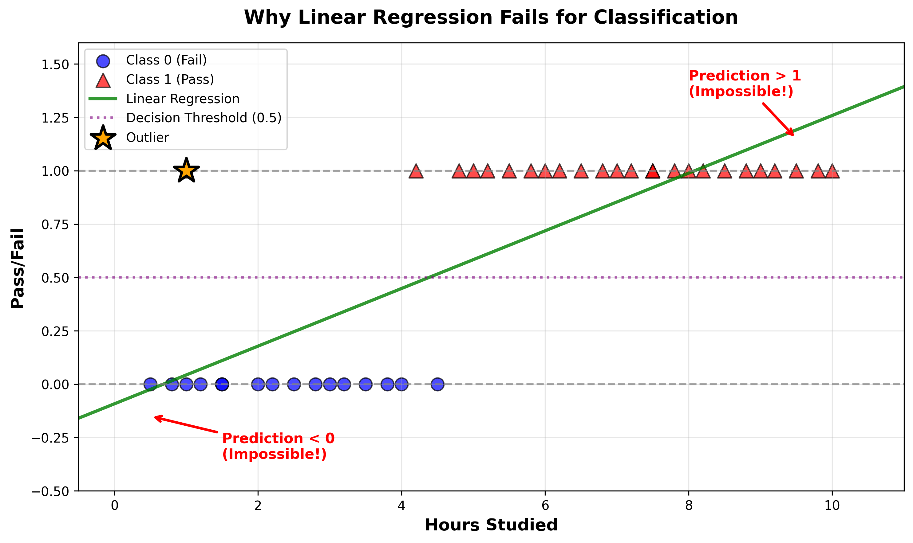
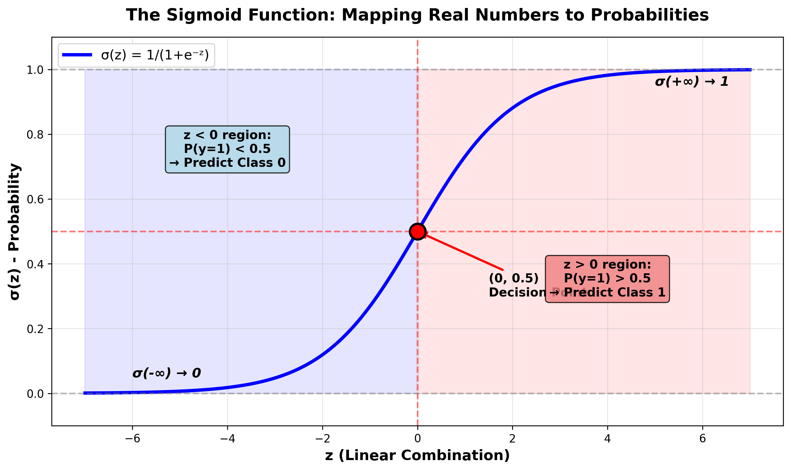
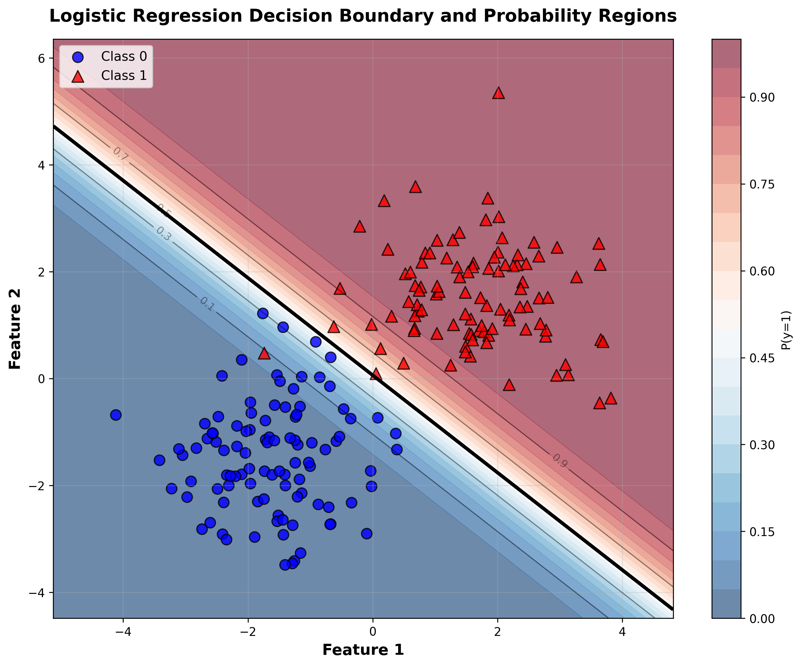
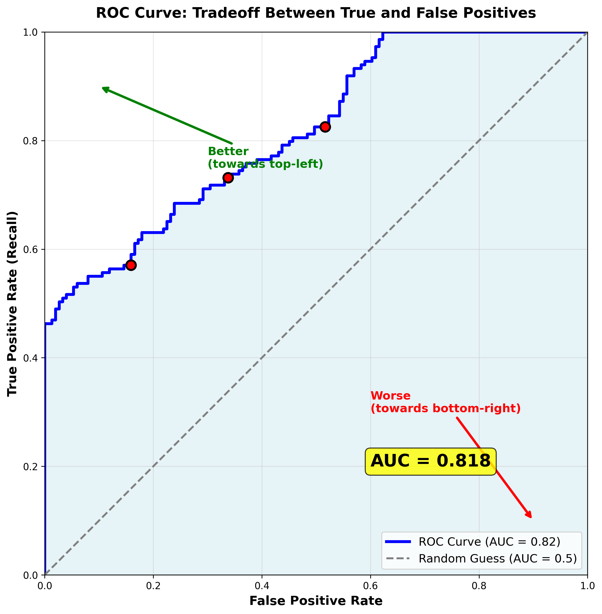
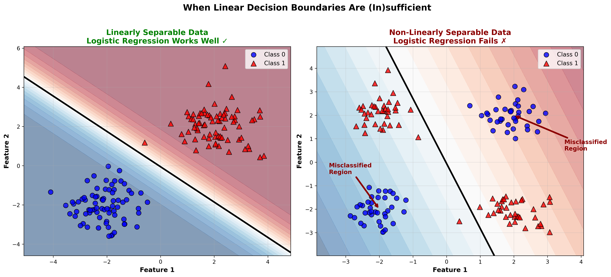

# Lesson 4: Logistic Regression
## Linear Classification and Model Evaluation

  
    MPS311/439 Machine Learning 
    Dr. Wei Xing 
    2026–27
  

---
layout: default
---

# Where We Left Off... 🎓

<strong class="text-blue-700">Lesson 1:</strong> Introduction to ML, Python basics, data exploration

<strong class="text-green-700">Lesson 2:</strong> Linear Regression - predicting continuous values 
(house prices, temperatures)

<strong class="text-purple-700">Lesson 3:</strong> Feature Engineering & Regularization 
(polynomial features, Ridge/Lasso to prevent overfitting)

💡 But what if we want to predict categories instead of numbers?

---
layout: two-cols
---

# Today's Challenge
## Classification Problems

**Definition:** Predicting discrete categories (classes), not continuous values

**Key characteristic:** Output is categorical
- Yes/No
- Class A/B/C
- 0 or 1

<strong class="text-blue-700">Today's Focus:</strong> 
Binary Classification 
(2 classes: 0 and 1)

::right::

## Real-World Examples

📧 **Email Filtering**

Spam or Not Spam?

🏥 **Medical Diagnosis**

Disease or Healthy?

💳 **Credit Approval**

Approve or Reject?

🖼️ **Image Recognition**

Cat or Dog?

---
layout: default
---

# Can We Just Use Linear Regression?

❌ Problems with Linear Regression for Classification:

Unbounded Predictions

Predictions can be outside [0, 1] range

Outlier Sensitivity

Very sensitive to outliers in the data

No Probability Interpretation

Can't properly interpret as probabilities

---
layout: default
---

# What We Need for Classification

✅

<strong class="text-xl text-green-700">Outputs between 0 and 1</strong>

So we can interpret them as probabilities

✅

<strong class="text-xl text-green-700">Smooth and differentiable</strong>

So we can use gradient descent to train

✅

<strong class="text-xl text-green-700">Proper probability interpretation</strong>

P(y=1|x) = probability of class 1 given features

✅

<strong class="text-xl text-green-700">Appropriate loss function</strong>

Designed for classification, not regression

🎯 Logistic Regression gives us all of this!

---
layout: two-cols
---

# The Sigmoid Function
## Our "Squashing" Function

::right::

## Formula

$$
\sigma(z) = \frac{1}{1 + e^{-z}}
$$

## Key Properties

Maps any real number to (0, 1)

Center point: <code>σ(0) = 0.5</code>

As <code>z → +∞</code>, <code>σ(z) → 1</code>

As <code>z → -∞</code>, <code>σ(z) → 0</code>

Smooth S-curve, differentiable

<strong>Perfect for probabilities!</strong>

---
layout: default
---

# Logistic Regression Model
<!-- ## Two Simple Steps -->

<strong class="text-2xl text-blue-800">Step 1: Linear Combination</strong>

(Just like before!)

$$
z = w_0 + w_1 x_1 + w_2 x_2 + \cdots + w_p x_p = \mathbf{w}^T \mathbf{x}
$$

<strong class="text-2xl text-green-800">Step 2: Apply Sigmoid</strong>

(Squash to probability)

$$
P(y=1|\mathbf{x}) = \sigma(z) = \frac{1}{1 + e^{-z}}
$$

<strong>Logistic Regression</strong> = Linear Model + Sigmoid Squashing

---
layout: default
---

# Linear Decision Boundaries

Decision Rule

• If <code>P(y=1|x) > 0.5</code>

→ Predict <strong>Class 1</strong>

• If <code>P(y=1|x) ≤ 0.5</code>

→ Predict <strong>Class 0</strong>

Key Points

• <strong>Decision boundary:</strong>

where wTx = 0

• Still <strong class="text-red-600">linear</strong> (straight line)

• <strong>Far from boundary</strong> = high confidence

• <strong>Near boundary</strong> = uncertain

💡 Colored regions show <strong>probability contours</strong>

---
layout: default
---

# Training with Cross-Entropy Loss

How do we train logistic regression?

<strong class="text-2xl text-purple-800">Binary Cross-Entropy Loss</strong>

$$
L(y, \hat{y}) = -\left[ y \log(\hat{y}) + (1-y) \log(1-\hat{y}) \right]
$$

where $\hat{y} = P(y=1|\mathbf{x})$ is our predicted probability

<strong class="text-blue-800">When actual y = 1:</strong>

$$L = -\log(\hat{y})$$

→ Penalizes low predictions for positive class

<strong class="text-green-800">When actual y = 0:</strong>

$$L = -\log(1-\hat{y})$$

→ Penalizes high predictions for negative class

<strong>Why not MSE?</strong> Cross-entropy creates a convex optimization problem → easier to train!

---
layout: default
---

# Why Cross-Entropy Loss? 🤔

## The Problem with Mean Squared Error (MSE)

<strong class="text-red-800 text-lg">❌ MSE for Classification</strong>

$$
L = \frac{1}{2}(y - \hat{y})^2
$$

• Creates <strong>non-convex</strong> loss surface

• Many local minima

• Gradient can vanish

• Hard to optimize

<strong class="text-green-800 text-lg">✅ Cross-Entropy</strong>

$$
L = -[y \log(\hat{y}) + (1-y) \log(1-\hat{y})]
$$

• Creates <strong>convex</strong> loss surface

• Single global minimum

• Strong gradients when wrong

• Reliable training

<strong class="text-xl">📊 Key Insight:</strong>

Cross-entropy naturally handles probabilities and provides the right gradient signal for classification tasks!

---
layout: default
---

# Understanding the Gradient

<strong class="text-xl text-purple-800">Good News: Simple Gradient! 🎉</strong>

The gradient of cross-entropy loss w.r.t. weights is surprisingly clean:

$$
\frac{\partial L}{\partial w_j} = (\hat{y} - y) x_j
$$

(Same form as linear regression, but with sigmoid-transformed predictions!)

<strong class="text-blue-800">Training Algorithm:</strong>

1. Initialize weights randomly

2. Predict: $\hat{y} = \sigma(\mathbf{w}^T \mathbf{x})$

3. Compute gradient

4. Update: $w_j := w_j - \alpha \frac{\partial L}{\partial w_j}$

5. Repeat until convergence

<strong class="text-green-800">In Practice:</strong>

• Use mini-batch gradient descent

• Add regularization (L2/L1)

• Use optimizers like Adam

• sklearn does all this for you!

---
layout: center
class: text-center
---

# Evaluation Metrics 📊
## Beyond Accuracy

Why isn't accuracy enough?

<strong class="text-red-800 text-xl">Example: Rare Disease Detection</strong>

• Disease prevalence: 1% of population

• A model that <strong>always predicts "healthy"</strong>

→ Gets <strong>99% accuracy</strong>! 🤯

→ But catches <strong>0% of sick patients</strong>! 😱

We need better metrics for imbalanced problems!

---
layout: default
---

# Confusion Matrix 📋

<table class="w-full text-center">
<thead>
<tr>
<th colspan="2" rowspan="2" class="border-b-2 border-r-2 border-gray-400"></th>
<th colspan="2" class="border-b-2 border-gray-400 pb-2">Predicted</th>
</tr>
<tr>
<th class="border-b-2 border-gray-400 p-2 bg-blue-100">Negative (0)</th>
<th class="border-b-2 border-gray-400 p-2 bg-blue-100">Positive (1)</th>
</tr>
</thead>
<tbody>
<tr>
<td rowspan="2" class="border-r-2 border-gray-400 font-bold bg-green-100" style="writing-mode: vertical-lr; transform: rotate(180deg);">Actual</td>
<td class="border-r-2 border-b border-gray-400 p-2 bg-green-100 font-bold">Negative (0)</td>
<td class="border-r border-b border-gray-400 p-3 bg-green-50">

TN

True Negative

</td>
<td class="border-b border-gray-400 p-3 bg-red-50">

FP

False Positive

</td>
</tr>
<tr>
<td class="border-r-2 border-gray-400 p-2 bg-green-100 font-bold">Positive (1)</td>
<td class="border-r border-gray-400 p-3 bg-red-50">

FN

False Negative

</td>
<td class="p-3 bg-green-50">

TP

True Positive

</td>
</tr>
</tbody>
</table>

<strong class="text-green-800">True Positive (TP):</strong>

Correctly predicted positive

<strong class="text-green-800">True Negative (TN):</strong>

Correctly predicted negative

<strong class="text-red-800">False Positive (FP):</strong>

Predicted positive, actually negative (Type I Error)

<strong class="text-red-800">False Negative (FN):</strong>

Predicted negative, actually positive (Type II Error)

---
layout: default
---

# Key Metrics from Confusion Matrix

<strong class="text-xl text-blue-800">Accuracy</strong>

$$
\text{Accuracy} = \frac{TP + TN}{TP + TN + FP + FN}
$$

Overall correctness - but <strong>misleading with imbalanced data!</strong>

<strong class="text-xl text-purple-800">Precision</strong>

$$
\text{Precision} = \frac{TP}{TP + FP}
$$

Of predicted positives, how many are correct?

<strong class="text-xl text-green-800">Recall (Sensitivity)</strong>

$$
\text{Recall} = \frac{TP}{TP + FN}
$$

Of actual positives, how many did we catch?

<strong class="text-xl text-orange-800">F1-Score</strong>

$$
F_1 = 2 \times \frac{\text{Precision} \times \text{Recall}}{\text{Precision} + \text{Recall}}
$$

Harmonic mean of precision and recall - balances both metrics

---
layout: two-cols
---

# Precision vs Recall Trade-off

## Precision

"Of all positive predictions, how many are correct?"

$$
\text{Precision} = \frac{TP}{TP + FP}
$$

<strong class="text-blue-800">High Precision = Few false alarms</strong>

<strong>Example:</strong> Email spam filter

→ Avoid marking important emails as spam!

::right::

## Recall

"Of all actual positives, how many did I catch?"

$$
\text{Recall} = \frac{TP}{TP + FN}
$$

<strong class="text-green-800">High Recall = Few missed detections</strong>

<strong>Example:</strong> Disease screening

→ Catch all patients with disease!

<strong>🏥 Medical Diagnosis Example:</strong>

<strong>High Recall</strong> → Aggressive screening (don't miss sick patients)

<strong>High Precision</strong> → Conservative diagnosis (only when very confident)

⚖️ Tradeoff: You usually can't maximize both!

---
layout: default
---

# ROC Curve & AUC
## Performance Across All Thresholds

<strong>ROC Curve:</strong> Shows performance at all possible thresholds

<strong>X-axis:</strong> False Positive Rate

<strong>Y-axis:</strong> True Positive Rate (Recall)

<strong>Diagonal line:</strong> Random guessing (AUC = 0.5)

<strong class="text-green-800">AUC (Area Under Curve):</strong>
<ul class="mt-2 space-y-1 text-xs">
<li>0.5 = Random guessing</li>
<li>0.7-0.8 = Acceptable</li>
<li>0.8-0.9 = Good</li>
<li>0.9-1.0 = Excellent</li>
<li>1.0 = Perfect classifier</li>
</ul>

<strong class="text-lg">AUC lets you compare models without choosing a specific threshold!</strong>

---
layout: center
class: text-center
---

# Live Demo! 🚀
## Let's Build a Classifier

Breast Cancer Classification

<strong>Dataset:</strong> Breast cancer (569 samples, 30 features)

<strong>Task:</strong> Predict malignant (0) or benign (1)

<strong>Tool:</strong> sklearn LogisticRegression

Watch how simple this is with sklearn!

💻 → Google Colab

---
layout: center
class: text-center
---

# Demo Part 2
## Evaluating Our Classifier

Part A: Basic Metrics

<ul class="space-y-2">
<li>✓ Display confusion matrix</li>
<li>✓ Calculate accuracy, precision, recall</li>
<li>✓ Interpret the results</li>
</ul>

Part B: Threshold Tuning

<ul class="space-y-2">
<li>• Default: threshold = 0.5</li>
<li>• Try threshold = 0.3 (aggressive)</li>
<li>• Try threshold = 0.7 (conservative)</li>
</ul>

<strong class="text-lg">⚡ See the precision-recall tradeoff in action!</strong>

💻 → Google Colab

---
layout: default
---

# Key Takeaways 🎯

1️⃣

<strong class="text-xl text-blue-800">Classification predicts categories</strong>, not continuous values

2️⃣

<strong class="text-xl text-green-800">Logistic Regression = Linear model + Sigmoid</strong>

• Outputs probabilities between 0 and 1

• Decision boundary is still <strong>linear</strong>

3️⃣

<strong class="text-xl text-purple-800">Cross-Entropy Loss</strong> is the right loss function

• Creates convex optimization → reliable training

4️⃣

<strong class="text-xl text-orange-800">Multiple metrics needed</strong> to evaluate classifiers

• Accuracy misleads with imbalanced data

• Precision vs Recall tradeoff depends on your problem

5️⃣

<strong class="text-xl text-pink-800">sklearn makes it simple</strong> - just a few lines of code!

---
layout: two-cols
---

# When Does It Work?

## ✅ Works Well

• Linearly separable classes

• Need interpretable models

• Want probability estimates

• High-dimensional data

::right::

## ❌ Struggles With

• Non-linear decision boundaries

• Complex feature interactions

• Classes mixed in complex ways

<strong class="text-blue-800">Solutions:</strong>
<ul class="mt-2 space-y-1 text-sm">
<li>• Feature engineering (polynomial features)</li>
<li>• Try non-linear models</li>
<li>• Next week: LDA/QDA for curved boundaries!</li>
</ul>

---
layout: center
class: text-center
---

# Looking Ahead 🔮

✅

<strong class="text-xl text-green-800">This Week</strong>

Logistic Regression

Linear decision boundaries

🔜

<strong class="text-xl text-blue-800">Next Week</strong>

LDA & QDA

• Linear Discriminant Analysis

• Quadratic boundaries (curved!)

• When to use each method

Questions? 🙋‍♀️🙋‍♂️

📝 Try the lab exercises this week

🔬 Experiment with different datasets

💬 Come to office hours if you need help!

---
layout: center
class: text-center
---

<!-- COURSE_FEEDBACK_QR:START -->
---
layout: center
class: text-center
---

# 30-second feedback

What would help you learn better next time?

Scan to share anonymous feedback on today's lecture.

MPS311/439 · 2026-27 · Lesson 04 lecture

<!-- COURSE_FEEDBACK_QR:END -->
