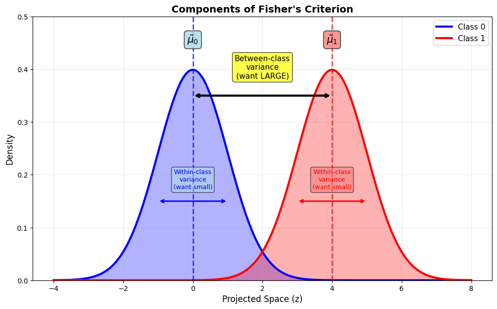
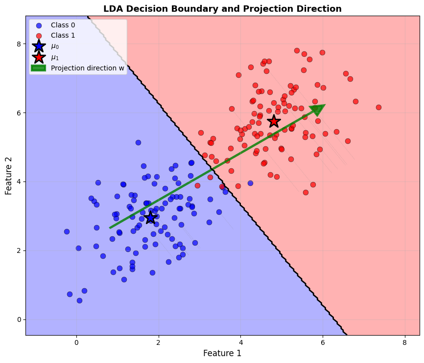
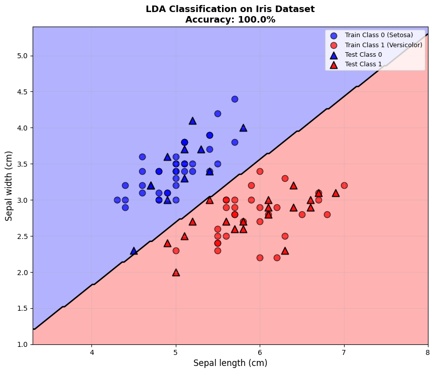
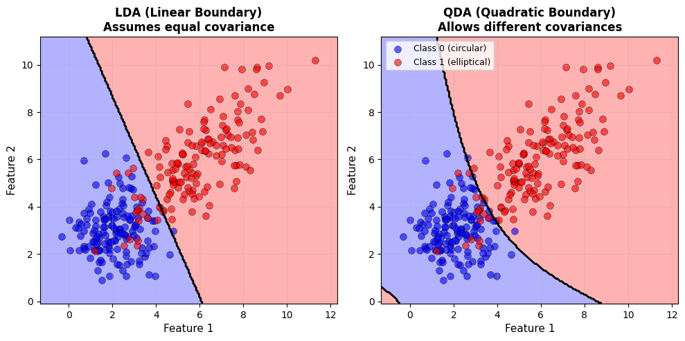
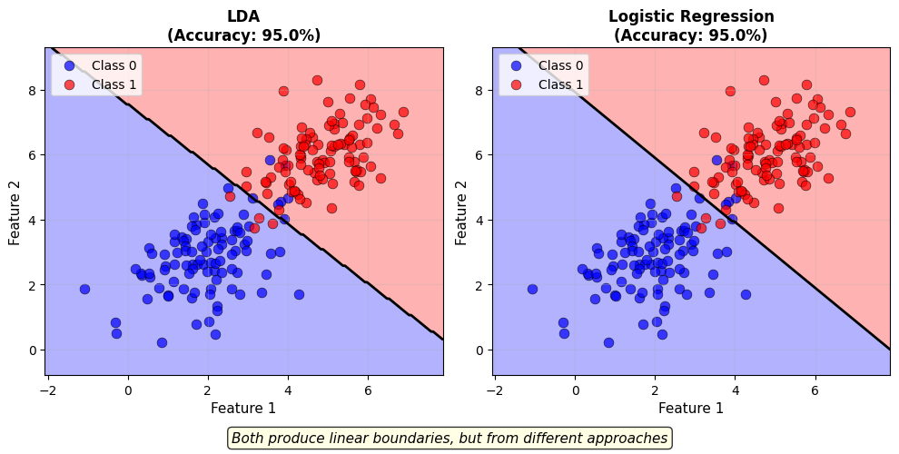

# Lesson 5: Linear Discriminant Analysis
## Finding the Best Projection for Classification

**MPS311/439 Machine Learning**  
**Dr. Wei Xing**  
**University of Sheffield**  
**Academic year 2026–27**

---

## 1. Introduction: Where We Are in Our Journey

Welcome to Lesson 5! Over the past few weeks, we've been building our classification toolkit. We started with linear regression for predicting continuous values, then moved to logistic regression for classification problems. Today, we're going to explore a completely different way of thinking about classification - one that might surprise you with its elegance and power.

### 1.1 Recap: Logistic Regression

Last week, we learned about **logistic regression**, which directly models the probability $P(Y|X)$ that a data point belongs to a particular class given its features. This is called a **discriminative approach** because we're learning to discriminate directly between classes.

Key characteristics of logistic regression:
- Uses the sigmoid function to convert linear combinations into probabilities
- Optimizes the decision boundary directly
- Works by finding the line (or hyperplane) that best separates the classes

Logistic regression works well for many problems, but today we're going to ask a different question entirely.

### 1.2 Today's New Perspective: Projection First, Then Classify

Here's the key insight for today: **What if we first project our high-dimensional data onto a lower dimension where the classes are naturally well-separated, and then classify?**

Think about it like this: Imagine you're looking at a complex 3D sculpture. From some angles, it looks like a confusing mess. But from just the right angle, you can clearly see what it represents. **Linear Discriminant Analysis (LDA)** is all about finding that "right angle" - the best direction to project your data so that different classes become easy to distinguish.

This approach was pioneered by Ronald Fisher in 1936 (yes, the same Fisher who gave us many statistical concepts!), and it's still widely used today because it's:
- Simple and interpretable
- Computationally efficient
- Surprisingly effective on many real-world problems
- Provides automatic dimensionality reduction

### 1.3 Learning Outcomes

By the end of this lecture, you should be able to:

**Core Outcomes (All Students):**
- ✅ Use `LinearDiscriminantAnalysis` and `QuadraticDiscriminantAnalysis` from sklearn
- ✅ Explain why LDA assumes equal covariances (same spread for all classes)
- ✅ Describe when LDA vs QDA is appropriate
- ✅ Compare LDA vs logistic regression performance on real data
- ✅ Understand the intuition behind projection-based classification

**Advanced Outcomes (MPS439 Students):**
- ✅ Derive LDA decision boundaries mathematically
- ✅ Explain Fisher's criterion in detail
- ✅ Understand the connection between projection and generative perspectives
- ✅ Implement basic LDA from scratch

Let's dive in!

---

## 2. Motivation: Why Do We Need Another Classification Method?

### 2.1 The Challenge: High-Dimensional Data

Real-world datasets often have many features. For example:
- Medical diagnosis: dozens of blood test measurements
- Image classification: thousands of pixel values
- Text classification: thousands of word frequencies

When we have data in high dimensions (say, 50 or 100 features), it becomes:
- Hard to visualize what's happening
- Difficult to understand which features matter most
- Computationally expensive to process
- Prone to overfitting (the curse of dimensionality)

**The question is**: Can we somehow reduce the dimensionality while preserving - or even enhancing - our ability to separate classes?

### 2.2 The Power of Projection

Here's where projection comes in. Let's start with a simple 2D example to build intuition.


**Figure 1**: The left panel shows two classes (blue and red) in 2D space. They overlap quite a bit when we look at them in the original feature space. But look at the right panel! When we project all the points onto a carefully chosen line (shown as the diagonal on the left), the two classes become much more separated in this 1D projected space.

This is powerful! We've:
1. Reduced dimensions from 2 to 1
2. Actually *improved* the class separation
3. Made classification much simpler (just compare a single number to a threshold)

**The key question**: How do we find this "magic line" - the optimal projection direction?

### 2.3 Good Projections vs Bad Projections

Not all projection directions are created equal. Look at the comparison below:


**Figure 2**: These plots show the same 2D data projected onto two different directions. The left shows a "bad" projection where the classes heavily overlap after projection. The right shows a "good" projection where the classes are clearly separated. The difference is dramatic!

**What makes a projection "good"?** Intuitively, we want:
- The projected class centers to be **far apart** from each other
- The points within each class to be **tightly clustered** in the projected space

Fisher's Linear Discriminant gives us a mathematical way to find the projection that optimally balances these two goals.

### 2.4 The Goal of LDA

Linear Discriminant Analysis seeks to find the direction vector $\mathbf{w}$ such that when we project our data onto this direction:

$$z = \mathbf{w}^T \mathbf{x}$$

The resulting 1D values $z$ maximize the separation between classes while minimizing the spread within each class.

Once we have this optimal projection, classification becomes simple: project a new point and compare its projected value to a threshold.

---

## 3. Fisher's Linear Discriminant: The Core Idea

Now let's get into the mathematics - but don't worry, we'll build this up step by step with clear intuition at each stage.

### 3.1 Setting Up the Problem

We have training data: $\{(\mathbf{x}_1, y_1), (\mathbf{x}_2, y_2), \ldots, (\mathbf{x}_n, y_n)\}$

For simplicity, let's start with **binary classification**: $y \in \{0, 1\}$ (two classes)

- Each $\mathbf{x}_i$ is a $d$-dimensional feature vector (a point in $d$-dimensional space)
- We'll call the two classes "Class 0" and "Class 1"
- Let $n_0$ be the number of Class 0 samples, $n_1$ be the number of Class 1 samples

**Our goal**: Find a direction vector $\mathbf{w}$ (also $d$-dimensional) such that projecting our data onto this direction gives maximum class separation.

### 3.2 Projection Mechanics

When we project a point $\mathbf{x}$ onto direction $\mathbf{w}$, we get a scalar value:

$$z = \mathbf{w}^T \mathbf{x}$$

This is just the dot product - it tells us "how much" of $\mathbf{x}$ lies along the direction $\mathbf{w}$.

For example, if $\mathbf{x} = [3, 4]^T$ and $\mathbf{w} = [1, 0]^T$, then $z = 3$ (we're projecting onto the horizontal axis).

After projecting all our training points, we get two sets of 1D values:
- $\{z_i : y_i = 0\}$ - projected Class 0 points
- $\{z_i : y_i = 1\}$ - projected Class 1 points

### 3.3 What Makes a Projection "Good"? Part 1: Between-Class Separation

After projection, each class has a mean in the 1D projected space:

$$\tilde{\mu}_0 = \frac{1}{n_0} \sum_{i: y_i=0} z_i = \frac{1}{n_0} \sum_{i: y_i=0} \mathbf{w}^T \mathbf{x}_i$$

$$\tilde{\mu}_1 = \frac{1}{n_1} \sum_{i: y_i=1} z_i = \frac{1}{n_1} \sum_{i: y_i=1} \mathbf{w}^T \mathbf{x}_i$$

Using the linearity of the dot product, we can write this more compactly:

$$\tilde{\mu}_0 = \mathbf{w}^T \boldsymbol{\mu}_0 \quad \text{and} \quad \tilde{\mu}_1 = \mathbf{w}^T \boldsymbol{\mu}_1$$

where $\boldsymbol{\mu}_0$ and $\boldsymbol{\mu}_1$ are the mean vectors of the two classes in the *original* $d$-dimensional space.

**Between-class variance** measures how far apart these projected means are:

$$(\tilde{\mu}_1 - \tilde{\mu}_0)^2 = (\mathbf{w}^T \boldsymbol{\mu}_1 - \mathbf{w}^T \boldsymbol{\mu}_0)^2 = (\mathbf{w}^T (\boldsymbol{\mu}_1 - \boldsymbol{\mu}_0))^2$$

**We want this to be LARGE** - the farther apart the class means are in the projected space, the better!

### 3.4 What Makes a Projection "Good"? Part 2: Within-Class Compactness

But wait! We can make the between-class variance arbitrarily large just by scaling $\mathbf{w}$ to be huge. That's cheating - we need another constraint.

The key insight: We also want the points within each class to be tightly clustered after projection. We measure this with **within-class variance**:

$$\tilde{s}_0^2 = \sum_{i: y_i=0} (z_i - \tilde{\mu}_0)^2 = \sum_{i: y_i=0} (\mathbf{w}^T \mathbf{x}_i - \mathbf{w}^T \boldsymbol{\mu}_0)^2$$

$$\tilde{s}_1^2 = \sum_{i: y_i=1} (z_i - \tilde{\mu}_1)^2 = \sum_{i: y_i=1} (\mathbf{w}^T \mathbf{x}_i - \mathbf{w}^T \boldsymbol{\mu}_1)^2$$

Total within-class variance: $\tilde{s}_0^2 + \tilde{s}_1^2$

**We want this to be SMALL** - tight clusters are easier to separate!



**Figure 3**: This illustration shows the two components we're trying to balance. The horizontal axis represents the projected space. The two bell curves show the distributions of the two classes after projection. The "between-class variance" is the distance between the peaks (large is good!). The "within-class variance" is the spread of each curve (small is good!).

### 3.5 Fisher's Criterion: The Optimal Balance

Now we can state Fisher's brilliant idea: **Find the projection $\mathbf{w}$ that maximizes the ratio of between-class variance to within-class variance.**

$$J(\mathbf{w}) = \frac{\text{between-class variance}}{\text{within-class variance}} = \frac{(\tilde{\mu}_1 - \tilde{\mu}_0)^2}{\tilde{s}_0^2 + \tilde{s}_1^2}$$

This is called **Fisher's criterion** or the **Fisher discriminant**. It's a beautiful formulation because:
- Maximizing the numerator pushes class means apart
- Minimizing the denominator tightens clusters
- The ratio balances both goals automatically

### 3.6 Expressing Fisher's Criterion with Matrices

To solve for the optimal $\mathbf{w}$, we need to express Fisher's criterion in terms of matrices. This allows us to use linear algebra tools.

Define the **within-class scatter matrix**:

$$\mathbf{S}_W = \sum_{i: y_i=0} (\mathbf{x}_i - \boldsymbol{\mu}_0)(\mathbf{x}_i - \boldsymbol{\mu}_0)^T + \sum_{i: y_i=1} (\mathbf{x}_i - \boldsymbol{\mu}_1)(\mathbf{x}_i - \boldsymbol{\mu}_1)^T$$

This measures the total scatter (spread) of points within each class in the original $d$-dimensional space. It's a $d \times d$ matrix that captures the covariance structure of each class.

Using this matrix, we can show (through some algebra) that:

$$\tilde{s}_0^2 + \tilde{s}_1^2 = \mathbf{w}^T \mathbf{S}_W \mathbf{w}$$

Similarly, the between-class separation can be written as:

$$(\mathbf{w}^T (\boldsymbol{\mu}_1 - \boldsymbol{\mu}_0))^2 = \mathbf{w}^T \mathbf{S}_B \mathbf{w}$$

where $\mathbf{S}_B = (\boldsymbol{\mu}_1 - \boldsymbol{\mu}_0)(\boldsymbol{\mu}_1 - \boldsymbol{\mu}_0)^T$ is called the **between-class scatter matrix**.

Fisher's criterion becomes:

$$J(\mathbf{w}) = \frac{\mathbf{w}^T \mathbf{S}_B \mathbf{w}}{\mathbf{w}^T \mathbf{S}_W \mathbf{w}}$$

### 3.7 The Solution: Fisher's Linear Discriminant

Through calculus (taking derivatives and setting to zero), the optimal direction $\mathbf{w}$ that maximizes $J(\mathbf{w})$ is:

$$\mathbf{w} \propto \mathbf{S}_W^{-1} (\boldsymbol{\mu}_1 - \boldsymbol{\mu}_0)$$

The $\propto$ symbol means "proportional to" - the exact scale of $\mathbf{w}$ doesn't matter, only its direction.

**Intuitive interpretation**:
- $(\boldsymbol{\mu}_1 - \boldsymbol{\mu}_0)$ is the vector pointing from one class mean to the other
- $\mathbf{S}_W^{-1}$ adjusts this direction based on the within-class scatter
- If classes are spread out in a particular direction, we downweight that direction

**Important note**: Don't worry about computing $\mathbf{S}_W^{-1}$ by hand - sklearn does all of this for us! The important thing is understanding *what* the algorithm is doing conceptually.

### 3.8 Geometric Intuition

Let's visualize what this means:



**Figure 4**: This shows 2D data with two classes. The thick arrow shows the projection direction $\mathbf{w}$ found by LDA - this is Fisher's optimal direction. The black line is the decision boundary, which is perpendicular to the projection direction. The class means ($\boldsymbol{\mu}_0$ and $\boldsymbol{\mu}_1$) are marked with stars.

Notice:
- The projection direction roughly points from one class center to the other
- The decision boundary is perpendicular to this direction
- Points are classified based on which side of the boundary they fall on

---

## 4. From Projection to Classification

Now that we have the optimal projection direction $\mathbf{w}$, how do we actually classify new points?

### 4.1 The Classification Rule

The process is beautifully simple:

**Step 1**: Project the new point $\mathbf{x}$ onto the direction $\mathbf{w}$:

$$z = \mathbf{w}^T \mathbf{x}$$

**Step 2**: Compare $z$ to a threshold $c$:

$$\text{Classify as } \begin{cases}
\text{Class 1} & \text{if } z > c \\
\text{Class 0} & \text{if } z \leq c
\end{cases}$$

That's it! The hard work was finding $\mathbf{w}$ - classification is now trivial.

### 4.2 Choosing the Threshold

How do we choose the threshold $c$? There are several reasonable approaches:

**Option 1: Midpoint** (simplest)

$$c = \frac{\tilde{\mu}_0 + \tilde{\mu}_1}{2} = \frac{\mathbf{w}^T \boldsymbol{\mu}_0 + \mathbf{w}^T \boldsymbol{\mu}_1}{2}$$

This places the decision boundary exactly halfway between the projected class means.

**Option 2: Weighted by class proportions**

If one class is much more common than the other, we might want to adjust the threshold to reflect this. If Class 0 appears with probability $\pi_0$ and Class 1 with probability $\pi_1$ in the training data, we can incorporate this into our threshold choice.

**sklearn handles this automatically** based on the training data, so you typically don't need to worry about it.

### 4.3 Decision Boundary in the Original Space

Here's something cool: Even though we're making decisions in the 1D projected space, this corresponds to a decision boundary in the original $d$-dimensional space.

The decision rule $\mathbf{w}^T \mathbf{x} = c$ defines a **hyperplane** in $d$ dimensions:
- In 2D: this is a straight line (as we saw in Figure 4)
- In 3D: this is a flat plane
- In higher dimensions: it's still called a hyperplane (but hard to visualize!)

This hyperplane is perpendicular to the projection direction $\mathbf{w}$. All points on one side of the hyperplane are classified as Class 0, all points on the other side as Class 1.

**Key insight**: LDA produces **linear decision boundaries**, just like logistic regression! But the way we arrive at these boundaries is completely different.

### 4.4 Extension to Multiple Classes

So far we've focused on binary classification (two classes). But LDA naturally extends to $K > 2$ classes!

For multiple classes:
- We find $K-1$ projection directions (not just one)
- These directions form a $(K-1)$-dimensional subspace
- We project data into this subspace and assign each point to the nearest class mean

**Example**: With 3 classes, we find 2 projection directions. We can then visualize all our data in this 2D projected space, which often gives beautiful, interpretable visualizations.

For this lecture, we'll stick with the binary case for simplicity, but know that sklearn handles multiple classes automatically.

---

## 5. Implementation with Python and sklearn

Enough theory - let's see how easy this is to use in practice!

### 5.1 The Easy Way: Using sklearn

sklearn provides a simple interface for LDA through the `LinearDiscriminantAnalysis` class. It works just like other classifiers we've seen (logistic regression, etc.).

```python
from sklearn.discriminant_analysis import LinearDiscriminantAnalysis
from sklearn.datasets import load_iris
from sklearn.model_selection import train_test_split
import numpy as np
import matplotlib.pyplot as plt

# Load iris dataset (we'll use only 2 classes for simplicity)
iris = load_iris()
X = iris.data[:100, :2]  # First 100 samples (setosa and versicolor), first 2 features
y = iris.target[:100]     # Binary labels: 0 and 1

# Split into training and test sets
X_train, X_test, y_train, y_test = train_test_split(X, y, test_size=0.3, random_state=42)
```

### 5.2 Training an LDA Model

Training is just one line:

```python
# Create and train the LDA model
lda = LinearDiscriminantAnalysis()
lda.fit(X_train, y_train)
```

That's it! Behind the scenes, sklearn:
1. Computes the class means $\boldsymbol{\mu}_0$ and $\boldsymbol{\mu}_1$
2. Computes the within-class scatter matrix $\mathbf{S}_W$
3. Solves for the optimal projection direction $\mathbf{w}$
4. Determines the appropriate threshold

### 5.3 Making Predictions

Prediction is equally simple:

```python
# Predict on test set
y_pred = lda.predict(X_test)

# Calculate accuracy
accuracy = lda.score(X_test, y_test)
print(f"Test accuracy: {accuracy:.3f}")
```

You can also get probability estimates:

```python
# Get probability predictions
y_prob = lda.predict_proba(X_test)
print(y_prob[:5])  # First 5 predictions
```

### 5.4 Visualizing the Decision Boundary

For 2D data, we can visualize the decision boundary:

```python
# Create a mesh to plot decision boundary
x_min, x_max = X[:, 0].min() - 0.5, X[:, 0].max() + 0.5
y_min, y_max = X[:, 1].min() - 0.5, X[:, 1].max() + 0.5
xx, yy = np.meshgrid(np.linspace(x_min, x_max, 200),
                     np.linspace(y_min, y_max, 200))

# Predict for each point in the mesh
Z = lda.predict(np.c_[xx.ravel(), yy.ravel()])
Z = Z.reshape(xx.shape)

# Plot
plt.contourf(xx, yy, Z, alpha=0.3, cmap='RdBu')
plt.scatter(X_train[:, 0], X_train[:, 1], c=y_train, cmap='RdBu', edgecolors='black')
plt.xlabel('Sepal length')
plt.ylabel('Sepal width')
plt.title('LDA Decision Boundary')
plt.show()
```



**Figure 5**: This shows the result of applying LDA to real data (Iris dataset). The colored regions show the classification areas, the decision boundary is where the colors meet, and the points show training data (circles) and test data (triangles). Notice the clean linear separation!

### 5.5 Interpreting the Model

LDA gives us access to several useful attributes:

```python
# The projection direction (coefficients)
print("Projection direction:", lda.coef_)

# Class means in the original space
print("Class means:", lda.means_)

# Prior probabilities (class proportions)
print("Class priors:", lda.priors_)
```

The `coef_` attribute gives us the direction vector $\mathbf{w}$. This tells us which features are most important for discrimination:
- Large positive values → feature increases likelihood of Class 1
- Large negative values → feature increases likelihood of Class 0
- Values near zero → feature doesn't help discriminate

### 5.6 What Can We Do With LDA?

Beyond simple classification, LDA is useful for:

**1. Dimensionality Reduction**
```python
# Use LDA to project to 1D
lda = LinearDiscriminantAnalysis(n_components=1)
X_transformed = lda.fit_transform(X_train, y_train)
print(X_transformed.shape)  # Now 1D!
```

This is like PCA but supervised - it finds low-dimensional representations that preserve class separability.

**2. Feature Importance**
The projection direction tells us which features matter most for classification.

**3. Data Visualization**
For multi-class problems, projecting to 2D or 3D using LDA often gives beautiful, interpretable visualizations.

---

## 6. Quadratic Discriminant Analysis (QDA)

LDA makes a strong assumption: all classes have the same "spread" or covariance structure. But what if this isn't true?

### 6.1 The Limitation of LDA

Remember that LDA assumes all classes share the same within-class scatter. In mathematical terms, we assume:

$$\text{Cov}(\mathbf{X} | Y=0) = \text{Cov}(\mathbf{X} | Y=1) = \mathbf{\Sigma}$$

where $\mathbf{\Sigma}$ is the covariance matrix.

**Reality check**: Often different classes have different spreads!

Examples:
- Class 0 might be tightly clustered (small variance)
- Class 1 might be spread out (large variance)
- Or they might be spread in different directions (different covariance structure)

When the equal covariance assumption is violated, LDA might perform poorly.

### 6.2 QDA: Relaxing the Assumption

**Quadratic Discriminant Analysis (QDA)** relaxes this assumption. Instead of assuming one shared covariance matrix, QDA allows each class to have its own:

$$\text{Cov}(\mathbf{X} | Y=k) = \mathbf{\Sigma}_k$$

This added flexibility comes at a cost:
- **More parameters to estimate**: Each class needs its own covariance matrix
- **More data required**: You need enough samples in each class to estimate these covariances reliably
- **More complex decision boundaries**: Instead of linear boundaries, we get quadratic (curved) boundaries

### 6.3 Visual Comparison

The difference is dramatic when classes have different spreads:



**Figure 6**: This comparison shows the same data with two classes that have different covariance structures - one class is circular, the other is elliptical. The left panel shows LDA forcing a linear boundary, which isn't optimal. The right panel shows QDA finding a curved boundary that better respects the different shapes of the classes.

### 6.4 When to Use QDA vs LDA

**Use LDA when**:
- Classes have roughly similar spreads/shapes
- You have limited training data (small sample size)
- You want a simpler, more interpretable model
- Computational efficiency is important

**Use QDA when**:
- Classes clearly have different variances or shapes
- You have plenty of training data (at least $p(p+1)/2$ more samples per class, where $p$ is the number of features)
- The added complexity is worth better accuracy
- You've tried LDA and it's not working well

**Rule of thumb**: For $p$ features and $K$ classes:
- LDA estimates $\approx p \cdot K$ parameters
- QDA estimates $\approx \frac{p(p+1)}{2} \cdot K$ parameters

QDA needs a lot more data to estimate all those parameters reliably!

### 6.5 QDA Implementation in sklearn

The good news: using QDA is almost identical to LDA!

```python
from sklearn.discriminant_analysis import QuadraticDiscriminantAnalysis

# Create and train QDA model
qda = QuadraticDiscriminantAnalysis()
qda.fit(X_train, y_train)

# Make predictions
y_pred_qda = qda.predict(X_test)

# Calculate accuracy
accuracy_qda = qda.score(X_test, y_test)
print(f"QDA test accuracy: {accuracy_qda:.3f}")
```

The API is the same - only the underlying algorithm differs!

### 6.6 Quick Comparison Example

Let's compare both on the same dataset:

```python
# Train both models
lda = LinearDiscriminantAnalysis()
qda = QuadraticDiscriminantAnalysis()

lda.fit(X_train, y_train)
qda.fit(X_train, y_train)

# Compare performance
lda_acc = lda.score(X_test, y_test)
qda_acc = qda.score(X_test, y_test)

print(f"LDA accuracy: {lda_acc:.3f}")
print(f"QDA accuracy: {qda_acc:.3f}")
```

Try this on different datasets! Sometimes LDA wins (simpler model, less overfitting), sometimes QDA wins (more flexible when classes really are different). It depends on your data.

---

## 7. LDA vs Logistic Regression: When to Use Which?

We now have two methods for linear classification: LDA and logistic regression. Both produce linear decision boundaries. So what's the difference?

### 7.1 Philosophical Differences

The fundamental difference is in their approach:

**Logistic Regression (Discriminative)**:
- Directly models the decision boundary
- Focuses on $P(Y|\mathbf{X})$ - the probability of the class given features
- Makes no assumptions about the distribution of $\mathbf{X}$
- Optimizes the boundary to maximize classification accuracy

**LDA (Generative - see appendix)**:
- Models each class separately, then derives the boundary
- Can be viewed as modeling $P(\mathbf{X}|Y)$ and using Bayes' theorem
- Assumes features follow a Gaussian distribution within each class
- Finds the boundary as a by-product of the class models

Despite these different philosophies, they often produce similar results in practice!

### 7.2 Performance Comparison

Let's see them side by side:



**Figure 7**: Both methods produce linear decision boundaries on this dataset, but they're slightly different. The boundaries are similar but not identical - they've been optimized according to different criteria. Both achieve good accuracy here.

### 7.3 When LDA Has Advantages

**LDA is better when**:

1. **Small sample sizes**: LDA can be more stable with limited data because it makes stronger assumptions (Gaussian distributions with equal covariance). These assumptions, if true, provide extra information that helps with small samples.

2. **Classes are well-separated**: When classes don't overlap much, LDA's assumptions are often reasonable and it performs well.

3. **Multi-class problems**: LDA naturally handles multiple classes and provides nice dimensionality reduction. Logistic regression needs to be extended (one-vs-rest or softmax).

4. **Dimensionality reduction needed**: LDA simultaneously classifies and reduces dimensions, which can be very useful for visualization and subsequent processing.

5. **Features are approximately Gaussian**: When the underlying assumptions are met, LDA can be more efficient (statistically).

### 7.4 When Logistic Regression Has Advantages

**Logistic Regression is better when**:

1. **Non-Gaussian data**: Logistic regression doesn't assume anything about feature distributions. If your features are highly non-Gaussian (e.g., binary features, skewed distributions), logistic regression is more robust.

2. **Very different class sizes**: When one class is much rarer than another, logistic regression handles the imbalance better.

3. **Regularization is important**: Logistic regression works seamlessly with Ridge (L2) and Lasso (L1) regularization. This is harder to implement with LDA.

4. **Outliers present**: Logistic regression is generally more robust to outliers because it doesn't estimate covariance matrices.

5. **Online learning**: Logistic regression can be updated incrementally as new data arrives. LDA requires recomputing covariance matrices.

### 7.5 A Practical Workflow

Here's a reasonable approach when facing a new classification problem:

```python
# Try both and compare!
from sklearn.linear_model import LogisticRegression
from sklearn.discriminant_analysis import LinearDiscriminantAnalysis
from sklearn.model_selection import cross_val_score

# Logistic Regression
logreg = LogisticRegression()
logreg_scores = cross_val_score(logreg, X, y, cv=5)

# LDA
lda = LinearDiscriminantAnalysis()
lda_scores = cross_val_score(lda, X, y, cv=5)

print(f"Logistic Regression CV accuracy: {logreg_scores.mean():.3f} (+/- {logreg_scores.std():.3f})")
print(f"LDA CV accuracy: {lda_scores.mean():.3f} (+/- {lda_scores.std():.3f})")
```

**Don't overthink it**: Try both and see which works better on your specific data!

### 7.6 Summary Table

| Aspect | LDA | Logistic Regression |
|--------|-----|---------------------|
| Assumptions | Gaussian features, equal covariance | None on feature distribution |
| Decision boundary | Linear | Linear |
| Multi-class | Native support | Requires extension |
| Dimensionality reduction | Yes (automatic) | No |
| Small sample performance | Often better | Can overfit |
| Robustness to outliers | Less robust | More robust |
| Regularization | Difficult | Easy (L1/L2) |
| Interpretability | Projection direction | Coefficients |

---

## 8. Practical Considerations and Summary

### 8.1 When LDA Works Well

LDA shines in these scenarios:

✅ **Classes are approximately Gaussian distributed**: When features within each class follow (roughly) normal distributions, LDA's assumptions are met and it performs optimally.

✅ **Similar covariance structures**: When all classes have roughly the same "shape" or spread, linear boundaries make sense.

✅ **Small to moderate sample sizes**: LDA's assumptions help stabilize estimates when data is limited.

✅ **Need for dimensionality reduction**: If you want both classification and dimension reduction in one step, LDA is perfect.

✅ **Interpretability matters**: The projection directions have clear geometric meaning.

✅ **Multiple classes with good separation**: LDA handles multi-class problems elegantly and can project to low dimensions for visualization.

### 8.2 When LDA Struggles

LDA can perform poorly when:

❌ **Highly non-Gaussian data**: If features are binary, categorical, or have weird distributions (e.g., heavy-tailed, multimodal), LDA's Gaussian assumption is violated.

❌ **Very different class spreads**: If one class is very tight and another is very spread out, the equal covariance assumption fails (consider QDA instead).

❌ **Outliers present**: Outliers can severely distort the mean and covariance estimates, ruining the projection direction.

❌ **Very small sample sizes**: If you have fewer samples than features ($n < p$), the covariance matrix can't be inverted reliably. LDA breaks down.

❌ **Highly imbalanced classes**: If one class is extremely rare, LDA can be unstable.

### 8.3 Tips for Using LDA in Practice

**1. Standardize your features**
```python
from sklearn.preprocessing import StandardScaler

scaler = StandardScaler()
X_train_scaled = scaler.fit_transform(X_train)
X_test_scaled = scaler.transform(X_test)

lda = LinearDiscriminantAnalysis()
lda.fit(X_train_scaled, y_train)
```

Features on very different scales can cause problems. Standardization helps.

**2. Check your assumptions**

Before using LDA, do a quick sanity check:
- Plot histograms of features for each class - do they look roughly Gaussian?
- Look at scatter plots - do classes have similar spread?
- Check for obvious outliers

**3. Compare with simpler methods**

Always compare LDA with logistic regression on your specific data:
```python
# Quick comparison
from sklearn.model_selection import cross_val_score

lda_score = cross_val_score(lda, X, y, cv=5).mean()
logreg_score = cross_val_score(LogisticRegression(), X, y, cv=5).mean()

print(f"LDA: {lda_score:.3f}, LogReg: {logreg_score:.3f}")
```

**4. Use cross-validation**

Don't trust a single train-test split! Use k-fold cross-validation to get reliable performance estimates.

**5. For high-dimensional data, consider shrinkage**

sklearn offers a shrinkage parameter that can help with high-dimensional data:
```python
lda = LinearDiscriminantAnalysis(shrinkage='auto', solver='lsqr')
```

This regularizes the covariance matrix estimate, preventing overfitting.

### 8.4 Key Takeaways

Let's recap what we've learned today:

🎯 **Core Concept**: LDA finds the optimal projection direction that maximizes class separation while minimizing within-class spread. This is Fisher's criterion.

🎯 **Two Perspectives**: 
   - **Projection view** (main): Find direction maximizing between-class / within-class variance ratio
   - **Generative view** (advanced): Model classes as Gaussians, use Bayes' theorem (see appendix)

🎯 **Implementation**: sklearn makes it trivial with `LinearDiscriminantAnalysis` and `QuadraticDiscriminantAnalysis`

🎯 **LDA vs QDA**: LDA assumes equal covariance (→ linear boundaries), QDA allows different covariances (→ curved boundaries)

🎯 **LDA vs Logistic Regression**: Both give linear boundaries but via different routes. Try both on your data!

🎯 **Practical wisdom**: 
   - LDA works well with small samples and Gaussian data
   - QDA needs more data but is more flexible
   - Always compare multiple methods on your specific problem

### 8.5 Looking Ahead: Next Week

Next week, we'll explore **Decision Trees** - a completely different approach to classification that:
- Doesn't assume linear boundaries (or any particular boundary shape!)
- Works naturally with categorical features
- Produces highly interpretable models
- Forms the basis for powerful ensemble methods (Random Forests, XGBoost)

Decision trees will give us our first taste of truly non-linear classification. Exciting stuff!

---

## Optional Advanced Section: The Generative Model Perspective

> **Note for Students**: This section provides an alternative mathematical perspective on LDA. It's **not required** for using LDA effectively or for the core learning outcomes. However, if you're in MPS439 or are simply curious about the deeper theory, this section will give you a richer understanding of why LDA works. Feel free to skip this if it feels overwhelming!

### A.1 Another Way to Think About LDA

So far, we've understood LDA through the lens of projection: find the direction that best separates classes. But there's a completely different way to derive the exact same algorithm using **probability theory** and **Bayes' theorem**. This is called the **generative approach** because we "generate" or model each class separately.

### A.2 The Generative Modeling Setup

Instead of directly modeling $P(Y|\mathbf{X})$ (the probability of the class given features), the generative approach models:

1. **Class distribution**: $P(Y=k)$ - the prior probability of each class
2. **Feature distribution given class**: $P(\mathbf{X}|Y=k)$ - how features are distributed within each class

Then we use **Bayes' theorem** to get what we want:

$$P(Y=k|\mathbf{X}) = \frac{P(\mathbf{X}|Y=k) \cdot P(Y=k)}{P(\mathbf{X})}$$

The denominator $P(\mathbf{X})$ is the same for all classes, so we can ignore it for classification (we just compare the numerators for different classes).

### A.3 The Gaussian Assumption

Here's the key assumption of LDA from the generative perspective:

**Each class follows a multivariate Gaussian distribution**:

$$P(\mathbf{X}|Y=k) = \mathcal{N}(\boldsymbol{\mu}_k, \boldsymbol{\Sigma})$$

where:
- $\boldsymbol{\mu}_k$ is the mean vector for class $k$
- $\boldsymbol{\Sigma}$ is the covariance matrix (same for all classes!)

The multivariate Gaussian density is:

$$P(\mathbf{X}|Y=k) = \frac{1}{(2\pi)^{d/2}|\boldsymbol{\Sigma}|^{1/2}} \exp\left(-\frac{1}{2}(\mathbf{x}-\boldsymbol{\mu}_k)^T\boldsymbol{\Sigma}^{-1}(\mathbf{x}-\boldsymbol{\mu}_k)\right)$$

Don't be intimidated by this formula! The key is that it's a bell-shaped distribution in multiple dimensions.

### A.4 Deriving the Decision Boundary

For binary classification (classes 0 and 1), we classify a point $\mathbf{x}$ as Class 1 if:

$$P(Y=1|\mathbf{X}=\mathbf{x}) > P(Y=0|\mathbf{X}=\mathbf{x})$$

Using Bayes' theorem:

$$\frac{P(\mathbf{X}=\mathbf{x}|Y=1) \cdot P(Y=1)}{P(\mathbf{X})} > \frac{P(\mathbf{X}=\mathbf{x}|Y=0) \cdot P(Y=0)}{P(\mathbf{X})}$$

The $P(\mathbf{X})$ cancels out:

$$P(\mathbf{X}=\mathbf{x}|Y=1) \cdot P(Y=1) > P(\mathbf{X}=\mathbf{x}|Y=0) \cdot P(Y=0)$$

Taking the logarithm (which preserves the inequality):

$$\log P(\mathbf{X}=\mathbf{x}|Y=1) + \log P(Y=1) > \log P(\mathbf{X}=\mathbf{x}|Y=0) + \log P(Y=0)$$

Now substitute the Gaussian densities and simplify. After lots of algebra (the exponentials become quadratics, terms cancel because $\boldsymbol{\Sigma}$ is the same), you end up with:

$$\mathbf{w}^T \mathbf{x} + w_0 > 0$$

where $\mathbf{w} = \boldsymbol{\Sigma}^{-1}(\boldsymbol{\mu}_1 - \boldsymbol{\mu}_0)$ and $w_0$ involves the prior probabilities and means.

**This is a linear decision boundary!** And notice: the direction $\mathbf{w}$ is exactly what we got from Fisher's discriminant!

### A.5 Why Equal Covariance Matters

The **crucial assumption** is that both classes have the same covariance matrix $\boldsymbol{\Sigma}$. Here's why:

If we allowed different covariances ($\boldsymbol{\Sigma}_0$ and $\boldsymbol{\Sigma}_1$), when we substitute into Bayes' theorem and simplify, the $\mathbf{x}^T\boldsymbol{\Sigma}^{-1}\mathbf{x}$ terms wouldn't cancel. We'd be left with:

$$\mathbf{x}^T(\boldsymbol{\Sigma}_1^{-1} - \boldsymbol{\Sigma}_0^{-1})\mathbf{x} + \text{linear terms} + \text{constant} > 0$$

This is a **quadratic** in $\mathbf{x}$, not linear! The decision boundary becomes a curve (or hyperbola, or ellipse) - this is exactly what QDA does.

So:
- **Equal covariance** ($\boldsymbol{\Sigma}_0 = \boldsymbol{\Sigma}_1 = \boldsymbol{\Sigma}$) → Linear boundary (LDA)
- **Different covariances** ($\boldsymbol{\Sigma}_0 \neq \boldsymbol{\Sigma}_1$) → Quadratic boundary (QDA)

### A.6 Connecting the Two Perspectives

The beautiful thing is that the **projection perspective** (Fisher's discriminant) and the **generative perspective** (Gaussian models + Bayes' theorem) lead to **exactly the same algorithm**!

- Fisher's approach: maximize $J(\mathbf{w})$ → get $\mathbf{w} \propto \mathbf{S}_W^{-1}(\boldsymbol{\mu}_1 - \boldsymbol{\mu}_0)$
- Generative approach: assume Gaussians with equal $\boldsymbol{\Sigma}$, use Bayes → get $\mathbf{w} = \boldsymbol{\Sigma}^{-1}(\boldsymbol{\mu}_1 - \boldsymbol{\mu}_0)$

Note that $\mathbf{S}_W$ (within-class scatter) is essentially our estimate of the pooled covariance $\boldsymbol{\Sigma}$!

This is one of those beautiful moments in mathematics where two completely different ways of thinking about a problem lead to the same answer. It suggests LDA is capturing something fundamental about the structure of classification problems.

### A.7 Why This Perspective Matters

Understanding the generative view provides:

1. **Deeper intuition**: You understand *why* LDA makes certain assumptions
2. **Connection to other methods**: Many ML algorithms use generative models (Naive Bayes, Gaussian Mixture Models, etc.)
3. **Handling missing data**: The generative model can naturally handle missing features during prediction
4. **Generating synthetic data**: Since you've modeled $P(\mathbf{X}|Y)$, you can generate new examples of each class

### A.8 For the Curious: Further Reading

If this perspective interests you:
- Look into **Naive Bayes** classifiers (simpler generative model)
- Study **Gaussian Mixture Models** (clustering with probabilistic models)
- Explore **generative vs discriminative** paradigms in machine learning
- Read about the **bias-variance tradeoff** in generative vs discriminative models

But remember: you can use and understand LDA effectively without any of this! This is enrichment, not requirement.

---

## Review Questions

Test your understanding with these questions:

### Core Level (All Students)

1. **Conceptual**: Explain in your own words why LDA projects data onto a lower-dimensional space before classification. What advantage does this give?

2. **Interpretation**: You fit an LDA model and `lda.coef_` gives you `[0.8, -0.3]`. What does this tell you about the two features?

3. **Comparison**: When would you choose QDA over LDA? Give a concrete example.

4. **Code**: Write sklearn code to train an LDA classifier, make predictions on test data, and print the accuracy.

5. **Visual**: Given a 2D scatter plot with two classes, sketch what you think the LDA decision boundary would look like and explain your reasoning.

### Advanced Level (MPS439 Students)

6. **Mathematical**: Explain why Fisher's criterion uses a ratio (between-class variance / within-class variance) rather than just maximizing between-class variance.

7. **Derivation**: Show mathematically why equal covariance matrices lead to linear decision boundaries while different covariances lead to quadratic boundaries.

8. **Implementation**: Implement a simple LDA classifier from scratch for 2D binary classification. You'll need to compute class means, within-class scatter matrix, and the projection direction.

9. **Theory**: Explain the connection between the projection perspective and the generative perspective on LDA. Why do they give the same answer?

---

## Further Resources

**For more practice and deeper understanding**:

- sklearn documentation: [LinearDiscriminantAnalysis](https://scikit-learn.org/stable/modules/generated/sklearn.discriminant_analysis.LinearDiscriminantAnalysis.html)
- Classic paper: R.A. Fisher (1936), "The Use of Multiple Measurements in Taxonomic Problems"
- Textbook: "The Elements of Statistical Learning" by Hastie, Tibshirani, and Friedman (Chapter 4)
- Interactive visualizations: Try creating your own synthetic datasets with different covariance structures and see how LDA vs QDA perform

**Lab exercises** (for Friday's session) will give you hands-on practice with:
- Applying LDA to real datasets
- Comparing LDA, QDA, and logistic regression
- Visualizing decision boundaries
- Using LDA for dimensionality reduction

*Remember: The goal isn't to memorize formulas, but to understand the core ideas. LDA finds the best projection for separating classes. Everything else follows from that simple insight. See you in lab!*

---

*End of Lesson 5 Lecture Notes*  
*MPS311/439 Machine Learning · Dr. Wei Xing · University of Sheffield · 2026–27*
