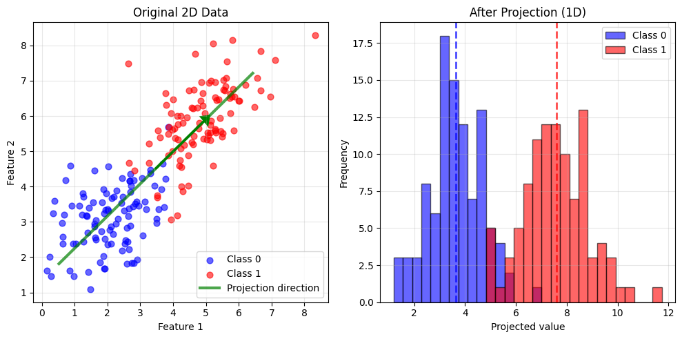
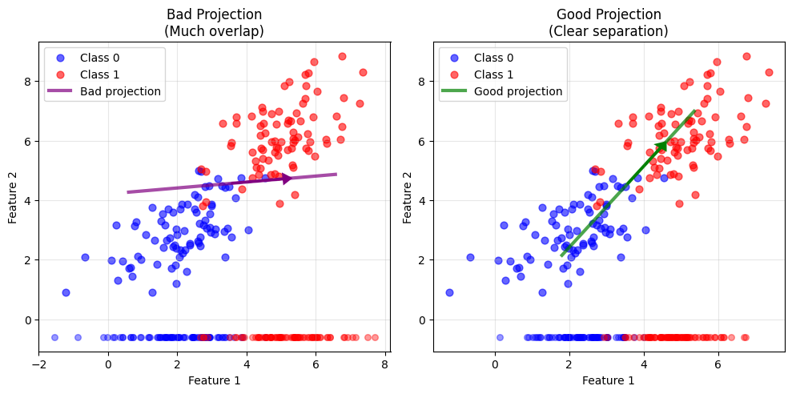

# Lesson 5: Linear Discriminant Analysis

## Finding the Best Projection for Classification

<div class="pt-12">
  <span class="text-xl">
    MPS311/439 Machine Learning<br>
    Dr. Wei Xing<br>
    2026–27
  </span>
</div>

---

# Where We Left Off

## Lesson 4: Logistic Regression

<div class="mt-8">

**Discriminative Approach**: Directly models $P(Y|X)$

- Uses **sigmoid function** to convert linear combinations into probabilities
- Optimizes the **decision boundary** directly  
- Learns to discriminate between classes

</div>

<div class="mt-10 p-6 bg-blue-50 rounded-lg">

**Today's Question**: What if we take a completely different approach?

What if we **project first**, then classify?

</div>

---

# Today's Journey

## Learning Outcomes

<div class="grid grid-cols-2 gap-8 mt-6">

<div class="p-2 border-2 border-blue-400 rounded-lg">

### Core Outcomes (All Students)

- ✅ Use `LinearDiscriminantAnalysis` and `QuadraticDiscriminantAnalysis` in sklearn
- ✅ Explain why LDA assumes **equal covariances**
- ✅ Describe when to use LDA vs QDA
- ✅ Understand **projection-based** classification
- ✅ Compare LDA vs Logistic Regression

</div>

<div class="p-4 border-2 border-purple-400 rounded-lg">

### Advanced Outcomes (MPS439)

- ✅ Understand Fisher's criterion mathematically
- ✅ Derive LDA decision boundaries
- ✅ Connect projection and generative perspectives

</div>

</div>

<div class="mt-4 text-center text-2xl font-bold text-blue-600">

Can we reduce dimensions while **improving** class separation?

</div>

---

# The Challenge: High-Dimensional Data

<div class="mt-3">

## Real-world examples have MANY features:

<div class="grid grid-cols-3 gap-6 mt-8">

<div class="text-center p-1 bg-green-50 rounded-lg">

**Medical Diagnosis**

Dozens of blood test measurements

</div>

<div class="text-center p-1 bg-blue-50 rounded-lg">

**Image Classification**

Thousands of pixel values

</div>

<div class="text-center p-1 bg-purple-50 rounded-lg">

**Text Classification**

Thousands of word frequencies

</div>

</div>

</div>

<div class="mt-4">

## Problems with high dimensions:

- 📊 Hard to **visualize** what's happening
- 💻 **Computationally expensive** to process
- 🎲 Prone to **overfitting** (curse of dimensionality)

</div>

<div class="mt-4 p-4 bg-yellow-50 border-l-4 border-yellow-400 rounded">

**Key Question**: Can we reduce dimensionality while preserving or enhancing class separation?

</div>

---

# The Power of Projection

<div class="flex justify-center mt-6">
  
</div>

<div class="mt-6 p-4 bg-blue-50 rounded-lg">

**Left**: Two classes (blue and red) overlap in 2D space

**Right**: Projected onto optimal line → classes separate in 1D!

</div>

<div class="mt-6 grid grid-cols-3 gap-4">

<div class="p-3 bg-green-100 rounded text-center">

✅ Reduced from **2D to 1D**

</div>

<div class="p-3 bg-green-100 rounded text-center">

✅ **Improved** separation

</div>

<div class="p-3 bg-green-100 rounded text-center">

✅ **Simpler** classification

</div>

</div>

---

# Not All Projections Are Equal

<div class="flex justify-center mt-6">
  
</div>

<div class="mt-6">

<div class="grid grid-cols-2 gap-6">

<div class="p-1 bg-red-50 rounded-lg border-2 border-red-400">

**Bad Projection** (Left)

Classes heavily overlap after projection

</div>

<div class="p-1 bg-green-50 rounded-lg border-2 border-green-400">

**Good Projection** (Right)

Classes clearly separated!

</div>

</div>

</div>

<div class="mt-8 text-center text-xl">

🤔 **Question**: What makes a projection "good"?

</div>

---

# What Makes a Projection "Good"?

<div class="mt-8">

## Two key principles:

<div class="grid grid-cols-2 gap-8 mt-8">

<div class="p-6 bg-blue-50 rounded-lg">

### 1. Maximize Distance

**Between projected class means**

<div class="mt-4">

Class centers should be **far apart**

</div>

<div class="mt-4 text-center text-4xl">

← → 

</div>

</div>

<div class="p-6 bg-purple-50 rounded-lg">

### 2. Minimize Spread

**Within each class**

<div class="mt-4">

Points in same class should be **tightly clustered**

</div>

<div class="mt-4 text-center text-4xl">

● ● ●

</div>

</div>

</div>

</div>

<div class="mt-8 p-4 bg-yellow-50 border-l-4 border-yellow-400 rounded text-lg">

**Fisher's Linear Discriminant** gives us the mathematical recipe to optimize both!

</div>

---

# Fisher's Linear Discriminant: The Core Idea

<div class="mt-2">

## Project data onto direction $\mathbf{w}$:

<div class="mt-2 text-center text-2xl p-1 bg-gray-50 rounded-lg">

$z = \mathbf{w}^T \mathbf{x}$

</div>

<div class="mt-2">

This is just a **dot product** - tells us "how much" of $\mathbf{x}$ lies along direction $\mathbf{w}$

</div>

</div>

<div class="mt-2 p-6 bg-blue-50 rounded-lg">

**The Goal**: Find $\mathbf{w}$ that maximizes class separation in projected space

</div>

<div class="mt-2 grid grid-cols-2 gap-6">

<div class="p-4 bg-gray-50 rounded">

**Historical Note**

Ronald Fisher, 1936

Still widely used today!

</div>

<div class="p-4 bg-gray-50 rounded">

**Why it works**

Elegant optimization problem with closed-form solution

</div>

</div>

---

# Fisher's Criterion: The Intuition

<div class="mt-2">

## The optimization objective:

<div class="mt-1 text-center text-2xl p-2 bg-gray-50 rounded-lg">

$J(\mathbf{w}) = \frac{\text{Between-class variance}}{\text{Within-class variance}}$

</div>

</div>

<div class="mt-2 grid grid-cols-2 gap-8">

<div class="p-2 bg-blue-50 rounded-lg">

### Numerator (Top)

**Between-class variance**

Pushes projected class means **apart**

Want this to be **LARGE**

</div>

<div class="p-2 bg-purple-50 rounded-lg">

### Denominator (Bottom)

**Within-class variance**

Keeps each class **tight**

Want this to be **SMALL**

</div>

</div>

<div class="mt-2 p-2 bg-green-50 border-l-4 border-green-400 rounded text-lg">

Maximizing this ratio finds the optimal projection direction $\mathbf{w}$

</div>

<div class="mt-2 text-center text-gray-600">

Think: Maximize signal (separation) while minimizing noise (spread)

</div>

---

# Fisher's Criterion: The Mathematics

<div class="mt-2">

## After projecting data: $z = \mathbf{w}^T \mathbf{x}$

<div class="mt-2 p-1 bg-blue-50 rounded-lg">

**Between-class variance** (numerator):

<div class="mt-2 text-center text-xl">

$(\tilde{\mu}_1 - \tilde{\mu}_0)^2 = (\mathbf{w}^T\boldsymbol{\mu}_1 - \mathbf{w}^T\boldsymbol{\mu}_0)^2 = \mathbf{w}^T(\boldsymbol{\mu}_1 - \boldsymbol{\mu}_0)(\boldsymbol{\mu}_1 - \boldsymbol{\mu}_0)^T\mathbf{w}$

</div>

<div class="mt-2 text-center">

where $\tilde{\mu}_k$ = projected mean of class $k$, and $\boldsymbol{\mu}_k$ = original mean

</div>

</div>

<div class="mt-2 p-1 bg-purple-50 rounded-lg">

**Within-class variance** (denominator):

<div class="mt-2 text-center text-xl">

$\tilde{s}_0^2 + \tilde{s}_1^2 = \mathbf{w}^T \mathbf{S}_W \mathbf{w}$

</div>

<div class="mt-2 text-center">

where $\mathbf{S}_W$ = within-class scatter matrix (measures spread within each class)

</div>

</div>

</div>

<div class="mt-2 p-2 bg-yellow-50 border-l-4 border-yellow-400 rounded">

**Solution**: $\mathbf{w} \propto \mathbf{S}_W^{-1}(\boldsymbol{\mu}_1 - \boldsymbol{\mu}_0)$ (derivation: take derivative, set to zero)

</div>

---

# How LDA Works: Step-by-Step

<div class="mt-8">

<div class="grid grid-cols-2 gap-6">

<div class="p-6 bg-blue-50 rounded-lg">

### Step 1: Compute Statistics

Calculate class means $\boldsymbol{\mu}_0, \boldsymbol{\mu}_1$

Calculate within-class scatter matrix $\mathbf{S}_W$

</div>

<div class="p-6 bg-green-50 rounded-lg">

### Step 2: Find Direction

Solve: $\mathbf{w} \propto \mathbf{S}_W^{-1}(\boldsymbol{\mu}_1 - \boldsymbol{\mu}_0)$

This is the optimal projection direction!

</div>

<div class="p-6 bg-purple-50 rounded-lg">

### Step 3: Project Data

Transform: $z_i = \mathbf{w}^T \mathbf{x}_i$

Now working in 1D space

</div>

<div class="p-6 bg-orange-50 rounded-lg">

### Step 4: Classify

Compare projected values to threshold

Simple 1D decision rule

</div>

</div>

</div>

<div class="mt-6 text-center text-gray-600">

Don't worry about the math details - sklearn does all this for you!

</div>

---

# Key Assumption: Equal Covariance

<div class="mt-6">

## LDA assumes all classes have the same "spread"

<div class="mt-2 p-2 bg-yellow-50 border-l-4 border-yellow-400 rounded-lg">

**Equal covariance matrices** for all classes → **LINEAR** decision boundary

</div>

</div>

<div class="mt-2">

## Visual intuition:

<div class="mt-2 text-center text-lg">

Both classes are Gaussian with **same shape**, just **different centers**

</div>

<div class="mt-2 grid grid-cols-2 gap-8">

<div class="p-2 bg-green-50 rounded text-center">

✅ **Class 0**: Circle-shaped cluster

</div>

<div class="p-4 bg-green-50 rounded text-center">

✅ **Class 1**: Circle-shaped cluster

</div>

</div>

</div>

<div class="mt-8 p-4 bg-purple-50 rounded-lg text-center text-xl">

🤔 What if the spreads are **different**? → **QDA** (coming soon!)

</div>

---

# LDA in Python with sklearn

<div class="mt-6">

## Incredibly simple to use:

<div class="mt-2">

```python
from sklearn.discriminant_analysis import LinearDiscriminantAnalysis

# Step 1: Initialize the model
lda = LinearDiscriminantAnalysis()

# Step 2: Fit to training data
lda.fit(X_train, y_train)

# Step 3: Make predictions
y_pred = lda.predict(X_test)
```

</div>

</div>

<div class="mt-2 p-2 bg-green-50 border-l-4 border-green-400 rounded-lg">

**That's it!** Just **3 lines** to use LDA

</div>

<div class="mt-2 p-2 bg-blue-50 rounded-lg">

**Bonus**: Access projection direction with `lda.coef_`

See how features contribute to classification!

</div>

<div class="mt-6 text-center text-2xl font-bold text-blue-600">

Let's see this in action! → Live Demo

</div>

---

# Interactive Demo 1: LDA on 2D Data

<div class="mt-6 p-6 bg-gray-100 rounded-lg text-center">

## 🖥️ Live Coding Session

**What we'll do:**

1. Generate synthetic 2D dataset with two classes
2. Fit LDA model
3. Visualize projection direction and decision boundary
4. Show 1D projected values

</div>

<div class="mt-8 p-6 bg-blue-50 border-l-4 border-blue-400 rounded-lg">

**Watch for**: How overlapping 2D classes become separated in 1D!

</div>

<div class="mt-6 text-center text-gray-600">

Code will be shared after class

Google Colab demonstration →

</div>

---

# Interactive Demo 2: Exploring Decision Boundaries

<div class="mt-6 p-6 bg-gray-100 rounded-lg text-center">

## 🖥️ Live Coding Session

**Comparing LDA vs Logistic Regression:**

1. Apply both methods to same dataset
2. Visualize decision boundaries side-by-side
3. Compare accuracies

</div>

<div class="mt-8 p-6 bg-purple-50 border-l-4 border-purple-400 rounded-lg">

**Key Insight**: Both are linear classifiers, but they find boundaries differently!

</div>

<div class="mt-6 text-center text-gray-600">

Google Colab demonstration →

</div>

---

# Beyond LDA: Quadratic Discriminant Analysis

<div class="mt-6">

## What if classes have **different spreads**?

<div class="mt-6 p-6 bg-blue-50 rounded-lg">

**QDA** allows each class its own covariance matrix

Result: **QUADRATIC (curved)** decision boundaries

</div>

</div>

<div class="mt-8 grid grid-cols-2 gap-8">

<div class="p-6 bg-green-50 rounded-lg border-2 border-green-400">

### LDA

Equal covariances

**Straight line** boundary

Fewer parameters

</div>

<div class="p-6 bg-purple-50 rounded-lg border-2 border-purple-400">

### QDA

Different covariances

**Curved** boundary

More flexible

</div>

</div>

<div class="mt-8">

```python
from sklearn.discriminant_analysis import QuadraticDiscriminantAnalysis

qda = QuadraticDiscriminantAnalysis()
qda.fit(X_train, y_train)
```

</div>

---

# When to Use LDA vs QDA

<div class="mt-2">

<div class="grid grid-cols-2 gap-6">

<div class="p-1 bg-blue-50 rounded-lg">

### LDA

**Assumptions:**
- Equal covariances

**Pros:**
- Simpler (fewer parameters)
- Works with **small datasets**
- More stable predictions

**Cons:**
- Less flexible
- Assumes linear boundary

**Use when:** Limited data, classes have similar spreads

</div>

<div class="p-1 bg-purple-50 rounded-lg">

### QDA

**Assumptions:**
- Different covariances allowed

**Pros:**
- More **flexible**
- Captures curved boundaries

**Cons:**
- Needs **more training data**
- More parameters → overfitting risk

**Use when:** Lots of data, classes have different shapes

</div>

</div>

</div>

<div class="mt-8 p-4 bg-yellow-50 border-l-4 border-yellow-400 rounded text-lg text-center">

**Rule of thumb**: Start with LDA, try QDA if you have abundant data and suspect different spreads

</div>

---

# Interactive Demo 3: LDA vs QDA vs Logistic Regression

<div class="mt-6 p-6 bg-gray-100 rounded-lg text-center">

## 🖥️ Live Coding Session

**Scenario**: Classes with **different spreads**

1. Create dataset violating equal covariance assumption
2. Compare all three methods
3. Visualize all decision boundaries
4. Compare accuracies

</div>

<div class="mt-8 p-6 bg-green-50 border-l-4 border-green-400 rounded-lg">

**Expected**: QDA wins when classes have different shapes!

</div>

<div class="mt-6 text-center text-gray-600">

Google Colab demonstration →

</div>

---

# Key Takeaways

<div class="mt-8">

<div class="grid grid-cols-2 gap-6">

<div class="space-y-4">

<div class="p-4 bg-blue-50 rounded-lg">

**1. Different Perspective**

LDA finds **optimal projection** for class separation

</div>

<div class="p-4 bg-green-50 rounded-lg">

**2. Dimensionality Reduction**

Automatically reduces dimensions while classifying

</div>

<div class="p-4 bg-purple-50 rounded-lg">

**3. Equal Covariance**

LDA assumes same spread → **linear** boundary

</div>

</div>

<div class="space-y-4">

<div class="p-4 bg-orange-50 rounded-lg">

**4. QDA for Flexibility**

Different covariances → **quadratic** boundary

</div>

<div class="p-4 bg-pink-50 rounded-lg">

**5. Easy in sklearn**

Just 3 lines of code!

</div>

<div class="p-4 bg-yellow-50 rounded-lg">

**6. Compare Methods**

Try LDA vs Logistic Regression on your data

</div>

</div>

</div>

</div>

<div class="mt-8 text-center text-2xl font-bold text-blue-600">

Different problems need different tools - experiment!

</div>

---

# Next Week Preview

<div class="mt-10 p-8 bg-gradient-to-r from-green-50 to-blue-50 rounded-lg">

## Lesson 6: Decision Trees

<div class="mt-6 text-xl">

A **completely different** paradigm!

</div>

<div class="mt-6 grid grid-cols-3 gap-6">

<div class="p-4 bg-white rounded-lg shadow">

❌ No linear combinations

</div>

<div class="p-4 bg-white rounded-lg shadow">

❌ No projections

</div>

<div class="p-4 bg-white rounded-lg shadow">

❌ No equations!

</div>

</div>

<div class="mt-8 text-lg">

Instead: Ask **yes/no questions** about features

"Is age > 30?" → "Is income > 50K?" → Predict!

</div>

</div>

<div class="mt-8 text-center text-gray-600">

Trees are incredibly intuitive and interpretable - perfect for explaining to non-technical stakeholders!

</div>

---
layout: center
class: text-center
---

# Thank You!

<div class="mt-8">

## Questions?

<div class="mt-8 text-lg">

**Office Hours**: Check course website

**Email**: w.xing@sheffield.ac.uk

**Next Session**: Lab on Friday - Hands-on practice with LDA/QDA on real datasets!

</div>

</div>

<div class="mt-12 p-6 bg-blue-50 rounded-lg">

Remember: The goal isn't to memorize formulas, but to understand the core ideas.

**LDA finds the best projection for separating classes** - everything else follows from that!

</div>

<!-- COURSE_FEEDBACK_QR:START -->
---
layout: center
class: text-center
---

# 30-second feedback

<p class="text-3xl mb-4">What would help you learn better next time?</p>

<p class="text-2xl mb-4">Scan to share anonymous feedback on today's lecture.</p>


<p class="text-sm mt-4 opacity-70">MPS311/439 · 2026-27 · Lesson 05 lecture</p>
<!-- COURSE_FEEDBACK_QR:END -->
