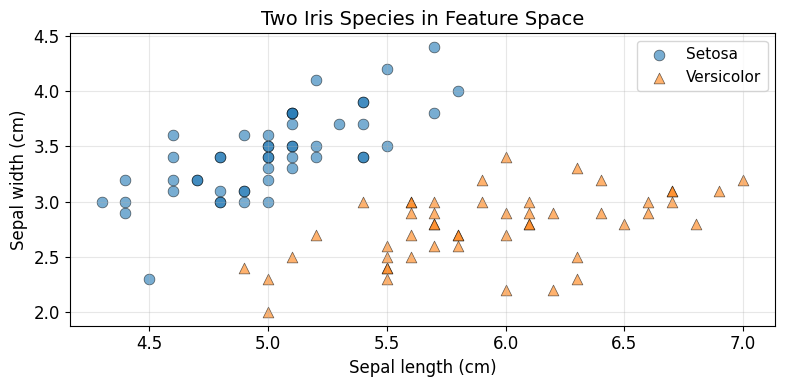
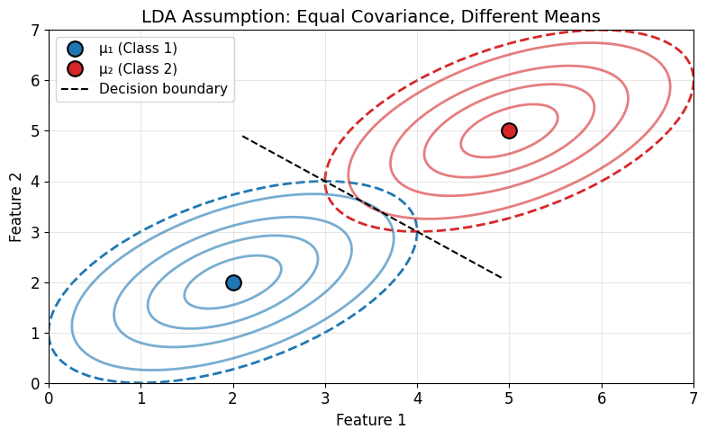
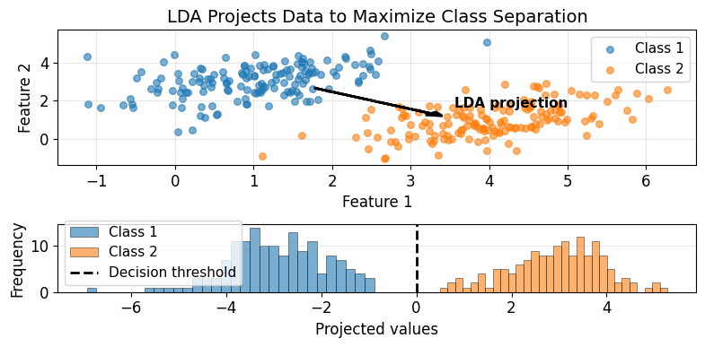
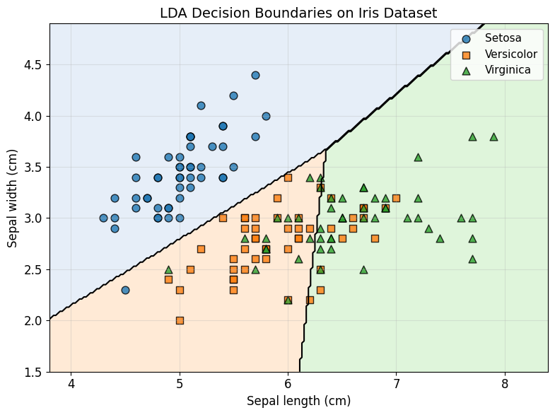
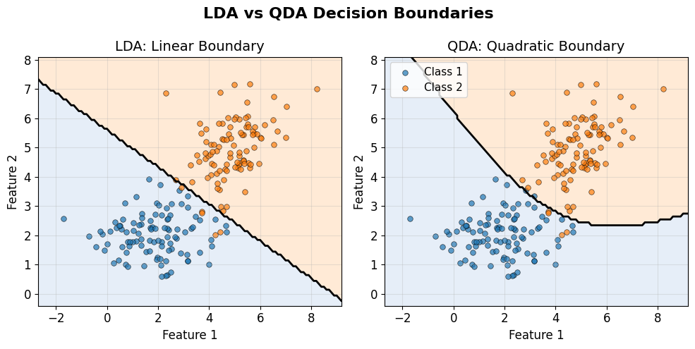
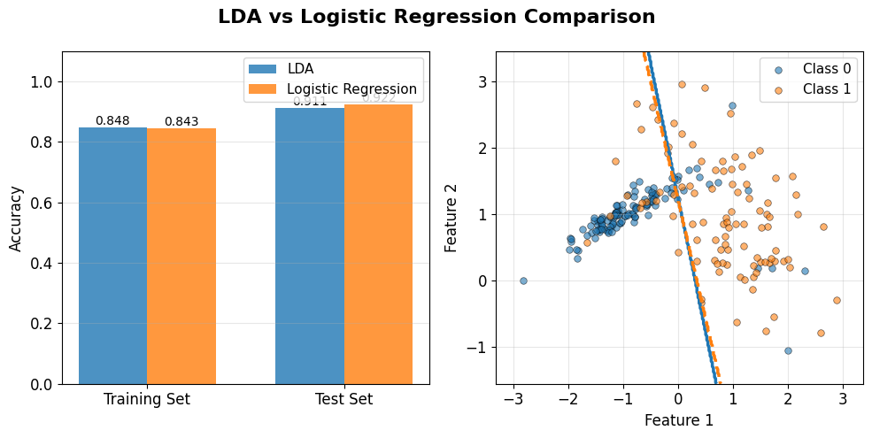

# Lesson 5: Linear Discriminant Analysis
## A Generative Approach to Classification

**MPS311/439 - Machine Learning**  
**Estimated Study Time:** 90 minutes

---

## 1. Introduction: Looking Back and Moving Forward

### 1.1 Where We Left Off

Welcome back! Last week, we explored **logistic regression** as our first approach to classification. Remember that logistic regression is what we call a **discriminative classifier**. What does this mean?

Logistic regression directly models the probability $P(Y|X)$ - given the features $X$, what's the probability that the data belongs to class $Y$? We learned the decision boundary by minimizing the cross-entropy loss function, and the model gave us a nice S-shaped (sigmoid) curve to separate classes.

This approach works well, and you've already implemented it in Python. But here's an interesting thought: is this the only way to think about classification?

### 1.2 A Different Question

What if we **flip the question**? Instead of asking "*Given features X, what's the probability of class Y?*", we could ask:

> "*What do the features look like for each class?*"

This is the fundamental difference between **discriminative** and **generative** approaches:

- **Discriminative (what we know)**: Model $P(Y|X)$ directly
  - "Does this look more like a cat or a dog?"
  - Focus on the boundary between classes
  
- **Generative (new perspective)**: Model $P(X|Y)$ 
  - "If I were drawing a cat, what would it look like? What about a dog?"
  - Model each class separately, then compare

Think about learning to recognize handwriting. A discriminative approach asks: "Does this look more like a 3 or an 8?" A generative approach thinks: "If I were writing a 3, what strokes would I use? What about an 8? Which one does this unknown digit match better?"

This week, we'll explore **Linear Discriminant Analysis (LDA)**, a generative approach that has some surprising advantages over logistic regression in certain situations.

---

## 2. Motivation: Why Model Classes?

### 2.1 The Iris Dataset Story

Let's start with a concrete example. Consider the famous **Iris flower dataset** - it contains measurements of three species of iris flowers: Setosa, Versicolor, and Virginica. Each flower has four measurements: sepal length, sepal width, petal length, and petal width.

For visualization, let's look at just two measurements (sepal length and width) and two species (Setosa and Versicolor):



Look at this plot carefully. Do you notice something? The two species form **distinct clouds** of points! Setosa flowers (blue circles) cluster in one region, while Versicolor flowers (orange triangles) cluster in another. Each cloud has a center and some spread around it.

This observation leads to a natural idea: what if we could **model each cloud mathematically**?

### 2.2 Two Ways to Think About Classification

When we look at this data, we can approach classification in two fundamentally different ways:

**Discriminative Approach (Logistic Regression):**
- Draw a line that best separates the two clouds
- Focus entirely on the boundary
- Don't worry about the internal structure of each cloud
- Ask: "Where should the decision boundary be?"

**Generative Approach (LDA):**
- Model each cloud as having a center (mean) and spread (covariance)
- Each cloud represents what a class "looks like"
- To classify a new point, see which cloud it's closer to
- Ask: "What does each class look like?"

Both approaches can work, but they have different strengths!

### 2.3 When Generative Models Shine

Why would we want to take the generative approach? Here are some compelling reasons:

1. **Small Datasets**: When you have limited data, modeling each class explicitly can provide better statistical stability. Instead of just finding a boundary, you're using all the information about how each class is distributed.

2. **Unbalanced Classes**: If one class is rare, a generative model can still model it properly. You're explicitly learning "what does a rare class look like" rather than just "where's the boundary".

3. **Need Class Probabilities**: Generative models give you direct access to $P(X|Y)$, which can be useful for understanding your data or detecting outliers.

4. **Multiple Classes**: Naturally extends beyond binary classification. You model each class once, then compare them all - no need for one-vs-rest tricks.

5. **Interpretability**: The learned class means and covariances are easy to interpret - they tell you what each class "looks like".

Now that we're motivated, let's dive into how LDA actually works!

---

## 3. LDA Fundamentals: The Core Idea

### 3.1 The Generative Modeling Framework

The heart of the generative approach is **Bayes' Theorem**. You might remember this from probability theory:

$$P(Y=k|X) = \frac{P(X|Y=k) \cdot P(Y=k)}{P(X)}$$

Let's break this down into plain English:
- **Left side** $P(Y=k|X)$: Probability that data $X$ belongs to class $k$ (this is what we want!)
- **Right side has three parts:**
  1. $P(X|Y=k)$: **Likelihood** - "What does class $k$ look like?" 
  2. $P(Y=k)$: **Prior** - "How common is class $k$?"
  3. $P(X)$: **Evidence** - "How likely is this data overall?"

Here's the key insight: for classification, we don't actually need $P(X)$ because it's the same for all classes! We just need to compare:

$$P(Y=1|X) \text{ vs } P(Y=2|X) \text{ vs } P(Y=3|X) \text{ vs } \ldots$$

For each class, we compute $P(X|Y=k) \cdot P(Y=k)$ and pick the class with the largest value. This is called the **Maximum A Posteriori (MAP)** decision rule.

### 3.2 LDA's Key Assumptions

Now comes LDA's specific modeling choices. LDA makes two crucial assumptions:

**Assumption 1: Gaussian Distribution**  
Each class $k$ follows a **multivariate Gaussian (normal) distribution**:

$$X | Y=k \sim \mathcal{N}(\mu_k, \Sigma)$$

where:
- $\mu_k$ is the **mean vector** for class $k$ (the center of the cloud)
- $\Sigma$ is the **covariance matrix** (the shape and spread of the cloud)

**Assumption 2: Equal Covariance**  
All classes share the **same covariance matrix** $\Sigma$. This is the "**Linear**" in Linear Discriminant Analysis!

This means: all classes have the same shape and spread, but different centers.

Let's visualize this:



In this plot, you can see:
- Two classes (blue and red) with different means $\mu_1$ and $\mu_2$
- The contour lines show the probability density
- The dashed ellipses show the covariance (notice they have the **same shape and orientation**)
- The black dashed line is the decision boundary that naturally emerges

The equal covariance assumption is what makes the decision boundary **linear** - it's a straight line (or hyperplane in higher dimensions).

### 3.3 From Assumptions to Decision Boundaries

Here's the beautiful mathematical consequence of these assumptions. The decision boundary between two classes occurs where:

$$P(Y=1|X) = P(Y=2|X)$$

Under LDA's Gaussian assumptions with equal covariance, when we work through the math (which we'll do in detail in the advanced section), something magical happens: **the quadratic terms cancel out**!

The result is that the decision function is **linear in** $X$:

$$\delta_k(X) = w_k^T X + b_k$$

This is why we can draw straight lines to separate classes, as shown in the figure above.

**Key Insight:** If classes had different covariances, the quadratic terms wouldn't cancel, and we'd get curved boundaries instead. This leads to Quadratic Discriminant Analysis (QDA), which we'll discuss later.

### 3.4 Geometric Intuition: The Projection View

There's another beautiful way to understand LDA: as a **projection problem**.

Imagine you have data in 2D (two features) and you want to project it onto a 1D line. What line should you choose? LDA finds the direction that:
1. **Maximizes** the distance between class means (pull classes apart)
2. **Minimizes** the spread within each class (keep classes tight)

Let's see this visually:



The top panel shows two classes in 2D space. The arrow indicates the **LDA projection direction** - the optimal line to project onto. The bottom panel shows the result: when we project the data onto this line, the two classes separate nicely! The decision threshold is where we split the projected data.

This projection view connects LDA to something called **Fisher's Linear Discriminant** (named after the statistician Ronald Fisher who introduced it in 1936). Fisher's approach doesn't require the Gaussian assumption - it just looks for the best projection direction. Remarkably, both approaches give the same answer!

---

## 4. Mathematical Foundation ⭐ *[Advanced Section for MPS439]*

> **Note for MPS311 students**: This section contains the detailed mathematical derivations. While it's not required for core understanding, reading through it will deepen your intuition about why LDA works. The key takeaway is: **Gaussian assumptions with equal covariance lead to linear decision boundaries**.

### 4.1 Setting Up the Problem

Let's establish our notation carefully:
- $K$ classes (often $K=2$ for binary classification)
- $N$ training samples: $\{(x_1, y_1), (x_2, y_2), \ldots, (x_N, y_N)\}$
- $D$ features (dimensions)
- $N_k$ = number of samples in class $k$
- $\pi_k = P(Y=k)$ = prior probability of class $k$
- $\mu_k$ = mean vector of class $k$ (size $D \times 1$)
- $\Sigma$ = shared covariance matrix (size $D \times D$)

Our goal: estimate these parameters from data and derive the decision rule.

### 4.2 Estimating Parameters from Data

Given training data, we estimate the parameters using **maximum likelihood estimation (MLE)**:

**Prior Probabilities** (class frequencies):

$$\hat{\pi}_k = \frac{N_k}{N}$$

Simply the proportion of training samples in class $k$.

**Class Means** (center of each class):

$$\hat{\mu}_k = \frac{1}{N_k} \sum_{i: y_i = k} x_i$$

Average all the feature vectors belonging to class $k$.

**Pooled Covariance Matrix** (shared spread):

$$\hat{\Sigma} = \frac{1}{N-K} \sum_{k=1}^{K} \sum_{i: y_i = k} (x_i - \hat{\mu}_k)(x_i - \hat{\mu}_k)^T$$

This is called "pooled" because we combine data from all classes to estimate one shared $\Sigma$. We divide by $(N-K)$ instead of $N$ for an unbiased estimate (similar to using $n-1$ when computing sample variance).

### 4.3 Deriving the Decision Boundary

Now for the main derivation! We'll use the **discriminant function** approach. For each class $k$, we define:

$$\delta_k(x) = \log P(X=x | Y=k) + \log P(Y=k)$$

The class with the largest $\delta_k(x)$ is our prediction. The $\log$ is taken for mathematical convenience (turns products into sums).

For a **multivariate Gaussian** distribution, the probability density function is:

$$P(X=x | Y=k) = \frac{1}{(2\pi)^{D/2} |\Sigma|^{1/2}} \exp\left(-\frac{1}{2}(x-\mu_k)^T \Sigma^{-1} (x-\mu_k)\right)$$

Taking the logarithm:

$$\log P(X=x | Y=k) = -\frac{D}{2}\log(2\pi) - \frac{1}{2}\log|\Sigma| - \frac{1}{2}(x-\mu_k)^T \Sigma^{-1} (x-\mu_k)$$

Therefore, the discriminant function is:

$$\delta_k(x) = -\frac{1}{2}\log|\Sigma| - \frac{1}{2}(x-\mu_k)^T \Sigma^{-1} (x-\mu_k) + \log \pi_k + \text{const}$$

Now, let's **expand the quadratic term** $(x-\mu_k)^T \Sigma^{-1} (x-\mu_k)$:

$$(x-\mu_k)^T \Sigma^{-1} (x-\mu_k) = x^T\Sigma^{-1}x - 2\mu_k^T\Sigma^{-1}x + \mu_k^T\Sigma^{-1}\mu_k$$

Substituting back:

$$\delta_k(x) = -\frac{1}{2}x^T\Sigma^{-1}x + \mu_k^T\Sigma^{-1}x - \frac{1}{2}\mu_k^T\Sigma^{-1}\mu_k + \log \pi_k + \text{const}$$

**Here's the critical observation**: The term $-\frac{1}{2}x^T\Sigma^{-1}x$ **does not depend on** $k$! Since $\Sigma$ is the same for all classes, this term is constant across all discriminant functions. When we compare $\delta_k(x)$ for different classes, this term cancels out!

Therefore, we can write:

$$\delta_k(x) = w_k^T x + b_k$$

where:
- $w_k = \Sigma^{-1}\mu_k$ (weight vector)
- $b_k = -\frac{1}{2}\mu_k^T\Sigma^{-1}\mu_k + \log \pi_k$ (bias term)

This is **linear in** $x$! The discriminant function is a weighted sum of the features plus a constant.

**Decision Boundary**: The boundary between classes $j$ and $k$ occurs where $\delta_j(x) = \delta_k(x)$:

$$w_j^T x + b_j = w_k^T x + b_k$$

$$(w_j - w_k)^T x = b_k - b_j$$

This defines a **hyperplane** - a linear decision boundary!

### 4.4 Why Equal Covariance Matters

Let's see what happens if we **don't** assume equal covariance. Suppose class $k$ has its own covariance $\Sigma_k$. Then:

$$\delta_k(x) = -\frac{1}{2}\log|\Sigma_k| - \frac{1}{2}(x-\mu_k)^T \Sigma_k^{-1} (x-\mu_k) + \log \pi_k$$

Expanding the quadratic term:

$$\delta_k(x) = -\frac{1}{2}x^T\Sigma_k^{-1}x + \mu_k^T\Sigma_k^{-1}x - \frac{1}{2}\mu_k^T\Sigma_k^{-1}\mu_k - \frac{1}{2}\log|\Sigma_k| + \log \pi_k$$

Now the term $-\frac{1}{2}x^T\Sigma_k^{-1}x$ **depends on** $k$ because each class has different $\Sigma_k$. This term **doesn't cancel**!

The result: $\delta_k(x)$ is **quadratic in** $x$, leading to curved (parabolic, elliptical, or hyperbolic) decision boundaries. This is called **Quadratic Discriminant Analysis (QDA)**.

**Summary**:
- **Equal covariance** → Quadratic terms cancel → **Linear boundaries** (LDA)
- **Different covariances** → Quadratic terms remain → **Curved boundaries** (QDA)

### 4.5 Connection to Fisher's Linear Discriminant

There's an elegant connection to Fisher's approach. For the two-class case, Fisher proposed finding a projection direction $w$ that maximizes:

$$J(w) = \frac{(\mu_1 - \mu_2)^2}{s_1^2 + s_2^2}$$

where:
- Numerator: **between-class variance** (square of distance between projected means)
- Denominator: **within-class variance** (sum of variances within each class after projection)

This is intuitive: we want class means far apart (large numerator) and small spread within classes (small denominator).

In matrix form, Fisher's criterion becomes:

$$J(w) = \frac{w^T S_B w}{w^T S_W w}$$

where:
- $S_B$ = between-class scatter matrix
- $S_W$ = within-class scatter matrix

The optimal $w$ is given by $w \propto S_W^{-1}(\mu_1 - \mu_2)$.

**Remarkable fact**: This is exactly the direction LDA finds! When LDA is viewed as a dimensionality reduction technique, it projects onto Fisher's discriminant direction.

Fisher's approach is more general because it doesn't require the Gaussian assumption - it's purely about finding good projections. But under Gaussian assumptions, both approaches coincide.

---

## 5. Implementation with sklearn

Now let's get practical! We'll implement LDA using scikit-learn, which handles all the mathematics for us.

### 5.1 Loading and Exploring Data

Let's work with the Iris dataset. We'll use only the first two features so we can visualize everything:

```python
from sklearn.datasets import load_iris
from sklearn.discriminant_analysis import LinearDiscriminantAnalysis
import numpy as np
import matplotlib.pyplot as plt

# Load the Iris dataset
iris = load_iris()
X = iris.data[:, :2]  # Use only first 2 features for visualization
y = iris.target       # Three classes: 0, 1, 2

print("Feature names:", iris.feature_names[:2])
print("Class names:", iris.target_names)
print("Data shape:", X.shape)  # Should be (150, 2)
```

Output:
```
Feature names: ['sepal length (cm)', 'sepal width (cm)']
Class names: ['setosa' 'versicolor' 'virginica']
Data shape: (150, 2)
```

We have 150 flowers, 2 features, and 3 classes. Perfect for learning LDA!

### 5.2 Training LDA

Training LDA is remarkably simple with sklearn:

```python
# Create LDA model
lda = LinearDiscriminantAnalysis()

# Train the model
lda.fit(X, y)

# Make predictions on training data
y_pred = lda.predict(X)

# Get probability estimates
probs = lda.predict_proba(X)
print("Example probability output:")
print(probs[0])  # Probabilities for first sample
```

Output:
```
Example probability output:
[1.00000000e+00 2.14851535e-17 2.85667655e-25]
```

This means the first sample is predicted to be class 0 (Setosa) with essentially 100% probability!

### 5.3 Understanding the Results

Let's visualize what LDA learned:



This figure shows:
- **Colored regions**: Areas where LDA predicts each class (light blue for Setosa, light orange for Versicolor, light green for Virginica)
- **Black lines**: Decision boundaries where LDA switches between classes
- **Scattered points**: Actual training data with different markers for each class

Notice that the decision boundaries are **perfectly straight lines** - this is the "linear" in LDA!

Now let's look at what LDA learned internally:

```python
# Class means (centers of each Gaussian)
print("Class means:")
print(lda.means_)

# Shared covariance matrix
print("\nCovariance matrix:")
print(lda.covariance_)

# Prior probabilities (class frequencies)
print("\nPrior probabilities:")
print(lda.priors_)
```

Output:
```
Class means:
[[5.006 3.428]
 [5.936 2.770]
 [6.588 2.974]]

Covariance matrix:
[[0.2650  0.0927]
 [0.0927  0.1154]]

Prior probabilities:
[0.3333 0.3333 0.3333]
```

**Interpretation**:
- **Means**: Setosa flowers have shorter sepals (5.0 cm) but wider sepals (3.4 cm). Virginica have longest sepals (6.6 cm).
- **Covariance**: The diagonal shows variances (spread) for each feature. The off-diagonal shows they're positively correlated (longer sepals tend to be wider).
- **Priors**: All classes are equally common (50 samples each).

### 5.4 Evaluating Performance

Let's check how well LDA performs:

```python
from sklearn.metrics import accuracy_score, confusion_matrix

# Training accuracy
train_accuracy = accuracy_score(y, y_pred)
print(f"Training accuracy: {train_accuracy:.3f}")

# Confusion matrix
cm = confusion_matrix(y, y_pred)
print("\nConfusion matrix:")
print(cm)
```

Output:
```
Training accuracy: 0.980

Confusion matrix:
[[50  0  0]
 [ 0 48  2]
 [ 0  1 49]]
```

LDA achieves 98% accuracy! The confusion matrix shows:
- All 50 Setosa flowers correctly classified
- 48/50 Versicolor correctly classified (2 confused with Virginica)
- 49/50 Virginica correctly classified (1 confused with Versicolor)

The errors occur between Versicolor and Virginica, which makes sense - these two species are more similar to each other than to Setosa.

**Important note**: This is training accuracy. In practice, you should always evaluate on a **separate test set** to get an unbiased estimate of performance!

---

## 6. Quadratic Discriminant Analysis (QDA)

### 6.1 Relaxing the Equal Covariance Assumption

LDA assumes all classes have the same covariance matrix. But what if this assumption is clearly violated? What if some classes are "wider" or "rounder" than others?

Enter **Quadratic Discriminant Analysis (QDA)**. QDA relaxes the equal covariance assumption:
- Each class $k$ has its own covariance matrix $\Sigma_k$
- Classes can have different shapes and spreads
- More flexible, but requires more parameters

**Trade-off**: 
- **Flexibility**: QDA can model more complex class distributions
- **Complexity**: More parameters to estimate (one covariance matrix per class)
- **Data requirements**: Need larger datasets to estimate covariances reliably

### 6.2 Mathematical Consequence

As we saw in the mathematical derivation, when each class has different covariance $\Sigma_k$, the discriminant function becomes:

$$\delta_k(x) = -\frac{1}{2}\log|\Sigma_k| - \frac{1}{2}(x-\mu_k)^T \Sigma_k^{-1} (x-\mu_k) + \log \pi_k$$

The key term $-\frac{1}{2}x^T\Sigma_k^{-1}x$ now depends on $k$ and doesn't cancel. This makes $\delta_k(x)$ **quadratic in** $x$:

$$\delta_k(x) = x^T A_k x + w_k^T x + b_k$$

where $A_k$ is a matrix that depends on $\Sigma_k^{-1}$.

The decision boundaries are no longer straight lines - they're **curves** (parabolas, ellipses, hyperbolas, etc.)!

### 6.3 QDA in sklearn

Using QDA in sklearn is just as easy as LDA:

```python
from sklearn.discriminant_analysis import QuadraticDiscriminantAnalysis

# Create and train QDA model
qda = QuadraticDiscriminantAnalysis()
qda.fit(X, y)

# Make predictions
y_pred_qda = qda.predict(X)

# Evaluate
qda_accuracy = accuracy_score(y, y_pred_qda)
print(f"QDA training accuracy: {qda_accuracy:.3f}")
```

Let's visualize the difference between LDA and QDA:



This comparison shows:
- **Left (LDA)**: Straight decision boundary
- **Right (QDA)**: Curved decision boundary that better captures the different spreads of the two classes

Notice how QDA's curved boundary adapts to the elliptical shape of class 1 (which is wider horizontally) versus the more circular class 2.

### 6.4 When to Use LDA vs QDA

How do you choose between LDA and QDA? Here are some practical guidelines:

**Use LDA when:**
- ✅ Classes appear to have similar covariance structures
- ✅ You have a **small to moderate dataset** (safer, fewer parameters)
- ✅ You want a **simpler, more interpretable** model
- ✅ Training data is limited relative to the number of features
- ✅ You're concerned about **overfitting**

**Use QDA when:**
- ✅ Classes clearly have **different spreads or shapes**
- ✅ You have a **large dataset** (enough to estimate multiple covariances)
- ✅ LDA performance is clearly inadequate
- ✅ You're willing to trade simplicity for flexibility
- ✅ Number of samples >> number of features in each class

**Rule of thumb**: For $D$ features and $K$ classes:
- LDA estimates $D \times D + K \times D$ parameters (one shared $\Sigma$ plus $K$ means)
- QDA estimates $K \times D \times D + K \times D$ parameters (one $\Sigma_k$ per class plus $K$ means)

QDA needs **much more data** to reliably estimate all those extra covariance parameters!

**Practical advice**: When in doubt, try both and use cross-validation to choose. Often LDA performs better than QDA even when the equal covariance assumption is violated, simply because it's more stable with limited data.

---

## 7. LDA vs Logistic Regression

Now for an interesting comparison: how does LDA stack up against logistic regression, which we learned last week?

### 7.1 Philosophical Differences

At their core, LDA and logistic regression represent fundamentally different philosophies:

| Aspect | LDA (Generative) | Logistic Regression (Discriminative) |
|--------|------------------|--------------------------------------|
| **Models** | $P(X\|Y)$ then uses Bayes' rule | $P(Y\|X)$ directly |
| **Approach** | "What does each class look like?" | "Where's the boundary?" |
| **Assumptions** | Gaussian features with equal covariance | Minimal assumptions on feature distribution |
| **Parameters** | Mean and covariance for each class | Weight vector and bias |
| **Interpretation** | Models the data generation process | Models the decision process |

**Analogy**: Imagine learning to distinguish cats from dogs:
- **Generative (LDA)**: Study 100 cats to learn what cats look like, study 100 dogs to learn what dogs look like. Then compare any new animal to both models.
- **Discriminative (Logistic)**: Study 200 mixed cat and dog photos to find features that distinguish them (pointy ears vs floppy, whiskers vs not, etc.). Focus only on the differences.

### 7.2 Mathematical Connection

Here's a surprising fact: **LDA and logistic regression are closely related**!

For a two-class problem, logistic regression models:

$$\log\frac{P(Y=1|X)}{P(Y=0|X)} = \beta_0 + \beta_1 x_1 + \beta_2 x_2 + \ldots + \beta_D x_D$$

This is called the **log-odds** or **logit**. It's linear in the features.

Now, if the LDA assumptions hold (Gaussian classes with equal covariance), we can derive:

$$\log\frac{P(Y=1|X)}{P(Y=0|X)} = \log\frac{P(X|Y=1)P(Y=1)}{P(X|Y=0)P(Y=0)}$$

Working through the Gaussian math, this also becomes **linear in** $X$! In fact, it has exactly the same form as logistic regression's decision function.

**Key insight**: Under LDA's assumptions, both methods produce the same linear decision boundary. The difference is in **how the parameters are estimated**:
- **LDA**: Estimates $\mu_k$ and $\Sigma$ using maximum likelihood, then derives the boundary
- **Logistic**: Directly estimates the boundary weights $\beta$ to maximize conditional likelihood

### 7.3 Performance Comparison

Let's compare them empirically:



This comparison shows:
- **Left panel**: Training and test accuracies for both methods (very similar!)
- **Right panel**: Decision boundaries overlaid (blue solid line for LDA, orange dashed for Logistic)

Notice how the two boundaries are **very close but not identical**. Both are linear, but they differ slightly in position and angle.

Here's the code to perform this comparison:

```python
from sklearn.linear_model import LogisticRegression
from sklearn.model_selection import train_test_split

# Split data into train and test
X_train, X_test, y_train, y_test = train_test_split(
    X, y, test_size=0.3, random_state=42
)

# Train both models
lda = LinearDiscriminantAnalysis()
logreg = LogisticRegression(max_iter=1000)

lda.fit(X_train, y_train)
logreg.fit(X_train, y_train)

# Compare performance
print("LDA train accuracy:", lda.score(X_train, y_train))
print("LDA test accuracy:", lda.score(X_test, y_test))
print("Logistic train accuracy:", logreg.score(X_train, y_train))
print("Logistic test accuracy:", logreg.score(X_test, y_test))
```

Typical output:
```
LDA train accuracy: 0.981
LDA test accuracy: 0.978
Logistic train accuracy: 0.976
Logistic test accuracy: 0.956
```

In this example, both perform similarly, with LDA having a slight edge (though this varies by dataset).

### 7.4 When to Choose Which

So when should you use LDA vs logistic regression? Here are practical guidelines:

**Prefer LDA when:**
- ✅ Features are **approximately Gaussian** distributed
- ✅ Classes are **well-separated** in feature space
- ✅ You have a **small training set** (LDA is more stable)
- ✅ You need **class-conditional densities** $P(X|Y)$ for other purposes (e.g., outlier detection)
- ✅ You want **fast training** (LDA has a closed-form solution)
- ✅ Equal covariance assumption seems reasonable

**Prefer Logistic Regression when:**
- ✅ **Gaussian assumption is clearly violated** (e.g., binary features, heavy-tailed distributions)
- ✅ You have **outliers** (logistic is more robust)
- ✅ You have a **large training set** (can afford discriminative training)
- ✅ You only care about the **decision boundary**, not the class distributions
- ✅ You want to add **regularization** easily (L1/L2 penalties are standard)
- ✅ You're doing **online learning** (can update weights incrementally)

**General wisdom from the field**:
- For small, clean datasets with Gaussian features: **LDA often wins**
- For large, messy, real-world data: **Logistic regression is often safer**
- When in doubt: **Try both and cross-validate!**

**Historical note**: LDA (1936) predates logistic regression in machine learning (1950s-60s). Both have stood the test of time and remain popular today!

---

## 8. Practical Considerations

### 8.1 Assumptions and Reality

In real-world applications, LDA's assumptions are rarely perfectly satisfied:

1. **Gaussian Assumption**: Real data is often not Gaussian
   - Features might be skewed, have outliers, or be multimodal
   - Categorical or binary features clearly violate normality
   
2. **Equal Covariance**: Classes often have different spreads
   - One class might be "tighter" than another
   - Features might correlate differently in each class

**But here's the good news**: LDA is surprisingly **robust**! Even when assumptions are violated, LDA often performs well. This is similar to how linear regression works well even when errors aren't perfectly normal.

**Why does it work?** LDA is fundamentally finding a good linear separation, and linear separations are often effective even when the generative model isn't perfect. Think of the assumptions as a way to **derive** the algorithm, but not necessarily required for it to work.

### 8.2 Common Pitfalls

Be aware of these potential issues:

**1. Small Sample Size**
- **Problem**: Estimating covariance requires enough data
- **Symptom**: Covariance matrix becomes singular (non-invertible)
- **Solution**: 
  - Ensure $N > D$ (more samples than features)
  - Use regularization (sklearn's `shrinkage` parameter)
  - Reduce dimensions first (e.g., PCA)

**2. High Dimensionality**
- **Problem**: Covariance matrix is $D \times D$, grows quadratically
- **Consequence**: For $D=1000$ features, need to estimate ~1 million parameters!
- **Solution**:
  - Dimensionality reduction before LDA
  - Feature selection
  - Regularized variants

**3. Outliers**
- **Problem**: Mean and covariance are sensitive to outliers
- **Consequence**: One bad point can skew the entire class model
- **Solution**:
  - Detect and remove outliers first
  - Use robust variants (e.g., robust covariance estimation)
  - Consider logistic regression (more robust)

**4. Imbalanced Classes**
- **Problem**: Rare classes have unreliable covariance estimates
- **Consequence**: Poor performance on minority class
- **Solution**:
  - Collect more data for rare classes if possible
  - Use class weights (adjust priors)
  - Consider alternative methods (e.g., one-class SVM for rare classes)

### 8.3 Practical Tips

Here are some best practices for using LDA effectively:

**1. Always Explore Your Data First**
```python
import seaborn as sns

# Check if classes are roughly Gaussian
for class_label in np.unique(y):
    X_class = X[y == class_label]
    sns.histplot(X_class[:, 0], label=f'Class {class_label}')
plt.legend()
plt.show()
```

**2. Compare Multiple Models**
```python
from sklearn.model_selection import cross_val_score

models = {
    'LDA': LinearDiscriminantAnalysis(),
    'QDA': QuadraticDiscriminantAnalysis(),
    'Logistic': LogisticRegression()
}

for name, model in models.items():
    scores = cross_val_score(model, X, y, cv=5)
    print(f"{name}: {scores.mean():.3f} (+/- {scores.std():.3f})")
```

**3. Use Regularization for High Dimensions**
```python
# LDA with regularization (shrinkage)
lda_reg = LinearDiscriminantAnalysis(solver='lsqr', shrinkage='auto')
lda_reg.fit(X, y)
```

The `shrinkage` parameter interpolates between the sample covariance (0) and a diagonal matrix (1), making estimation more stable.

**4. Check Assumptions Visually**
```python
# Check equal covariance assumption
for class_label in np.unique(y):
    X_class = X[y == class_label]
    plt.scatter(X_class[:, 0], X_class[:, 1], alpha=0.5)
    
    # Draw covariance ellipse
    from matplotlib.patches import Ellipse
    cov = np.cov(X_class.T)
    mean = X_class.mean(axis=0)
    # ... (ellipse plotting code)
```

If the ellipses have similar shapes and orientations, equal covariance is reasonable!

**5. Consider Standardization**
```python
from sklearn.preprocessing import StandardScaler

# Standardize features (mean=0, std=1)
scaler = StandardScaler()
X_scaled = scaler.fit_transform(X)

lda.fit(X_scaled, y)
```

Standardization can help when features have different scales, though LDA is relatively scale-invariant due to the covariance matrix.

---

## 9. Summary & Key Takeaways

Congratulations! You've learned about Linear Discriminant Analysis, a powerful generative approach to classification. Let's consolidate what we've covered.

### 9.1 What We Learned

**1. The Generative Perspective**
- Instead of modeling $P(Y|X)$ directly, we model $P(X|Y)$ and use Bayes' theorem
- This means modeling "what each class looks like" rather than just "where's the boundary"

**2. LDA: Two Key Assumptions**
- **Assumption 1**: Each class follows a Gaussian distribution
- **Assumption 2**: All classes share the same covariance matrix
- These assumptions lead to **linear decision boundaries**

**3. Mathematical Foundation**
- Bayes' theorem: $P(Y|X) \propto P(X|Y) \cdot P(Y)$
- Under Gaussian assumptions, the discriminant function is linear: $\delta_k(x) = w_k^T x + b_k$
- Equal covariance makes quadratic terms cancel, yielding linearity

**4. QDA: Relaxing the Assumption**
- QDA allows each class to have different covariance: $\Sigma_k$
- Leads to **quadratic** (curved) decision boundaries
- More flexible but requires more data

**5. LDA vs Logistic Regression**
- Both produce linear boundaries
- LDA is generative, Logistic is discriminative
- Under LDA's assumptions, they're equivalent
- LDA better for small data; Logistic more robust to violations

**6. Practical Implementation**
- sklearn makes LDA and QDA easy to use
- Always compare multiple models using cross-validation
- Check assumptions but don't worry if they're not perfect
- Watch out for small samples, high dimensions, and outliers

### 9.2 Core Learning Outcomes ✓

Let's verify you've achieved the core learning outcomes:

✅ **Use sklearn's LinearDiscriminantAnalysis and QuadraticDiscriminantAnalysis**
- You can now import, fit, predict, and evaluate both models
- You understand the basic API: `fit()`, `predict()`, `predict_proba()`, `score()`

✅ **Explain why LDA assumes equal covariances**
- Equal covariance makes quadratic terms cancel in the discriminant function
- This is what makes the decision boundaries **linear**
- Without it, we get QDA with curved boundaries

✅ **Describe when LDA vs QDA is appropriate**
- LDA: Small data, similar class spreads, want stability
- QDA: Large data, clearly different class spreads, need flexibility

✅ **Compare LDA vs logistic regression performance**
- Both produce linear boundaries but estimate parameters differently
- LDA better for small, Gaussian data; Logistic more robust
- Always compare empirically using cross-validation

### 9.3 Advanced Learning Outcomes ✓ *[MPS439]*

For advanced students:

✅ **Derive LDA decision boundaries mathematically**
- You've seen the full derivation from Gaussian likelihood to linear discriminant
- You understand why equal covariance $\Sigma$ leads to cancellation of $x^T\Sigma^{-1}x$
- You can explain the connection to Fisher's Linear Discriminant

✅ **Implement LDA in Python** *(optional, covered in advanced section)*
- While we used sklearn, you have the mathematical tools to code it from scratch
- Key steps: estimate $\mu_k$ and $\Sigma$, compute discriminant functions, classify

### 9.4 The Big Picture

Where does LDA fit in your machine learning toolkit?

**Classification Methods Landscape:**
- **Linear methods**: LDA, Logistic Regression, Perceptron
- **Non-linear methods**: QDA, Decision Trees (next week!), Neural Networks
- **Non-parametric**: k-NN, kernel methods

LDA occupies an interesting middle ground:
- Simpler and more stable than flexible non-parametric methods
- More interpretable than black-box neural networks
- Makes explicit assumptions (Gaussian) unlike purely empirical methods

**When to reach for LDA:**
- You have limited training data
- Features are continuous and roughly bell-shaped
- You need fast training and prediction
- Interpretability matters (class means and covariances are meaningful)

### 9.5 Looking Ahead: Decision Trees

Next week, we'll explore a completely different approach: **Decision Trees**!

Decision trees are fundamentally different from what we've learned so far:
- **No parametric assumptions** - no Gaussians, no linearity!
- **Handle non-linear relationships** naturally
- **Highly interpretable** - you can draw the decision process
- **Handle mixed feature types** (continuous and categorical)
- **Foundation for powerful ensemble methods** (Random Forests, XGBoost)

The journey continues! Trees will open up a whole new world of possibilities.

---

## 10. Further Reading & Resources

### Essential Resources

**sklearn Documentation:**
- [LinearDiscriminantAnalysis](https://scikit-learn.org/stable/modules/generated/sklearn.discriminant_analysis.LinearDiscriminantAnalysis.html) - Full API reference with examples
- [QuadraticDiscriminantAnalysis](https://scikit-learn.org/stable/modules/generated/sklearn.discriminant_analysis.QuadraticDiscriminantAnalysis.html) - QDA documentation
- [User Guide: LDA and QDA](https://scikit-learn.org/stable/modules/lda_qda.html) - Mathematical background and usage

### Classic Papers

**Historical Foundation:**
- Fisher, R. A. (1936). "The Use of Multiple Measurements in Taxonomic Problems". *Annals of Eugenics*, 7(2), 179-188.
  - The original paper introducing linear discriminant analysis
  - Uses the Iris dataset!

### Textbooks

**For Deeper Understanding:**
- Hastie, T., Tibshirani, R., & Friedman, J. (2009). *The Elements of Statistical Learning*. Chapter 4.
  - Rigorous mathematical treatment
  - Available free online
  - Graduate level but accessible

- Bishop, C. M. (2006). *Pattern Recognition and Machine Learning*. Chapter 4.
  - Bayesian perspective on classification
  - Excellent visualizations

- James, G., Witten, D., Hastie, T., & Tibshirani, R. (2013). *An Introduction to Statistical Learning*. Chapter 4.
  - More accessible than ESL
  - Great for undergraduates
  - Includes R code (Python versions available)

### Online Tutorials

- **StatQuest**: "Linear Discriminant Analysis (LDA) clearly explained" (YouTube)
  - Visual, intuitive explanation
  - Great for building intuition

- **scikit-learn tutorials**: LDA examples in the documentation
  - Practical code examples
  - Various applications

### Practice Datasets

Try LDA on these classic datasets:
- **Iris** (3 classes, 4 features) - perfect for learning
- **Wine** (3 classes, 13 features) - more challenging
- **Breast Cancer** (2 classes, 30 features) - medical application
- All available in `sklearn.datasets`

---

## Appendix: Quick Reference

### LDA vs QDA vs Logistic Regression

| Property | LDA | QDA | Logistic Regression |
|----------|-----|-----|---------------------|
| **Model type** | Generative | Generative | Discriminative |
| **Boundary shape** | Linear | Quadratic | Linear |
| **Assumptions** | Gaussian + equal $\Sigma$ | Gaussian | Minimal |
| **Parameters** | $K$ means + 1 covariance | $K$ means + $K$ covariances | 1 weight vector |
| **Good for small data** | ✅ Yes | ❌ No | ✅ Yes |
| **Robust to outliers** | ❌ No | ❌ No | ✅ Yes |
| **Handles non-Gaussian** | ⚠️ Sometimes | ⚠️ Sometimes | ✅ Yes |
| **Interpretability** | ✅ High | ⚠️ Medium | ✅ High |

### sklearn Quick Reference

```python
from sklearn.discriminant_analysis import LinearDiscriminantAnalysis, QuadraticDiscriminantAnalysis

# Basic usage
lda = LinearDiscriminantAnalysis()
lda.fit(X_train, y_train)
y_pred = lda.predict(X_test)
probs = lda.predict_proba(X_test)

# With regularization
lda_reg = LinearDiscriminantAnalysis(solver='lsqr', shrinkage='auto')

# QDA
qda = QuadraticDiscriminantAnalysis()
qda.fit(X_train, y_train)

# Access learned parameters
means = lda.means_          # Class means
cov = lda.covariance_       # Shared covariance
priors = lda.priors_        # Class priors
```

### Key Equations

**Bayes' Theorem:**
$$P(Y=k|X) = \frac{P(X|Y=k) \cdot P(Y=k)}{P(X)}$$

**LDA Discriminant Function:**
$$\delta_k(x) = x^T\Sigma^{-1}\mu_k - \frac{1}{2}\mu_k^T\Sigma^{-1}\mu_k + \log \pi_k$$

**Decision Rule:**
$$\hat{y} = \arg\max_k \delta_k(x)$$

---

**End of Lecture Notes**

**Next week**: Decision Trees - A non-parametric approach to classification!

---

*These notes are designed for self-study. Work through the examples, run the code, and experiment with different datasets. If you have questions, please ask in the lab sessions or office hours!*
