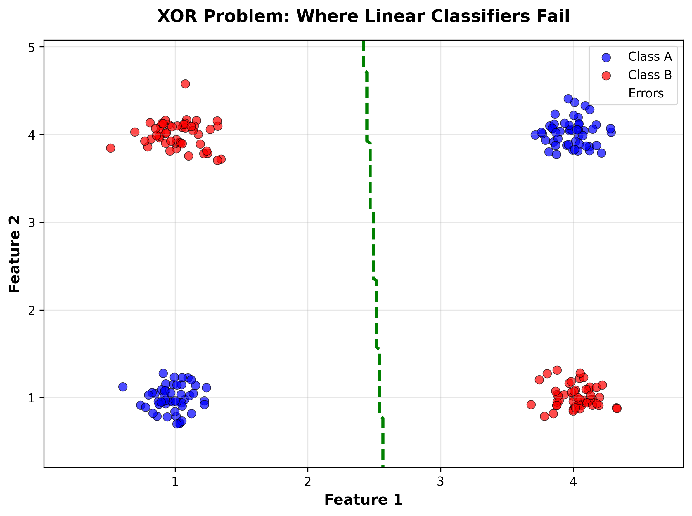

# Lesson 6 Decision Trees - Figure Generation

## Overview
This package contains the Python script and all generated figures for the Lesson 6 Decision Trees lecture notes (MPS311/439 - Machine Learning Course).

## Contents

### Python Script
- **`figure_gen.py`** - Generates all 8 figures for the lecture notes

### Generated Figures
All figures are saved in the `./figures/` directory:

1. **`fig_xor_linear_fail.png`** (245 KB)
   - Shows XOR problem where linear classifiers fail
   - Demonstrates the limitation of linear decision boundaries
   - 8" × 6" scatter plot with linear boundary overlay

2. **`fig_nested_boundaries.png`** (287 KB)
   - Nested/circular class boundaries
   - Shows when LDA/QDA struggle with complex patterns
   - 8" × 6" scatter plot with QDA boundary

3. **`fig_simple_tree_example.png`** (363 KB)
   - Decision tree visualization on Iris dataset
   - Shows tree structure with nodes, splits, and leaves
   - 12" × 8" tree diagram with depth=3

4. **`fig_gini_entropy_comparison.png`** (203 KB)
   - Comparison of Gini impurity vs Entropy
   - Line plots showing both splitting criteria
   - 10" × 5" single plot

5. **`fig_tree_decision_boundary.png`** (319 KB)
   - Side-by-side comparison of shallow vs deep trees
   - Shows decision boundaries for depth=2 and depth=8
   - 12" × 5" (2 panels)

6. **`fig_overfitting_comparison.png`** (468 KB)
   - Comprehensive 2×2 grid showing overfitting
   - Top: shallow vs deep tree decision boundaries
   - Bottom: training/test accuracy curves and Gini impurity
   - 12" × 10" (4 panels)

7. **`fig_tree_instability.png`** (472 KB)
   - Shows tree instability with bootstrap samples
   - 5 different trees from same underlying data
   - 15" × 6" (5 panels in 2×3 grid)

8. **`fig_ensemble_comparison.png`** (195 KB)
   - Comparison of Decision Tree, Random Forest, and XGBoost
   - Bar plots showing accuracy and training time
   - 10" × 8" (2 stacked panels)

**Total size: ~2.5 MB**

## Requirements

The script requires the following Python packages:

```bash
pip install numpy matplotlib scikit-learn xgboost
```

### Package Versions (tested):
- numpy >= 1.21.0
- matplotlib >= 3.4.0
- scikit-learn >= 1.0.0
- xgboost >= 1.5.0

## Usage

### Running the Script

Simply run the script from the command line:

```bash
python figure_gen.py
```

The script will:
1. Create a `./figures/` directory (if it doesn't exist)
2. Generate all 8 figures with progress updates
3. Save all figures as high-resolution PNG files (300 DPI)

### Output

```
============================================================
FIGURE GENERATION FOR LESSON 6: DECISION TREES
MPS311/439 - Machine Learning Course
============================================================

Starting figure generation...

Generating Figure 1: XOR Linear Fail...
  ✓ Saved: fig_xor_linear_fail.png
Generating Figure 2: Nested Boundaries...
  ✓ Saved: fig_nested_boundaries.png
...
(continues for all 8 figures)

============================================================
✓ ALL FIGURES GENERATED SUCCESSFULLY!
============================================================
```

## Script Features

### Design Principles
- **Reproducibility**: Fixed random seeds (seed=42) for consistent results
- **High Quality**: 300 DPI resolution for publication-quality figures
- **Clean Code**: Well-commented, modular functions for each figure
- **Educational Focus**: Figures designed for undergraduate teaching
- **Minimal Dependencies**: Only uses core scientific Python packages

### Figure Generation Functions

Each figure has its own function:
- `generate_fig_xor_linear_fail()` - Figure 1
- `generate_fig_nested_boundaries()` - Figure 2
- `generate_fig_simple_tree_example()` - Figure 3
- `generate_fig_gini_entropy_comparison()` - Figure 4
- `generate_fig_tree_decision_boundary()` - Figure 5
- `generate_fig_overfitting_comparison()` - Figure 6
- `generate_fig_tree_instability()` - Figure 7
- `generate_fig_ensemble_comparison()` - Figure 8

## Customization

### Modifying Figures

You can easily customize any figure by editing the corresponding function in `figure_gen.py`:

**Example: Change colors in XOR plot**
```python
# In generate_fig_xor_linear_fail()
scatter_a = ax.scatter(X[y==0, 0], X[y==0, 1], 
                      c='blue',  # Change to 'green'
                      s=50, alpha=0.7, ...)
```

**Example: Adjust figure size**
```python
# Change from 8×6 to 10×8
fig, ax = plt.subplots(figsize=(10, 8))  # Was (8, 6)
```

**Example: Change random seed**
```python
# At the top of the script
np.random.seed(42)  # Change to any integer for different data
```

### Adding New Figures

To add a new figure:

1. Create a new function following the naming pattern:
```python
def generate_fig_new_figure():
    print("Generating Figure X: New Figure...")
    
    # Your figure generation code here
    fig, ax = plt.subplots(figsize=(8, 6))
    # ... plotting code ...
    
    plt.savefig('./figures/fig_new_figure.png', bbox_inches='tight')
    plt.close()
    print("  ✓ Saved: fig_new_figure.png")
```

2. Call it in the `main()` function:
```python
def main():
    # ... existing calls ...
    generate_fig_new_figure()
```

## Technical Details

### Figure Specifications

All figures follow these specifications:
- **Format**: PNG (Portable Network Graphics)
- **Resolution**: 300 DPI (print quality)
- **Color Space**: RGB
- **Compression**: Standard PNG compression
- **Background**: White

### Matplotlib Configuration

```python
plt.style.use('default')
plt.rcParams['figure.dpi'] = 100      # Display DPI
plt.rcParams['savefig.dpi'] = 300     # Save DPI
plt.rcParams['font.size'] = 10        # Base font size
```

### Data Generation Details

- **XOR Dataset**: 4 clusters (50 samples each) with Gaussian noise (σ=0.15)
- **Nested Circles**: 100 samples per class, inner radius 0-2, outer radius 2-4
- **Moons Dataset**: sklearn's `make_moons` with 200 samples, noise=0.25
- **Wine Dataset**: sklearn's built-in Wine dataset (178 samples, 13 features, 3 classes)
- **Iris Dataset**: sklearn's built-in Iris dataset (150 samples, 4 features, 3 classes)

## Troubleshooting

### Common Issues

**Issue**: `ModuleNotFoundError: No module named 'xgboost'`
```bash
# Solution:
pip install xgboost --break-system-packages
```

**Issue**: Figures are blurry or low resolution
```python
# Solution: Check DPI settings
plt.rcParams['savefig.dpi'] = 300  # Increase if needed
```

**Issue**: Script runs slowly
```python
# This is normal! Generating 8 high-quality figures with:
# - Bootstrap sampling (Figure 7)
# - Cross-validation (Figure 8)
# - Multiple model training
# Typical runtime: 10-30 seconds depending on your machine
```

**Issue**: Out of memory error
```python
# Solution: Reduce mesh resolution for decision boundaries
xx, yy = np.meshgrid(np.linspace(x_min, x_max, 100),  # Was 200
                     np.linspace(y_min, y_max, 100))
```

## Integration with Lecture Notes

These figures are designed to be referenced in the lecture notes as:

```markdown

*Figure 1: The XOR problem demonstrates where linear classifiers fail.*
```

Or for LaTeX:

```latex
\begin{figure}[h]
  \centering
  \includegraphics[width=0.8\textwidth]{figures/fig_xor_linear_fail.png}
  \caption{The XOR problem demonstrates where linear classifiers fail.}
  \label{fig:xor_fail}
\end{figure}
```

## Figure Usage Guidelines

### For Teaching
- ✓ Use in lecture slides
- ✓ Include in course materials
- ✓ Share with students
- ✓ Modify for specific teaching needs

### Quality Checks
Before using in lecture notes, verify:
- [ ] All text is readable at target size
- [ ] Colors are distinguishable (accessibility)
- [ ] Legends are clear and informative
- [ ] Axis labels are present and descriptive
- [ ] Titles are informative and concise

## Contact & Support

For questions about the figures or script:
- **Course**: MPS311/439 Machine Learning
- **Instructor**: Dr. Wei Xing
- **Email**: w.xing@sheffield.ac.uk

## Version History

- **v1.0** (November 2025)
  - Initial release
  - 8 figures for Decision Trees lecture
  - Full documentation

## License

These materials are created for educational purposes as part of the MPS311/439 Machine Learning course at the University of Sheffield.

---

**Note**: This script generates figures with random data. While random seeds ensure reproducibility, the actual data values may differ slightly from the examples shown in the lecture notes. The pedagogical concepts remain consistent.

---

*Generated by figure_gen.py for Lesson 6: Decision Trees*
*MPS311/439 - Machine Learning Course*
*University of Sheffield, November 2025*
