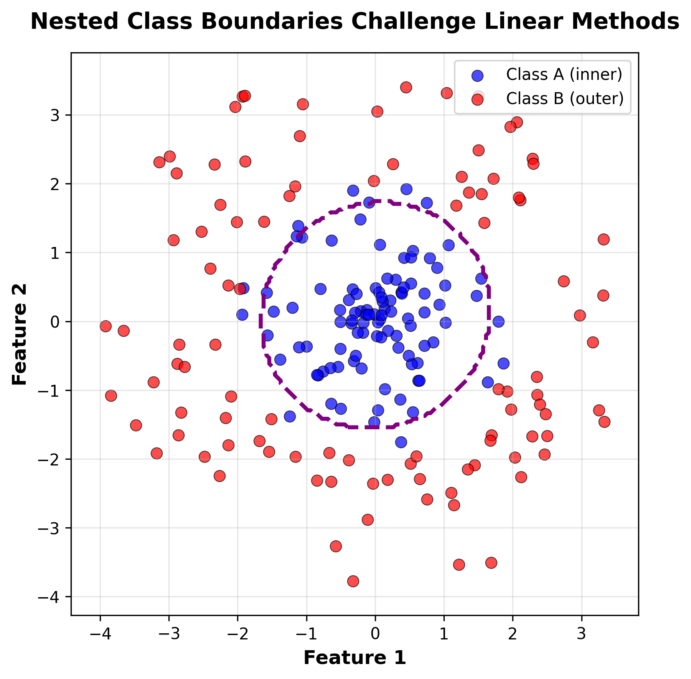
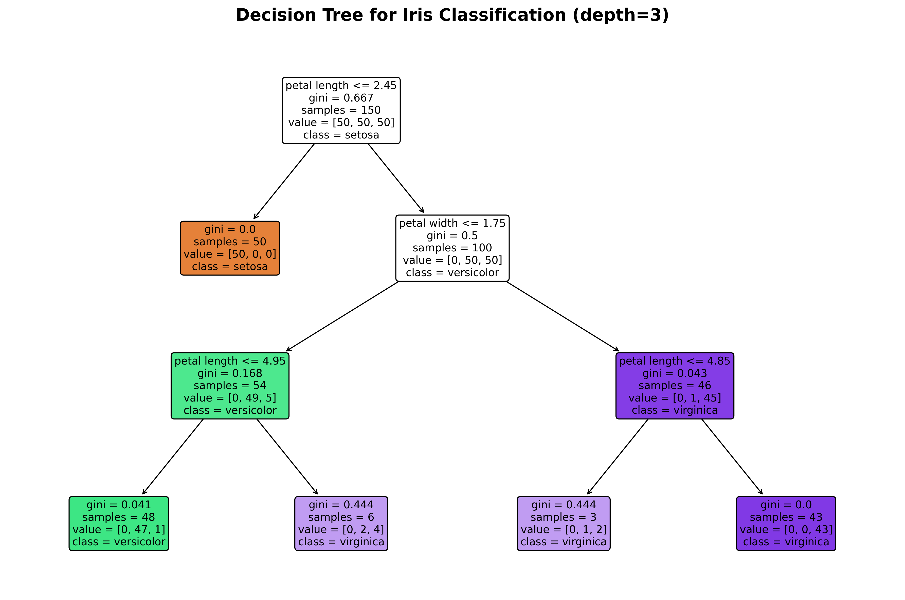
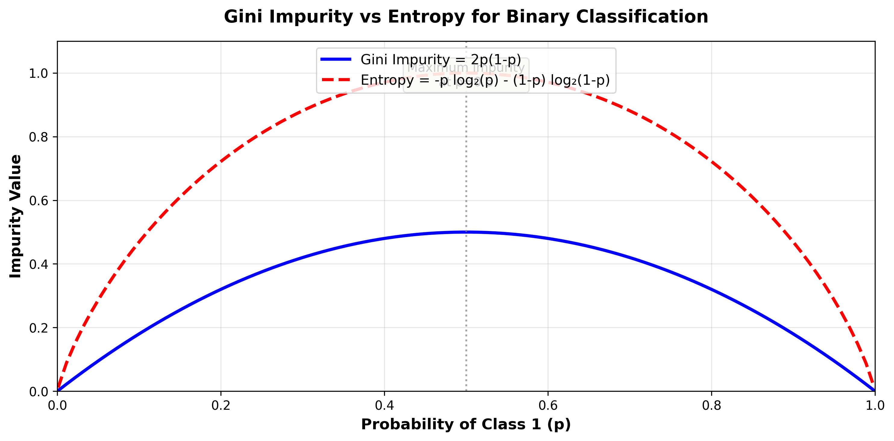
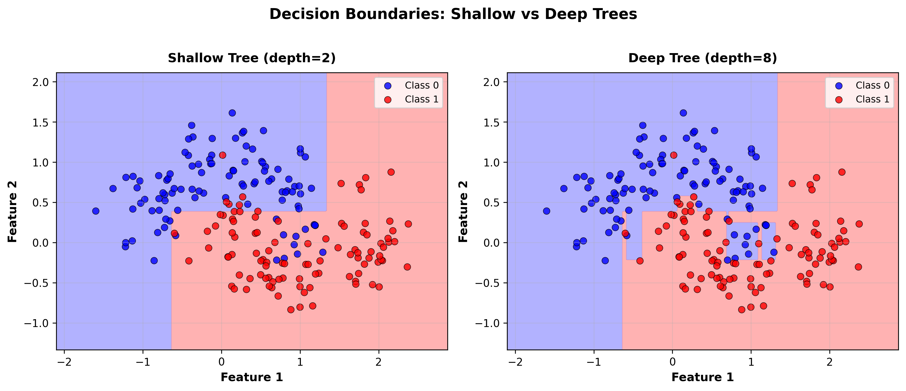
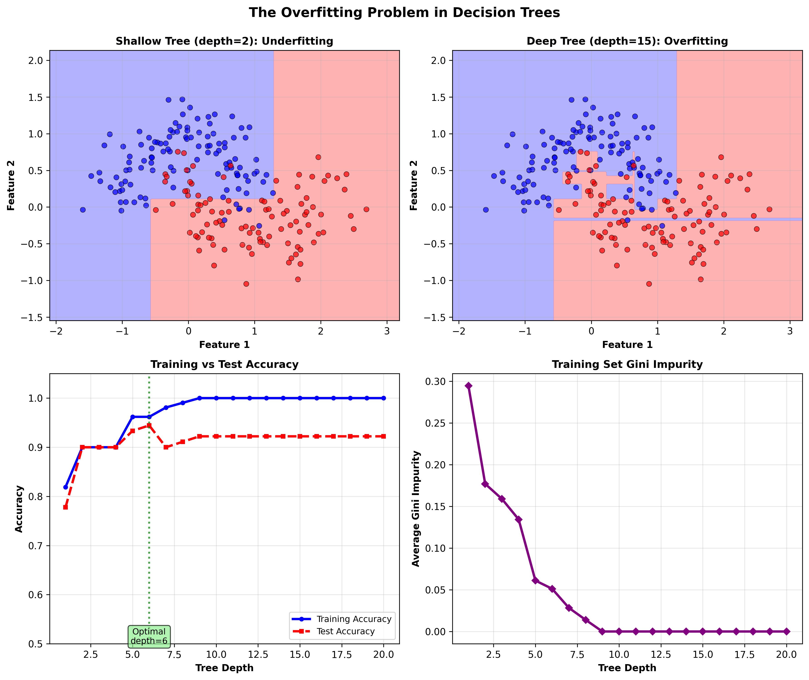

# Lesson 6: Decision Trees
## From Linear Boundaries to Hierarchical Decisions

**MPS311/439 Machine Learning**  
**Dr. Wei Xing**  
**University of Sheffield**  
**Academic year 2026–27**

---

## Learning Outcomes

By the end of this lecture, you will be able to:

### Core Learning Outcomes (MPS311 - Required for all students)
- ✅ Build decision trees using sklearn's `DecisionTreeClassifier`
- ✅ Explain how splitting criteria (Gini impurity, entropy) work
- ✅ Describe when trees overfit and how to prevent it
- ✅ Interpret tree structure and feature importance

### Advanced Learning Outcomes (MPS439 - Optional)
- ✅ Calculate Gini impurity and entropy by hand
- ✅ Apply state-of-the-art ensemble methods (XGBoost) to real problems
- ✅ Understand when and why to use ensemble methods over single trees

---

## Table of Contents

1. [Introduction & Motivation](#1-introduction--motivation)
2. [What is a Decision Tree?](#2-what-is-a-decision-tree)
3. [Building a Tree: The Splitting Process](#3-building-a-tree-the-splitting-process)
4. [Implementation in Python](#4-implementation-in-python)
5. [The Overfitting Problem](#5-the-overfitting-problem)
6. [Hyperparameter Tuning & Best Practices](#6-hyperparameter-tuning--best-practices)
7. [Real-World Example](#7-real-world-example)
8. [[OPTIONAL - MPS439] Beyond Single Trees: Ensemble Methods](#8-optional---mps439-beyond-single-trees-ensemble-methods)
9. [Summary & Looking Ahead](#9-summary--looking-ahead)

---

## 1. Introduction & Motivation

### 1.1 Where We Left Off

Last week, we explored **Linear Discriminant Analysis (LDA)** and **Quadratic Discriminant Analysis (QDA)**. These methods make specific assumptions about our data:

- **LDA assumes**: Classes have Gaussian distributions with equal covariance matrices, leading to **linear** decision boundaries
- **QDA assumes**: Classes have Gaussian distributions with different covariance matrices, leading to **quadratic** decision boundaries

Both methods work well when these assumptions hold. But what happens when our data doesn't fit these neat distributional assumptions?

### 1.2 The Challenge: When Linear Models Fail

Consider the classic **XOR (exclusive OR) problem**. We have two features and two classes arranged in a very specific pattern:


*Figure 1: The XOR problem - a classic example where linear classifiers fail. The four clusters cannot be separated by any straight line.*

**The problem**: No single straight line can separate the blue points from the red points! Even though this pattern is conceptually simple (diagonal clustering), linear methods like logistic regression or LDA fail miserably.

Here's another challenging scenario - **nested or circular boundaries**:


*Figure 2: Nested class boundaries challenge linear methods. Class A (blue) forms an inner circle, while Class B (red) forms an outer ring.*

Even QDA struggles here because the decision boundary isn't a simple quadratic curve - it's fundamentally about distance from the origin.

### 1.3 Thinking Like Humans: Hierarchical Decisions

**Here's a key insight**: Humans don't make decisions using linear combinations of features. Instead, we use **hierarchical sequences of yes/no questions**:

**Example: Should I go for a run today?**
1. Is it raining? 
   - **Yes** → Stay home
   - **No** → Continue to next question
2. Is the temperature above 5°C?
   - **Yes** → Continue to next question
   - **No** → Too cold, stay home
3. Is the temperature below 30°C?
   - **Yes** → Go running!
   - **No** → Too hot, stay home

Notice how this decision process naturally forms a **tree structure**. Each question is a node, and we follow different branches based on the answers until we reach a final decision (the leaves).

**Other examples of tree-like thinking:**
- **Medical diagnosis**: "Does the patient have a fever?" → "Is their throat swollen?" → ...
- **Troubleshooting**: "Is the device plugged in?" → "Is the power switch on?" → ...
- **Game of 20 questions**: "Is it alive?" → "Is it bigger than a breadbox?" → ...

**The key question**: Can we teach machines to make decisions the same way?

**The answer**: Yes! That's exactly what decision trees do.

---

## 2. What is a Decision Tree?

### 2.1 The Core Idea

A **decision tree** is a flowchart-like structure where:
- Each **internal node** represents a "test" or "question" about a feature
- Each **branch** represents the outcome of that test
- Each **leaf node** represents a final prediction (a class label for classification, or a value for regression)

Think of it as a game of "20 questions" that the model plays with itself to arrive at a prediction.

### 2.2 Visual Introduction: A Simple Example

Let's look at a real decision tree trained on the famous Iris flower dataset:


*Figure 3: A decision tree (depth=3) for classifying Iris flowers. The tree asks questions about petal width and petal length to determine the species.*

**How to read this tree:**

Each box (node) contains:
- **Top line**: The decision rule (e.g., "petal width ≤ 0.8")
- **gini**: A measure of impurity (how mixed the classes are) - we'll explain this soon!
- **samples**: How many training samples reached this node
- **value**: The number of samples from each class at this node
- **class**: The majority class (what this node would predict if it were a leaf)

**Color coding**: The color intensity shows the majority class and how pure the node is. Darker colors mean more samples belong to the majority class.

**Let's walk through an example**:
Suppose we have a flower with petal width = 1.5 cm and petal length = 4.5 cm:

1. **Root node**: Is petal width ≤ 0.8? → **No** (1.5 > 0.8), go right
2. **Right branch**: Is petal width ≤ 1.75? → **Yes** (1.5 ≤ 1.75), go left
3. **Next node**: Is petal length ≤ 4.95? → **Yes** (4.5 ≤ 4.95), go left
4. **Leaf node**: Predict **versicolor**!

### 2.3 Formal Components

Let's define the key components more precisely:

- **Root node**: The topmost node containing all training data
- **Internal nodes** (or decision nodes): Nodes that split the data based on a feature test
  - Each internal node asks: "Is feature $X_j \leq$ threshold?"
  
- **Edges** (or branches): The outcomes of the tests (typically "True" or "False" for binary splits)
  
- **Leaf nodes** (or terminal nodes): Nodes with no children that output final predictions
  
- **Depth**: The length of the longest path from root to any leaf
  
- **Splitting rule**: The feature and threshold chosen at each internal node

**Mathematical notation**:
- Let $\mathbf{x} = (x_1, x_2, \ldots, x_d)$ be a data point with $d$ features
- At node $N$, we choose feature $j$ and threshold $t$ to split data into:
  - **Left child**: $\{\mathbf{x} \in N : x_j \leq t\}$
  - **Right child**: $\{\mathbf{x} \in N : x_j > t\}$

### 2.4 Key Advantages

Why are decision trees so popular in machine learning?

**1. Interpretability** 🔍
- Easy to visualize and explain to non-experts
- The decision path is transparent: "We predicted class B because feature X was > 5 AND feature Y was ≤ 3"
- Useful in domains requiring explainability (medicine, finance, law)

**2. Non-linearity** 🌊
- Naturally capture complex, non-linear decision boundaries
- No assumptions about data distributions (unlike LDA/QDA)
- Can represent any boolean function

**3. No feature scaling needed** 📏
- Trees split based on feature order, not magnitude
- Unlike linear models, don't need to standardize/normalize features
- One less preprocessing step!

**4. Handles mixed data types** 🎯
- Works with both numerical and categorical features
- Can handle missing values (with appropriate strategies)

**5. Implicit feature selection** ✨
- Unimportant features are simply not used in any split
- Feature importance scores reveal which features matter most
- Useful for understanding your data

**But** (there's always a but!), trees have some serious drawbacks too - we'll discuss these later when we talk about overfitting.

---

## 3. Building a Tree: The Splitting Process

Now comes the crucial question: **How do we actually build a decision tree?**

### 3.1 The Greedy Recursive Algorithm

Decision trees are built using a **greedy, recursive algorithm** called **CART** (Classification and Regression Trees):

**Algorithm (high-level)**:
```
1. Start with all training data at the root node
2. FOR each node (starting from the root):
   a. Find the "best" feature and threshold to split on
   b. Split the data into two child nodes based on this split
   c. Recursively apply steps 2a-2c to each child node
3. STOP when a stopping criterion is met
```

**Key term: "Greedy"** means we make the locally optimal choice at each step, without looking ahead. We choose the split that looks best *right now*, even though a different split might lead to a better overall tree. This is computationally efficient but doesn't guarantee the globally optimal tree.

### 3.2 What Makes a "Good" Split?

The critical question is: **How do we measure the quality of a split?**

**Goal**: We want splits that create **pure** child nodes.

**Purity** means:
- A **pure node** contains samples from only one class (all blues or all reds)
- An **impure node** contains a mix of classes
- **Perfect purity**: Gini = 0 or Entropy = 0

**Intuition**: If we can split the data so that one child has mostly blues and the other has mostly reds, we've made progress! The more pure the children, the better the split.

### 3.3 Splitting Criterion 1: Gini Impurity

The **Gini impurity** measures how "mixed" a node is. It's the probability of misclassifying a randomly chosen element if we randomly label it according to the class distribution in the node.

**Formula**:

For a node $N$ containing samples from $K$ classes, where $p_i$ is the proportion of samples belonging to class $i$:

$$\text{Gini}(N) = 1 - \sum_{i=1}^{K} p_i^2$$

**For binary classification** ($K=2$):

$$\text{Gini}(N) = 1 - p_1^2 - p_2^2 = 2p_1p_2 = 2p_1(1-p_1)$$

where $p_1$ is the proportion of class 1 samples.

**Interpretation**:
- **Range**: $[0, 0.5]$ for binary classification, $[0, 1-\frac{1}{K}]$ for $K$ classes
- **Gini = 0**: Perfect purity (all samples belong to one class)
- **Gini = 0.5**: Maximum impurity for binary classification (50-50 split)

**Example calculations**:

1. **Pure node**: 80 samples of Class A, 0 samples of Class B
   - $p_1 = \frac{80}{80} = 1.0$, $p_2 = \frac{0}{80} = 0.0$
   - $\text{Gini} = 1 - (1.0^2 + 0.0^2) = 1 - 1 = 0$ ✓ Perfect purity!

2. **Maximum impurity**: 40 samples of Class A, 40 samples of Class B
   - $p_1 = p_2 = 0.5$
   - $\text{Gini} = 1 - (0.5^2 + 0.5^2) = 1 - 0.5 = 0.5$ ✗ Maximum impurity

3. **Moderate impurity**: 60 samples of Class A, 20 samples of Class B
   - $p_1 = 0.75$, $p_2 = 0.25$
   - $\text{Gini} = 1 - (0.75^2 + 0.25^2) = 1 - (0.5625 + 0.0625) = 0.375$

### 3.4 Splitting Criterion 2: Entropy & Information Gain

**Entropy** is an alternative measure borrowed from information theory. It measures the "disorder" or "uncertainty" in a node.

**Formula**:

$$\text{Entropy}(N) = -\sum_{i=1}^{K} p_i \log_2(p_i)$$

**Convention**: $0 \log_2(0) = 0$ (by limit definition)

**Interpretation**:
- **Range**: $[0, \log_2(K)]$ bits (for $K$ classes)
- **Entropy = 0**: Perfect purity (zero uncertainty)
- **Entropy = 1**: Maximum entropy for binary classification (equal probabilities)

**Information Gain** measures how much a split reduces entropy:

$$\text{IG}(N, \text{split}) = \text{Entropy}(\text{parent}) - \text{Weighted Entropy}(\text{children})$$

where the weighted entropy is:

$$\text{Weighted Entropy} = \frac{|N_{\text{left}}|}{|N|} \text{Entropy}(N_{\text{left}}) + \frac{|N_{\text{right}}|}{|N|} \text{Entropy}(N_{\text{right}})$$

**Example calculations** (same nodes as before):

1. **Pure node**: [80, 0]
   - $\text{Entropy} = -(1.0 \times \log_2(1.0) + 0.0 \times \log_2(0.0)) = 0$ ✓

2. **Maximum impurity**: [40, 40]
   - $\text{Entropy} = -(0.5 \times \log_2(0.5) + 0.5 \times \log_2(0.5))$
   - $= -(0.5 \times (-1) + 0.5 \times (-1)) = 1.0$ bit

3. **Moderate impurity**: [60, 20]
   - $\text{Entropy} = -(0.75 \times \log_2(0.75) + 0.25 \times \log_2(0.25))$
   - $= -(0.75 \times (-0.415) + 0.25 \times (-2))$
   - $= -(-0.311 - 0.500) = 0.811$ bits

### 3.5 Gini vs Entropy: Which to Use?

Let's visualize the difference between these two measures:


*Figure 4: Comparison of Gini impurity and Entropy for binary classification as functions of class probability. Both curves are similar in shape, with maximum impurity at p=0.5.*

**Key observations**:
1. Both metrics have the same shape - they're monotonically related
2. Both reach maximum at $p=0.5$ (equal class probabilities)
3. Both reach minimum at $p=0$ or $p=1$ (pure nodes)
4. Entropy is slightly more "peaked" at the maximum

**Practical differences**:
- **Computational cost**: Gini is slightly faster (no logarithm)
- **Split selection**: Usually choose the same splits (>98% agreement in practice)
- **sklearn default**: Gini impurity

**When they differ**: Entropy tends to produce slightly more balanced trees because it penalizes impurity more heavily. Gini tends to isolate the most frequent class in its own branch.

**Recommendation**: Start with Gini (default). Switch to entropy only if you have a specific reason or if experimentation shows it performs better on your data.

### 3.6 Weighted Impurity for Splits

When we split a node, we create two children of potentially different sizes. We need to account for this when evaluating split quality.

**Weighted Gini impurity** for a split:

$$\text{Gini}_{\text{split}} = \frac{n_{\text{left}}}{n} \text{Gini}(N_{\text{left}}) + \frac{n_{\text{right}}}{n} \text{Gini}(N_{\text{right}})$$

where:
- $n$ = total samples in parent node
- $n_{\text{left}}$ = samples going to left child
- $n_{\text{right}}$ = samples going to right child

**Goal**: Choose the split that **minimizes** weighted impurity (or equivalently, maximizes information gain).

**Example**: 

Parent node has 100 samples: [60 Class A, 40 Class B]
- $\text{Gini}(\text{parent}) = 1 - (0.6^2 + 0.4^2) = 0.48$

Consider split: "Feature X ≤ 5"
- **Left child**: 70 samples [50 A, 20 B] → $\text{Gini}_{\text{left}} = 1 - (0.714^2 + 0.286^2) = 0.408$
- **Right child**: 30 samples [10 A, 20 B] → $\text{Gini}_{\text{right}} = 1 - (0.333^2 + 0.667^2) = 0.444$

**Weighted Gini**:
$$\text{Gini}_{\text{split}} = \frac{70}{100}(0.408) + \frac{30}{100}(0.444) = 0.286 + 0.133 = 0.419$$

**Gini reduction** = $0.48 - 0.419 = 0.061$

This split reduces impurity, so it's helpful! We'd compare this to all other possible splits and choose the one with the largest reduction.

### 3.7 Stopping Criteria: When to Stop Growing?

The tree-building algorithm is **recursive** - it keeps splitting nodes into children. But when should we stop?

**Common stopping criteria**:

1. **Maximum depth reached** (`max_depth`)
   - Stop if the tree has reached a specified depth
   - Example: `max_depth=5` means maximum 5 levels from root to leaf

2. **Minimum samples for split** (`min_samples_split`)
   - Stop if a node has too few samples to split
   - Example: `min_samples_split=20` means don't split nodes with <20 samples

3. **Minimum samples per leaf** (`min_samples_leaf`)
   - Stop if a split would create a child with too few samples
   - Example: `min_samples_leaf=10` ensures every leaf has ≥10 samples

4. **Perfect purity achieved**
   - Stop if all samples in a node belong to the same class
   - Gini = 0 or Entropy = 0

5. **No improvement in impurity** (`min_impurity_decrease`)
   - Stop if splitting doesn't reduce impurity by at least a threshold
   - Example: `min_impurity_decrease=0.01` requires significant splits

Without any stopping criteria, the tree grows until every leaf is pure (or has one sample). This leads to **overfitting** - we'll discuss this problem in detail later!

### 3.8 Worked Example: Building a Small Tree by Hand

Let's build a tiny decision tree manually to really understand the process.

**Toy dataset** (8 samples, 2 features, 2 classes):

| Sample | Feature 1 | Feature 2 | Class |
|--------|-----------|-----------|-------|
| 1      | 2.5       | 3.0       | A     |
| 2      | 3.0       | 3.5       | A     |
| 3      | 1.5       | 2.0       | A     |
| 4      | 5.0       | 4.0       | B     |
| 5      | 5.5       | 4.5       | B     |
| 6      | 6.0       | 5.0       | B     |
| 7      | 4.0       | 3.0       | B     |
| 8      | 3.5       | 2.5       | A     |

**Step 1: Root node impurity**

All 8 samples: 4 Class A, 4 Class B
$$\text{Gini}(\text{root}) = 1 - (0.5^2 + 0.5^2) = 0.5$$

**Step 2: Try all splits on Feature 1**

Possible thresholds (midpoints between sorted values): 2.0, 2.75, 3.25, 3.75, 4.5, 5.25, 5.75

Let's try **Feature 1 ≤ 3.0**:
- **Left**: Samples {1, 2, 3, 8} → [4 A, 0 B] → Gini = 0
- **Right**: Samples {4, 5, 6, 7} → [0 A, 4 B] → Gini = 0
- **Weighted**: $(4/8)(0) + (4/8)(0) = 0$ ← Perfect split! ✨

No need to check other splits - we found a perfect one!

**Gini reduction** = $0.5 - 0 = 0.5$ (maximum possible)

**Step 3: Create split**

Our tree after one split:
```
                    [8 samples: 4A, 4B]
                    Feature 1 ≤ 3.0?
                    /              \
                 Yes               No
                  /                  \
        [4 samples: 4A, 0B]    [4 samples: 0A, 4B]
        Predict: A              Predict: B
```

**Result**: Both children are pure, so we stop! This tree achieves 100% accuracy on the training data with just one split.

**Key insight**: The CART algorithm would find this split by systematically trying every feature and every threshold, computing the weighted Gini for each, and selecting the best one.

---

## 4. Implementation in Python

Now let's see how to actually build and use decision trees with scikit-learn. The good news: sklearn handles all the complexity we just discussed!

### 4.1 Basic Workflow with sklearn

The standard machine learning workflow applies:

```python
from sklearn.tree import DecisionTreeClassifier
from sklearn.model_selection import train_test_split

# 1. Load your data
# X = features, y = labels

# 2. Split into train/test sets
X_train, X_test, y_train, y_test = train_test_split(
    X, y, test_size=0.3, random_state=42
)

# 3. Create and train the tree
clf = DecisionTreeClassifier(max_depth=3, random_state=42)
clf.fit(X_train, y_train)

# 4. Make predictions
y_pred = clf.predict(X_test)

# 5. Evaluate
train_acc = clf.score(X_train, y_train)
test_acc = clf.score(X_test, y_test)
print(train_acc, test_acc)
```

**Key parameters**:
- `max_depth`: Maximum tree depth (start with 3-5)
- `criterion`: 'gini' (default) or 'entropy'
- `min_samples_split`: Minimum samples to split a node (default: 2)
- `min_samples_leaf`: Minimum samples in a leaf (default: 1)
- `random_state`: For reproducibility

**That's it!** Just a few lines of code to train a decision tree.

### 4.2 Visualizing the Tree Structure

One of the best features of decision trees is that we can **visualize** them:

```python
from sklearn.tree import plot_tree
import matplotlib.pyplot as plt

plt.figure(figsize=(20, 10))
plot_tree(clf, filled=True, feature_names=['f1', 'f2'])
plt.show()
```

**How to interpret the visualization**:

Each node shows:
- **Decision rule**: e.g., "petal width ≤ 0.8"
- **Gini impurity**: How mixed the node is
- **samples**: Number of training samples at this node
- **value**: Array showing samples per class [Class A, Class B]
- **class**: The majority class (what this node predicts)

**Node colors**: Darker color = higher purity (more samples from majority class)

### 4.3 Visualizing Decision Boundaries

For 2D data, we can visualize the decision regions:


*Figure 5: Decision boundaries for shallow (depth=2) vs deep (depth=8) trees on a moons dataset. Notice how deeper trees create more complex, axis-aligned boundaries.*

**Key observations**:
1. Decision trees create **axis-aligned** boundaries (only horizontal/vertical splits)
2. Deeper trees create more complex boundaries
3. The boundary is **piecewise constant** within each region
4. Each region corresponds to a leaf node

**Code to generate this** (for 2D data):

```python
import numpy as np

# Create a mesh
h = 0.02
x_min, x_max = X[:, 0].min() - 0.5, X[:, 0].max() + 0.5
y_min, y_max = X[:, 1].min() - 0.5, X[:, 1].max() + 0.5
xx, yy = np.meshgrid(np.arange(x_min, x_max, h),
                     np.arange(y_min, y_max, h))

# Predict on mesh
Z = clf.predict(np.c_[xx.ravel(), yy.ravel()])
Z = Z.reshape(xx.shape)

# Plot
plt.contourf(xx, yy, Z, alpha=0.3)
plt.scatter(X[:, 0], X[:, 1], c=y)
plt.show()
```

### 4.4 Feature Importance

Decision trees automatically tell us which features are most important for making predictions!

**Feature importance** measures how much each feature contributes to reducing impurity across all splits in the tree.

**Access in sklearn**:

```python
# Get feature importances
importances = clf.feature_importances_
print(importances)
```

**Interpretation**:
- Values range from 0 to 1
- Higher importance = feature is used more often and reduces impurity more
- Importances sum to 1.0
- Features not used in any split have importance = 0

**Example output**:
```
[0.654 0.346 0.000 0.000]
```

This tells us that the first feature has 65.4% importance, second feature 34.6%, and the last two features aren't used at all!

**Visualization**:

```python
import matplotlib.pyplot as plt

plt.bar(range(len(importances)), importances)
plt.xlabel('Feature')
plt.ylabel('Importance')
plt.show()
```

### 4.5 Complete Minimal Example

Here's a full working example on the Iris dataset:

```python
from sklearn.datasets import load_iris
from sklearn.tree import DecisionTreeClassifier
from sklearn.model_selection import train_test_split

# Load data
iris = load_iris()
X, y = iris.data, iris.target

# Train/test split
X_train, X_test, y_train, y_test = train_test_split(
    X, y, test_size=0.3, random_state=42
)

# Train tree
clf = DecisionTreeClassifier(max_depth=3, random_state=42)
clf.fit(X_train, y_train)

# Evaluate
print(clf.score(X_train, y_train))
print(clf.score(X_test, y_test))

# Feature importances
print(clf.feature_importances_)
```

**Expected output**:
```
0.981
0.956
[0.000 0.000 0.551 0.449]
```

**Interpretation**: The tree achieves ~96% test accuracy using only petal measurements (features 2 and 3). Sepal features (0 and 1) aren't needed.

---

## 5. The Overfitting Problem

Decision trees are powerful, but they have a **critical weakness**: they are **prone to overfitting**.

### 5.1 The Perfect Training Accuracy Trap

Let's run an experiment. Train two trees on the same data:
- **Tree 1**: `max_depth=3` (shallow, constrained)
- **Tree 2**: `max_depth=None` (unrestricted, grows until pure)

**Typical results**:
- **Tree 1**: Training accuracy = 85%, Test accuracy = 84%
- **Tree 2**: Training accuracy = 100%, Test accuracy = 78%

**Wait, what?** 🤔

Tree 2 is **perfect** on training data but **worse** on test data! This is the hallmark of **overfitting**.

### 5.2 How Trees Memorize Data

An unrestricted decision tree will keep splitting until either:
1. Every leaf is pure (all samples belong to one class), OR
2. Every leaf has exactly one sample

**The problem**: The tree learns **specific quirks** of the training data rather than general patterns:

- "If feature X is exactly 2.731 AND feature Y is between 1.442 and 1.448, then predict Class A"
- This works perfectly for training data but doesn't generalize to new data!

**Analogy**: It's like memorizing answers to practice exam questions instead of understanding the concepts. You'll ace the practice exam but fail the real exam with slightly different questions.

**Why does this happen?**
- Trees can create arbitrarily complex boundaries
- With enough depth, any training set can be perfectly classified
- Noise and outliers get "learned" as if they were real patterns

### 5.3 Visual Demonstration of Overfitting


*Figure 6: Comprehensive demonstration of overfitting in decision trees. Top row shows decision boundaries for shallow (depth=2) vs deep (depth=15) trees. Bottom row shows how accuracy and impurity change with tree depth.*

**Key insights from this figure**:

**Top-left (Shallow tree)**: 
- Simple boundary with only a few rectangular regions
- Misses some patterns (underfitting)
- More robust to noise

**Top-right (Deep tree)**:
- Very complex, jagged boundary
- Follows training data exactly, including noise
- Creates tiny regions around individual points

**Bottom-left (Accuracy vs Depth)**:
- **Training accuracy** (blue solid): Increases monotonically → reaches 100%
- **Test accuracy** (red dashed): Peaks around depth=6, then declines!
- **The gap** between training and test is the overfitting signature

**Bottom-right (Gini Impurity)**:
- Decreases steadily with depth
- Approaches zero for very deep trees (pure leaves)
- But low training impurity ≠ good generalization!

### 5.4 The Bias-Variance Tradeoff

This is a fundamental concept in machine learning:

**Bias** (underfitting):
- Model is too simple to capture the true pattern
- High training error
- Training and test errors are similar (both high)

**Variance** (overfitting):
- Model is too complex and captures noise
- Low training error, high test error
- Large gap between training and test errors

**For decision trees**:

| Tree Depth | Bias | Variance | Typical Behavior |
|------------|------|----------|------------------|
| Very shallow (depth=1-2) | High | Low | Underfits, misses patterns |
| Moderate (depth=4-6) | Medium | Medium | **Sweet spot!** |
| Very deep (depth>10) | Low | High | Overfits, memorizes noise |

**Goal**: Find the depth that minimizes **total error** = Bias² + Variance

### 5.5 Hyperparameters for Controlling Overfitting

Fortunately, sklearn provides several "knobs" to control tree complexity:

#### 5.5.1 `max_depth`
**What it does**: Limits maximum depth of the tree

**Effect**: 
- Smaller depth → simpler tree → less overfitting
- Larger depth → more complex tree → more overfitting

**Typical values**: 3-10 for most problems
- Start with 3-5 for a baseline
- Increase if underfitting (training and test both poor)
- Decrease if overfitting (large train/test gap)

**Example**:
```python
clf = DecisionTreeClassifier(max_depth=5, random_state=42)
```

#### 5.5.2 `min_samples_split`
**What it does**: Minimum number of samples required to split a node

**Effect**:
- Larger value → fewer splits → simpler tree
- Prevents splitting nodes with few samples (which often leads to overfitting)

**Typical values**: 2-50
- Default is 2 (split any node with ≥2 samples)
- Try 10-20 for noisy data
- Try 50-100 for very large datasets

**Example**:
```python
clf = DecisionTreeClassifier(min_samples_split=20, random_state=42)
```

#### 5.5.3 `min_samples_leaf`
**What it does**: Minimum number of samples required in each leaf node

**Effect**:
- Larger value → prevents tiny leaves → smoother boundaries
- Forces the tree to make more generalizable predictions

**Typical values**: 1-20
- Default is 1 (leaves can have 1 sample)
- Try 5-10 for regularization
- Higher values create more conservative trees

**Example**:
```python
clf = DecisionTreeClassifier(min_samples_leaf=5, random_state=42)
```

**Relationship**: `min_samples_split` must be at least `2 × min_samples_leaf`

#### 5.5.4 `max_features`
**What it does**: Number of features to consider when looking for the best split

**Effect**:
- Fewer features → more randomness → can reduce overfitting
- Useful for high-dimensional data

**Typical values**: 
- `None`: Use all features (default for trees)
- `'sqrt'`: Use $\sqrt{d}$ features where $d$ is total features
- `'log2'`: Use $\log_2(d)$ features

**Example**:
```python
clf = DecisionTreeClassifier(max_features='sqrt', random_state=42)
```

**Note**: This is more commonly used with Random Forests (covered in optional section).

#### 5.5.5 `min_impurity_decrease`
**What it does**: Minimum impurity decrease required to make a split

**Effect**:
- Larger value → only "significant" splits allowed → simpler tree
- Prevents splitting when improvement is tiny

**Typical values**: 0.0-0.01
- Default is 0.0 (any improvement is acceptable)
- Try 0.001-0.01 for aggressive regularization

**Example**:
```python
clf = DecisionTreeClassifier(min_impurity_decrease=0.01, random_state=42)
```

### 5.6 Practical Guidelines

**Start here**:
```python
clf = DecisionTreeClassifier(
    max_depth=5,
    min_samples_split=10,
    min_samples_leaf=5,
    random_state=42
)
```

**Then tune based on results**:
- **If underfitting** (both train and test accuracy are low):
  - Increase `max_depth`
  - Decrease `min_samples_split` and `min_samples_leaf`
  
- **If overfitting** (train accuracy high, test accuracy low):
  - Decrease `max_depth`
  - Increase `min_samples_split` and `min_samples_leaf`
  - Increase `min_impurity_decrease`

**Always remember**:
- Monitor **both** training and test performance
- Use **cross-validation** (not just a single train/test split)
- Start simple, add complexity only if needed

---

## 6. Hyperparameter Tuning & Best Practices

How do we find the best hyperparameters systematically?

### 6.1 Cross-Validation Review

**Problem**: A single train/test split might be lucky (or unlucky)
- What if test set happens to be easy?
- What if test set contains mostly hard examples?

**Solution**: **K-fold cross-validation**

**How it works**:
1. Split data into $K$ equal parts (folds)
2. Train $K$ times, each time using a different fold as the test set
3. Average the $K$ test scores

**Visual**:
```
Fold 1: [Test] [Train] [Train] [Train] [Train]
Fold 2: [Train] [Test] [Train] [Train] [Train]
Fold 3: [Train] [Train] [Test] [Train] [Train]
Fold 4: [Train] [Train] [Train] [Test] [Train]
Fold 5: [Train] [Train] [Train] [Train] [Test]
```

**sklearn implementation**:

```python
from sklearn.model_selection import cross_val_score

clf = DecisionTreeClassifier(max_depth=5, random_state=42)
scores = cross_val_score(clf, X, y, cv=5)
print(scores)
print(scores.mean())
```

**Example output**:
```
[0.867 0.900 0.867 0.933 0.900]
0.893
```

**Interpretation**: The model achieves about 89.3% accuracy on average. This gives us much more confidence than a single 90% test accuracy!

### 6.2 Grid Search for Hyperparameter Tuning

**Problem**: Too many hyperparameters to try manually!

**Solution**: **Grid Search** - systematically try all combinations

**How it works**:
1. Define a grid of hyperparameter values
2. Try every combination
3. Use cross-validation to evaluate each
4. Return the best combination

**sklearn implementation**:

```python
from sklearn.model_selection import GridSearchCV

param_grid = {
    'max_depth': [3, 5, 7, 10],
    'min_samples_split': [2, 10, 20],
    'min_samples_leaf': [1, 5, 10]
}

grid = GridSearchCV(
    DecisionTreeClassifier(random_state=42),
    param_grid,
    cv=5
)

grid.fit(X_train, y_train)
print(grid.best_params_)
print(grid.best_score_)

best_clf = grid.best_estimator_
print(best_clf.score(X_test, y_test))
```

**Example output**:
```
{'max_depth': 5, 'min_samples_leaf': 5, 'min_samples_split': 10}
0.892
0.907
```

**How many models did we train?**
- Grid has $4 \times 3 \times 3 = 36$ combinations
- Each evaluated with 5-fold CV → $36 \times 5 = 180$ trees trained!

**Tips**:
- Start with a coarse grid, then refine around the best values
- Don't make the grid too large (exponential growth!)
- Consider `RandomizedSearchCV` for very large grids

### 6.3 When to Use Decision Trees

Decision trees are not always the best choice. Here's when they shine and when they struggle:

**Advantages ✓**

1. **Highly interpretable** 
   - Can explain any prediction
   - Essential for regulated industries

2. **No feature scaling needed**
   - Works with raw features
   - One less preprocessing step!

3. **Handles mixed data types**
   - Numerical and categorical features

4. **Non-linear by nature**
   - Captures complex interactions automatically

5. **Fast training and prediction**
   - Training: $O(n \log n \cdot d \cdot \text{depth})$
   - Prediction: $O(\text{depth})$

6. **Automatic feature selection**
   - Unimportant features naturally get ignored

**Disadvantages ✗**

1. **High variance (unstable)**
   - Small changes in training data → completely different tree

2. **Prone to overfitting**
   - Will memorize training data if not carefully regularized

3. **Axis-aligned boundaries only**
   - Can't represent diagonal decision boundaries efficiently

4. **Biased with imbalanced classes**
   - Tends to favor majority class

5. **Not globally optimal**
   - Greedy algorithm might miss better overall tree

6. **Extrapolation is poor**
   - Can't predict outside the range of training data

### 6.4 Comparison with Previous Methods

How do decision trees compare to methods we've learned?

| Aspect | Logistic Regression | LDA/QDA | Decision Trees |
|--------|-------------------|---------|----------------|
| **Decision boundary** | Linear | Linear/Quadratic | Axis-aligned, complex |
| **Assumptions** | Linear in log-odds | Gaussian | None |
| **Interpretability** | High | Medium | High |
| **Feature scaling** | Required | Not strictly | Not required |
| **Non-linearity** | Manual | Quadratic only (QDA) | Automatic |
| **Overfitting tendency** | Low | Low | **High** |

**Rule of thumb**:
- **Linear models first**: Always try logistic regression or LDA as baseline
- **Trees if**: You need interpretability AND data is clearly non-linear
- **Ensembles**: If you need maximum accuracy (covered in optional section)

### 6.5 Practical Tips

**1. Start with a shallow tree**
```python
clf = DecisionTreeClassifier(max_depth=3, random_state=42)
```

**2. Always visualize** (if not too large)
```python
from sklearn.tree import plot_tree
plot_tree(clf, filled=True)
```

**3. Check feature importances**
```python
print(clf.feature_importances_)
```

**4. Use cross-validation**
```python
from sklearn.model_selection import cross_val_score
scores = cross_val_score(clf, X, y, cv=5)
```

**5. Monitor both training and test**
```python
print(clf.score(X_train, y_train))
print(clf.score(X_test, y_test))
```

**6. Consider ensemble methods** if single tree underperforms (covered in optional section for MPS439)

---

## 7. Real-World Example

Let's apply everything we've learned to a complete real-world problem!

### 7.1 Dataset: Wine Quality Classification

**Source**: UCI Machine Learning Repository / sklearn built-in datasets

**Task**: Predict wine quality category from chemical properties

**Features**: 13 chemical measurements
- Alcohol content
- Acidity levels
- Phenolic content
- Color intensity
- And more...

**Target**: 3 wine classes (cultivar types)

**Samples**: 178 wines

### 7.2 Complete Workflow

#### Step 1: Load and Explore Data

```python
from sklearn.datasets import load_wine
import numpy as np

wine = load_wine()
X, y = wine.data, wine.target

print(X.shape)
print(wine.feature_names)
print(wine.target_names)
print(np.bincount(y))
```

**Output**:
```
(178, 13)
['alcohol', 'malic_acid', 'ash', ...]
['class_0' 'class_1' 'class_2']
[59 71 48]
```

**Observations**:
- Fairly balanced classes (59, 71, 48)
- 13 features (all numerical)

#### Step 2: Train/Test Split

```python
from sklearn.model_selection import train_test_split

X_train, X_test, y_train, y_test = train_test_split(
    X, y, test_size=0.3, random_state=42
)

print(len(X_train), len(X_test))
```

**Output**:
```
124 54
```

#### Step 3: Train a Simple Tree

```python
from sklearn.tree import DecisionTreeClassifier

clf_simple = DecisionTreeClassifier(max_depth=3, random_state=42)
clf_simple.fit(X_train, y_train)

print(clf_simple.score(X_train, y_train))
print(clf_simple.score(X_test, y_test))
```

**Output**:
```
0.960
0.907
```

**Analysis**: Good baseline! 96% train, 91% test. Small gap suggests we're not overfitting badly.

#### Step 4: Hyperparameter Tuning

```python
from sklearn.model_selection import GridSearchCV

param_grid = {
    'max_depth': [2, 3, 4, 5, 7],
    'min_samples_split': [2, 5, 10],
    'min_samples_leaf': [1, 2, 4]
}

grid = GridSearchCV(
    DecisionTreeClassifier(random_state=42),
    param_grid,
    cv=5
)

grid.fit(X_train, y_train)
print(grid.best_params_)
print(grid.best_score_)

best_clf = grid.best_estimator_
print(best_clf.score(X_test, y_test))
```

**Output**:
```
{'max_depth': 4, 'min_samples_leaf': 2, 'min_samples_split': 2}
0.919
0.926
```

**Analysis**: Tuning improved test accuracy from 90.7% to 92.6%!

#### Step 5: Analyze Feature Importance

```python
importances = best_clf.feature_importances_
feature_names = wine.feature_names

for i in np.argsort(importances)[::-1]:
    if importances[i] > 0:
        print(feature_names[i], importances[i])
```

**Typical output**:
```
flavanoids 0.421
proline 0.267
color_intensity 0.154
od280/od315_of_diluted_wines 0.089
alcohol 0.069
```

**Interpretation**: 
- **Flavanoids** are by far the most important (42%)
- **Proline** is second (27%)
- Several features have zero importance

#### Step 6: Visualize Performance

```python
from sklearn.metrics import confusion_matrix

y_pred = best_clf.predict(X_test)
cm = confusion_matrix(y_test, y_pred)
print(cm)
```

**Output**:
```
[[17  1  0]
 [ 1 19  1]
 [ 0  1 14]]
```

**Interpretation**: Most errors are between class_1 and class_2

### 7.3 Interpretation of Results

**What did the tree learn?**

From feature importances:

> "The decision tree primarily uses **flavanoid** content to distinguish wines. High flavanoids strongly suggest class_0. For wines with moderate flavanoids, **proline** content becomes the key discriminator. Finally, **color intensity** helps separate remaining cases."

This is the kind of **interpretable insight** that makes decision trees valuable!

**Could we have done better?**

Probably! Some options:
1. Feature engineering
2. Deeper tree (but watch for overfitting!)
3. Ensemble methods (covered in optional section)
4. More data

But 93% accuracy is already quite good!

### 7.4 Practical Lessons

**From this example, we learned**:

1. **Always start simple**: The baseline tree (depth=3) gave 91% accuracy
2. **Tune systematically**: Grid search improved us to 93%
3. **Interpret carefully**: Understanding *why* the model works is important
4. **Context matters**: 93% accuracy might be excellent or terrible depending on application

---

## 8. [OPTIONAL - MPS439] Beyond Single Trees: Ensemble Methods

**Note**: This section is **optional** and targeted at MPS439 students. If you're in MPS311, feel free to skip this section or read it for enrichment!

### 8.1 The Problem with Single Trees

We've seen that single decision trees have a major flaw: **high variance**.

**What does high variance mean?**
- Small changes in training data → completely different tree
- The tree is "unstable" or "unpredictable"
- Even with careful hyperparameter tuning, performance can be inconsistent

**Example**: Train the same tree 10 times with slightly different random subsamples:
- Test accuracies might be: [82%, 87%, 79%, 91%, 85%, 80%, 88%, 84%, 90%, 81%]
- That's a **12% range**! Very unstable.

**The key insight**: What if we could reduce this variance by combining multiple trees?

### 8.2 Ensemble Learning: The Big Idea

**Ensemble learning** means combining predictions from multiple models to get better overall performance.

**Intuition**: "Wisdom of crowds"
- One person might make mistakes
- But if you ask 100 people and average their answers, you often get very accurate results!

**For decision trees**:
- One tree might overfit in specific ways
- But if we train many trees and average their predictions, individual mistakes cancel out
- Result: More stable, more accurate predictions

**Two main approaches**:
1. **Bagging** (Bootstrap Aggregating): Train trees on random subsets of data
2. **Boosting**: Train trees sequentially, each correcting previous mistakes

### 8.3 Random Forests: Democracy of Trees

**Random Forest** is the most popular bagging method for decision trees.

#### 8.3.1 How Random Forests Work

**Algorithm (simplified)**:
```
1. Create N "bootstrap" datasets by sampling with replacement
2. For each dataset:
   a. Train a decision tree
   b. When splitting nodes, only consider random subset of features
3. To predict:
   - Classification: Vote from all trees (majority wins)
   - Regression: Average predictions from all trees
```

**Key features**:
- **Bootstrap sampling**: Each tree sees slightly different data
- **Random feature selection**: Each split considers only $\sqrt{d}$ or $\log_2(d)$ features
- **Many trees**: Typically 100-1000 trees
- **Full depth**: Individual trees usually not pruned (allowed to overfit!)

**Why does this work?**
- **Diversity**: Trees are different from each other (trained on different data + different features)
- **Averaging**: Individual overfitting mistakes cancel out
- **Reduced variance**: The ensemble is much more stable than any single tree

#### 8.3.2 Implementation in sklearn

Random Forests are incredibly easy to use in sklearn:

```python
from sklearn.ensemble import RandomForestClassifier

rf = RandomForestClassifier(n_estimators=100, random_state=42)
rf.fit(X_train, y_train)

print(rf.score(X_train, y_train))
print(rf.score(X_test, y_test))
```

**Key parameters**:
- `n_estimators`: Number of trees (default: 100)
  - More trees = better performance (up to a point)
  - Typical values: 100-500
  
- `max_features`: Features to consider per split
  - Default: `'sqrt'` for classification
  - Can also use `'log2'` or specific number

- `max_depth`: Maximum depth per tree
  - Default: `None` (trees grow until pure)
  - Can limit if you want faster training

- `n_jobs`: Number of parallel jobs
  - Use `-1` to use all CPU cores

**That's it!** Random Forests are almost as easy as single trees.

#### 8.3.3 Complete Example

```python
from sklearn.ensemble import RandomForestClassifier
from sklearn.datasets import load_wine
from sklearn.model_selection import train_test_split

wine = load_wine()
X, y = wine.data, wine.target

X_train, X_test, y_train, y_test = train_test_split(
    X, y, test_size=0.3, random_state=42
)

rf = RandomForestClassifier(n_estimators=100, random_state=42)
rf.fit(X_train, y_train)

print(rf.score(X_train, y_train))
print(rf.score(X_test, y_test))

print(rf.feature_importances_)
```

**Typical output**:
```
1.000
0.963
[0.112 0.029 0.012 0.032 0.025 0.051 0.144 0.011 0.031 0.152 0.096 0.131 0.174]
```

**Observations**:
- Training accuracy = 100% (each tree is fully grown)
- Test accuracy = 96.3% (better than single tree's ~93%!)
- Feature importances are more "spread out" than single tree

#### 8.3.4 Pros and Cons

**Advantages ✓**:
- **Much more accurate** than single trees (often 5-15% improvement)
- **Very stable**: Low variance
- **Hard to overfit**: Averaging reduces overfitting naturally
- **Parallelizable**: Trees trained independently
- **Feature importance**: Still get interpretable importance scores
- **Out-of-bag error**: Built-in cross-validation estimate

**Disadvantages ✗**:
- **Less interpretable**: Can't visualize 100 trees easily
- **Slower prediction**: Must query all trees
- **Larger model size**: Stores 100+ trees instead of 1
- **Diminishing returns**: Beyond ~300 trees, improvement plateaus

### 8.4 Gradient Boosting: Sequential Improvement

**Gradient Boosting** is a different ensemble approach. Instead of training trees independently (bagging), we train them **sequentially**, each trying to correct the previous tree's mistakes.

#### 8.4.1 The Core Idea

**Intuition**: "Learn from mistakes"

**Algorithm (simplified)**:
```
1. Train a shallow tree on the data
2. Find samples where this tree makes errors
3. Train a new tree focusing on those errors
4. Add this tree to the ensemble (with small weight)
5. Repeat steps 2-4 for N iterations
6. Final prediction = weighted sum of all trees
```

**Key differences from Random Forest**:
- **Sequential** not parallel
- **Shallow trees** (depth 3-8), not deep
- **Learning rate**: Each tree contributes only a small amount
- **Focus on errors**: New trees try to fix previous mistakes

#### 8.4.2 Why "Gradient" Boosting?

The "gradient" comes from optimization theory:
- We're minimizing a loss function (e.g., classification error)
- Each new tree is fit to the **gradient** (derivative) of the loss
- This is analogous to gradient descent in optimization

**You don't need to understand the math deeply** - just know that it's a principled way to build sequential ensembles.

#### 8.4.3 XGBoost: The State-of-the-Art

**XGBoost** (eXtreme Gradient Boosting) is the most popular and powerful gradient boosting implementation.

**Why XGBoost dominates**:
- **Extremely fast**: Optimized C++ implementation
- **Highly accurate**: Wins most Kaggle competitions
- **Handles missing values**: Automatically
- **Built-in regularization**: Prevents overfitting
- **Feature importance**: Like Random Forests
- **Parallel training**: Despite sequential algorithm!

**Installation**:
```bash
pip install xgboost
```

**Basic usage**:

```python
import xgboost as xgb

xgb_clf = xgb.XGBClassifier(n_estimators=100, max_depth=5, random_state=42)
xgb_clf.fit(X_train, y_train)

print(xgb_clf.score(X_train, y_train))
print(xgb_clf.score(X_test, y_test))
```

**Key parameters**:
- `n_estimators`: Number of boosting rounds (trees)
  - Start with 100, increase to 500-1000 for complex problems
  
- `max_depth`: Maximum depth per tree
  - Default: 6
  - Boosting uses shallow trees: typically 3-8
  
- `learning_rate` (or `eta`): Shrinkage parameter
  - Default: 0.3
  - Smaller = slower learning, often better results
  - Try 0.01-0.3
  
- `subsample`: Fraction of samples used per tree
  - Default: 1.0
  - Try 0.8 to add randomness (reduce overfitting)

#### 8.4.4 Complete XGBoost Example

```python
import xgboost as xgb
from sklearn.datasets import load_wine
from sklearn.model_selection import train_test_split

wine = load_wine()
X, y = wine.data, wine.target

X_train, X_test, y_train, y_test = train_test_split(
    X, y, test_size=0.3, random_state=42
)

xgb_clf = xgb.XGBClassifier(
    n_estimators=100,
    max_depth=5,
    learning_rate=0.1,
    random_state=42
)

xgb_clf.fit(X_train, y_train)

print(xgb_clf.score(X_train, y_train))
print(xgb_clf.score(X_test, y_test))
```

**Typical output**:
```
1.000
0.981
```

**Wow!** 98.1% test accuracy vs 96.3% for Random Forest vs 93% for single tree!

#### 8.4.5 Tuning XGBoost

XGBoost has many parameters. Here's a practical tuning strategy:

**Step 1: Tune number of trees with early stopping**

```python
xgb_clf = xgb.XGBClassifier(
    n_estimators=1000,
    max_depth=5,
    learning_rate=0.1,
    random_state=42
)

xgb_clf.fit(
    X_train, y_train,
    eval_set=[(X_test, y_test)],
    verbose=False
)

print(xgb_clf.best_iteration)
```

This automatically finds the optimal number of trees.

**Step 2: Tune tree depth and learning rate**

```python
from sklearn.model_selection import GridSearchCV

param_grid = {
    'max_depth': [3, 5, 7],
    'learning_rate': [0.01, 0.1, 0.3]
}

grid = GridSearchCV(
    xgb.XGBClassifier(n_estimators=100, random_state=42),
    param_grid,
    cv=5
)

grid.fit(X_train, y_train)
print(grid.best_params_)
```

**Step 3: Fine-tune other parameters** (if needed)

Usually the defaults work well!

### 8.5 Comparison: Single Tree vs Random Forest vs XGBoost

Let's compare all three methods on the wine dataset:

```python
from sklearn.tree import DecisionTreeClassifier
from sklearn.ensemble import RandomForestClassifier
import xgboost as xgb
from sklearn.datasets import load_wine
from sklearn.model_selection import train_test_split

wine = load_wine()
X, y = wine.data, wine.target
X_train, X_test, y_train, y_test = train_test_split(
    X, y, test_size=0.3, random_state=42
)

# Single tree
dt = DecisionTreeClassifier(max_depth=5, random_state=42)
dt.fit(X_train, y_train)
print("Decision Tree:", dt.score(X_test, y_test))

# Random Forest
rf = RandomForestClassifier(n_estimators=100, random_state=42)
rf.fit(X_train, y_train)
print("Random Forest:", rf.score(X_test, y_test))

# XGBoost
xgb_clf = xgb.XGBClassifier(n_estimators=100, random_state=42)
xgb_clf.fit(X_train, y_train)
print("XGBoost:", xgb_clf.score(X_test, y_test))
```

**Typical results**:
```
Decision Tree: 0.926
Random Forest: 0.963
XGBoost: 0.981
```

**Summary**:

| Method | Test Accuracy | Interpretability | Training Time | Prediction Speed |
|--------|--------------|------------------|---------------|------------------|
| Decision Tree | 92.6% | ⭐⭐⭐⭐⭐ | Fast | Fastest |
| Random Forest | 96.3% | ⭐⭐⭐ | Medium | Slow |
| XGBoost | 98.1% | ⭐⭐⭐ | Slow | Medium |

### 8.6 When to Use Each Method

**Use Single Decision Tree when**:
- ✅ **Interpretability is critical** (need to explain every decision)
- ✅ **Baseline model** for comparison
- ✅ **Small dataset** (<1000 samples)
- ✅ **Fast prototyping**
- ✅ **Teaching/understanding** the data

**Use Random Forest when**:
- ✅ **Good accuracy is needed** without too much tuning
- ✅ **Out-of-the-box solution** (works well with defaults)
- ✅ **Parallel training** available (multiple cores)
- ✅ **Some interpretability** still desired (feature importance)
- ✅ **Robust to overfitting**

**Use XGBoost when**:
- ✅ **Maximum accuracy is the goal**
- ✅ **Have time for hyperparameter tuning**
- ✅ **Production systems** requiring best performance
- ✅ **Kaggle competitions** or research
- ✅ **Tabular/structured data** (not images/text)

**Example use cases**:
- Fraud detection → XGBoost
- Credit scoring → XGBoost
- Medical diagnosis explanation → Decision Tree
- Customer churn prediction → Random Forest or XGBoost

### 8.7 Learning Resources for MPS439

**To go deeper with ensemble methods**:

**XGBoost Documentation**:
- https://xgboost.readthedocs.io/
- Complete tutorials and examples

**Kaggle**:
- Study winning solutions (most use XGBoost!)
- Practice on real datasets

**Key Papers**:
- Chen & Guestrin (2016): "XGBoost: A Scalable Tree Boosting System"
- Friedman (2001): "Greedy Function Approximation: A Gradient Boosting Machine"

**Books**:
- "Hands-On Machine Learning" by Aurélien Géron (Chapter 7)

**Practice Tips**:
1. Start with Random Forest (easy, robust)
2. Move to XGBoost when you need extra accuracy
3. Always compare to single tree baseline
4. Tune systematically with grid search

---

## 9. Summary & Looking Ahead

### 9.1 Key Takeaways

Let's recap what we've learned about decision trees:

**Core Concepts**:
1. ✅ **Decision trees** make predictions through hierarchical yes/no questions
2. ✅ Trees are built **greedily** by choosing splits that maximize purity (minimize Gini/entropy)
3. ✅ Trees are **highly interpretable** - you can visualize and explain any prediction
4. ✅ Trees are **prone to overfitting** - they memorize training data if not constrained
5. ✅ **Hyperparameters** like `max_depth` control model complexity
6. ✅ **Feature importance** tells us which features drive predictions

**Practical Skills Acquired** (MPS311):
- ✓ Build and evaluate decision trees with sklearn
- ✓ Visualize tree structure and decision boundaries
- ✓ Interpret feature importance rankings
- ✓ Tune hyperparameters using cross-validation and grid search
- ✓ Understand when trees overfit and how to prevent it

**Advanced Skills Acquired** (MPS439):
- ✓ Calculate Gini impurity and entropy by hand
- ✓ Understand the CART algorithm
- ✓ Apply ensemble methods (Random Forests, XGBoost)
- ✓ Know when and why to use each method

### 9.2 Limitations and Strengths

**When Decision Trees Excel** ✨:
- **Non-linear patterns**: Naturally capture complex relationships
- **Interpretability**: Can explain any prediction step-by-step
- **Mixed data**: Handle categorical and numerical features
- **Quick prototyping**: Fast to train and visualize
- **No preprocessing**: Don't need to scale features

**When Trees Struggle** 🚧:
- **High variance**: Small data changes → completely different trees
- **Overfitting**: Will memorize noise if not regularized
- **Axis-aligned splits**: Can't efficiently represent diagonal boundaries
- **Imbalanced classes**: Tend to favor majority class
- **Extrapolation**: Can't predict outside training range

**The Solution** (for MPS439): Ensemble methods!
- Random Forests reduce variance through averaging
- XGBoost achieves state-of-the-art performance
- Trade-off: Lose some interpretability for accuracy gains

### 9.3 The Bigger Picture

**Where we've been** (Supervised Learning - Weeks 2-6):

```
Linear Methods              Non-linear Methods
     |                            |
     |--- Linear Regression       |--- Decision Trees
     |--- Logistic Regression     |--- Random Forests (optional)
     |--- LDA/QDA                 |--- XGBoost (optional)
     |
     └→ Simple, interpretable, assume linearity
                                  └→ Complex, flexible, no assumptions
```

**The supervised learning landscape**:
- **Linear models**: Fast, interpretable, but limited
- **Tree methods**: Flexible, intuitive, powerful with ensembles
- **Neural networks** (future): Most flexible, but need lots of data

### 9.4 Looking Ahead: Lesson 7 - PCA

**Big transition**: From **supervised** to **unsupervised** learning!

**What changes**:
- **Supervised learning**: We have labels $y$ → Learn $f: X \to y$
- **Unsupervised learning**: No labels! → Find structure in $X$ alone

**Lesson 7: Principal Component Analysis (PCA)**

**The new challenge**:
- Dataset with many features (e.g., 100 dimensions)
- Hard to visualize or understand
- Many features are correlated (redundant)
- **Question**: Can we find a smaller set of "important directions"?

**PCA's answer**:
- Find directions of maximum variance in the data
- Project data onto these directions
- Reduce from 100D → 2D or 3D for visualization
- Or 100D → 20D for faster learning

**Connection to decision trees**:
- **Trees**: Feature importance → which features matter for prediction
- **PCA**: Principal components → which directions capture variance
- Both help us understand what's important in our data!

**What to review before Lesson 7**:
- **Linear algebra**: Eigenvalues and eigenvectors
- **Matrix operations**: Matrix multiplication, transpose
- **Variance**: How to calculate variance of data

### 9.5 Before Next Week

**Practice what you learned**:

**For everyone (MPS311)**:
1. Try decision trees on a new dataset
   - UCI repository: https://archive.ics.uci.edu/ml/
   - Kaggle: https://www.kaggle.com/datasets
   
2. Experiment with hyperparameters
   - What happens when you vary `max_depth`?
   - How does `min_samples_leaf` affect overfitting?
   
3. Visualize your trees
   - Use `plot_tree()` to understand what it learned
   - Interpret feature importances

**For MPS439 students**:
1. Apply XGBoost to a Kaggle competition
   - Start with "tabular" competitions
   - Compare single tree vs Random Forest vs XGBoost
   
2. Try hyperparameter tuning
   - Use grid search
   - Document what works and why
   
3. Read the XGBoost paper (optional)
   - Chen & Guestrin (2016)

**Prepare for PCA**:
1. Review eigenvalues/eigenvectors
2. Refresh matrix operations
3. Think about: "What makes a direction 'important' in data?"

---

## Additional Resources

### For All Students (MPS311)

**sklearn Documentation**:
- Decision Trees: https://scikit-learn.org/stable/modules/tree.html

**Interactive Visualizations**:
- R2D3 Visual Intro: http://www.r2d3.us/visual-intro-to-machine-learning-part-1/

**Books**:
- "Introduction to Statistical Learning" (James et al.) - Chapter 8
  - Free PDF available online

**Videos**:
- StatQuest: Decision Trees (Josh Starmer)
  - Available on YouTube

### For MPS439 Students

**XGBoost Resources**:
- Official docs: https://xgboost.readthedocs.io/
- GitHub: https://github.com/dmlc/xgboost

**Papers**:
- Chen & Guestrin (2016): "XGBoost: A Scalable Tree Boosting System"
  - https://arxiv.org/abs/1603.02754

**Kaggle**:
- Learn track: https://www.kaggle.com/learn/intermediate-machine-learning
- Competitions with tabular data

**Advanced Topics** (if interested):
- LightGBM: Another gradient boosting framework
- CatBoost: Specialized for categorical features

---

## Quick Reference Card

**Key Formulas**:

**Gini Impurity**:
$$\text{Gini}(N) = 1 - \sum_{i=1}^{K} p_i^2$$

**Entropy**:
$$\text{Entropy}(N) = -\sum_{i=1}^{K} p_i \log_2(p_i)$$

**Weighted Impurity**:
$$\text{Gini}_{\text{split}} = \frac{n_{\text{left}}}{n} \text{Gini}(N_{\text{left}}) + \frac{n_{\text{right}}}{n} \text{Gini}(N_{\text{right}})$$

**Key Code Snippets**:

```python
# Train tree
from sklearn.tree import DecisionTreeClassifier
clf = DecisionTreeClassifier(max_depth=5, random_state=42)
clf.fit(X_train, y_train)

# Visualize
from sklearn.tree import plot_tree
plot_tree(clf, filled=True)

# Feature importance
importances = clf.feature_importances_

# Grid search
from sklearn.model_selection import GridSearchCV
grid = GridSearchCV(clf, param_grid, cv=5)
grid.fit(X_train, y_train)

# Random Forest (MPS439)
from sklearn.ensemble import RandomForestClassifier
rf = RandomForestClassifier(n_estimators=100)

# XGBoost (MPS439)
import xgboost as xgb
xgb_clf = xgb.XGBClassifier(n_estimators=100)
```

---

**End of Lesson 6 Lecture Notes**

**Next week**: Principal Component Analysis (PCA) - Dimensionality Reduction

---

*MPS311/439 Machine Learning · Dr. Wei Xing · University of Sheffield · 2026–27*
