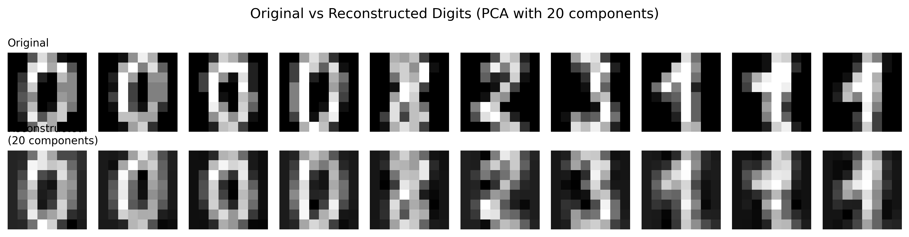

# Lesson 7: Principal Component Analysis
## Finding Structure in High-Dimensional Data

**MPS311/439 Machine Learning**  
**Dr. Wei Xing**  
**University of Sheffield**  
**Academic year 2026–27**

---

## 1. Introduction: Beyond Supervised Learning

Welcome back! Over the past seven weeks, we've built a solid foundation in supervised learning. We started with linear regression, moved through classification methods, and explored decision trees. In all these approaches, we had one thing in common: **labeled data**. We always knew the "right answer" – whether it was house prices, disease diagnoses, or customer categories.

But what happens when we don't have labels? What if we just want to understand the structure in our data, or reduce its complexity? This week marks a transition to **unsupervised learning**, and we'll start with one of the most elegant and widely-used techniques: **Principal Component Analysis (PCA)**.

### 1.1 The Challenge of High-Dimensional Data

Let me paint a picture. Imagine you're analyzing images of handwritten digits (like postal codes). Each image is 64×64 pixels. That's **4,096 dimensions** – one for each pixel! Now imagine trying to:

- **Visualize** this data (we can barely imagine 3D, let alone 4,096D)
- **Train models** on it (more features = slower algorithms)
- **Understand patterns** (which pixels actually matter?)

This is the **curse of dimensionality**, and it's everywhere in modern data science:
- Genomics: thousands of gene expressions per patient
- Text analysis: vocabulary of 10,000+ words
- Sensor networks: hundreds of measurements per second

Here's the key insight: **most of this data is redundant**. Many features are correlated, and the "true" complexity is often much lower than the number of dimensions suggests.


*Figure 1: A simple example where 2D data really only needs 1D to capture most variation. The data forms an elongated cloud – clearly, one direction matters much more than the other.*

### 1.2 What PCA Does For Us

PCA helps us in three critical ways:

1. **Visualization**: Reduce high-dimensional data to 2D or 3D so we can actually see it
2. **Computational efficiency**: Fewer features mean faster training and prediction
3. **Noise reduction**: Remove directions with little variance (often just noise)

The beautiful thing? PCA does this **optimally** – it finds the best low-dimensional representation in a precise mathematical sense.

---

## 2. The Core Idea: Variance as Information

Before diving into formulas, let's build intuition. Suppose we surveyed 100 students with three test scores: Mathematics, Physics, and Chemistry. We want to summarize each student with a single number – a "general science ability" score.

**Question**: How should we combine the three scores?

One approach: just average them. But that treats all three equally. What if students vary a lot in Math but are all similar in Chemistry? Then Math scores contain more **information**.

This is the key principle behind PCA:

> **Variance = Information**
> 
> Directions where data varies a lot are informative. Directions where data barely varies tell us less.

### 2.1 Finding the Direction of Maximum Variance

Let's visualize this with 2D data (though PCA works in any dimension):


*Figure 2: Several possible directions to project our data. The red arrow shows the direction of maximum variance – this is our first principal component (PC1).*

If we project all points onto different lines, which captures the most information? Clearly, the direction where points spread out the most. This is PC1.

The **first principal component** is the direction in which our data varies the most. If we had to compress our data to a single dimension, this would be the best choice.

But we don't stop there:
- **Second principal component (PC2)**: Direction perpendicular to PC1 with next-most variance
- **Third principal component (PC3)**: Perpendicular to both PC1 and PC2, next-most variance
- And so on...

These components form a new coordinate system, aligned with the natural structure of our data.

---

## 3. How PCA Works: The Algorithm

Now let's see how to actually find these principal components. The algorithm is surprisingly straightforward:

### Step 1: Center the Data

First, subtract the mean from each feature:

```python
import numpy as np

# Example data: 100 samples, 3 features
X = np.random.randn(100, 3)

# Center by subtracting mean
X_centered = X - X.mean(axis=0)

print("Original mean:", X.mean(axis=0))
print("Centered mean:", X_centered.mean(axis=0))  # ~[0, 0, 0]
```

**Why center?** PCA finds directions through the origin. If our data is off-center, we'd be finding directions through the wrong point.

### Step 2: Find the Direction of Maximum Variance

This is where the mathematics comes in (details in Section 4). The direction of maximum variance is the **eigenvector** of the **covariance matrix** corresponding to the largest **eigenvalue**.

Don't worry if those terms sound intimidating – let's understand them intuitively:

- **Covariance matrix**: Captures how features vary together
- **Eigenvectors**: Special directions that the covariance matrix "stretches" but doesn't rotate
- **Eigenvalues**: How much stretching happens in each eigenvector direction

The larger the eigenvalue, the more variance in that direction, the more important that component.

### Step 3: Find Remaining Components

Repeat Step 2, but constrained to directions perpendicular to those already found. This gives us PC2, PC3, etc.

A beautiful property: for the covariance matrix (which is symmetric), eigenvectors are automatically perpendicular. So we just need to sort them by eigenvalue size.

### Step 4: Transform and Reduce

Once we have our principal components, we:
1. **Transform**: Project data onto the PC directions
2. **Reduce**: Keep only the top *k* components

Let's see this in action with sklearn:

```python
from sklearn.decomposition import PCA

# Create PCA object: keep top 2 components
pca = PCA(n_components=2)

# Fit and transform in one step
X_reduced = pca.fit_transform(X_centered)

print("Original shape:", X_centered.shape)  # (100, 3)
print("Reduced shape:", X_reduced.shape)    # (100, 2)

# How much variance did we keep?
print("Variance explained:", pca.explained_variance_ratio_)
# Example output: [0.68, 0.24] = 92% total
```

That's it! We've gone from 3 dimensions to 2, keeping 92% of the variance.

---

## 4. Mathematical Foundation *(Optional for MPS311)*

> **Note**: This section provides the mathematical derivation of PCA. MPS311 students can skip to Section 5 – you won't be tested on these derivations, though understanding them deepens your intuition. MPS439 students should work through this carefully.

### 4.1 Setting Up the Problem

Let's formalize what we're trying to do. We have:
- Data matrix **X**: *n* samples × *d* features (already centered)
- Goal: Find unit vector **w** that maximizes variance of projected data

The projection of **X** onto **w** is **Xw** (matrix-vector multiplication). The variance of this projection is:

$$\text{Var}(\mathbf{Xw}) = \frac{1}{n}\|\mathbf{Xw}\|^2 = \frac{1}{n}\mathbf{w}^T\mathbf{X}^T\mathbf{Xw} = \mathbf{w}^T\mathbf{Cw}$$

where **C** = (1/*n*)**X**ᵀ**X** is the **covariance matrix**.

So our optimization problem is:

$$\max_{\mathbf{w}} \mathbf{w}^T\mathbf{Cw} \quad \text{subject to} \quad \mathbf{w}^T\mathbf{w} = 1$$

The constraint ensures **w** is a unit vector (otherwise we could make variance arbitrarily large).

### 4.2 Solving with Lagrange Multipliers

Using Lagrange multipliers for the constraint:

$$L(\mathbf{w}, \lambda) = \mathbf{w}^T\mathbf{Cw} - \lambda(\mathbf{w}^T\mathbf{w} - 1)$$

Taking the derivative with respect to **w** and setting to zero:

$$\frac{\partial L}{\partial \mathbf{w}} = 2\mathbf{Cw} - 2\lambda\mathbf{w} = 0$$

This gives us:

$$\mathbf{Cw} = \lambda\mathbf{w}$$

This is the **eigenvalue equation**! Our optimal **w** is an eigenvector of **C**, and λ is the corresponding eigenvalue.

### 4.3 Which Eigenvector?

Multiplying both sides by **w**ᵀ:

$$\mathbf{w}^T\mathbf{Cw} = \lambda\mathbf{w}^T\mathbf{w} = \lambda$$

So the variance we're maximizing equals λ. Therefore, to maximize variance, we choose the eigenvector with the **largest eigenvalue**.

For the second principal component, we maximize variance subject to being orthogonal to the first eigenvector. This gives the second-largest eigenvalue's eigenvector, and so on.

### 4.4 Geometric Interpretation

The covariance matrix **C** describes an ellipsoid. The eigenvectors point along the axes of this ellipsoid, and eigenvalues give the squared lengths of these axes.


*Figure 3: The covariance structure forms an ellipse. The eigenvectors (red and blue arrows) point along the major and minor axes. Their lengths are proportional to the eigenvalues (variance in each direction).*

This is why PCA works: it aligns our coordinate system with the natural shape of the data.

---

## 5. Practical Implementation with sklearn

Now let's work through a complete, realistic example. We'll use the **digits dataset** – images of handwritten digits (0-9).

### 5.1 Loading and Exploring Data

```python
from sklearn.datasets import load_digits
import matplotlib.pyplot as plt
import numpy as np

# Load data
digits = load_digits()
X = digits.data
y = digits.target

print("Shape:", X.shape)  # (1797, 64)
print("Each sample: 8x8 pixel image flattened to 64 features")

# Visualize a few samples
fig, axes = plt.subplots(2, 5, figsize=(10, 4))
for i, ax in enumerate(axes.flat):
    ax.imshow(X[i].reshape(8, 8), cmap='gray')
    ax.set_title(f'Label: {y[i]}')
    ax.axis('off')
plt.tight_layout()
plt.show()
```

We have 1,797 images, each with 64 features (pixels). Can we reduce this?

### 5.2 Applying PCA

```python
from sklearn.decomposition import PCA

# First, let's see all 64 components
pca = PCA()
X_pca = pca.fit_transform(X)

print("Transformed shape:", X_pca.shape)  # Still (1797, 64)
```

At first, we keep all components. But look at how much variance each captures:

```python
print("First 10 components:")
print(pca.explained_variance_ratio_[:10])
```

Output might look like:
```
[0.1498, 0.1356, 0.1188, 0.0841, 0.0542, 0.0419, 0.0378, 0.0277, 0.0244, 0.0203]
```

The first component alone captures **~15%** of total variance! The first three capture over **40%**.


*Figure 4: Variance explained by each principal component. Notice the rapid drop-off – most variance is in the first few components.*

### 5.3 Choosing the Number of Components

There are several strategies:

#### Strategy 1: Cumulative Variance Threshold

A common choice: keep enough components to retain 90% (or 95%) of variance.

```python
# Calculate cumulative variance
cumulative_variance = np.cumsum(pca.explained_variance_ratio_)

# How many components for 90%?
n_components_90 = np.argmax(cumulative_variance >= 0.90) + 1
print(f"Components for 90% variance: {n_components_90}")

# How many for 95%?
n_components_95 = np.argmax(cumulative_variance >= 0.95) + 1
print(f"Components for 95% variance: {n_components_95}")
```


*Figure 5: Cumulative variance explained. We need only about 21 components (out of 64) to capture 90% of the variance – a significant reduction!*

#### Strategy 2: Elbow Method

Look for an "elbow" in the variance plot – where the curve flattens. This is subjective but often effective.

#### Strategy 3: Task-Specific

- For visualization: Use 2 or 3 components (regardless of variance)
- For preprocessing: Choose based on downstream model performance
- For compression: Balance accuracy vs. space savings

### 5.4 Dimensionality Reduction in Practice

Let's reduce to 20 components:

```python
# Create new PCA with just 20 components
pca_reduced = PCA(n_components=20)
X_reduced = pca_reduced.fit_transform(X)

print("Original shape:", X.shape)      # (1797, 64)
print("Reduced shape:", X_reduced.shape)  # (1797, 20)
print("Variance retained:", pca_reduced.explained_variance_ratio_.sum())
# Approximately 0.93 = 93%
```

We've reduced dimensionality by **68%** while keeping **93%** of the information!

### 5.5 Reconstruction: Can We Go Back?

One nice property of PCA: we can transform back to the original space.

```python
# Reconstruct original data from reduced representation
X_reconstructed = pca_reduced.inverse_transform(X_reduced)

print("Reconstructed shape:", X_reconstructed.shape)  # (1797, 64)
```

Of course, we've lost some information (7% of variance). Let's visualize this:



*Figure 6: Original (top) vs. reconstructed images (bottom) using 20 components. Most details are preserved, though some fine features are smoothed. This compression might actually help reduce noise!*

The reconstructed images are slightly blurred, but the essential features remain. This is exactly what we want: noise reduction while preserving signal.

---

## 6. Visualization: Seeing High-Dimensional Data

One of PCA's most powerful uses is **visualization**. Let's project our 64D digit data into 2D:

```python
# PCA to 2 dimensions
pca_2d = PCA(n_components=2)
X_2d = pca_2d.fit_transform(X)

# Plot in PC1-PC2 space, colored by digit class
plt.figure(figsize=(10, 8))
scatter = plt.scatter(X_2d[:, 0], X_2d[:, 1], c=y, cmap='tab10', 
                      alpha=0.6, edgecolors='k', linewidth=0.5)
plt.colorbar(scatter, label='Digit')
plt.xlabel(f'PC1 ({pca_2d.explained_variance_ratio_[0]:.1%} variance)')
plt.ylabel(f'PC2 ({pca_2d.explained_variance_ratio_[1]:.1%} variance)')
plt.title('Digits Dataset: 2D PCA Projection')
plt.show()
```


*Figure 7: The digits dataset projected onto its first two principal components. Notice how different digits tend to cluster in different regions, even though we didn't use the labels! PC1 and PC2 alone capture meaningful structure.*

Even with just two components (capturing ~28% of variance), we see structure:
- Different digits cluster in different regions
- Some digits overlap (0 and 6 might be similar in shape)
- The first two PCs capture something meaningful about digit identity

This is why PCA is so valuable: it finds structure **without labels**.

---

## 7. Advanced: Implementing PCA with SVD *(MPS439 Only)*

> **Note**: This section is for MPS439 students only. We'll implement PCA from scratch using Singular Value Decomposition (SVD).

### 7.1 Why SVD Instead of Eigendecomposition?

In Section 4, we derived PCA using the eigendecomposition of the covariance matrix **C** = (1/*n*)**X**ᵀ**X**. However, there's a problem:

- Computing **X**ᵀ**X** explicitly can be **numerically unstable**
- If *d* (features) is large, **C** is *d* × *d*, which is expensive to store
- Eigendecomposition of large matrices is slow

**Singular Value Decomposition (SVD)** provides a better way. For any matrix **X**, SVD factorizes it as:

$$\mathbf{X} = \mathbf{U} \mathbf{\Sigma} \mathbf{V}^T$$

where:
- **U**: *n* × *n* matrix (left singular vectors)
- **Σ**: *n* × *d* diagonal matrix (singular values)
- **V**: *d* × *d* matrix (right singular vectors)

**Key insight**: The columns of **V** are exactly the eigenvectors of **C**, and the singular values σ relate to eigenvalues by λ = σ²/*n*.

### 7.2 PCA via SVD: The Math

Starting with the covariance matrix:

$$\mathbf{C} = \frac{1}{n}\mathbf{X}^T\mathbf{X}$$

Using SVD (**X** = **U** **Σ** **V**ᵀ):

$$\mathbf{C} = \frac{1}{n}(\mathbf{U\Sigma V}^T)^T(\mathbf{U\Sigma V}^T) = \frac{1}{n}\mathbf{V\Sigma}^T\mathbf{U}^T\mathbf{U\Sigma V}^T$$

Since **U**ᵀ**U** = **I** (orthogonal matrix):

$$\mathbf{C} = \frac{1}{n}\mathbf{V\Sigma}^2\mathbf{V}^T$$

This is the eigendecomposition of **C**! Thus:
- Eigenvectors of **C** = columns of **V**
- Eigenvalues of **C** = σ²/*n*

### 7.3 Implementation from Scratch

```python
import numpy as np

def pca_svd(X, n_components):
    """
    Perform PCA using SVD.
    
    Parameters:
    X : array, shape (n_samples, n_features)
        Input data
    n_components : int
        Number of components to keep
        
    Returns:
    X_transformed : array, shape (n_samples, n_components)
        Data in PC space
    components : array, shape (n_components, n_features)
        Principal component vectors
    explained_variance : array, shape (n_components,)
        Variance explained by each component
    """
    # Step 1: Center the data
    X_centered = X - X.mean(axis=0)
    
    # Step 2: Compute SVD
    # full_matrices=False gives economy SVD (faster for tall matrices)
    U, s, Vt = np.linalg.svd(X_centered, full_matrices=False)
    
    # Step 3: Extract principal components
    # Vt is already transposed, so rows are components
    components = Vt[:n_components]
    
    # Step 4: Transform data (project onto components)
    X_transformed = X_centered @ components.T
    
    # Step 5: Calculate explained variance
    # Variance = (singular values squared) / (n - 1)
    explained_variance = (s[:n_components] ** 2) / (len(X) - 1)
    
    return X_transformed, components, explained_variance

# Test on digits dataset
X_test = digits.data
X_transformed, components, variance = pca_svd(X_test, n_components=2)

print("Transformed shape:", X_transformed.shape)
print("Components shape:", components.shape)
print("Explained variance:", variance)
```

### 7.4 Verification

Let's compare with sklearn:

```python
from sklearn.decomposition import PCA

# Our implementation
X_ours, _, var_ours = pca_svd(X_test, n_components=2)

# sklearn
pca_sklearn = PCA(n_components=2)
X_sklearn = pca_sklearn.fit_transform(X_test)

# Compare (up to sign flip)
print("Our variance:", var_ours)
print("sklearn variance:", pca_sklearn.explained_variance_)
print("Difference:", np.abs(var_ours - pca_sklearn.explained_variance_))

# Should be tiny (numerical precision)
```

The results should match perfectly (up to sign flips, which don't matter – eigenvectors can point either direction).

**Why this matters**: Understanding SVD-based PCA is crucial for:
- Large-scale applications (images, genomics, NLP)
- Numerical stability
- Connection to other techniques (Latent Semantic Analysis, matrix factorization)

---

## 8. Important Considerations

Before you start applying PCA everywhere, let's discuss when it works well and common pitfalls.

### 8.1 When PCA Works Best

PCA shines when:

✅ **Linear relationships**: Features are linearly correlated
✅ **Gaussian-like data**: Works best with roughly normal distributions
✅ **Variance = importance**: High variance truly means high information (not always true!)
✅ **Preprocessing**: Used before other ML algorithms

### 8.2 Common Pitfalls

#### Pitfall 1: Forgetting to Standardize

**The problem**: If features have different units (age in years, income in thousands), PCA is dominated by large-scale features.

```python
# Bad: Features with different scales
X_mixed = np.column_stack([
    np.random.randn(100) * 1,      # Small variance
    np.random.randn(100) * 1000,   # Large variance
])

pca = PCA(n_components=2)
pca.fit(X_mixed)
print(pca.explained_variance_ratio_)
# Output: [~1.0, ~0.0] - PC1 is all about the large-scale feature!
```

**The solution**: Standardize features to have mean=0, std=1:

```python
from sklearn.preprocessing import StandardScaler

scaler = StandardScaler()
X_scaled = scaler.fit_transform(X_mixed)

pca.fit(X_scaled)
print(pca.explained_variance_ratio_)
# Output: More balanced
```

sklearn's PCA doesn't standardize automatically – you must do it yourself if needed.

#### Pitfall 2: Blindly Choosing k

More components ≠ always better. In machine learning pipelines:
- **Too few components**: Lost important signal → underfitting
- **Too many components**: Kept noise → overfitting

Always validate on held-out data.

#### Pitfall 3: Misinterpreting Components

Principal components are **linear combinations of all features**. They're often not interpretable:

```python
# First PC might look like:
# PC1 = 0.32*pixel1 + 0.28*pixel2 - 0.19*pixel3 + ...
# What does this "mean"? Often unclear!
```

PCA finds variance, not meaning. High-variance directions aren't necessarily the most useful for your task.

### 8.3 What PCA Doesn't Do

❌ **Nonlinear patterns**: PCA can't find curved or complex manifolds (use kernel PCA, t-SNE, UMAP instead)
❌ **Class separation**: PCA doesn't use labels, so PCs might not separate classes (use Linear Discriminant Analysis instead)
❌ **Sparse features**: PCA creates dense components even from sparse data (use sparse PCA or alternatives)
❌ **Robustness to outliers**: A single outlier can dominate a principal component

---

## 9. Summary & Key Takeaways

Congratulations! You've learned one of the foundational techniques in modern data science. Let's recap:

### 9.1 Core Concepts

**What PCA Does**:
- Finds orthogonal directions of maximum variance in data
- Transforms data to a new coordinate system (principal components)
- Allows dimensionality reduction while preserving information

**Why It Works**:
- Based on eigendecomposition of covariance matrix
- Eigenvectors = principal components (directions)
- Eigenvalues = variance in each direction (importance)
- Guaranteed to find optimal linear projection

**How to Use It**:
```python
from sklearn.decomposition import PCA

pca = PCA(n_components=k)  # Choose k
X_reduced = pca.fit_transform(X)
variance_kept = pca.explained_variance_ratio_.sum()
```

### 9.2 Checklist for Understanding

Can you answer these questions?

**For all students (MPS311 & MPS439)**:
- [ ] Why does high variance mean high information?
- [ ] What do eigenvectors and eigenvalues represent geometrically?
- [ ] How do you use sklearn's PCA?
- [ ] How do you choose the number of components?
- [ ] When should you standardize features before PCA?

**For MPS439 students additionally**:
- [ ] Can you derive the PCA objective function?
- [ ] How do eigenvalues relate to the covariance matrix?
- [ ] Can you implement PCA using numpy's SVD?
- [ ] Why is SVD preferred over eigendecomposition?

### 9.3 When to Use PCA

| **Use PCA when...** | **Avoid PCA when...** |
|---------------------|----------------------|
| ✅ Visualizing high-D data | ❌ Features are already low-dimensional |
| ✅ Preprocessing for ML models | ❌ You need interpretable features |
| ✅ Reducing noise | ❌ Variance doesn't equal importance |
| ✅ Compressing data | ❌ Data has nonlinear structure |
| ✅ Features are correlated | ❌ You have very sparse data |

### 9.4 Looking Ahead

PCA is our first step into **unsupervised learning**. It's a **dimension reduction** technique – we're compressing data while preserving structure.

Next week, we'll explore **clustering** – another unsupervised approach that groups similar data points together. Unlike PCA (which reduces dimensions), clustering finds discrete groups.

Both are fundamental tools for understanding data without labels.

---

## Final Thought

> *"PCA is deceptively simple. The math fits on one page, yet it powers everything from genomics to recommendation systems to image compression. Its elegance lies in a single principle: **find the directions that matter most**."*

The most important lesson? **Variance is not always what matters for your task**. PCA finds variance, but your goal might be discrimination, prediction, or something else entirely. Always validate that PCA helps your specific objective.

Now go explore your own high-dimensional datasets – and see what structure emerges when you look in the right directions!

---

## Appendix: Additional Resources

### For Further Reading
- **sklearn documentation**: [PCA user guide](https://scikit-learn.org/stable/modules/decomposition.html#pca)
- **Interactive visualizations**: Try setosa.io/ev/principal-component-analysis/
- **Advanced topics**: Kernel PCA for nonlinear dimension reduction

### Practice Suggestions
1. Apply PCA to the Iris dataset – can you separate the three species in 2D?
2. Try PCA on your own image data – what do the first few components look like?
3. Experiment with different numbers of components – how does it affect model performance?

### Common Questions

**Q: Should I always standardize before PCA?**  
A: If features have different units or vastly different scales, yes. If they're already comparable (e.g., all pixel intensities), it's optional.

**Q: Can PCA be used for regression/classification?**  
A: Yes! Use it as preprocessing: `X_reduced = PCA(k).fit_transform(X)`, then fit your model on `X_reduced`.

**Q: What if I want to reduce to exactly k dimensions?**  
A: Set `n_components=k` directly. But check how much variance you're keeping!

**Q: How is PCA related to SVD?**  
A: They're mathematically equivalent (see Section 7). sklearn uses SVD internally for efficiency.

---

*End of Lesson 7 Lecture Notes*  
*MPS311/439 Machine Learning · Dr. Wei Xing · University of Sheffield · 2026–27*
