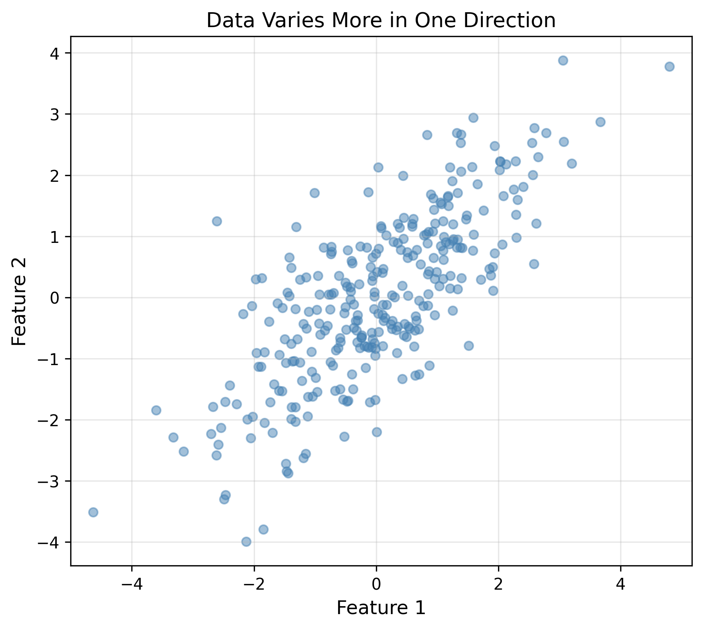
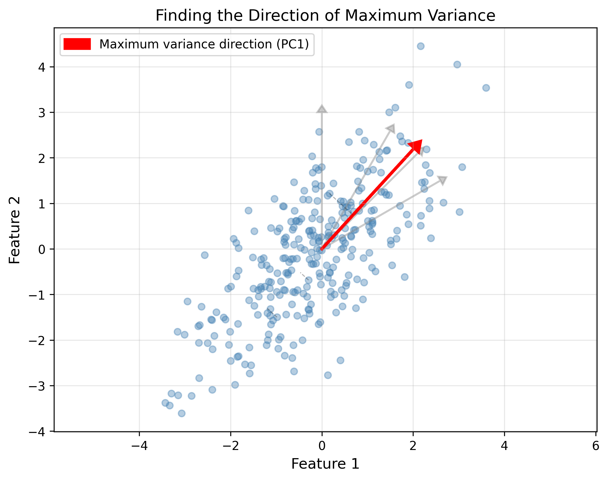
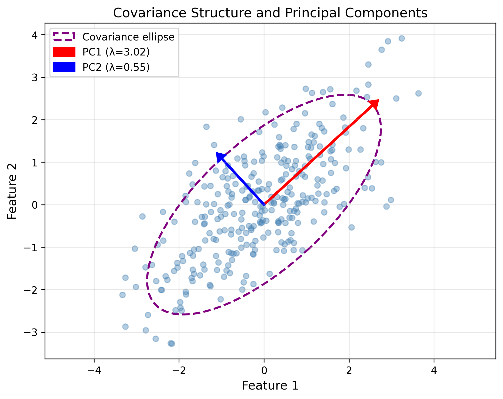
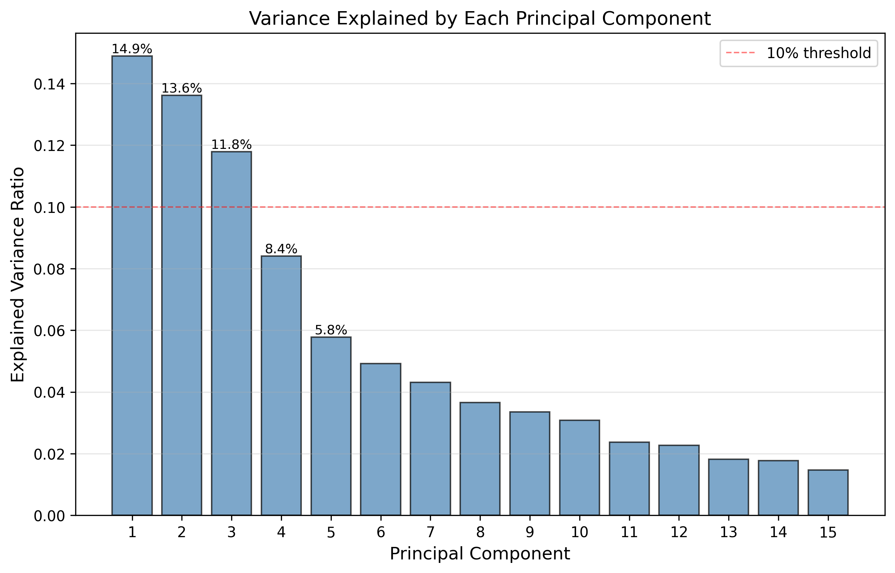
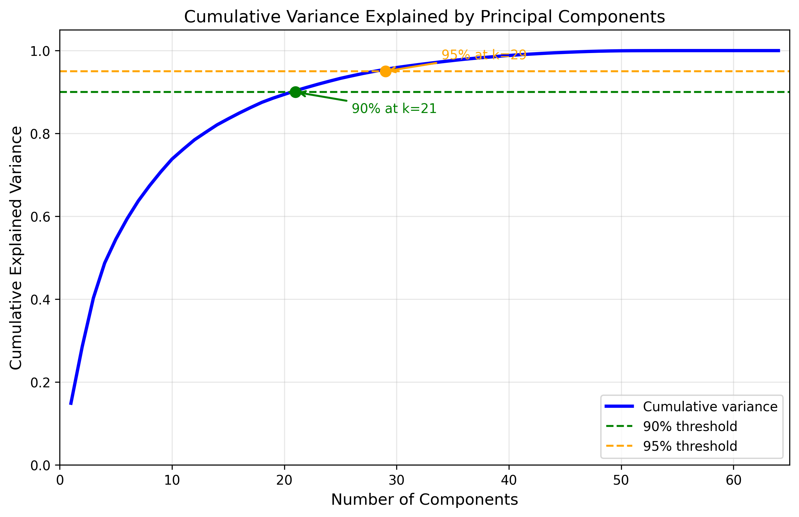
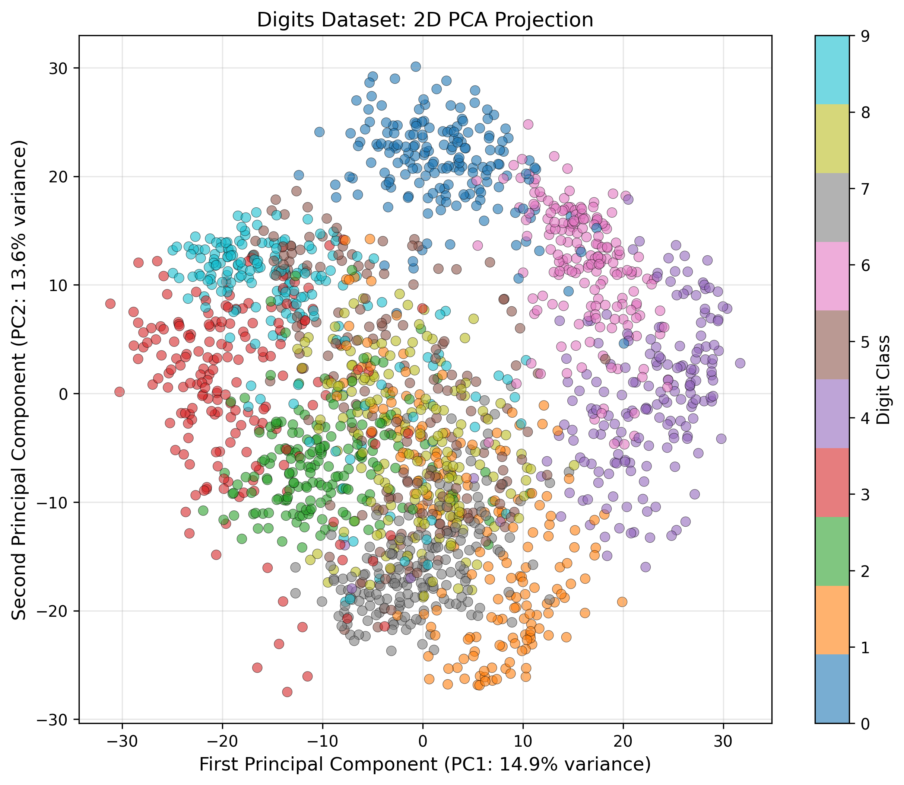

# Lesson 7: Principal Component Analysis

## Finding Structure in High-Dimensional Data

<div class="pt-12">
  <span class="text-xl">
    MPS311/439 Machine Learning<br>
    Dr. Wei Xing<br>
    2026–27
  </span>
</div>

---

# Where We Left Off

<div class="grid grid-cols-2 gap-8 mt-8">

<div>

## Our Journey So Far

<div class="mt-4 space-y-3">

- **Lesson 2-3**: Linear Regression
  - Predict continuous values

- **Lesson 4-5**: Classification
  - Predict categories (logistic, LDA)

- **Lesson 6**: Decision Trees
  - Non-linear decisions

</div>

<div class="mt-6 p-4 bg-blue-50 rounded-lg border-l-4 border-blue-500">

**Common Theme**: All supervised learning - we always had labels!

</div>

</div>

<div>

## Today's Shift

<div class="mt-4 space-y-3">

**What if we don't have labels?**

What if we just want to:
- Understand data structure?
- Visualize complex data?
- Remove redundancy?

</div>

<div class="mt-8 p-4 bg-green-50 rounded-lg border-l-4 border-green-500">

**Welcome to Unsupervised Learning**

PCA is our first unsupervised technique

</div>

</div>

</div>

<!--
hhh
-->

---

# The Challenge: High-Dimensional Data

<div class="grid grid-cols-2 gap-8">

<div>

## Real-World Examples

<div class="mt-4 space-y-4">

<div class="p-3 bg-yellow-50 rounded border-l-4 border-yellow-500">

📷 **Images**: 64×64 pixels = **4,096 dimensions**

</div>

<div class="p-3 bg-purple-50 rounded border-l-4 border-purple-500">

🧬 **Genomics**: **20,000+ genes** per patient

</div>

<div class="p-3 bg-pink-50 rounded border-l-4 border-pink-500">

📝 **Text**: **10,000+ words** vocabulary

</div>

</div>

## Three Key Problems

<div class="mt-4 space-y-2 text-sm">

1. 📊 **Visualization**: Can't plot 4,096 dimensions
2. ⚡ **Computation**: More features = slower algorithms  
3. 🎯 **Noise**: Many features are redundant

</div>

</div>

<div>

<div class="p-0 bg-blue-50 rounded-lg mt-0">

### Key Insight

Most high-dimensional data lives in a **lower-dimensional space**!

</div>



<div class="text-sm text-gray-600 mt-0 text-center">

2D data that really only needs 1D

</div>

</div>

</div>

---

# Core Idea: Variance as Information

<div class="grid grid-cols-2 gap-8">

<div>

## Thought Experiment

<div class="mt-4 space-y-4">

**Scenario**: 100 students, 3 test scores
- Mathematics
- Physics  
- Chemistry

**Goal**: Summarize each student with **one number**

**Question**: Which score matters most?

</div>

<div class="mt-6 p-4 bg-green-50 rounded-lg">

### The Answer

<div class="mt-2 space-y-2 text-sm">

- Math scores vary a lot (50-100) → **informative**
- Chemistry barely varies (85-90) → **less informative**

</div>

</div>

</div>

<div>

<div class="p-6 bg-blue-100 rounded-lg border-2 border-blue-400 mt-4">

## Central Principle

<div class="text-xl font-bold text-center mt-4">

**Variance = Information**

</div>

<div class="mt-4 text-sm">

Directions where data varies a lot contain more information

</div>

</div>

<div class="mt-8 space-y-3 text-sm">

- **High variance feature**: Spreads data apart
- **Low variance feature**: Data clustered together

</div>

<div class="mt-6 p-4 bg-yellow-50 rounded-lg">

**PCA finds the directions of maximum variance**

</div>

</div>

</div>

---

# Finding Maximum Variance Direction

<div class="text-center">



<div class="text-sm text-gray-600 mt-3">

The red arrow shows maximum variance direction (PC1)

</div>

</div>

<div class="grid grid-cols-3 gap-4 mt-8">

<div class="p-4 bg-red-50 rounded-lg">

### PC1
**First Principal Component**

Direction of maximum spread

</div>

<div class="p-4 bg-blue-50 rounded-lg">

### PC2
**Second Principal Component**

Perpendicular to PC1, next-most variance

</div>

<div class="p-4 bg-green-50 rounded-lg">

### PC3, PC4, ...
**Remaining Components**

Continue with decreasing variance

</div>

</div>

<div class="mt-6 p-4 bg-purple-50 rounded-lg border-l-4 border-purple-500 text-center">

These components form a **new coordinate system** aligned with data structure

</div>

---

# How PCA Works: The Algorithm

<div class="grid grid-cols-2 gap-6 mt-4">

<div>

## Step 1: Center the Data

<div class="text-sm mt-3">

Subtract mean from each feature

**Why?** PCA finds directions through origin

</div>

<div class="h-16"></div>

## Step 2: Find Maximum Variance

<div class="text-sm mt-3">

This becomes PC1

(Math details coming next...)

</div>

</div>

<div>

## Step 3: Find Orthogonal Directions

<div class="text-sm mt-3">

- PC2: perpendicular to PC1
- PC3: perpendicular to PC1 & PC2
- And so on...

</div>

<div class="h-8"></div>

## Step 4: Transform & Reduce

<div class="text-sm mt-3">

- Project data onto PC directions
- Keep only top **k** components

</div>

</div>

</div>

<div class="mt-2 p-2 bg-green-50 rounded-lg border-l-4 border-green-500 text-center text-lg">

✨ All this happens automatically in **sklearn**! ✨

</div>


---

# The Mathematics: Setting Up PCA

<div class="grid grid-cols-2 gap-8">

<div>

## The Problem

<div class="mt-4 space-y-4">

**Given**: Data matrix **X** (n samples × d features)

**Assumption**: Data is centered (mean = 0)

**Goal**: Find direction **w** where data has maximum variance

**Constraint**: **w** must be a unit vector

$$\|\mathbf{w}\| = 1 \quad \text{or} \quad \mathbf{w}^T\mathbf{w} = 1$$

</div>

</div>

<div>

## Variance of Projection

<div class="mt-4">

When we project data **X** onto direction **w**, we get:

$$\text{Projection} = \mathbf{X}\mathbf{w}$$

The variance of this projection is:

$$\text{Var}(\mathbf{X}\mathbf{w}) = \frac{1}{n}\|\mathbf{X}\mathbf{w}\|^2$$

</div>

<div class="mt-4">

After some algebra:

$$= \frac{1}{n}\mathbf{w}^T\mathbf{X}^T\mathbf{X}\mathbf{w} = \mathbf{w}^T\mathbf{C}\mathbf{w}$$   

($\mathbf{C} = \frac{1}{n}\mathbf{X}^T\mathbf{X}$ is the **covariance matrix**)

</div>

</div>

</div>

<div class="mt-1 p-1 bg-blue-100 rounded-lg border-2 border-blue-500 text-center">

**Optimization Problem**: Maximize $\mathbf{w}^T\mathbf{C}\mathbf{w}$ subject to $\mathbf{w}^T\mathbf{w} = 1$

</div>

---

# The Mathematics: Solving for Principal Components

<div class="grid grid-cols-2 gap-8">

<div>

## Using Lagrange Multipliers

<div class="mt-3 space-y-3 text-sm">

Set up the Lagrangian:

$$L(\mathbf{w}, \lambda) = \mathbf{w}^T\mathbf{C}\mathbf{w} - \lambda(\mathbf{w}^T\mathbf{w} - 1)$$

Take derivative with respect to **w**:

$$\frac{\partial L}{\partial \mathbf{w}} = 2\mathbf{C}\mathbf{w} - 2\lambda\mathbf{w} = 0$$

This gives us:

</div>

<div class="mt-3 p-4 bg-yellow-100 rounded-lg border-2 border-yellow-500 text-center">

$$\mathbf{C}\mathbf{w} = \lambda\mathbf{w}$$

**The eigenvalue equation!**

</div>

</div>

<div>

## Interpretation

<div class="mt-0 space-y-4 text-sm">

<div class="p-0.5 bg-red-50 rounded">

**Optimal w**: Must be an **eigenvector** of **C**

</div>

<div class="p-0.5 bg-blue-50 rounded">

Multiply both sides by $\mathbf{w}^T$:

$$\mathbf{w}^T\mathbf{C}\mathbf{w} = \lambda\mathbf{w}^T\mathbf{w} = \lambda$$

So the **variance we maximize = λ**

</div>

<div class="p-0.5 bg-green-50 rounded">

**Conclusion**: Choose eigenvector with **largest eigenvalue** for PC1

</div>

<div class="p-0. bg-purple-50 rounded">

**For PC2, PC3, ...**: Next largest eigenvalues (automatically orthogonal!)

</div>

</div>

</div>

</div>

<!--  -->

<div class="mt-0 text-xs text-gray-600 text-center">

MPS311: Understand the concept | MPS439: Know the full derivation

</div>

---

# Understanding Eigenvalues & Eigenvectors

<div class="grid grid-cols-2 gap-8 mt-6">

<div>

## Intuitive Explanation

<div class="space-y-4 mt-4">

<div class="p-4 bg-red-50 rounded-lg border-l-4 border-red-500">

**Eigenvectors** 

= Principal component directions

</div>

<div class="p-4 bg-blue-50 rounded-lg border-l-4 border-blue-500">

**Eigenvalues** 

= Amount of variance in each direction

</div>

<div class="p-4 bg-green-50 rounded-lg border-l-4 border-green-500">

**Larger eigenvalue** 

= More important direction

</div>

</div>

</div>

<div>

## Mathematical Result

<div class="mt-4 space-y-3 text-sm">

- Eigenvectors of covariance matrix **C** are the PCs

- Eigenvalues = variance captured by each PC

- Sorted by size:

</div>

<div class="text-center mt-4">

$$\lambda_1 \geq \lambda_2 \geq ... \geq \lambda_d$$

</div>

<div class="mt-6 p-4 bg-purple-50 rounded-lg">

### Key Insight

- Eigenvector with **largest** eigenvalue → PC1
- Second-largest eigenvalue → PC2
- And so on...

This is **optimal** - no other linear projection captures more variance!

</div>

</div>

</div>

---

# Implementation in sklearn
````md magic-move
```python
# Import libraries
from sklearn.decomposition import PCA
from sklearn.datasets import load_digits

# Load data
digits = load_digits()
X = digits.data

print(X.shape)  # (1797, 64)
```
```python
# Import libraries
from sklearn.decomposition import PCA
from sklearn.datasets import load_digits

# Load data
digits = load_digits()
X = digits.data

# Apply PCA - keep top 20 components
pca = PCA(n_components=20)
X_reduced = pca.fit_transform(X)
```
```python
# Import libraries
from sklearn.decomposition import PCA
from sklearn.datasets import load_digits

# Load data
digits = load_digits()
X = digits.data

# Apply PCA - keep top 20 components
pca = PCA(n_components=20)
X_reduced = pca.fit_transform(X)

print(X.shape)          # (1797, 64)
print(X_reduced.shape)  # (1797, 20)
```
````

<div class="mt-8">

## Key Outputs

<div class="grid grid-cols-3 gap-4 mt-4">

<div class="p-1 bg-blue-50 rounded text-sm">

`explained_variance_ratio_`

Proportion of variance per component

</div>

<div class="p-1 bg-green-50 rounded text-sm">

`components_`

The principal component vectors

</div>

<div class="p-1 bg-purple-50 rounded text-sm">

`explained_variance_`

Variance (eigenvalues) per component

</div>

</div>

</div>

<div class="mt-2 p-1 bg-yellow-50 rounded-lg border-l-4 border-yellow-500 text-center">

**That's it!** 64 → 20 dimensions while keeping ~93% variance

</div>

---

# Choosing Number of Components

<div class="mt-1">

<div class="grid grid-cols-3 gap-6 mt-0">

<div class="p-0 bg-blue-50 rounded-lg">

### Strategy 1
**Variance Threshold**

Keep until 90% (or 95%) total variance

Most common approach

</div>

<div class="p-0 bg-green-50 rounded-lg">

### Strategy 2
**Scree Plot / Elbow**

Look for "elbow" where variance drops off

More subjective

</div>

<div class="p-0 bg-purple-50 rounded-lg">

### Strategy 3
**Task-Specific**

- Visualization: 2-3 components
- ML preprocessing: validate on task

</div>

</div>

</div>

<div class="grid grid-cols-2 gap-2 mt-1">

<div>



<div class="text-sm text-gray-600 mt-2 text-center">

Variance per component

</div>

</div>

<div>



<div class="text-sm text-gray-600 mt-2 text-center">

Cumulative variance (21 components → 90%)

</div>

</div>

</div>

---

# Visualization Example

<div class="grid grid-cols-2 gap-8">

<div>

## From 64D to 2D

<div class="mt-1 p-1 bg-blue-50 rounded-lg">

**Setup**:
- Digits dataset: 64 dimensions → 2
- No labels used in PCA
- Color by true digit class to see structure

</div>

<div class="mt-2">

```python
# PCA to 2 dimensions
pca = PCA(n_components=2)
X_2d = pca.fit_transform(X)
# Plot
plt.scatter(X_2d[:, 0], X_2d[:, 1], c=digits.target)

```

</div>

<div class="mt-1 p-1 bg-green-50 rounded-lg">

**Observation**:

PC1 and PC2 capture ~28% variance, but reveal meaningful structure!

</div>

</div>

<div>



<div class="mt-2 p-2 bg-yellow-50 rounded-lg border-l-4 border-yellow-500 text-center">

**Clusters emerge even without using labels!**

Different digits naturally separate in PC space

</div>

</div>

</div>

---

# When to Use PCA: Practical Considerations

<div class="grid grid-cols-2 gap-8 mt-6">

<div>

## ✅ When PCA Works Well

<div class="space-y-3 mt-4 text-sm">

- Features are **correlated** (linear relationships)

- Need to **visualize** high-D data

- **Preprocessing** before ML models

- **Noise reduction**

- Features on **similar scales** (or standardized)

</div>

</div>

<div>

## ❌ Watch Out For

<div class="space-y-3 mt-4 text-sm">

<div class="p-3 bg-red-50 rounded border-l-4 border-red-500">

**Pitfall 1**: Forgetting to standardize

If different units/scales → biased PCs

</div>

<div class="p-3 bg-orange-50 rounded border-l-4 border-orange-500">

**Pitfall 2**: Blindly choosing k

More components ≠ always better (overfitting)

</div>

<div class="p-3 bg-yellow-50 rounded border-l-4 border-yellow-500">

**Pitfall 3**: Assuming interpretability

PCs are linear combinations - often unclear

</div>

<div class="p-3 bg-pink-50 rounded border-l-4 border-pink-500">

**Pitfall 4**: Nonlinear data

PCA can't find curved structures

</div>

</div>

</div>

</div>

<div class="mt-8 p-4 bg-blue-100 rounded-lg border-2 border-blue-500 text-center text-lg">

💡 **Always standardize if features have different units!**

</div>

---

# What We Learned Today

<div class="mt-6">

## Core Concepts

<div class="grid grid-cols-2 gap-6 mt-6">

<div class="space-y-4">

<div class="p-4 bg-blue-50 rounded-lg">

### 1. What PCA Does

- Finds orthogonal directions of maximum variance
- Reduces dimensionality while preserving information
- Transforms data to new coordinate system

</div>

<div class="p-4 bg-green-50 rounded-lg">

### 2. How It Works

- Based on eigendecomposition of covariance matrix
- Eigenvectors = PC directions
- Eigenvalues = importance
- Guaranteed optimal linear projection

</div>

</div>

<div class="space-y-4">

<div class="p-4 bg-purple-50 rounded-lg">

### 3. Practical Use

- `sklearn.decomposition.PCA` - easy!
- Choose k by explained variance (90% common)
- Standardize features if needed

</div>

<div class="p-4 bg-yellow-100 rounded-lg border-2 border-yellow-500 text-center">

**Key Formula**

$$\mathbf{C}\mathbf{w} = \lambda\mathbf{w}$$

</div>

</div>

</div>

</div>

<div class="mt-6 p-4 bg-green-100 rounded-lg border-l-4 border-green-500 text-center">

First step into **unsupervised learning** - finding structure without labels

</div>

---

# Learning Outcomes - Check Your Understanding

<div class="grid grid-cols-2 gap-8 mt-4">

<div>

## For All Students (MPS311 & MPS439)

<div class="space-y-2 mt-4 text-sm">

- ☐ Can you explain why high variance = high information?

- ☐ Can you describe what eigenvectors and eigenvalues represent?

- ☐ Can you implement PCA using sklearn?

- ☐ Can you choose number of components using explained variance?

- ☐ Do you know when to standardize features before PCA?

- ☐ Can you visualize high-D data in 2D/3D using PCA?

</div>

</div>

<div>

## Additional for MPS439 Students

<div class="space-y-2 mt-4 text-sm">

- ☐ Can you derive the PCA optimization problem?

- ☐ Can you explain the eigenvalue equation solution?

- ☐ Do you understand the SVD approach to PCA?

</div>

<div class="mt-6 p-4 bg-blue-50 rounded-lg">

### Resources

- Lecture notes on Blackboard (full derivations)
- Lab session this Friday: hands-on PCA
- Office hours: Tuesday 12-1pm

</div>

</div>

</div>

<div class="mt-1 p-1 bg-purple-50 rounded-lg border-l-4 border-purple-500 italic text-center">

"PCA: Simple, elegant, powerful. The foundation for understanding data structure."

</div>

---
layout: center
class: text-center
---

<!-- COURSE_FEEDBACK_QR:START -->
---
layout: center
class: text-center
---

# 30-second feedback

<p class="text-3xl mb-4">What would help you learn better next time?</p>

<p class="text-2xl mb-4">Scan to share anonymous feedback on today's lecture.</p>


<p class="text-sm mt-4 opacity-70">MPS311/439 · 2026-27 · Lesson 07 lecture</p>
<!-- COURSE_FEEDBACK_QR:END -->
