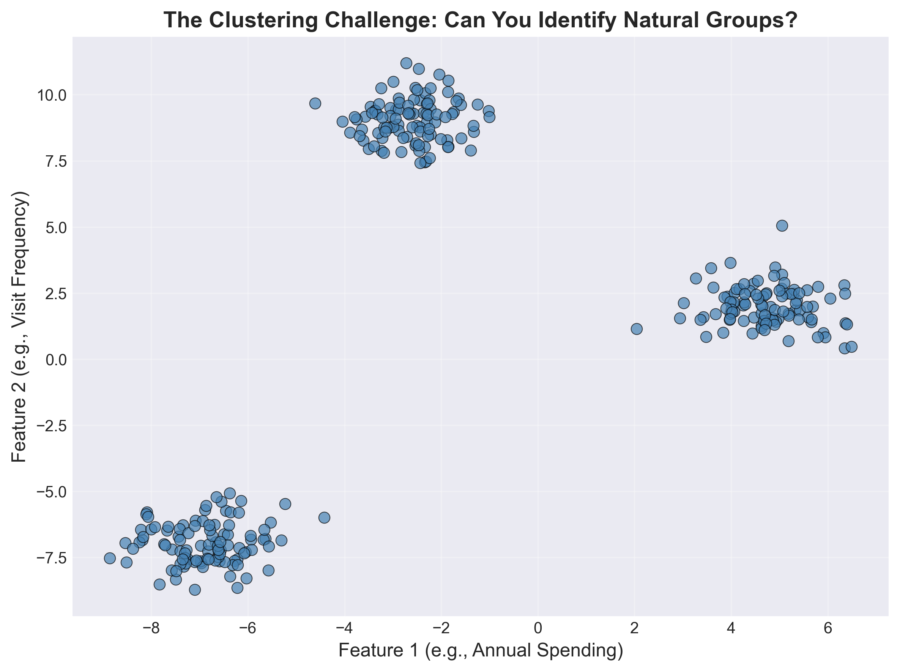
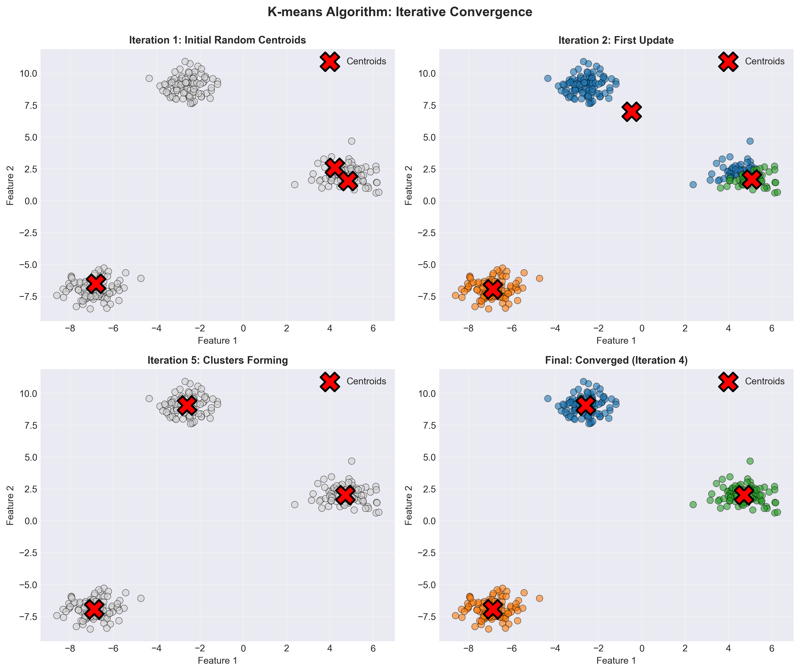
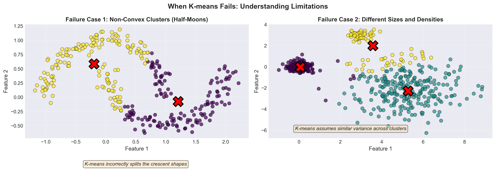
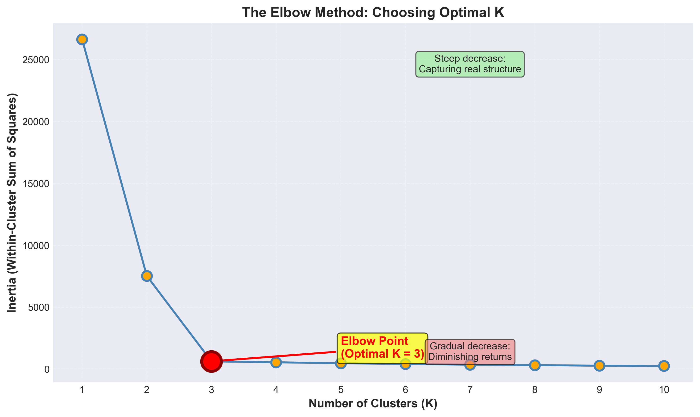
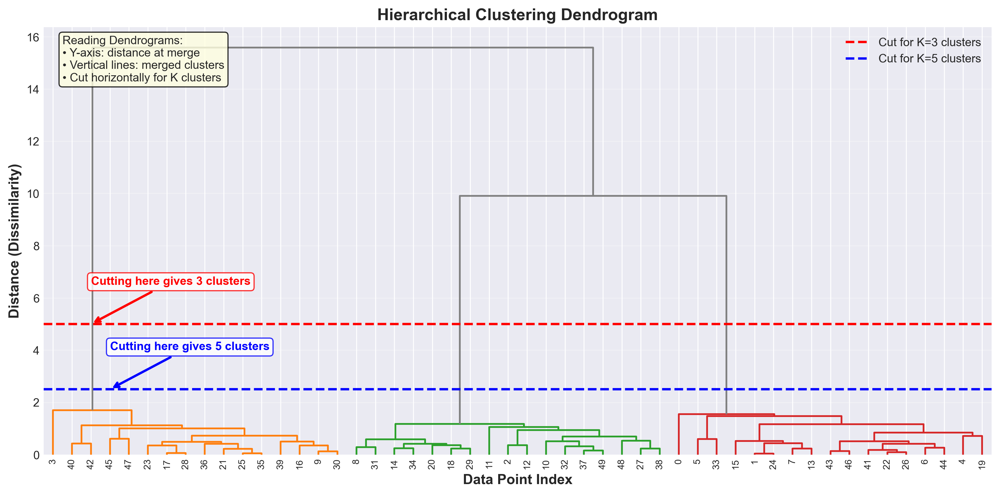

# Lesson 8: K-means and Hierarchical Clustering
## Discovering Groups in Unlabeled Data

**MPS311/439 Machine Learning**  
**Dr. Wei Xing**  
**University of Sheffield**  
**Academic year 2026–27**

---

## 1. Introduction: A New Kind of Challenge

Welcome to Lesson 8! Over the past few weeks, we've been building up a comprehensive toolkit for machine learning. Last week, we explored **Principal Component Analysis (PCA)**, which helped us find hidden structure in high-dimensional data by identifying directions of maximum variance. PCA transformed our data into a more compact representation while preserving the most important information.

This week, we're tackling a fundamentally different but equally important question: **How do we group similar data points together when we have no labels?**

Think about it—in all our previous topics (linear regression, logistic regression, decision trees), we always had labels. We knew which emails were spam, which tumors were malignant, which houses sold for what price. But what if we don't have labels? What if we simply have data and want to discover natural groupings?

This is the realm of **unsupervised learning**, and specifically, **clustering**. Today we'll learn two fundamental clustering algorithms that have stood the test of time: **K-means** and **Hierarchical Clustering**.

---

## 2. Real-World Motivation: Where Do We Need Clustering?

Before diving into algorithms, let's appreciate why clustering matters. Here are three compelling real-world applications:

**Customer Segmentation in Marketing**: Imagine you're running an e-commerce platform with millions of users. You have data on their browsing history, purchase patterns, time spent on site, and preferred categories. You don't have predefined customer "types"—but you want to discover natural groups of similar customers so you can tailor marketing strategies. Are there "budget shoppers"? "Premium buyers"? "Window shoppers"? Clustering can reveal these hidden segments.

**Image Compression**: A color image contains millions of pixels, each with its own RGB value. But often, an image doesn't use all possible colors—maybe it's dominated by blues and greens (ocean scene) or reds and browns (desert landscape). We can cluster similar colors together and replace each pixel with its cluster center color. This dramatically reduces storage while maintaining visual quality.

**Gene Expression Analysis**: In bioinformatics, researchers measure expression levels of thousands of genes across different conditions. By clustering genes with similar expression patterns, we can identify groups of genes that work together—perhaps they're all involved in immune response, or cell division. These discoveries lead to new biological insights.

All these problems share a **common pattern**: we have data with no labels, and we want to discover natural groupings where items within a group are similar to each other.

---

## 3. The Clustering Problem: An Intuitive Setup

Let's make this concrete. Look at the scatter plot below—it shows data points in 2D space (imagine they're customers plotted by "annual spending" vs "visit frequency"):



**Question for you**: If I asked you to organize these points into 3 groups, how would you do it?

You'd probably start by visually identifying regions where points cluster together, then draw boundaries around them. Your brain naturally does this pattern recognition. The question is: **how do we teach a computer to do this systematically?**

### Formalizing the Problem

Let's define **clustering** formally:

> **Clustering**: Given $n$ data points $\{x_1, x_2, ..., x_n\}$ where each $x_i \in \mathbb{R}^d$, partition them into $K$ groups (clusters) such that:
> - Points within the same cluster are **similar** to each other
> - Points in different clusters are **dissimilar** from each other

The key challenge is defining what "similar" means. For most clustering algorithms, similarity is measured by **distance**—points that are close together in space are considered similar.

**Crucial distinction from classification**: In supervised classification, we have training labels that tell us the correct categories. In clustering, we're discovering the categories ourselves. There's no "ground truth" to compare against—clustering is about finding useful structure in data.

---

## 4. K-means Clustering: The Core Idea

Now let's develop our first clustering algorithm. Here's the **intuitive insight** that leads to K-means:

**Thought experiment**: Suppose someone told you where the "center" of each of the 3 groups is. Then clustering would be easy—just assign each point to whichever center is closest! But wait—we don't know where the centers are...

**Brilliant twist**: What if we:
1. Start with a **guess** of where the centers are
2. Assign points to their nearest center
3. **Improve** our guess by computing the actual center of each group
4. Repeat until things stop changing

This is exactly what **K-means clustering** does! It's an iterative algorithm that alternates between two steps:
- **Assignment step**: Assign each point to its nearest center
- **Update step**: Recompute centers as the mean of assigned points

The name "K-means" comes from having $K$ clusters, each represented by its mean (center point).

---

## 5. The K-means Algorithm: Step by Step

Let's walk through the algorithm in detail.

### Step 1: Initialization

First, we need to **initialize** $K$ cluster centers (called **centroids**). The simplest approach is to randomly select $K$ data points from our dataset as the initial centroids.

**Notation**: Let's denote our $K$ centroids as $\mu_1, \mu_2, ..., \mu_K$ where each $\mu_k \in \mathbb{R}^d$.

### Step 2: Assignment

For each data point $x_i$, we **assign** it to the nearest centroid. We compute the distance from $x_i$ to each centroid and choose the closest one:

$$c_i = \arg\min_{k \in \{1,...,K\}} \|x_i - \mu_k\|^2$$

Here, $c_i$ is the cluster assignment for point $i$ (a number from 1 to $K$), and $\|x_i - \mu_k\|^2$ is the squared Euclidean distance:

$$\|x_i - \mu_k\|^2 = (x_{i1} - \mu_{k1})^2 + (x_{i2} - \mu_{k2})^2 + ... + (x_{id} - \mu_{kd})^2$$

**Geometric interpretation**: This assignment step creates **Voronoi regions** around each centroid—imagine drawing boundaries where all points on one side are closer to one centroid, and points on the other side are closer to another.

### Step 3: Update

After all points have been assigned, we **update** each centroid to be the mean of all points assigned to it:

$$\mu_k = \frac{1}{|C_k|} \sum_{i \in C_k} x_i$$

where $C_k$ is the set of all points assigned to cluster $k$, and $|C_k|$ is the number of points in that cluster.

**Why the mean?** The mean minimizes the sum of squared distances to all points in the cluster—it's the optimal center point!

### Step 4: Iteration

We repeat steps 2 and 3 (assignment and update) until **convergence**. Convergence occurs when:
- The centroids stop moving (or move very little), OR
- The cluster assignments stop changing

In practice, K-means typically converges in 10-50 iterations for most datasets.

---

## 6. Visualizing K-means in Action

Let's see K-means working through iterations:



**What's happening here?**
- **Iteration 1**: Starting from random initial centroids (marked with X), points are assigned to nearest center (shown by colors). Centers are far from optimal.
- **Iteration 2**: Centroids have moved to the center of their assigned points. New assignments are made, and some points switch clusters.
- **Iteration 5**: Clusters are taking clear shape. Centroids have moved significantly closer to the true cluster centers.
- **Final**: Algorithm has converged. Centroids are stable, and cluster assignments match our intuitive grouping.

Notice how the algorithm **always makes progress**—each iteration either reduces the total distance from points to their centroids or keeps it the same (when converged). This is guaranteed by the algorithm's design!

---

## 7. Why "Spherical" Clusters?

An important characteristic of K-means is that it tends to find **spherical (roughly circular) clusters** of similar size. Why?

**Geometric reasoning**: K-means assigns points based purely on **Euclidean distance** to centroids. This creates decision boundaries that are perpendicular bisectors between centroids—resulting in regions that are convex and roughly circular around each center.

Think about it: if you have two centroids, the boundary between their regions is the line where points are equidistant from both. This creates a straight-line boundary—and when you have multiple centroids, you get polygon-like regions that approximate circles.

**Implication**: K-means works best when:
- True clusters are compact and roughly spherical
- Clusters are well-separated
- Clusters have similar sizes (number of points)
- Clusters have similar variances (spread)

---

## 8. When K-means Fails: Important Examples

Understanding where K-means struggles is crucial for knowing when to use it. Here are two classic failure cases:



**Left panel - Non-convex shapes**: Two crescent-shaped clusters (half-moons). K-means incorrectly splits them because it can only create straight-line boundaries. The distance-based assignment cannot capture the curved, interlocking structure.

**Right panel - Different sizes and densities**: Three clusters where one is much larger and sparser than the others. K-means tries to make clusters of similar variance, so it incorrectly splits the large cluster and merges parts of different clusters.

**Takeaway**: If your data has non-spherical clusters, very different cluster sizes, or complex shapes, K-means may not be the right tool. You might need more sophisticated methods like DBSCAN or Gaussian Mixture Models (beyond our course scope).

---

## 9. K-means in Python: Basic Implementation

Now let's see how easy K-means is to use in scikit-learn:

```python
from sklearn.cluster import KMeans
import numpy as np

# Assuming X is your data matrix (n_samples, n_features)
kmeans = KMeans(n_clusters=3, random_state=42)
kmeans.fit(X)

# Get cluster assignments
labels = kmeans.labels_  # Array of 0, 1, 2 indicating cluster for each point

# Get cluster centers
centers = kmeans.cluster_centers_  # Array of shape (3, n_features)
```

**Key parameters**:
- `n_clusters`: The number of clusters $K$ (you must specify this!)
- `random_state`: Sets the random seed for reproducible results
- `n_init`: Number of times to run K-means with different initializations (default is 10—takes the best result)

The `fit()` method runs the entire K-means algorithm. After fitting:
- `labels_` gives you the cluster assignment for each data point
- `cluster_centers_` gives you the final centroid positions

---

## 10. Complete Example: K-means on Synthetic Data

Here's a complete working example:

```python
import numpy as np
import matplotlib.pyplot as plt
from sklearn.cluster import KMeans
from sklearn.datasets import make_blobs

# Generate synthetic data with 3 natural clusters
X, y_true = make_blobs(n_samples=300, centers=3, n_features=2, 
                        random_state=42)

# Apply K-means
kmeans = KMeans(n_clusters=3, random_state=42)
kmeans.fit(X)
y_pred = kmeans.labels_

# Visualize results
plt.scatter(X[:, 0], X[:, 1], c=y_pred, cmap='viridis')
plt.scatter(kmeans.cluster_centers_[:, 0], 
            kmeans.cluster_centers_[:, 1], 
            marker='X', s=200, c='red')
plt.show()
```

**What's happening**:
1. `make_blobs` creates synthetic data with clear clusters (useful for testing)
2. We fit K-means with 3 clusters
3. We plot points colored by cluster assignment
4. We mark centroids with red X symbols

**Try this yourself!** Change `n_clusters` to 2 or 4 and see what happens. Does K=3 give the best result visually?

---

## 11. The Crucial Question: Choosing K

Unlike supervised learning where the number of classes is given by the data, in clustering we must choose $K$—the number of clusters. This is both an art and a science.

**Domain knowledge first**: Sometimes domain expertise tells you $K$. For example:
- Customer segmentation: Marketing team might want exactly 4 segments for practical targeting
- Image compression: You might need exactly 16 colors for a specific file format
- Gene clustering: Biological knowledge might suggest looking for 5 functional groups

But often, we don't know $K$ in advance. We need a data-driven approach.

---

## 12. The Elbow Method: A Data-Driven Approach

The **elbow method** is the most popular technique for choosing $K$. It's based on a key insight:

**Key metric - Inertia**: K-means minimizes something called **within-cluster sum of squares** (WCSS), also known as **inertia**:

$$\text{Inertia} = \sum_{k=1}^{K} \sum_{i \in C_k} \|x_i - \mu_k\|^2$$

This measures the total squared distance from all points to their assigned centroids. Lower inertia means tighter, more compact clusters.

**Observation**: As we increase $K$, inertia always decreases. In the extreme, if $K = n$ (number of points), inertia is zero—each point is its own cluster!

**The elbow insight**: Plot inertia vs. $K$. Initially, inertia drops rapidly as we add clusters—we're capturing real structure. But after the "right" $K$, adding more clusters gives diminishing returns. The curve looks like an arm, and we choose $K$ at the **elbow** where the rate of decrease slows down sharply.



In this example, there's a clear elbow at $K=3$, suggesting 3 is the optimal number of clusters.

---

## 13. Implementing the Elbow Method

Here's how to create an elbow plot:

```python
inertias = []
K_range = range(1, 11)

for k in K_range:
    kmeans = KMeans(n_clusters=k, random_state=42)
    kmeans.fit(X)
    inertias.append(kmeans.inertia_)

plt.plot(K_range, inertias, marker='o')
plt.xlabel('Number of Clusters K')
plt.ylabel('Inertia')
plt.title('Elbow Method')
plt.show()
```

**How to read the plot**:
- Look for the "elbow point" where the curve bends
- Before the elbow: steep decrease (adding clusters helps a lot)
- After the elbow: gradual decrease (diminishing returns)
- Choose $K$ at the elbow

**Reality check**: Sometimes there's no clear elbow! The curve might be smooth. In such cases:
- Try different $K$ values and examine cluster interpretability
- Use domain knowledge to guide your choice
- Consider that the data might not have natural clusters

---

## 14. Practical Considerations for K-means

Before we move on to hierarchical clustering, here are some important practical tips:

### Random Initialization Matters

K-means is sensitive to initial centroid placement. Different random initializations can lead to different final clusters (local minima). 

**Solution**: scikit-learn's default `n_init=10` runs K-means 10 times with different initializations and returns the best result (lowest inertia). This makes results much more reliable.

### Scaling Your Features

K-means uses Euclidean distance, so **feature scaling** is important! If one feature is in meters (range 0-1000) and another is in millimeters (range 0-1000000), the millimeter feature will dominate the distance calculation.

**Best practice**: Standardize features before clustering:
```python
from sklearn.preprocessing import StandardScaler

scaler = StandardScaler()
X_scaled = scaler.fit_transform(X)
kmeans.fit(X_scaled)
```

### Computational Efficiency

K-means is very fast! Computational complexity is $O(nKt \cdot d)$ where:
- $n$ = number of points
- $K$ = number of clusters  
- $t$ = number of iterations (typically small)
- $d$ = number of dimensions

This scales well to large datasets (millions of points).

---

## 15. [Optional Mathematics] The K-means Objective Function

*This section provides mathematical depth for interested students. MPS311 students can skip to Section 16.*

K-means has a clear mathematical objective it's trying to minimize. Understanding this helps explain why the algorithm works.

### The Objective

K-means minimizes the **within-cluster sum of squares**:

$$J = \sum_{k=1}^{K} \sum_{i \in C_k} \|x_i - \mu_k\|^2$$

where:
- $C_k$ is the set of points assigned to cluster $k$
- $\mu_k$ is the centroid of cluster $k$

This objective measures how compact the clusters are. Smaller $J$ means points are closer to their centroids.

### Why the Algorithm Works

The two-step iteration is actually **coordinate descent** on this objective:

**Assignment step** (fix $\mu$, optimize $c$): Given current centroids, assigning each point to its nearest centroid provably minimizes $J$. Why? If we assigned point $i$ to any other centroid, the distance $\|x_i - \mu_{c_i}\|^2$ would be larger, increasing $J$.

**Update step** (fix $c$, optimize $\mu$): Given current assignments, the mean of assigned points provably minimizes $J$. This follows from calculus: taking the derivative of $J$ with respect to $\mu_k$ and setting to zero gives:

$$\frac{\partial J}{\partial \mu_k} = -2 \sum_{i \in C_k} (x_i - \mu_k) = 0$$

Solving: $\mu_k = \frac{1}{|C_k|} \sum_{i \in C_k} x_i$ (the mean!)

### Convergence Guarantee

Since each step reduces (or maintains) $J$, and $J$ is bounded below by 0, the algorithm must converge. However, it may converge to a **local minimum** rather than the global minimum—hence the importance of multiple random initializations.

---

## 16. Hierarchical Clustering: A Different Approach

Now let's explore our second clustering method. K-means has a significant limitation: **we must choose $K$ in advance**. What if we want to:
- Explore clustering at multiple scales (2 groups? 5 groups? 10 groups?)
- Visualize how clusters merge as we go from fine to coarse groupings
- Avoid committing to a specific $K$ upfront

This is where **hierarchical clustering** shines!

### Motivation: Nested Structure

Think about real-world taxonomies:
- **Biology**: Species → Genus → Family → Order → Class → Phylum → Kingdom
- **Geography**: City → County → State → Country → Continent
- **Organizations**: Employee → Team → Department → Division → Company

These have **nested hierarchical structure**—smaller groups are contained within larger groups. Hierarchical clustering reveals this kind of structure in data.

---

## 17. The Core Idea: Building a Tree

Hierarchical clustering builds a **tree** (called a **dendrogram**) that shows how clusters merge. There are two approaches:

**Agglomerative (bottom-up)**: Start with each point as its own cluster, progressively merge the closest pairs until everything is one cluster. This is most common and what we'll focus on.

**Divisive (top-down)**: Start with all points in one cluster, progressively split until each point is its own cluster. Less common in practice.

### The Agglomerative Algorithm

Here's the basic algorithm:

1. **Initialize**: Treat each of the $n$ data points as its own cluster
2. **Loop**: While more than one cluster remains:
   - Find the two closest clusters
   - Merge them into a single cluster
   - Record the merge and the distance at which it occurred
3. **Output**: A dendrogram showing the entire merge history

**Key advantage**: We don't need to choose $K$ beforehand! The dendrogram shows all possible clusterings, and we can "cut" the tree at different heights to get different numbers of clusters.

---

## 18. Linkage Criteria: Defining Distance Between Clusters

When we have clusters with multiple points (not just singletons), how do we measure the distance between two clusters? This is a crucial design choice.

There are three main **linkage criteria**:

### Single Linkage (Minimum Linkage)

Distance between two clusters = **minimum distance** between any pair of points from the two clusters:

$$d(C_i, C_j) = \min_{x \in C_i, y \in C_j} \|x - y\|$$

**Characteristics**:
- Creates elongated, chain-like clusters
- Sensitive to noise and outliers (one bridge point can merge clusters)
- Good for detecting non-spherical clusters

**Geometric intuition**: Like finding the narrowest "bridge" between two clusters.

### Complete Linkage (Maximum Linkage)

Distance between two clusters = **maximum distance** between any pair of points from the two clusters:

$$d(C_i, C_j) = \max_{x \in C_i, y \in C_j} \|x - y\|$$

**Characteristics**:
- Creates compact, tight clusters of similar diameter
- Less sensitive to outliers
- Tends toward spherical clusters

**Geometric intuition**: Ensures all points in merged cluster are within a certain distance from each other.

### Average Linkage

Distance between two clusters = **average distance** between all pairs of points from the two clusters:

$$d(C_i, C_j) = \frac{1}{|C_i| \cdot |C_j|} \sum_{x \in C_i} \sum_{y \in C_j} \|x - y\|$$

**Characteristics**:
- Balanced approach between single and complete
- Generally robust and widely used in practice
- Good default choice

**Geometric intuition**: Considers all pairwise distances, not just extreme cases.

---

## 19. Understanding Dendrograms

The output of hierarchical clustering is a **dendrogram**—a tree diagram showing the merge hierarchy. Let's learn to read one:



**How to read this**:
- **Bottom (leaves)**: Individual data points
- **Y-axis**: Distance (or dissimilarity) at which merges occur
- **Vertical lines**: Connect clusters being merged
- **Height of connection**: Shows the distance between merged clusters

**Extracting clusters**: To get $K$ clusters, draw a horizontal line through the dendrogram and count how many vertical lines it crosses. 

**Example in the figure**:
- Cutting at height ≈ 5: Gives 3 clusters (A,B,C)
- Cutting at height ≈ 2: Gives 5 smaller clusters
- Cutting at height ≈ 0: Gives n individual points

**Insight**: The dendrogram shows which clusterings are "natural". Large vertical gaps indicate clear separation—good places to cut!

---

## 20. Hierarchical Clustering in Python

Scikit-learn makes hierarchical clustering straightforward:

```python
from sklearn.cluster import AgglomerativeClustering

# Create and fit hierarchical clustering
hc = AgglomerativeClustering(n_clusters=3, linkage='average')
labels = hc.fit_predict(X)

# labels now contains cluster assignments (0, 1, 2)
```

**Key parameters**:
- `n_clusters`: How many clusters to extract (where to cut the dendrogram)
- `linkage`: Choose from `'single'`, `'complete'`, `'average'`, `'ward'`
  - `'ward'` minimizes within-cluster variance (similar to K-means objective)

**Note**: `AgglomerativeClustering` doesn't return the full dendrogram by default—it just gives you the final clustering with $K$ clusters.

---

## 21. Creating and Visualizing Dendrograms

To actually see the dendrogram, we use `scipy.cluster.hierarchy`:

```python
from scipy.cluster.hierarchy import dendrogram, linkage
import matplotlib.pyplot as plt

# Compute linkage matrix
Z = linkage(X, method='average')

# Plot dendrogram
plt.figure(figsize=(10, 5))
dendrogram(Z)
plt.xlabel('Data Point Index')
plt.ylabel('Distance')
plt.title('Hierarchical Clustering Dendrogram')
plt.show()
```

**What's happening**:
1. `linkage()` performs the hierarchical clustering and returns a linkage matrix
2. `dendrogram()` visualizes this matrix as a tree
3. The `method` parameter specifies the linkage criterion

**Tip for large datasets**: If you have thousands of points, dendrograms become unreadable. Use the `truncate_mode` parameter:
```python
dendrogram(Z, truncate_mode='lastp', p=30)  # Show only last 30 merges
```

---

## 22. Complete Hierarchical Clustering Example

Here's a full workflow:

```python
import numpy as np
import matplotlib.pyplot as plt
from scipy.cluster.hierarchy import dendrogram, linkage
from sklearn.cluster import AgglomerativeClustering
from sklearn.datasets import make_blobs

# Generate data
X, _ = make_blobs(n_samples=50, centers=3, random_state=42)

# Compute linkage for dendrogram
Z = linkage(X, method='average')

# Plot dendrogram
plt.figure(figsize=(10, 4))
dendrogram(Z)
plt.title('Dendrogram')
plt.show()

# Extract 3 clusters
hc = AgglomerativeClustering(n_clusters=3, linkage='average')
labels = hc.fit_predict(X)

# Visualize clusters
plt.scatter(X[:, 0], X[:, 1], c=labels, cmap='viridis')
plt.title('Hierarchical Clustering Result (K=3)')
plt.show()
```

**Exercise**: Try running this with different linkage methods (`'single'`, `'complete'`, `'ward'`). How do the dendrograms and final clusterings differ?

---

## 23. K-means vs Hierarchical: When to Use Which?

Both algorithms are valuable tools, but they have different strengths. Here's a practical comparison:

### Computational Complexity

**K-means**: $O(nKtd)$ where $t$ is number of iterations
- Very fast, scales to millions of points
- Linear in number of points

**Hierarchical**: $O(n^2 \log n)$ or worse depending on implementation
- Slower, practical for small-medium datasets (n < 5,000)
- Quadratic in number of points

### When to Use K-means

✅ You know $K$ (number of clusters) in advance  
✅ Large datasets (n > 10,000 points)  
✅ You want fast results  
✅ Clusters are roughly spherical and similar in size  
✅ You don't need a hierarchical structure

**Example scenario**: Segmenting 1 million customers into 5 predefined marketing segments.

### When to Use Hierarchical

✅ You don't know $K$ and want to explore  
✅ Small-medium datasets (n < 5,000)  
✅ You want to visualize the dendrogram  
✅ You need nested cluster structure  
✅ Clusters may have irregular shapes (with single linkage)

**Example scenario**: Exploring gene expression patterns for 100 genes to discover functional groups, with the flexibility to examine 3, 5, or 10 clusters.

### Practical Hybrid Approach

For very large datasets where you want both speed and hierarchy:
1. Use K-means to create many small clusters (e.g., K=100)
2. Apply hierarchical clustering to the cluster centers
3. Get a dendrogram that's manageable to visualize

---

## 24. Real-World Case Study: Customer Segmentation

Let's see clustering in action with a realistic example. Suppose we're analyzing customer data for an online retailer:

**Features**: 
- Annual spending ($)
- Visit frequency (visits per month)
- Average order value ($)
- Account age (months)

**Goal**: Segment customers to tailor marketing strategies.

```python
from sklearn.preprocessing import StandardScaler
from sklearn.cluster import KMeans

# Assuming customer_data is a DataFrame with the features above
X = customer_data[['spending', 'visits', 'order_value', 'age']].values

# Scale features (very important for K-means!)
scaler = StandardScaler()
X_scaled = scaler.fit_transform(X)

# Apply K-means with K=4 (chosen via elbow method)
kmeans = KMeans(n_clusters=4, random_state=42)
labels = kmeans.fit_predict(X_scaled)

# Examine cluster centers (inverse transform to original scale)
centers_original = scaler.inverse_transform(kmeans.cluster_centers_)
```

**Interpreting the clusters** (example results):
- **Cluster 0** (High spenders): High spending, high order value, moderate visits → VIP customers, offer premium services
- **Cluster 1** (Frequent browsers): Low spending, high visits, low order value → Window shoppers, offer incentives to convert
- **Cluster 2** (New users): Low spending, low visits, short account age → Recent sign-ups, focus on engagement
- **Cluster 3** (Loyal budget shoppers): Moderate spending, moderate visits, long account age → Price-sensitive regulars, target with deals

**Key insight**: The cluster centers tell you the "archetype" of each segment. Marketing teams can create targeted campaigns for each archetype.

---

## 25. [MPS439] Implementing K-means from Scratch

*This section is for MPS439 students who want to understand K-means at a deeper level by implementing it themselves. MPS311 students can skip to the Summary.*

Now we'll implement K-means from scratch using only NumPy. This will deepen your understanding of what sklearn is doing under the hood—and show you how conceptually simple the algorithm is!

### Implementation Strategy

We'll need four key functions:
1. **Initialize centroids**: Randomly select K data points
2. **Compute distances**: Calculate distance from each point to each centroid
3. **Assign clusters**: Find nearest centroid for each point
4. **Update centroids**: Compute mean of assigned points
5. **Check convergence**: Determine when to stop

Let's build this step by step.

---

## 26. [MPS439] Efficient Distance Computation

First, we need to compute distances from all $n$ points to all $K$ centroids. The naive approach would use nested loops, but NumPy's **broadcasting** makes this elegant and fast:

```python
def compute_distances(X, centroids):
    """
    Compute Euclidean distance from each point to each centroid.
    
    Parameters:
    X: array of shape (n, d) - data points
    centroids: array of shape (K, d) - cluster centers
    
    Returns:
    distances: array of shape (n, K) - distances[i, k] is distance from point i to centroid k
    """
    # Expand dimensions for broadcasting
    # X[:, np.newaxis, :] has shape (n, 1, d)
    # centroids has shape (K, d), broadcasts to (n, K, d)
    diff = X[:, np.newaxis, :] - centroids
    
    # Compute squared distances: sum over feature dimension
    distances = np.sqrt(np.sum(diff**2, axis=2))
    
    return distances
```

**Understanding broadcasting**:
- `X[:, np.newaxis, :]` creates shape (n, 1, d)
- `centroids` has shape (K, d)
- NumPy broadcasts to compute (n, K, d) array of differences
- We sum over the feature dimension (axis=2) to get (n, K) distances

**Why this is fast**: NumPy operations are vectorized in C—much faster than Python loops!

---

## 27. [MPS439] Assignment and Update Steps

Now the core iteration steps:

```python
def assign_clusters(distances):
    """
    Assign each point to nearest centroid.
    
    Parameters:
    distances: array of shape (n, K)
    
    Returns:
    labels: array of shape (n,) with values in {0, 1, ..., K-1}
    """
    return np.argmin(distances, axis=1)


def update_centroids(X, labels, K):
    """
    Compute new centroids as mean of assigned points.
    
    Parameters:
    X: array of shape (n, d)
    labels: array of shape (n,)
    K: number of clusters
    
    Returns:
    centroids: array of shape (K, d)
    """
    n, d = X.shape
    centroids = np.zeros((K, d))
    
    for k in range(K):
        # Find points assigned to cluster k
        cluster_points = X[labels == k]
        
        if len(cluster_points) > 0:
            centroids[k] = cluster_points.mean(axis=0)
        else:
            # Empty cluster: reinitialize randomly
            centroids[k] = X[np.random.randint(0, n)]
    
    return centroids
```

**Key details**:
- `np.argmin(distances, axis=1)` finds the minimum along each row (for each point)
- We handle empty clusters by randomly reinitializing (otherwise we'd have division by zero)
- The mean is computed along axis=0 (averaging over points, keeping features separate)

---

## 28. [MPS439] Putting It All Together

Here's the complete K-means implementation:

```python
import numpy as np

def kmeans_from_scratch(X, K, max_iters=100, tol=1e-4):
    """
    K-means clustering implementation from scratch.
    
    Parameters:
    X: array of shape (n, d) - data points
    K: number of clusters
    max_iters: maximum number of iterations
    tol: convergence tolerance
    
    Returns:
    labels: cluster assignments
    centroids: final cluster centers
    history: list of centroids at each iteration (for visualization)
    """
    n, d = X.shape
    
    # Initialize: randomly select K points as initial centroids
    idx = np.random.choice(n, K, replace=False)
    centroids = X[idx].copy()
    
    history = [centroids.copy()]
    
    for iteration in range(max_iters):
        # Assignment step
        distances = compute_distances(X, centroids)
        labels = assign_clusters(distances)
        
        # Update step
        new_centroids = update_centroids(X, labels, K)
        
        # Check convergence
        centroid_shift = np.linalg.norm(new_centroids - centroids)
        
        centroids = new_centroids
        history.append(centroids.copy())
        
        if centroid_shift < tol:
            print(f"Converged after {iteration + 1} iterations")
            break
    
    return labels, centroids, history


# Helper functions from previous sections
def compute_distances(X, centroids):
    diff = X[:, np.newaxis, :] - centroids
    distances = np.sqrt(np.sum(diff**2, axis=2))
    return distances

def assign_clusters(distances):
    return np.argmin(distances, axis=1)

def update_centroids(X, labels, K):
    n, d = X.shape
    centroids = np.zeros((K, d))
    for k in range(K):
        cluster_points = X[labels == k]
        if len(cluster_points) > 0:
            centroids[k] = cluster_points.mean(axis=0)
        else:
            centroids[k] = X[np.random.randint(0, n)]
    return centroids
```

**What we track**:
- `history`: Stores centroids at each iteration (useful for visualization)
- `centroid_shift`: Measures how much centroids moved (for convergence)

---

## 29. [MPS439] Testing Your Implementation

Let's verify that our implementation matches sklearn:

```python
from sklearn.datasets import make_blobs
from sklearn.cluster import KMeans
import matplotlib.pyplot as plt

# Generate test data
X, y_true = make_blobs(n_samples=300, centers=4, random_state=42)

# Our implementation
np.random.seed(42)
labels_ours, centroids_ours, history = kmeans_from_scratch(X, K=4)

# Sklearn implementation
kmeans_sk = KMeans(n_clusters=4, random_state=42, n_init=1)
labels_sk = kmeans_sk.fit_predict(X)

# Compare results
print(f"Our inertia: {np.sum((X - centroids_ours[labels_ours])**2):.2f}")
print(f"Sklearn inertia: {kmeans_sk.inertia_:.2f}")

# Visualize
fig, axes = plt.subplots(1, 2, figsize=(12, 5))

axes[0].scatter(X[:, 0], X[:, 1], c=labels_ours, cmap='viridis')
axes[0].scatter(centroids_ours[:, 0], centroids_ours[:, 1], 
                marker='X', s=200, c='red')
axes[0].set_title('Our Implementation')

axes[1].scatter(X[:, 0], X[:, 1], c=labels_sk, cmap='viridis')
axes[1].scatter(kmeans_sk.cluster_centers_[:, 0], 
                kmeans_sk.cluster_centers_[:, 1],
                marker='X', s=200, c='red')
axes[1].set_title('Sklearn Implementation')

plt.show()
```

**What to check**:
- Inertia values should be very similar
- Visual clustering should look the same (though cluster labels might be permuted—this is okay!)
- If they differ significantly, there might be a bug or different random initialization

---

## 30. [MPS439] Visualizing the Learning Process

One benefit of our implementation is we saved the centroid history. Let's visualize how centroids move during training:

```python
# Plot multiple iterations
fig, axes = plt.subplots(2, 3, figsize=(15, 10))
iterations_to_plot = [0, 1, 2, 5, 10, len(history)-1]

for idx, iter_num in enumerate(iterations_to_plot):
    ax = axes[idx // 3, idx % 3]
    
    # Compute labels for this iteration
    distances = compute_distances(X, history[iter_num])
    labels = assign_clusters(distances)
    
    # Plot
    ax.scatter(X[:, 0], X[:, 1], c=labels, cmap='viridis', alpha=0.6)
    ax.scatter(history[iter_num][:, 0], history[iter_num][:, 1],
               marker='X', s=200, c='red', edgecolors='black')
    ax.set_title(f'Iteration {iter_num}')

plt.tight_layout()
plt.show()
```

**What you'll observe**:
- Early iterations: centroids move dramatically, cluster boundaries change significantly
- Middle iterations: centroids shift less, refinement of boundaries
- Final iterations: minimal change, convergence achieved

This visualization helps build intuition for the algorithm's behavior!

---

## 31. [MPS439] Key Implementation Insights

From implementing K-means yourself, you should now appreciate:

1. **Simplicity**: The core algorithm is remarkably simple—just repeated assignment and update

2. **Vectorization matters**: NumPy's broadcasting makes the distance computation efficient without loops

3. **Convergence is guaranteed**: Each iteration reduces (or maintains) the objective function, so convergence is certain

4. **Local minima are real**: Different initializations can yield different results—hence sklearn's `n_init` parameter

5. **Edge cases**: Handling empty clusters requires special care (reinitialize or remove)

**Challenge exercise**: Modify the implementation to:
- Use K-means++ initialization (smarter initial centroid selection)
- Track and plot the objective function over iterations
- Implement different distance metrics (Manhattan distance instead of Euclidean)

---

## 32. Summary: What We've Learned Today

Let's consolidate the key concepts from this lecture:

### Clustering Fundamentals

**Clustering** is unsupervised learning for discovering natural groupings in data without labels. Unlike classification, we're not predicting known categories—we're discovering hidden structure.

**Applications** range from customer segmentation to image compression to gene expression analysis—anywhere we want to find similar groups.

### K-means Clustering

**Core idea**: Iteratively assign points to nearest centroids, then update centroids as cluster means. Repeat until convergence.

**Strengths**:
- Fast and scalable ($O(nKt)$ complexity)
- Simple to understand and implement
- Works well for spherical, well-separated clusters

**Limitations**:
- Requires choosing K in advance
- Assumes spherical clusters of similar size
- Sensitive to initialization (mitigated by multiple runs)
- Can get stuck in local minima

**Choosing K**: Use the elbow method—plot inertia vs. K and look for the "elbow" where diminishing returns begin.

### Hierarchical Clustering

**Core idea**: Build a tree (dendrogram) showing how clusters merge from bottom-up. Start with individual points, progressively merge closest pairs.

**Strengths**:
- No need to specify K upfront
- Provides dendrogram showing structure at all scales
- Can handle non-spherical clusters (with single linkage)

**Limitations**:
- Slower ($O(n^2 \log n)$ complexity)
- Doesn't scale to large datasets
- Once merged, clusters can't be split (greedy algorithm)

**Linkage criteria** define cluster distance:
- **Single**: Minimum distance between points (elongated clusters)
- **Complete**: Maximum distance between points (compact clusters)
- **Average**: Average distance between all pairs (balanced, robust)

### Practical Guidance

**Use K-means when**:
- You know K or can determine it via elbow method
- You have large datasets (n > 10,000)
- Clusters are roughly spherical
- Speed is important

**Use hierarchical when**:
- You want to explore different numbers of clusters
- You need the dendrogram visualization
- Dataset is small-medium (n < 5,000)
- You value interpretability over speed

**Always remember**:
- Scale your features before clustering (K-means especially)
- Visualize your results when possible (2D/3D plots)
- Validate clusters make sense for your domain
- Clustering is exploratory—there's often no single "right" answer

---

## 33. Key Takeaways

As you reflect on this lecture, here are the essential points to remember:

1. **K-means is iterative optimization**: It alternates between assignment (points to clusters) and update (cluster centers), guaranteed to converge by reducing within-cluster variance at each step.

2. **The elbow method guides K selection**: Plot inertia vs. K and choose the elbow point where additional clusters give diminishing returns—though domain knowledge should inform your final choice.

3. **Hierarchical clustering builds a merge tree**: The dendrogram shows clustering structure at all scales, allowing you to cut at different heights to extract different numbers of clusters without re-running the algorithm.

4. **Choose the right tool**: K-means for speed and large data with known K; hierarchical for exploration and interpretability with small-medium data.

5. **Distance metrics and scaling matter**: Both algorithms rely on distance calculations, so feature scaling is crucial. Different linkage criteria in hierarchical clustering give different cluster shapes.

---

**Well done completing Lesson 8!** You now have two powerful unsupervised learning methods in your toolkit. These clustering algorithms reveal hidden patterns in unlabeled data—a fundamental capability in modern data science.

Next week, we'll explore **deep learning** and neural networks, entering the realm that has revolutionized AI in recent years. See you then!

---

*For questions or clarification, please use the Blackboard discussion forum or attend office hours.*

---

*End of Lesson 8 Lecture Notes*  
*MPS311/439 Machine Learning · Dr. Wei Xing · University of Sheffield · 2026–27*
