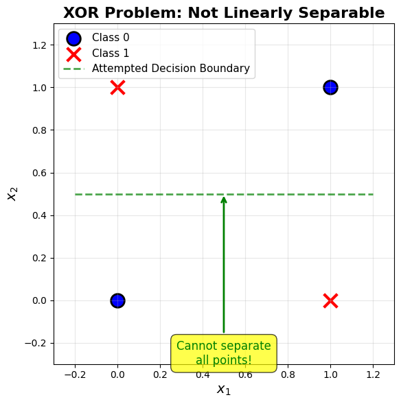
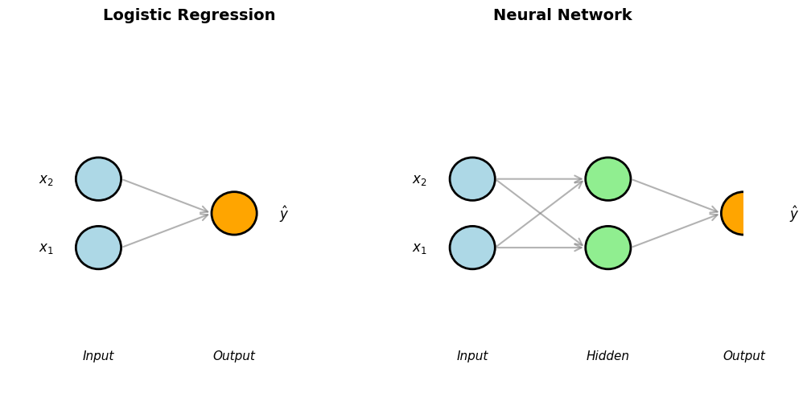
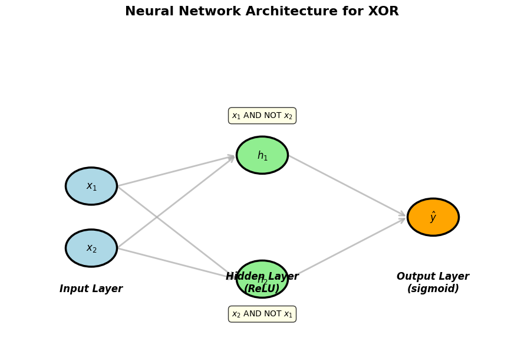
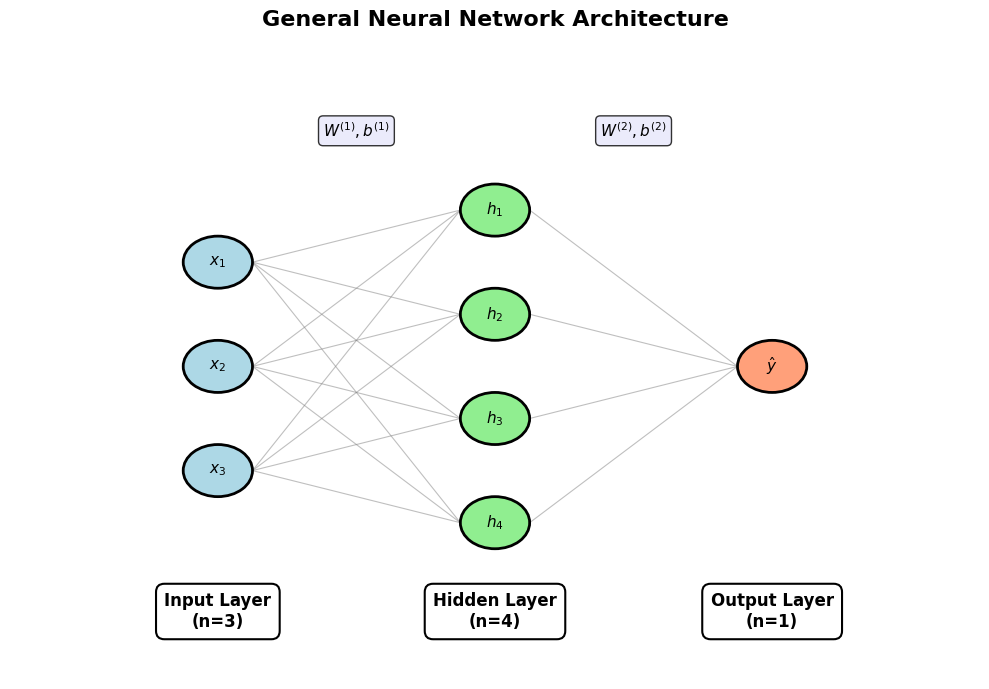
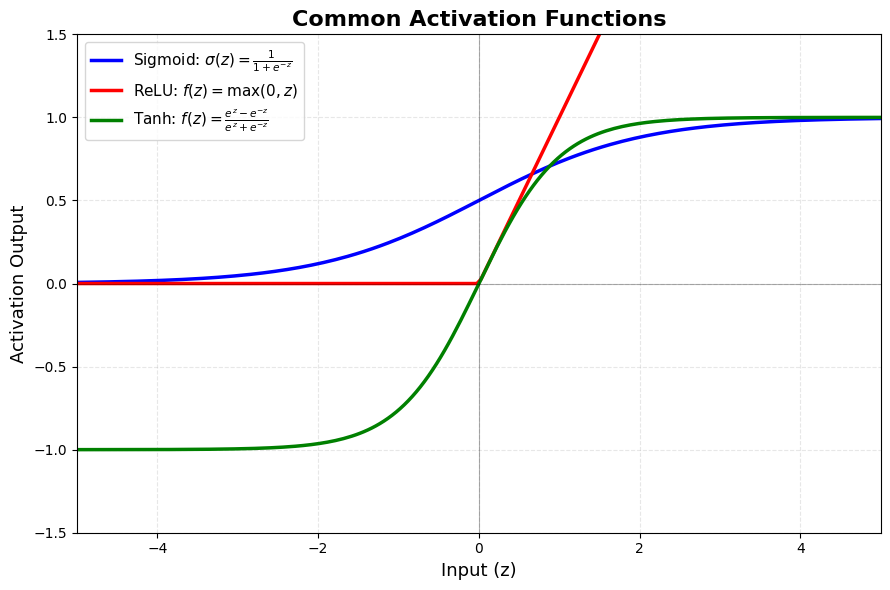
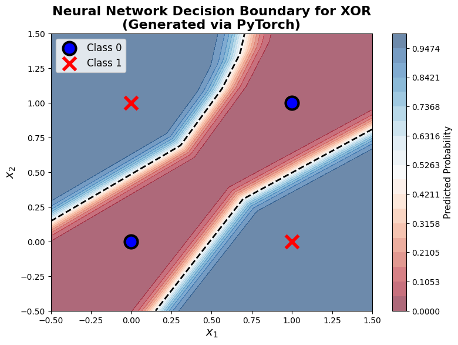
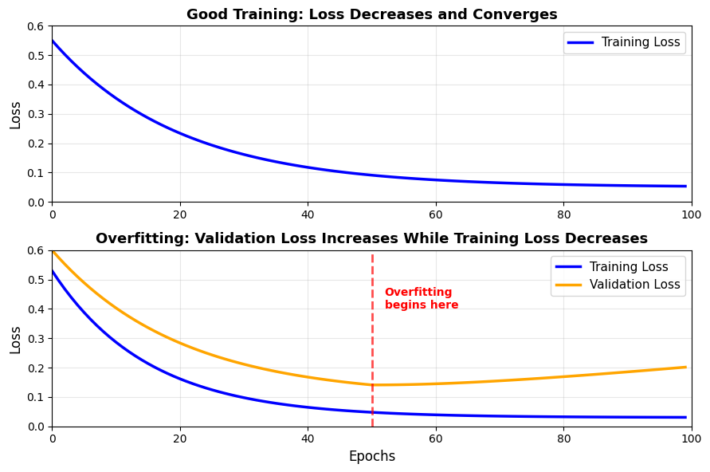
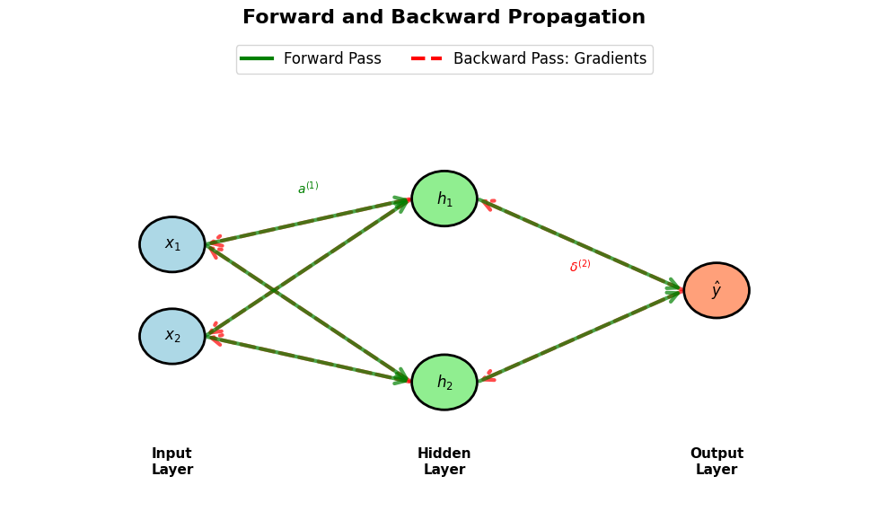

# Lesson 9: Neural Networks
## From Logistic Regression to Deep Learning

**MPS311/439 Machine Learning**  
**Dr. Wei Xing**  
**University of Sheffield**  
**Academic year 2026–27**

---

## 1. Introduction & Motivation

### 1.1 Where We Left Off

Welcome back! Over the past few weeks, we've built a strong foundation in machine learning. We started with **linear regression**, where we learned to predict continuous values by finding the best-fitting line through our data. Then we moved to **logistic regression**, where we tackled binary classification problems by using the sigmoid function to map our predictions to probabilities between 0 and 1.

Let's quickly recall the structure of logistic regression:

$$\hat{y} = \sigma(w_1 x_1 + w_2 x_2 + \cdots + w_n x_n + b) = \sigma(\mathbf{w}^T \mathbf{x} + b)$$

where $\sigma(z) = \frac{1}{1 + e^{-z}}$ is the sigmoid function.

Notice the elegant pattern here: we take a **linear combination** of inputs (the weighted sum), then apply a **non-linear activation function** (sigmoid). This simple formula has solved many real-world problems: spam detection, disease diagnosis, customer churn prediction, and more.

But here's the thing: logistic regression draws a single decision boundary through your data. Sometimes that's perfect. Other times... not so much.

### 1.2 The Fundamental Question

Imagine you're trying to classify data where the patterns are more complex. What if the relationship between features and outcomes isn't captured by a single straight line or plane? What if you need **multiple decision boundaries working together**?

This is where we hit a fundamental limitation of logistic regression. No matter how we adjust the weights, we're always drawing just one line (or hyperplane in higher dimensions) to separate our classes.

Today, we're going to discover something powerful: **what if we stack multiple logistic regression units together?** What if we let one set of units learn useful intermediate representations, and then let another unit make the final decision based on those representations?

This idea—composition of simple operations—is at the heart of neural networks.

### 1.3 Today's Journey

In this lecture, we'll take a natural step forward from what we already know:

- We'll start with a concrete problem that logistic regression **cannot** solve
- We'll discover how **stacking** simple units creates powerful models
- We'll formalize this idea into **neural network** architecture
- We'll implement our first neural network using **Keras** (surprisingly simple!)
- We'll understand how these networks **learn** from data

**For MPS311 students**: By the end, you'll be able to build and train neural networks using Keras, understand when to use them, and interpret their behavior.

**For MPS439 students**: You'll additionally understand the backpropagation algorithm that makes training efficient, and you'll learn advanced techniques like regularization and dropout.

Let's begin with a classic challenge that will illuminate everything.

---

## 2. The XOR Problem: A Concrete Challenge

### 2.1 Introducing XOR

Let me introduce you to a deceptively simple problem that revolutionized our understanding of neural computation. It's called the **XOR problem** (exclusive OR).

XOR is a logical operation that outputs true (1) when inputs differ, and false (0) when they're the same. Here's the truth table:

| $x_1$ | $x_2$ | XOR Output |
|-------|-------|------------|
| 0     | 0     | 0          |
| 0     | 1     | 1          |
| 1     | 0     | 1          |
| 1     | 1     | 0          |

Think of a practical example: An alarm system that triggers if **either** a door is open **or** a window is open, but **not both** (because if both are open, it might be you entering through the door while airing out the room).

### 2.2 Why Logistic Regression Fails

Now here's the puzzle: can we use logistic regression to learn this XOR function? Let's visualize the problem:



Look at those four points. The blue circles (class 0) are at opposite corners, and the red crosses (class 1) are at the other opposite corners. Try to imagine drawing a single straight line that separates blue from red. Go ahead, try it.

You can't! Any line you draw will misclassify at least one point.

Let's think about this mathematically. For logistic regression to work, we need to find weights $w_1$, $w_2$, and bias $b$ such that:

- $\sigma(w_1 \cdot 0 + w_2 \cdot 0 + b) \approx 0$ (for point (0,0))
- $\sigma(w_1 \cdot 0 + w_2 \cdot 1 + b) \approx 1$ (for point (0,1))
- $\sigma(w_1 \cdot 1 + w_2 \cdot 0 + b) \approx 1$ (for point (1,0))
- $\sigma(w_1 \cdot 1 + w_2 \cdot 1 + b) \approx 0$ (for point (1,1))

From the second and third constraints, we need $w_2 + b$ to be large (positive) and $w_1 + b$ to be large (positive). But then $w_1 + w_2 + b$ would also be large and positive, contradicting the fourth constraint!

**This problem is not linearly separable.** No single line can solve it.

### 2.3 What Do We Need?

Here's an intuitive question: what if we could use **two lines** instead of one? What if we had one line that captures "$x_1$ is on but $x_2$ is off" and another line that captures "$x_2$ is on but $x_1$ is off", and then we combined these insights?

If we could do that, we could solve XOR! But how do we make logistic regression use multiple decision boundaries?

The answer: **we don't use one logistic regression unit—we use multiple units arranged in layers.** Let some units learn intermediate patterns, and then let another unit combine those patterns.

This is our entry point into neural networks.

---

## 3. From Logistic Regression to Neural Networks

### 3.1 Building Blocks Review

Let's be crystal clear about our building block. A single logistic regression unit computes:

$$z = w_1 x_1 + w_2 x_2 + \cdots + w_n x_n + b = \mathbf{w}^T \mathbf{x} + b$$

$$\hat{y} = \sigma(z) = \frac{1}{1 + e^{-z}}$$

Geometrically, this creates **one decision boundary**—a hyperplane in the input space. Points on one side get classified as one class, points on the other side as the other class.

### 3.2 The Key Insight: Composition

Now here's the beautiful idea: instead of going directly from inputs to output, what if we introduce an **intermediate layer** of processing?



Look at the difference:

- **Left side (Logistic Regression)**: Inputs $x_1, x_2$ connect directly to output $\hat{y}$. One unit, one decision boundary.
- **Right side (Neural Network)**: Inputs $x_1, x_2$ connect to **multiple intermediate units** (the green nodes), which then connect to the output. Each intermediate unit can learn its own pattern, its own decision boundary!

The intermediate layer is called a **hidden layer** because it's not directly visible in the input or output—it's hidden inside the network, learning useful representations.

### 3.3 Solving XOR with Two Layers

Let's make this concrete. Suppose we have two hidden units. Each one is just a logistic regression unit:

$$h_1 = \sigma(w_{11} x_1 + w_{12} x_2 + b_1)$$

$$h_2 = \sigma(w_{21} x_1 + w_{22} x_2 + b_2)$$

Now, instead of predicting from $x_1$ and $x_2$ directly, we predict from $h_1$ and $h_2$:

$$\hat{y} = \sigma(v_1 h_1 + v_2 h_2 + b_3)$$

Here's the magic: **$h_1$ might learn to detect "$x_1$ AND NOT $x_2$"** (fires when $x_1=1$ and $x_2=0$). Meanwhile, **$h_2$ might learn to detect "$x_2$ AND NOT $x_1$"** (fires when $x_2=1$ and $x_1=0$). Then the output unit simply says: "Output 1 if either $h_1$ or $h_2$ is active."



This diagram shows the complete architecture for solving XOR. The two hidden units learn complementary patterns, and the output unit combines them. This is a **neural network**!

### 3.4 The General Principle

This example illustrates a profound principle: **by stacking layers of simple operations, we can approximate arbitrarily complex functions.**

Each layer transforms the data into a new representation. The first hidden layer might learn simple patterns (edges, basic combinations). Deeper layers could learn more abstract concepts (shapes, complex relationships). The final layer makes the decision based on these learned representations.

And here's what's remarkable: each individual unit is just doing logistic regression! We haven't invented anything fundamentally new at the unit level. The power comes from **composition**—putting simple pieces together in the right way.

---

## 4. Neural Network Architecture

### 4.1 Formal Structure

Let's formalize what we've discovered. A neural network consists of:

1. **Input Layer**: This isn't really a "layer" in terms of computation—it's just our features $x_1, x_2, \ldots, x_n$. If you have 10 features, you have 10 input nodes.

2. **Hidden Layer(s)**: One or more layers of computational units. Each unit in a hidden layer:
   - Receives inputs from the previous layer
   - Computes a weighted sum plus bias
   - Applies an activation function
   - Passes the result to the next layer

3. **Output Layer**: The final layer that produces predictions. For binary classification, this is typically one unit with sigmoid activation.



This diagram shows a network with 3 inputs, one hidden layer with 4 units, and 1 output. Notice:
- Every input connects to every hidden unit (these are the weights $W^{(1)}$)
- Every hidden unit connects to the output (these are the weights $W^{(2)}$)
- Each unit has its own bias term

### 4.2 Key Terminology

Let's establish our vocabulary:

- **Neuron/Unit**: A single computational unit. It receives inputs, computes a weighted sum, applies an activation function, and produces an output. Think of it as one logistic regression unit.

- **Weights ($W$)**: The parameters that connect layers. $W^{(l)}$ denotes the weights connecting layer $l-1$ to layer $l$. These are what the network learns during training.

- **Biases ($b$)**: The offset parameters for each unit. $b^{(l)}$ denotes the biases for layer $l$.

- **Activation**: The output of a neuron after applying the activation function. We often denote the activation of layer $l$ as $a^{(l)}$.

### 4.3 Mathematical Notation

Let's write this precisely. For a network with one hidden layer:

**Hidden layer computation:**

$$z^{(1)} = W^{(1)} \mathbf{x} + b^{(1)}$$

$$a^{(1)} = \sigma(z^{(1)})$$

where:
- $\mathbf{x}$ is our input vector (shape: $n \times 1$)
- $W^{(1)}$ is the weight matrix connecting inputs to hidden layer (shape: $h \times n$, where $h$ is number of hidden units)
- $b^{(1)}$ is the bias vector for hidden layer (shape: $h \times 1$)
- $z^{(1)}$ is the pre-activation (shape: $h \times 1$)
- $a^{(1)}$ is the activation (shape: $h \times 1$)

**Output layer computation:**

$$z^{(2)} = W^{(2)} a^{(1)} + b^{(2)}$$

$$\hat{y} = a^{(2)} = \sigma(z^{(2)})$$

where:
- $W^{(2)}$ is the weight matrix connecting hidden to output (shape: $1 \times h$)
- $b^{(2)}$ is the bias for output (shape: $1 \times 1$)

**General form** for any layer $l$:

$$a^{(l)} = \sigma(W^{(l)} a^{(l-1)} + b^{(l)})$$

This compact notation describes the entire computation! Each layer takes the previous layer's activation, applies a linear transformation (via $W$ and $b$), and applies an activation function.

**Understanding matrix shapes**: If layer $l$ has $n_l$ units and layer $l+1$ has $n_{l+1}$ units, then $W^{(l+1)}$ has shape $(n_{l+1}, n_l)$. This ensures the matrix multiplication works out correctly.

### 4.4 Why "Deep" Learning?

You've probably heard the term "deep learning." What does "deep" mean?

- **Shallow network**: 1 hidden layer (like our XOR example)
- **Deep network**: 2 or more hidden layers

The term "deep" simply refers to having multiple layers stacked on top of each other. Deep networks can learn more complex, hierarchical representations. However, they're also harder to train and require more data.

For this lecture, we'll focus on shallow networks (1 hidden layer). But the principles we learn extend directly to deeper architectures!

---

## 5. Activation Functions

### 5.1 Why Non-linearity Matters

Here's a critical question: why do we need activation functions at all? Why not just compute $\hat{y} = W^{(2)}(W^{(1)}\mathbf{x} + b^{(1)}) + b^{(2)}$?

Let's see what happens without activation functions. Expanding the expression:

$$\hat{y} = W^{(2)}W^{(1)}\mathbf{x} + W^{(2)}b^{(1)} + b^{(2)}$$

Notice that $W^{(2)}W^{(1)}$ is just another matrix (call it $W$), and $W^{(2)}b^{(1)} + b^{(2)}$ is just another vector (call it $b$). So we get:

$$\hat{y} = W\mathbf{x} + b$$

This is just **linear regression**! No matter how many layers we stack, without non-linear activation functions, we'd just be doing a fancy version of linear regression. All those layers would collapse into a single linear transformation.

**The non-linearity is what gives neural networks their power.** The activation function introduces the non-linearity that allows networks to learn complex patterns.

### 5.2 Common Activation Functions

Let's look at the most common activation functions you'll encounter:



**1. Sigmoid: $\sigma(z) = \frac{1}{1 + e^{-z}}$**

- Range: (0, 1)
- We already know this one from logistic regression!
- Smooth, differentiable everywhere
- Problem: outputs saturate (become very flat) for large |z|, which can slow down learning
- Best used: output layer for binary classification

**2. ReLU (Rectified Linear Unit): $\text{ReLU}(z) = \max(0, z)$**

- Range: [0, ∞)
- Extremely simple: zero for negative inputs, identity for positive inputs
- Fast to compute, surprisingly effective
- Most popular choice for hidden layers
- Problem: "dying ReLU" - units can get stuck at zero
- Best used: hidden layers (default choice!)

**3. Tanh (Hyperbolic Tangent): $\tanh(z) = \frac{e^z - e^{-z}}{e^z + e^{-z}}$**

- Range: (-1, 1)
- Similar to sigmoid but centered at zero
- Stronger gradients than sigmoid (doesn't saturate as quickly)
- Best used: hidden layers, especially in RNNs (which we'll see later)

### 5.3 Choosing Activation Functions

Here's a simple decision guide:

**For hidden layers:**
- **Start with ReLU** - it's the default choice and works well in most cases
- Use tanh if you want zero-centered activations
- Avoid sigmoid in hidden layers (saturation issues)

**For output layer:**
- **Binary classification**: sigmoid (outputs probability between 0 and 1)
- **Multi-class classification**: softmax (we'll see this later)
- **Regression**: linear/no activation (output can be any real number)

**Rule of thumb**: When in doubt, use ReLU for all hidden layers. Adjust only if you have specific reasons.

---

## 6. Forward Propagation

### 6.1 The Computation Flow

**Forward propagation** is the process of computing the network's output from its input. It's called "forward" because we move forward through the network: input → hidden layer(s) → output.

Think of it like an assembly line:
1. Raw materials (input data) enter
2. First station (hidden layer) processes them into intermediate products
3. Second station (output layer) produces final product (prediction)

Each layer takes what the previous layer produced, transforms it, and passes it forward.

### 6.2 Step-by-Step Example

Let's work through a complete example with actual numbers. This will make everything concrete.

**Network architecture:**
- 2 inputs: $x_1, x_2$
- 2 hidden units with ReLU activation
- 1 output with sigmoid activation

**Given weights and biases** (normally these are learned, but we'll specify them):

$$W^{(1)} = \begin{bmatrix} 1.0 & 0.5 \\ -0.5 & 1.0 \end{bmatrix}, \quad b^{(1)} = \begin{bmatrix} -0.2 \\ 0.3 \end{bmatrix}$$

$$W^{(2)} = \begin{bmatrix} 2.0 & -1.5 \end{bmatrix}, \quad b^{(2)} = 0.1$$

**Input:** $\mathbf{x} = \begin{bmatrix} 0.5 \\ 0.8 \end{bmatrix}$

**Step 1: Compute hidden layer pre-activation**

$$z^{(1)} = W^{(1)} \mathbf{x} + b^{(1)} = \begin{bmatrix} 1.0 & 0.5 \\ -0.5 & 1.0 \end{bmatrix} \begin{bmatrix} 0.5 \\ 0.8 \end{bmatrix} + \begin{bmatrix} -0.2 \\ 0.3 \end{bmatrix}$$

$$z^{(1)} = \begin{bmatrix} 1.0(0.5) + 0.5(0.8) \\ -0.5(0.5) + 1.0(0.8) \end{bmatrix} + \begin{bmatrix} -0.2 \\ 0.3 \end{bmatrix} = \begin{bmatrix} 0.9 \\ 0.55 \end{bmatrix} + \begin{bmatrix} -0.2 \\ 0.3 \end{bmatrix} = \begin{bmatrix} 0.7 \\ 0.85 \end{bmatrix}$$

**Step 2: Apply ReLU activation**

$$a^{(1)} = \text{ReLU}(z^{(1)}) = \begin{bmatrix} \max(0, 0.7) \\ \max(0, 0.85) \end{bmatrix} = \begin{bmatrix} 0.7 \\ 0.85 \end{bmatrix}$$

(Both values are positive, so ReLU doesn't change them)

**Step 3: Compute output layer pre-activation**

$$z^{(2)} = W^{(2)} a^{(1)} + b^{(2)} = \begin{bmatrix} 2.0 & -1.5 \end{bmatrix} \begin{bmatrix} 0.7 \\ 0.85 \end{bmatrix} + 0.1$$

$$z^{(2)} = 2.0(0.7) + (-1.5)(0.85) + 0.1 = 1.4 - 1.275 + 0.1 = 0.225$$

**Step 4: Apply sigmoid activation**

$$\hat{y} = a^{(2)} = \sigma(z^{(2)}) = \sigma(0.225) = \frac{1}{1 + e^{-0.225}} \approx \frac{1}{1 + 0.799} \approx 0.556$$

**Final prediction**: $\hat{y} \approx 0.556$

For binary classification, we'd typically threshold at 0.5, so this would predict class 1.

### 6.3 Matrix Form (Batch Processing)

In practice, we rarely process one example at a time. We process **batches** of examples simultaneously. This is much more efficient, especially on GPUs.

Instead of $\mathbf{x}$ being a single column vector, $X$ becomes a **matrix** where each row is one example:

$$X = \begin{bmatrix} \mathbf{x}^{(1)T} \\ \mathbf{x}^{(2)T} \\ \vdots \\ \mathbf{x}^{(m)T} \end{bmatrix}$$

where $m$ is the batch size.

The forward propagation equations remain almost identical:

$$Z^{(1)} = X W^{(1)T} + b^{(1)}$$
$$A^{(1)} = \text{ReLU}(Z^{(1)})$$
$$Z^{(2)} = A^{(1)} W^{(2)T} + b^{(2)}$$
$$\hat{Y} = \sigma(Z^{(2)})$$

Now each matrix operation processes all examples at once! This is why GPUs (which excel at matrix operations) make neural networks practical.

### 6.4 Computational Graph Perspective

Another useful way to think about forward propagation is as a **computational graph**. Each node represents an operation (matrix multiply, addition, activation function), and edges represent data flow.

For our simple network:
```
x → [W¹×] → [+b¹] → [ReLU] → a¹ → [W²×] → [+b²] → [sigmoid] → ŷ
```

This perspective becomes especially important when we talk about backpropagation (for MPS439 students). The graph structure tells us exactly how to compute gradients efficiently.

---

## 7. Implementation with Keras

### 7.1 Why Keras?

Now for the good news: you don't have to implement all this matrix math by hand! **Keras** is a high-level neural network library that handles all the complexity for us.

Keras is:
- **Simple**: Build networks with just a few lines of code
- **Powerful**: Can handle complex architectures when needed
- **Industry-standard**: Used by researchers and practitioners worldwide
- **Well-integrated**: Works with TensorFlow, PyTorch, or JAX as the backend

Think of Keras as the "easy mode" for neural networks. It lets you focus on the architecture and problem-solving rather than the implementation details.

### 7.2 Solving XOR: Complete Example

Let's solve the XOR problem using Keras. You'll be amazed at how simple this is:

```python
import numpy as np
from keras.models import Sequential
from keras.layers import Dense
import matplotlib.pyplot as plt

# Step 1: Create XOR dataset
X = np.array([[0, 0],
              [0, 1],
              [1, 0],
              [1, 1]])
y = np.array([0, 1, 1, 0])

# Step 2: Build the neural network
model = Sequential([
    Dense(4, input_dim=2, activation='relu'),  # Hidden layer: 4 units, ReLU
    Dense(1, activation='sigmoid')              # Output layer: 1 unit, sigmoid
])

# Step 3: Compile the model
model.compile(optimizer='adam',
              loss='binary_crossentropy',
              metrics=['accuracy'])

# Step 4: Train the model
history = model.fit(X, y, epochs=1000, verbose=0)

# Step 5: Evaluate
predictions = model.predict(X)
print("XOR Predictions:")
for i in range(4):
    print(f"Input: {X[i]} → Predicted: {predictions[i][0]:.4f}, True: {y[i]}")
```

**Output:**
```
XOR Predictions:
Input: [0 0] → Predicted: 0.0234, True: 0
Input: [0 1] → Predicted: 0.9812, True: 1
Input: [1 0] → Predicted: 0.9791, True: 1
Input: [1 1] → Predicted: 0.0187, True: 0
```

It works! The network successfully learned XOR. Predictions are very close to 0 or 1 as expected.

### 7.3 Code Walkthrough

Let's break down what each part does:

**1. `Sequential([...])`**: Creates a feed-forward network where layers are stacked sequentially (one after another).

**2. `Dense(4, input_dim=2, activation='relu')`**: 
   - `Dense` = fully connected layer (every input connects to every unit)
   - `4` = number of hidden units
   - `input_dim=2` = we have 2 input features (only needed for first layer)
   - `activation='relu'` = use ReLU activation function

**3. `Dense(1, activation='sigmoid')`**:
   - Output layer with 1 unit
   - Sigmoid activation for binary classification (outputs probability)

**4. `compile(optimizer='adam', loss='binary_crossentropy')`**:
   - `optimizer='adam'` = how to update weights (Adam is a sophisticated version of gradient descent)
   - `loss='binary_crossentropy'` = what to minimize (appropriate for binary classification)
   - `metrics=['accuracy']` = track accuracy during training

**5. `fit(X, y, epochs=1000)`**:
   - Train the model for 1000 epochs (passes through the data)
   - `verbose=0` suppresses training output (use `verbose=1` to see progress)

**6. `predict(X)`**: Make predictions for input data

That's it! About 10 lines of actual code to build, train, and use a neural network.

### 7.4 Results Visualization

Let's visualize what the network learned:



This figure shows the decision boundary learned by our neural network. The background colors show what the network predicts for each point in the input space:
- Light blue regions → predicts class 0
- Light red regions → predicts class 1

Notice how the decision boundary is **non-linear** (curved). The network successfully separates the XOR pattern, which logistic regression couldn't do!

### 7.5 Code Simplicity Note

Think about what we just accomplished:
- We built a neural network that solves a problem logistic regression cannot solve
- The total code was about 10 lines
- We didn't have to compute any gradients manually
- We didn't have to implement backpropagation
- We didn't even have to write the training loop!

This is the power of Keras. It abstracts away the complexity while still giving us full control over the architecture.

**However**: Understanding what's happening under the hood (sections 1-6) is crucial for:
- Debugging when things go wrong
- Choosing appropriate architectures
- Understanding why certain choices work better than others
- Being able to implement custom components when needed

---

## 8. Training and Loss Functions

### 8.1 How Neural Networks Learn

We've seen how to build a network and make predictions (forward propagation). But how do networks **learn**? How do they figure out the right weights and biases?

The training process is conceptually the same as logistic regression:

1. **Make predictions** using current weights (forward propagation)
2. **Measure error** using a loss function
3. **Compute gradients** (how to adjust weights to reduce error)
4. **Update weights** to reduce the error
5. **Repeat** until convergence

The key difference: neural networks have many more parameters (sometimes millions!), organized in layers. But the principle is the same.

### 8.2 Loss Functions

The **loss function** (also called cost function or objective function) measures how wrong our predictions are. It's what we're trying to minimize.

**For binary classification** (what we've been doing):

$$L = -\frac{1}{m}\sum_{i=1}^{m} [y^{(i)} \log(\hat{y}^{(i)}) + (1-y^{(i)}) \log(1-\hat{y}^{(i)})]$$

This is **binary crossentropy** (also called log loss). It's the same loss function we used in logistic regression! It heavily penalizes confident wrong predictions.

**For regression problems**:

$$L = \frac{1}{m}\sum_{i=1}^{m} (y^{(i)} - \hat{y}^{(i)})^2$$

This is **mean squared error (MSE)**. Larger errors get penalized more heavily (squared term).

**For multi-class classification** (preview for later):

$$L = -\frac{1}{m}\sum_{i=1}^{m}\sum_{k=1}^{K} y_k^{(i)} \log(\hat{y}_k^{(i)})$$

This is **categorical crossentropy**, which extends binary crossentropy to multiple classes.

In Keras, you just specify the appropriate loss:
- `loss='binary_crossentropy'` for binary classification
- `loss='mse'` for regression
- `loss='categorical_crossentropy'` for multi-class

### 8.3 Gradient Descent Conceptually

Imagine you're standing on a hill in thick fog. You can't see the bottom, but you can feel which direction is downhill. You take a step downhill, check again, take another step downhill, and repeat. Eventually, you reach (approximately) the bottom.

This is **gradient descent**:
- The hill is the loss landscape (loss as a function of all weights)
- "Downhill" means the direction that reduces loss (negative gradient)
- Each step is a weight update
- The step size is the **learning rate** ($\alpha$)

Mathematically:

$$W^{(l)} \leftarrow W^{(l)} - \alpha \frac{\partial L}{\partial W^{(l)}}$$

$$b^{(l)} \leftarrow b^{(l)} - \alpha \frac{\partial L}{\partial b^{(l)}}$$

The gradients $\frac{\partial L}{\partial W^{(l)}}$ tell us which direction increases the loss. We go in the opposite direction (hence the minus sign) to decrease it.

**Learning rate** ($\alpha$): How big of steps to take
- Too large: might overshoot the minimum, training becomes unstable
- Too small: training is very slow
- Typical values: 0.001 to 0.1

**Epochs**: One complete pass through the training data
- We typically need many epochs for the network to learn
- Too few: underfitting (network hasn't learned enough)
- Too many: overfitting (network memorizes training data)

### 8.4 Common Training Issues

Let's look at training curves to diagnose problems:



**Top panel - Good Training:**
- Loss steadily decreases
- Eventually plateaus (reaches minimum)
- This is what we want to see!

**Bottom panel - Overfitting:**
- Training loss keeps decreasing (blue line)
- Validation loss decreases initially, then **increases** (orange line)
- The network is memorizing training data rather than learning general patterns
- This is a red flag!

**Other common issues:**

**Underfitting**: 
- High training error that doesn't improve
- Network is too simple to capture patterns
- Solution: More hidden units, more layers, train longer

**Exploding/Vanishing Gradients**:
- Loss becomes NaN or doesn't change at all
- Common in very deep networks
- Solution: Better initialization, batch normalization, gradient clipping

**Slow Convergence**:
- Loss decreases very slowly
- Solution: Increase learning rate, use better optimizer (Adam instead of SGD)

### 8.5 Training Tips for MPS311 Students

Here's a practical workflow:

1. **Start simple**: 1 hidden layer with 4-8 units
2. **Choose appropriate loss**: binary_crossentropy for classification, mse for regression
3. **Use Adam optimizer**: Good default choice (`optimizer='adam'`)
4. **Train with enough epochs**: Start with 100-1000, observe loss curves
5. **Split your data**: Train on training set, evaluate on test set
6. **Watch the curves**: 
   - Training loss should decrease
   - If validation loss increases → overfitting → stop training
7. **Iterate**: 
   - Not learning? → More units, more epochs, higher learning rate
   - Overfitting? → Fewer units, more data, regularization

**Debugging checklist:**
- ❌ Loss is NaN → Learning rate too high, check data for NaN values
- ❌ Loss doesn't decrease → Learning rate too low, or network too simple
- ❌ Predictions all same value → Wrong loss function or activation
- ❌ Training accuracy 100% but test accuracy low → Overfitting

---

## 9. Practical Considerations

### 9.1 How Many Hidden Layers?

This is one of the most common questions! Here's practical guidance:

**Start with 1 hidden layer**. Seriously. For many problems, one hidden layer is sufficient. The universal approximation theorem tells us a network with one hidden layer can approximate any continuous function (given enough units).

**Add a second layer if:**
- Performance plateaus with one layer
- You have a lot of data (10,000+ examples)
- The problem is complex (e.g., image recognition, natural language)

**Go deeper (3+ layers) only if:**
- You have huge amounts of data (100,000+ examples)
- You're working on domains where deep learning excels (computer vision, speech, NLP)
- You have computational resources (GPUs)

**Why not always go deep?**
- More layers = more parameters = more chance of overfitting with limited data
- Deeper networks are harder to train
- Training takes longer
- Might not improve performance

**Rule of thumb**: Start shallow, go deeper only if you have clear evidence it helps.

### 9.2 How Many Hidden Units?

For a single hidden layer, here's guidance:

**Starting point**: Between input size and output size
- If you have 10 inputs and 1 output, try 5-10 hidden units
- If you have 100 inputs and 10 outputs, try 30-50 hidden units

**Adjust based on performance:**
- Underfitting (high training error) → Increase hidden units
- Overfitting (low training error, high test error) → Decrease hidden units

**Practical ranges:**
- Small datasets (<1000 samples): 4-16 units
- Medium datasets (1000-10000): 16-64 units
- Large datasets (10000+): 64-256 units

**More hidden units:**
- ✅ More capacity to learn complex patterns
- ✅ Can fit training data better
- ❌ More parameters to train (slower)
- ❌ More risk of overfitting
- ❌ Requires more data

**Remember**: Start small, increase if needed. It's easier to add capacity than to remove overfitting.

### 9.3 When to Use Neural Networks?

Neural networks are powerful, but they're not always the best choice. Here's when to use them:

**Good candidates for neural networks:**
- ✅ **Complex, non-linear patterns** that simpler models can't capture
- ✅ **Large datasets** (1000+ examples, ideally 10,000+)
- ✅ **High-dimensional data** (many features)
- ✅ **Unstructured data** (images, text, audio) where feature engineering is hard
- ✅ **When interpretability is not critical**

**Consider simpler models first:**
- ❌ Small datasets (<1000 samples) → Try logistic/linear regression, decision trees
- ❌ Linear relationships → Linear/logistic regression will work better
- ❌ Need interpretability → Decision trees, linear models show clear feature importance
- ❌ Limited computational resources → Simpler models train faster

**The pragmatic approach:**
1. Start with simplest model (linear/logistic regression)
2. If performance is insufficient, try more complex models
3. Neural networks are powerful but come with costs (data requirements, training time, tuning)

### 9.4 Workflow Summary for MPS311

Here's your practical workflow for using neural networks:

**Step 1: Prepare Data**
```python
# Normalize features to similar scales
from sklearn.preprocessing import StandardScaler
scaler = StandardScaler()
X_train_scaled = scaler.fit_transform(X_train)
X_test_scaled = scaler.transform(X_test)
```
Why? Neural networks train better when features are on similar scales.

**Step 2: Start Simple**
```python
model = Sequential([
    Dense(8, input_dim=n_features, activation='relu'),
    Dense(1, activation='sigmoid')  # for binary classification
])
model.compile(optimizer='adam', loss='binary_crossentropy', metrics=['accuracy'])
```

**Step 3: Train and Monitor**
```python
history = model.fit(X_train_scaled, y_train, 
                    validation_split=0.2,  # Use 20% for validation
                    epochs=100, 
                    verbose=1)
```

**Step 4: Evaluate**
```python
test_loss, test_acc = model.evaluate(X_test_scaled, y_test)
print(f"Test accuracy: {test_acc:.3f}")
```

**Step 5: Iterate**
- Training loss decreasing but accuracy low? → Train longer or add units
- Validation loss increasing? → Overfitting → Stop earlier or simplify model
- Both losses high? → Underfitting → Add units or layers

### 9.5 Common Pitfalls

**Pitfall 1: Forgetting to normalize features**
```python
# ❌ Bad: Features on very different scales
X = np.array([[1, 10000], [2, 20000], [3, 15000]])  

# ✅ Good: Normalize first
scaler = StandardScaler()
X_scaled = scaler.fit_transform(X)
```
Why it matters: Features with larger scales dominate the loss, making training unstable.

**Pitfall 2: Too many epochs → Overfitting**
```python
# ❌ Bad: Training for 10,000 epochs without monitoring
model.fit(X, y, epochs=10000)

# ✅ Good: Monitor validation loss, use early stopping
from keras.callbacks import EarlyStopping
early_stop = EarlyStopping(monitor='val_loss', patience=10)
model.fit(X, y, epochs=1000, validation_split=0.2, callbacks=[early_stop])
```

**Pitfall 3: Wrong activation on output**
```python
# ❌ Bad: ReLU on output for binary classification
Dense(1, activation='relu')  # Output can be any positive number!

# ✅ Good: Sigmoid for binary classification
Dense(1, activation='sigmoid')  # Output is probability between 0 and 1
```

**Pitfall 4: Not splitting train/test**
```python
# ❌ Bad: Evaluate on training data
model.fit(X, y, epochs=100)
accuracy = model.evaluate(X, y)  # This is training accuracy!

# ✅ Good: Evaluate on separate test set
from sklearn.model_selection import train_test_split
X_train, X_test, y_train, y_test = train_test_split(X, y, test_size=0.2)
model.fit(X_train, y_train, epochs=100)
accuracy = model.evaluate(X_test, y_test)  # This is test accuracy
```

**Pitfall 5: Using wrong loss function**
```python
# ❌ Bad: MSE for classification
model.compile(loss='mse')  # Treats classes as numbers!

# ✅ Good: Binary crossentropy for binary classification
model.compile(loss='binary_crossentropy')
```

---

## 10. [MPS439 Only] Backpropagation Algorithm

*Note: This section is optional for MPS311 students. It provides mathematical details on how neural networks actually compute gradients. MPS311 students can skip to Section 12 (Summary).*

### 10.1 The Challenge

Neural networks often have millions of parameters. Our XOR example had:
- Hidden layer: $2 \times 4 = 8$ weights plus 4 biases = 12 parameters
- Output layer: $4 \times 1 = 4$ weights plus 1 bias = 5 parameters
- Total: 17 parameters

Real networks can have millions or even billions! How do we compute gradients $\frac{\partial L}{\partial w_{ij}}$ for each of these efficiently?

**Naive approach**: Compute each gradient independently using finite differences:

$$\frac{\partial L}{\partial w_{ij}} \approx \frac{L(w_{ij} + \epsilon) - L(w_{ij})}{\epsilon}$$

This requires $n$ forward passes for $n$ parameters. With a million parameters, that's a million forward passes per gradient update! Completely impractical.

**Backpropagation** solves this by computing all gradients in just two passes: one forward, one backward. This is what makes training deep networks feasible.

### 10.2 The Key Insight: Chain Rule

The fundamental insight behind backpropagation is the **chain rule** from calculus. 

Consider a simple composition: $L$ depends on $z$, $z$ depends on $w$. Then:

$$\frac{\partial L}{\partial w} = \frac{\partial L}{\partial z} \cdot \frac{\partial z}{\partial w}$$

Neural networks are just deep compositions:

$$L \rightarrow a^{(L)} \rightarrow z^{(L)} \rightarrow a^{(L-1)} \rightarrow z^{(L-1)} \rightarrow \cdots \rightarrow a^{(1)} \rightarrow z^{(1)} \rightarrow w^{(1)}$$

By repeatedly applying the chain rule, we can compute gradients for early layers by working **backward** through the network, reusing computations.

Key idea: Once we know $\frac{\partial L}{\partial a^{(l)}}$, we can compute $\frac{\partial L}{\partial a^{(l-1)}}$ using local gradients. This is much more efficient than computing each gradient from scratch!

### 10.3 Derivation for Simple Network

Let's derive backpropagation for a simple network: input $\mathbf{x}$ → hidden layer → output $\hat{y}$.

**Network equations:**

$$z^{(1)} = W^{(1)}\mathbf{x} + b^{(1)}$$
$$a^{(1)} = \sigma(z^{(1)})$$
$$z^{(2)} = W^{(2)}a^{(1)} + b^{(2)}$$
$$\hat{y} = a^{(2)} = \sigma(z^{(2)})$$

**Loss function** (for one example, simplified MSE):

$$L = \frac{1}{2}(y - \hat{y})^2$$

**Goal**: Compute $\frac{\partial L}{\partial W^{(1)}}, \frac{\partial L}{\partial b^{(1)}}, \frac{\partial L}{\partial W^{(2)}}, \frac{\partial L}{\partial b^{(2)}}$

---

**Output Layer Gradients:**

Start with $\frac{\partial L}{\partial z^{(2)}}$ (we call this $\delta^{(2)}$):

$$\delta^{(2)} = \frac{\partial L}{\partial z^{(2)}} = \frac{\partial L}{\partial \hat{y}} \cdot \frac{\partial \hat{y}}{\partial z^{(2)}}$$

$$\frac{\partial L}{\partial \hat{y}} = \frac{\partial}{\partial \hat{y}} \left[\frac{1}{2}(y - \hat{y})^2\right] = -(y - \hat{y}) = (\hat{y} - y)$$

$$\frac{\partial \hat{y}}{\partial z^{(2)}} = \sigma'(z^{(2)}) = \sigma(z^{(2)})(1 - \sigma(z^{(2)})) = \hat{y}(1 - \hat{y})$$

Therefore:

$$\delta^{(2)} = (\hat{y} - y) \cdot \hat{y}(1 - \hat{y})$$

Now we can get the weight and bias gradients for the output layer:

$$\frac{\partial L}{\partial W^{(2)}} = \frac{\partial L}{\partial z^{(2)}} \cdot \frac{\partial z^{(2)}}{\partial W^{(2)}} = \delta^{(2)} \cdot a^{(1)T}$$

$$\frac{\partial L}{\partial b^{(2)}} = \frac{\partial L}{\partial z^{(2)}} \cdot \frac{\partial z^{(2)}}{\partial b^{(2)}} = \delta^{(2)}$$

---

**Hidden Layer Gradients:**

Now we need $\frac{\partial L}{\partial z^{(1)}}$ (call this $\delta^{(1)}$):

$$\delta^{(1)} = \frac{\partial L}{\partial z^{(1)}} = \frac{\partial L}{\partial a^{(1)}} \cdot \frac{\partial a^{(1)}}{\partial z^{(1)}}$$

The first term uses chain rule through $z^{(2)}$:

$$\frac{\partial L}{\partial a^{(1)}} = \frac{\partial L}{\partial z^{(2)}} \cdot \frac{\partial z^{(2)}}{\partial a^{(1)}} = \delta^{(2)} \cdot W^{(2)T}$$

The second term is the derivative of the activation:

$$\frac{\partial a^{(1)}}{\partial z^{(1)}} = \sigma'(z^{(1)}) = a^{(1)} \odot (1 - a^{(1)})$$

where $\odot$ denotes element-wise multiplication.

Therefore:

$$\delta^{(1)} = (W^{(2)T} \delta^{(2)}) \odot a^{(1)} \odot (1 - a^{(1)})$$

Notice the pattern: the error from layer 2 ($\delta^{(2)}$) is "backpropagated" through the weights ($W^{(2)T}$) to layer 1!

Finally:

$$\frac{\partial L}{\partial W^{(1)}} = \delta^{(1)} \cdot \mathbf{x}^T$$

$$\frac{\partial L}{\partial b^{(1)}} = \delta^{(1)}$$

### 10.4 General Algorithm

Here's the backpropagation algorithm for a network with $L$ layers:

**Forward Pass:**
1. For $l = 1$ to $L$:
   - Compute $z^{(l)} = W^{(l)}a^{(l-1)} + b^{(l)}$ (where $a^{(0)} = \mathbf{x}$)
   - Compute $a^{(l)} = \sigma(z^{(l)})$
2. Compute loss $L$ using $a^{(L)}$ and true label $y$

**Backward Pass:**
1. Compute output layer error:
   $$\delta^{(L)} = \frac{\partial L}{\partial z^{(L)}} = \frac{\partial L}{\partial a^{(L)}} \odot \sigma'(z^{(L)})$$

2. For $l = L-1$ down to $1$:
   - Backpropagate error:
   $$\delta^{(l)} = (W^{(l+1)T} \delta^{(l+1)}) \odot \sigma'(z^{(l)})$$

3. Compute gradients for all layers:
   $$\frac{\partial L}{\partial W^{(l)}} = \delta^{(l)} \cdot a^{(l-1)T}$$
   $$\frac{\partial L}{\partial b^{(l)}} = \delta^{(l)}$$

**Update Weights:**
1. For $l = 1$ to $L$:
   $$W^{(l)} \leftarrow W^{(l)} - \alpha \frac{\partial L}{\partial W^{(l)}}$$
   $$b^{(l)} \leftarrow b^{(l)} - \alpha \frac{\partial L}{\partial b^{(l)}}$$

### 10.5 Why It's Efficient

**Computational complexity:**
- Naive approach: $O(n^2)$ where $n$ is number of parameters (need $n$ forward passes)
- Backpropagation: $O(n)$ (one forward pass, one backward pass)

The key efficiency comes from **reusing computations**. When computing $\delta^{(l)}$, we reuse $\delta^{(l+1)}$ which we already computed. Each gradient is computed exactly once.

**Memory-wise**: We need to store activations from the forward pass (to use in backward pass), but this is much less than recomputing everything.

This efficiency is why we can train networks with millions or billions of parameters!

### 10.6 Implementation Note

Here's a visual representation of the forward and backward passes:



- **Green arrows** show the forward pass: data flows from input to output, computing predictions
- **Red arrows** show the backward pass: gradients flow from output to input, computing how to adjust weights

In practice, frameworks like Keras and TensorFlow implement backpropagation automatically using **automatic differentiation**. You just define the forward pass (the network architecture), and the framework figures out the backward pass!

However, understanding backpropagation helps you:
- Debug gradient-related issues (vanishing/exploding gradients)
- Design custom layers or loss functions
- Understand why deep networks are hard to train
- Appreciate why certain architectural choices matter (skip connections, normalization, etc.)

---

## 11. [MPS439 Only] Advanced Techniques

*Note: This section is optional for MPS311 students. It covers advanced training techniques that improve performance and prevent overfitting.*

### 11.1 Regularization

When training neural networks, especially with limited data, **overfitting** is a major concern. The network memorizes training examples instead of learning general patterns.

**Regularization** adds a penalty term to the loss function to discourage complex models:

**L2 Regularization (Ridge):**

$$L_{total} = L_{data} + \lambda \sum_{l} ||W^{(l)}||^2_2 = L_{data} + \lambda \sum_{l} \sum_{i,j} (w_{ij}^{(l)})^2$$

- Penalizes large weights
- Encourages weights to be small and spread out
- $\lambda$ controls strength of regularization (typical: 0.001 to 0.1)

**L1 Regularization (Lasso):**

$$L_{total} = L_{data} + \lambda \sum_{l} ||W^{(l)}||_1 = L_{data} + \lambda \sum_{l} \sum_{i,j} |w_{ij}^{(l)}|$$

- Encourages sparsity: many weights go to exactly zero
- Performs implicit feature selection
- Less common in neural networks than L2

**In Keras:**

```python
from keras.regularizers import l2, l1

model = Sequential([
    Dense(64, activation='relu', kernel_regularizer=l2(0.01)),  # L2 with λ=0.01
    Dense(32, activation='relu', kernel_regularizer=l1(0.01)),  # L1 with λ=0.01
    Dense(1, activation='sigmoid')
])
```

**When to use:**
- Small dataset (< 1000 samples)
- Network has many parameters relative to data size
- Validation loss increases while training loss decreases (overfitting)

### 11.2 Dropout

**Dropout** is a powerful and simple regularization technique. During training, randomly set a fraction of neurons to zero.

**How it works:**
1. For each training iteration, randomly "drop" (set to 0) each neuron with probability $p$ (typically 0.2-0.5)
2. The dropped neurons don't participate in forward or backward pass
3. At test time, use all neurons but scale outputs by $(1-p)$

**Why it works:**
- Forces network to not rely on any single neuron
- Creates an ensemble effect: training many sub-networks simultaneously
- Reduces co-adaptation between neurons

**In Keras:**

```python
from keras.layers import Dropout

model = Sequential([
    Dense(128, activation='relu'),
    Dropout(0.5),  # Drop 50% of neurons randomly during training
    Dense(64, activation='relu'),
    Dropout(0.3),  # Drop 30% of neurons
    Dense(1, activation='sigmoid')
])
```

**Important**: Dropout is only active during training. Keras automatically turns it off during prediction.

**Typical values:**
- 0.2-0.3 for early layers (closer to input)
- 0.5 for later layers (closer to output)
- Don't use dropout on output layer

**When to use:**
- Large networks prone to overfitting
- Have enough data (>1000 samples) to tolerate the noise
- Often used with L2 regularization for even better results

### 11.3 Batch Normalization

**Batch Normalization** (BatchNorm) normalizes activations within each mini-batch. It stabilizes and speeds up training.

**What it does:**

For each mini-batch, normalize each feature to have mean 0 and variance 1:

$$\hat{z}_i = \frac{z_i - \mu_{batch}}{\sqrt{\sigma^2_{batch} + \epsilon}}$$

Then scale and shift with learned parameters $\gamma$ and $\beta$:

$$BN(z_i) = \gamma \hat{z}_i + \beta$$

**Why it works:**
- Reduces internal covariate shift (changing distributions during training)
- Allows higher learning rates (faster training)
- Acts as regularization (slight noise from batch statistics)
- Reduces dependence on careful initialization

**In Keras:**

```python
from keras.layers import BatchNormalization

model = Sequential([
    Dense(64),
    BatchNormalization(),  # Add after Dense, before activation
    Activation('relu'),
    Dense(32),
    BatchNormalization(),
    Activation('relu'),
    Dense(1, activation='sigmoid')
])
```

**Placement**: Typically after Dense layer, before activation (though after activation also works).

**When to use:**
- Deep networks (3+ hidden layers)
- Unstable training (loss explodes or vanishes)
- Want to train faster
- Practically always beneficial for deep networks!

### 11.4 Optimization Algorithms

We've been using gradient descent conceptually. In practice, more sophisticated optimizers work much better.

**1. SGD (Stochastic Gradient Descent):**

Basic update rule:

$$W \leftarrow W - \alpha \nabla L$$

**With Momentum:**

$$v = \beta v + \alpha \nabla L$$
$$W \leftarrow W - v$$

- $\beta$ (typically 0.9) determines how much "momentum" to keep
- Helps accelerate in relevant directions and dampen oscillations
- Like a ball rolling downhill gaining speed

```python
from keras.optimizers import SGD
model.compile(optimizer=SGD(learning_rate=0.01, momentum=0.9))
```

**2. Adam (Adaptive Moment Estimation):**

Combines momentum with adaptive learning rates for each parameter:

$$m = \beta_1 m + (1-\beta_1) \nabla L$$ (momentum)
$$v = \beta_2 v + (1-\beta_2) (\nabla L)^2$$ (adaptive learning rate)
$$W \leftarrow W - \alpha \frac{m}{\sqrt{v} + \epsilon}$$

- Adapts learning rate for each parameter
- Works well with default parameters ($\beta_1=0.9$, $\beta_2=0.999$)
- Generally the best default choice!

```python
from keras.optimizers import Adam
model.compile(optimizer=Adam(learning_rate=0.001))  # or just optimizer='adam'
```

**3. RMSprop:**

Similar to Adam but without momentum:

$$v = \beta v + (1-\beta) (\nabla L)^2$$
$$W \leftarrow W - \alpha \frac{\nabla L}{\sqrt{v} + \epsilon}$$

- Good for RNNs (recurrent networks)
- Adaptive learning rates help with non-stationary problems

**Comparison:**

| Optimizer | Pros | Cons | When to Use |
|-----------|------|------|-------------|
| SGD | Simple, well-understood | Sensitive to learning rate, slow | When you have time to tune |
| SGD + Momentum | Faster than plain SGD | Still needs tuning | Research, well-studied problems |
| Adam | Works well out-of-box, fast convergence | Can generalize slightly worse | **Default choice**, general use |
| RMSprop | Good for non-stationary objectives | Less popular than Adam | RNNs, online learning |

**Practical advice:** Start with Adam. Only switch if you have specific reasons.

### 11.5 Simple From-Scratch Implementation

Let's implement a simple neural network from scratch to solidify understanding. We'll solve XOR again, but this time without Keras:

```python
import numpy as np

# Activation functions
def sigmoid(z):
    return 1 / (1 + np.exp(-z))

def sigmoid_derivative(z):
    s = sigmoid(z)
    return s * (1 - s)

def relu(z):
    return np.maximum(0, z)

def relu_derivative(z):
    return (z > 0).astype(float)

# XOR dataset
X = np.array([[0, 0], [0, 1], [1, 0], [1, 1]])
y = np.array([[0], [1], [1], [0]])

# Initialize weights randomly
np.random.seed(42)
W1 = np.random.randn(2, 4) * 0.5  # 2 inputs -> 4 hidden units
b1 = np.zeros((1, 4))
W2 = np.random.randn(4, 1) * 0.5  # 4 hidden -> 1 output
b2 = np.zeros((1, 1))

# Hyperparameters
learning_rate = 0.5
epochs = 10000

# Training loop
for epoch in range(epochs):
    # Forward pass
    z1 = X.dot(W1) + b1
    a1 = relu(z1)
    z2 = a1.dot(W2) + b2
    a2 = sigmoid(z2)
    
    # Compute loss (MSE)
    loss = np.mean((y - a2)**2)
    
    # Backward pass
    # Output layer
    dL_da2 = -(y - a2)  # derivative of MSE
    da2_dz2 = sigmoid_derivative(z2)
    delta2 = dL_da2 * da2_dz2
    
    dL_dW2 = a1.T.dot(delta2)
    dL_db2 = np.sum(delta2, axis=0, keepdims=True)
    
    # Hidden layer
    delta1 = delta2.dot(W2.T) * relu_derivative(z1)
    
    dL_dW1 = X.T.dot(delta1)
    dL_db1 = np.sum(delta1, axis=0, keepdims=True)
    
    # Update weights
    W2 -= learning_rate * dL_dW2
    b2 -= learning_rate * dL_db2
    W1 -= learning_rate * dL_dW1
    b1 -= learning_rate * dL_db1
    
    # Print progress
    if epoch % 2000 == 0:
        print(f"Epoch {epoch}, Loss: {loss:.4f}")

# Final predictions
print("\nFinal Predictions:")
for i in range(4):
    print(f"Input: {X[i]} -> Prediction: {a2[i][0]:.4f}, True: {y[i][0]}")
```

**Output:**
```
Epoch 0, Loss: 0.2734
Epoch 2000, Loss: 0.0023
Epoch 4000, Loss: 0.0008
Epoch 6000, Loss: 0.0004
Epoch 8000, Loss: 0.0003

Final Predictions:
Input: [0 0] -> Prediction: 0.0156, True: 0
Input: [0 1] -> Prediction: 0.9847, True: 1
Input: [1 0] -> Prediction: 0.9851, True: 1
Input: [1 1] -> Prediction: 0.0148, True: 0
```

This ~40 line implementation demonstrates all the key concepts: forward propagation, loss computation, backpropagation, and weight updates!

### 11.6 Comparing Techniques

Let's qualitatively compare the effects of different techniques:

**Without regularization:**
- Training loss: 0.05
- Validation loss: 0.35
- **Gap indicates overfitting**

**With L2 regularization (λ=0.01):**
- Training loss: 0.12
- Validation loss: 0.15
- **Smaller gap, better generalization**

**With Dropout (p=0.5):**
- Training loss: 0.15
- Validation loss: 0.17
- **Even better generalization**

**With BatchNorm:**
- Converges in 50 epochs instead of 200
- **Much faster training**

**Practical advice:**
1. Start simple (no regularization)
2. If overfitting: add L2 regularization or dropout
3. If training is slow/unstable: add batch normalization
4. Always use Adam optimizer unless you have reasons not to
5. Combine techniques: BatchNorm + Dropout + L2 often works best

---

## 12. Summary & Takeaways

### 12.1 The Journey

Let's recap the journey we've taken today:

We **started** with logistic regression—a simple, elegant model that uses a weighted sum followed by a sigmoid activation. We saw that it creates a single decision boundary, perfect for linearly separable problems.

Then we **discovered** its fundamental limitation: the XOR problem. Four simple points that no single line can separate. This wasn't just an academic curiosity—it represented a whole class of problems where patterns are non-linear and complex.

Our **solution** was beautifully simple: stack multiple logistic regression units in layers! Let hidden units learn useful intermediate representations, then let the output unit make decisions based on these representations. By composing simple operations, we create arbitrarily complex functions.

We **formalized** this as neural network architecture: input layer → hidden layer(s) → output layer. Each layer transforms its input through weighted sums and non-linear activations.

We **implemented** a working neural network in about 10 lines of Keras code, solving the problem that stumped logistic regression. We trained it, watched it learn, and visualized its non-linear decision boundary.

We **understood** how networks learn through gradient descent and backpropagation, how to diagnose training issues through loss curves, and when neural networks are the right tool for the job.

### 12.2 Key Concepts to Remember

**Architecture Fundamentals:**
- Neural networks stack simple operations (weighted sums + activations) in layers
- Hidden layers learn intermediate representations
- Each unit is essentially doing logistic regression
- Depth (multiple layers) allows learning hierarchical patterns

**Forward Propagation:**
- Computing predictions layer by layer: $a^{(l)} = \sigma(W^{(l)}a^{(l-1)} + b^{(l)})$
- Information flows forward from input to output
- Matrix operations enable efficient batch processing

**Activation Functions:**
- Provide crucial non-linearity
- Without them, multiple layers collapse to single layer
- **ReLU for hidden layers** (default choice)
- **Sigmoid for binary classification output**

**Training Process:**
- Minimize loss function using gradient descent
- Loss measures prediction error
- Weights updated iteratively to reduce loss
- Monitor training curves to diagnose issues

**Keras Makes It Easy:**
- Build networks with Sequential API
- Dense layers, activation functions, optimizers all built-in
- ~10 lines for a working neural network
- Focus on architecture and problem-solving, not implementation details

### 12.3 For MPS311 Students

**You can now:**
- ✅ Build neural networks using Keras
- ✅ Understand when to use them (complex patterns, sufficient data)
- ✅ Choose appropriate architectures (start with 1 hidden layer, 4-8 units)
- ✅ Train networks and interpret results
- ✅ Diagnose problems using training curves
- ✅ Apply neural networks to real-world classification and regression problems

**Your workflow:**
1. **Prepare**: Normalize features, split train/test
2. **Build**: Start simple (1 hidden layer, ReLU, few units)
3. **Train**: Use Adam optimizer, appropriate loss function
4. **Evaluate**: Check training/validation curves
5. **Iterate**: Adjust based on performance (more units, regularization, etc.)

**Remember:**
- Start simple, add complexity only when needed
- More data is usually better than more complex models
- Normalize your features!
- Use validation set to catch overfitting
- When in doubt: 1 hidden layer, ReLU activation, Adam optimizer

### 12.4 For MPS439 Students

**You additionally understand:**
- ✅ **Backpropagation algorithm**: How gradients are computed efficiently via chain rule
- ✅ **Why it's efficient**: $O(n)$ instead of $O(n^2)$, reusing computations
- ✅ **Advanced techniques**:
  - L2/L1 regularization to prevent overfitting
  - Dropout for robust representations
  - Batch normalization for stable/fast training
  - Different optimizers (SGD, Adam, RMSprop)
- ✅ **Implementation details**: Can build networks from scratch when needed

**You can:**
- Implement custom loss functions and layers
- Debug gradient-related issues (vanishing/exploding gradients)
- Make informed architectural decisions
- Understand trade-offs between different techniques
- Read and implement research papers

**Advanced workflow:**
1. Understand the problem and data deeply
2. Design appropriate architecture (depth, width, activations)
3. Choose regularization strategy (L2, dropout, BatchNorm)
4. Select optimizer and learning rate schedule
5. Implement from scratch if needed for custom components
6. Analyze training dynamics and adjust accordingly

### 12.5 The Big Picture

Neural networks are **not magic**. They're:
- Compositions of simple operations we already understand (weighted sums + activations)
- Trained using principles we know (gradient descent, minimize loss)
- Subject to the same challenges (overfitting, need for data)

But through **composition** and **scale**, they become remarkably powerful:
- Can approximate any continuous function (universal approximation)
- Learn hierarchical representations automatically
- Achieve state-of-the-art results on complex tasks (vision, language, etc.)

**The trade-offs:**
- ✅ Handle complex, non-linear patterns
- ✅ Automatic feature learning
- ✅ Flexible architecture
- ❌ Need more data than simpler models
- ❌ Harder to interpret ("black box")
- ❌ More hyperparameters to tune
- ❌ Computationally expensive

**Success requires:**
- Good quality data (sufficient quantity, representative)
- Appropriate architecture (not too simple, not too complex)
- Proper training (right optimizer, learning rate, epochs)
- Validation and iteration (monitor curves, adjust as needed)

### 12.6 Practical Wisdom

**"Start simple, add complexity as needed"**
- Begin with 1 hidden layer
- Try simpler models first (logistic regression)
- Add layers/units only when performance plateaus

**"More data > more complex model"**
- 1000 samples with simple model often beats 500 samples with complex model
- If underfitting, get more data before increasing complexity
- Data quality matters more than quantity

**"Understand your training curves"**
- They tell you what's happening (overfitting, underfitting, convergence)
- Make decisions based on curves, not blind hyperparameter tuning
- Validation loss is your friend

**"When in doubt, try ReLU and Adam"**
- ReLU activation for hidden layers (fast, effective)
- Adam optimizer (works well out-of-box)
- These defaults work for most problems

**"Neural networks are tools, not solutions"**
- Right tool for right job (not always neural networks!)
- Understand the problem before choosing the method
- Simpler models are often better when they work

---

**Congratulations!** You've taken a major step in your machine learning journey. You now understand neural networks—from the fundamental intuition of stacking simple operations, through the mathematics of forward and backward propagation, to practical implementation with Keras.

The principles you learned today extend to much deeper and more sophisticated architectures: convolutional networks for images, recurrent networks for sequences, transformers for language. But they all build on the same foundations we covered here.

Keep experimenting, keep learning, and remember: even the most complex deep learning models are ultimately built from the simple building blocks we explored today.

---

*End of Lesson 9 Lecture Notes*  
*MPS311/439 Machine Learning · Dr. Wei Xing · University of Sheffield · 2026–27*
